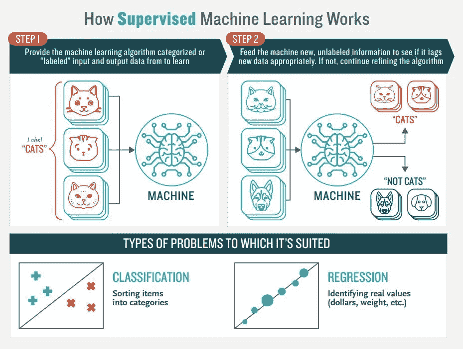
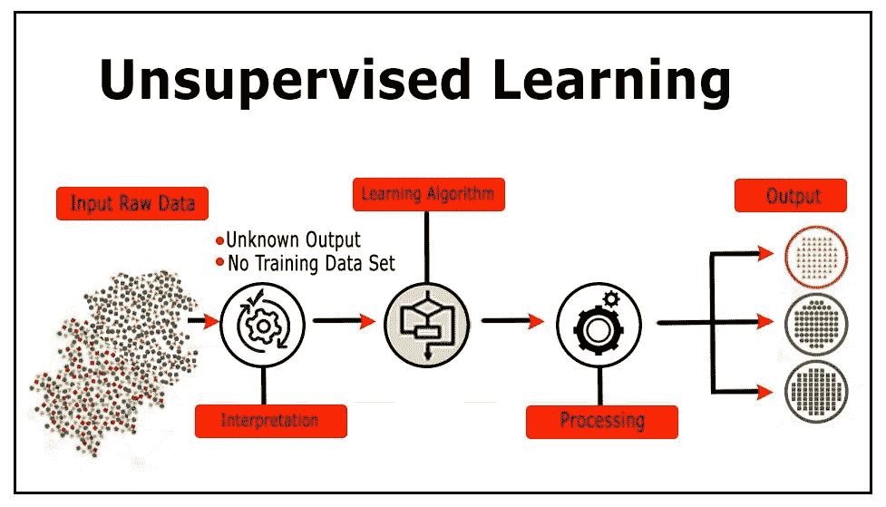
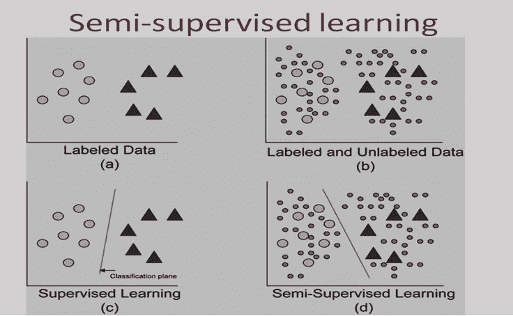

# 监督和非监督学习

> 原文：<https://medium.datadriveninvestor.com/supervised-and-unsupervised-learning-7281050992a0?source=collection_archive---------3----------------------->

在之前的博客中，我们已经看到了 ML 技术的概述和机器学习的一些应用。现在，我们将从 3 种技术中收集关于 2 种技术的更多信息，还将学习另一种技术，即*半监督学习。*

*监督学习*:我们对*监督了解多少？*监督是在老师或某个监督者的指导下学习一些东西，他们可以判断我们做的事情是否正确。同样，在监督学习中，当我们训练算法时，我们有一组标记的数据。现在我们对标记数据的理解是什么？

标记数据意味着目标数据被标记了答案，即我们正在研究的算法应该得出的答案。因此，例如，一个带标签的自行车数据集会告诉算法告诉我们 R15，脉冲星，光辉。每当显示新图像时，该算法都会将其与训练数据集进行比较，以得出结果并预测正确的标签。

**Source : boozallen.com**

这种学习主要在两个方面有用，分类和回归问题。

分类问题要求算法预测离散值，将输入数据识别为特定类或组的成员。例如，如果有一个自行车的训练数据集，这意味着每张图像都被预先标记为 R15，Pulsar，spread，e.t.c。现在正在测试该算法，以正确分类 Pulsar，spread 和其他图像的新图像。

另一方面，回归问题寻找连续的数据。

因此，监督学习最适合解决有一组可用参考点的问题。

无监督学习:这种技术用于深度学习模型在没有明确指令的情况下处理数据集。然后，该模型尝试通过提取特征和分析结构来自动找到数据中的结构。

它可以以各种方式组织数据，如聚类、异常检测、关联、自动编码器。

在无监督学习的情况下，很难计算算法的精度。

**SOURCE : datavedas.com**

现在我们将讨论*半监督*学习，半监督学习是既有标记数据又有未标记数据的训练数据集。这种方法在提取特征非常困难并且标记例子是一个耗时的过程时非常有用，即使对于一些优秀的专家来说也是如此。

这种情况的常见例子是许多人遇到的医疗情况，MRI、CT 扫描。现在，手动标记每一次扫描将是一个耗时的过程，但深度学习网络仍然可以通过处理一小部分标记数据来以更准确的方式工作，并与无监督学习相比提高准确性。

**SOURCE : towardsdatascience.com**