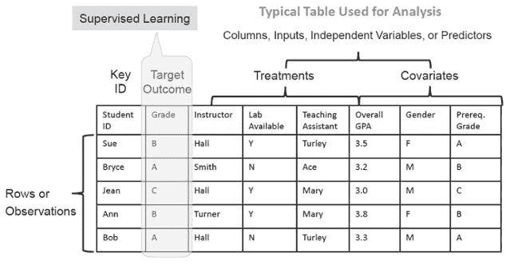
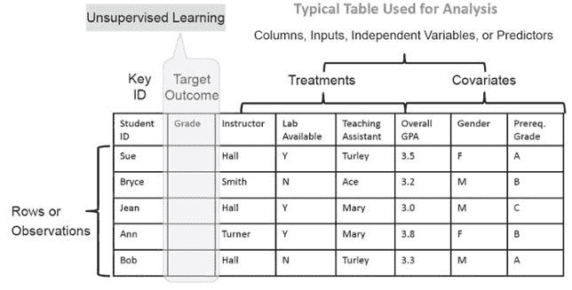

# 有监督与无监督的机器学习

> 原文：<https://medium.datadriveninvestor.com/supervised-vs-unsupervised-machine-learning-ce0c683d32ce?source=collection_archive---------34----------------------->

分析和机器学习技术是重要的决策工具。分析从数据中提出问题并得到答案，主要是为了预测可能会发生什么。但是，人们很容易对监督学习和非监督学习等术语感到困惑。无监督学习到底是什么？它与监督学习有什么不同，为什么这些术语很重要？

简单地说，如果没有目标或结果变量，模型就是无监督的。也就是说，一个区分*欺诈*和*非欺诈*的模型是有监督的，因为它有一个目标变量(欺诈)，但一个寻找“存在哪些细分客户”的分析项目是无监督的。

在操作上，无监督模型的开发需要人类专家更多的投入。项目的规划者需要提供足够的时间和额外的资金来收集专家的意见。项目规划者还应该意识到，这样的专家通常需要重新安排他们当前任务的优先级，这样他们才有时间提供他们的意见。

与无监督模型相关的数据不包括历史结果作为感兴趣的关键问题。因此，与构建监督模型相比，数据科学家可用于构建非监督模型的技术较少。由于在构建无监督模型时，数据中没有已知的结果，因此无法直接计算这些模型的准确性。为了开发一种无监督模型预测能力的测量方法，人类专家必须手动检查模型结果的样本，并将结果标记为有用或无用。

现在您已经更好地理解了理解这些术语的重要性，让我们通过一个简单的例子来更详细地研究它们。让我们假设我们想要建立一个模型，该模型将使用某些变量或输入来预测学生将获得的分数。在图 1 所示的情况下，让我们进一步假设我们有显示五个学生获得的分数以及与这些学生相关的输入变量的数据。请注意，我们已经将输入(独立)变量分为两类。

*   **治疗**是我们可以改变的输入。在我们的例子中，他们是教师、实验室和助教。
*   **协变量**是我们没有能力改变的输入。在我们的例子中，它们是总的 GPA、学生的性别和学生的先决成绩。

*Figure 1\. Supervised Learning Example*

有了这些历史信息，我们可以使用监督学习建立一个模型来预测其他学生的目标结果(成绩),我们知道这些学生的输入(独立)变量。

如果我们不知道这五个学生获得的目标成果(成绩)(见图 2 ),我们可以将学生分组。也就是说，我们可能首先使用非监督聚类算法来寻找数据中的关系，这些关系自然地将学生分组。然后，我们可以更仔细地查看聚类算法识别的组的特征，我们甚至可以以某种有助于了解如何为他们服务的方式来标记这些组(例如，第一代大学生、外州大学生、通勤族等)。).

为了收集做出这些预测所需的信息，我们将采访组织内的主题专家(例如，教师和管理人员)，检查以往经验的记录，并采用其他数据收集技术。这个建模过程被称为无监督学习。

*Figure 2\. Unsupervised Learning Example*

无监督学习在技术上比监督学习更具挑战性，但在数据分析的现实世界中，它往往是唯一的选择。例如，为了在[建立一个检测欺诈的模型](https://www.elderresearch.com/analytics-solutions/fraud-and-risk-analytics)时创建足够多的标记案例，在数据样本中调查(从而标记)足够多的案例以查看是否存在欺诈通常是不切实际的。如果没有关于目标结果的明确历史信息，数据科学家必须使用无监督学习技术来构建模型，然后寻找异常(不寻常的情况)作为开始调查的好地方。

总之，监督学习有目标或结果变量。它使用已知案例在未来数据中查找相似类型的案例。无监督学习没有目标或结果变量，在技术上比监督学习更具挑战性，需要主题专家的更多投入。

**需要帮助开始分析吗？我们为期半天的现场分析高管战略会议提供了使用分析来改进组织决策的策略，以及如何提高您的分析能力的建议。** [**了解更多。**](https://www.elderresearch.com/analytics-executive-strategy-consulting)

# 有关系的

[如何自动调整机器学习模型](https://www.elderresearch.com/blog/how-to-automate-machine-learning-models)

[聘请数据分析顾问](https://www.elderresearch.com/blog/hiring-a-data-analytics-consultant)

[我们在使用机器学习吗？](https://www.elderresearch.com/blog/are-we-using-machine-learning)

*最初发表于*[*【www.elderresearch.com】*](https://www.elderresearch.com/blog/supervised-unsupervised-machine-learning)*。*