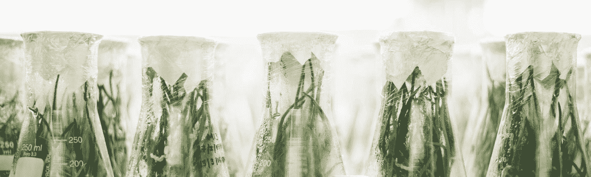

# 补充现实

> 原文：<https://medium.datadriveninvestor.com/supplementing-reality-5c2d15105d32?source=collection_archive---------10----------------------->

## 使用精神活性物质来补充，而不是逃避我们的感知现实

Photo by [Emma Miller](https://unsplash.com/@777emiller?utm_source=medium&utm_medium=referral) on [Unsplash](https://unsplash.com?utm_source=medium&utm_medium=referral)

最近空气有所变化。几十年来，我们一直迷恋于关于精神活性物质的公众舆论的改革，这种观念上的变化最终似乎正在形成。

> “意识的控制决定了生活的质量。”
> 
> ― **米哈里·契克森米哈**

这可能只是时间的波动改变了我们使用物质来*打开*我们的思想的方式，而不是简单地安抚或吸引它们。当然，这种研究迷幻药和其他改变精神的化合物的方法已经存在了半个多世纪(当然，如果我们超越当代西方文化，时间会更长)，但从来没有像今天这样强大。

 [## 医疗保健的未来正在被一场巨大的技术入侵所塑造——数据驱动的投资者

### 过去十年，全球经济的所有部门都经历了大规模的数字颠覆，而卫生部门现在…

www.datadriveninvestor.com](https://www.datadriveninvestor.com/2018/11/02/the-future-of-healthcare-is-being-shaped-by-a-big-tech-invasion/) 

硅谷发现自己越来越受到微量给药的推动；成群结队的寻求启示者前往秘鲁，参与萨满引导的无生命体验；大麻合法化几乎席卷了整个北美；基于 MDMA 和裸盖菇素的疗法越来越有优势。

简单来说——随着我们不断认识到精神活性物质的特殊好处，我们终于脱离了这些只是派对药物的陈旧假设。虽然这不一定是什么新的范式，但最近的势头应该引起注意。随着每一家新店的开张和各州的合法化，与吸食大麻相关的污名正在被抛到一边；正常化的脉搏在老一代人的判断情绪中产生共鸣。虽然总会有一些人使用改变精神的物质作为逃避或麻木或兴奋的方式，但越来越多的使用者正在意识到某些物质的好处，以扩展意识，进行更深层次的思考，思考和反省，同情和回顾。

> "没有一个问题可以从创造它的同一意识层次上解决."——阿尔伯特·爱因斯坦

随着越来越多的成功故事从精神活性辅助心理治疗的沙发上出现，这些不同药物的潜力开始膨胀。在某种程度上，成功的企业家将他们的财富归功于一种精神兴奋剂，这激发了那些渴望成功的人的好奇心。这并不是说成功取决于毒品的使用，而是说成功和毒品的使用明显地在加利福尼亚海岸(和世界其他地方)携手并进。

加拿大最近将大麻合法化，我居住的城市刚刚允许开了三家大麻实体店，更多的实体店即将开业。参观了其中一家商店后，我很高兴地看到人群中有很大一部分是白胡子和白发。对我自己来说，我是在抽大麻的娱乐中长大的——完全意义上的娱乐。重击和钝器，交叉关节，热拳击和三振出局——这些都是在尽可能喝醉的情况下完成的。

然而现在，情况不同了。我选择“一击即中”而不是“直言不讳”,这让我可以暂时对一个想法进行更深入的思考，更有效地思考或反省，打破写作的瓶颈，从不同的角度处理问题，跳出一维视角。即使在我穿越树林的探险中——跑步或山地自行车——我也会迅速让大脑的汁液流动起来，而不是让自己丧失能力，甚至不一定要增强任何体验，而是阐明和润滑沉思的齿轮或沉浸到当前时刻。

它有时会让我进入这种神秘的[心流状态](https://medium.com/datadriveninvestor/flow-state-the-super-mind-5265932ba900)，这种状态慢慢成为一种时髦的精神状态，让我进入我的自行车轮胎必须躲避和避开的树根和巨石的区域。这个脑死亡的瘾君子或逃避现实的艺术家的公理随着我的轮胎流畅地移动的每一根木头和我脑海中实现的改善我生活的每一个想法而被推翻。

因为这是美好的一线希望，往往被令人窒息的判断之尘所掩盖，隐藏着许多这些化合物的真正潜力——精神活性物质具有巨大的能力，可以将我们从日常生活中抽离出来，除非我们面临重大的生活事件，否则我们不一定会意识到自己受到限制。我们永远都不应该低估从高处或远处对我们生活的短暂一瞥的力量。

在宏观层面上，这些化合物经常促使我们评估我们在生活中做了什么，我们是否在实现我们的目标或浪费我们的时间。在微观层面上，它们可以点燃我们自我意识的余烬，点燃我们的创造力，为更高的意识模式提供燃料。

在一个充满令人麻木的娱乐和社交媒体比较的世界里，我们越来越容易让我们各自对现实的感知停滞在不断搅动的单调和舒适的无生命的齿轮中——这对我们自我发现、自我发展和自我目的的永久旅程构成了严重威胁。

> "成长的关键是在我们的意识中产生更高维度的意识."——老子

在这样一个世界里，需要补充性的思维模式。无论它们是由某种冥想或冥想活动、旅行或冒险、仪式性的自省或自我发现组成，我们都需要自我实现或重新构建我们的视角的方法。对许多人来说，精神活性化合物是一种补充我们现实的方式，并在一个完全不同的层面上参与其中。

[**读下去:Psychoterratica！**](https://medium.com/datadriveninvestor/psychoterratica-cf2fb9496884)

[How science is barking up the wrong tree by deviating from nature](https://medium.com/datadriveninvestor/psychoterratica-cf2fb9496884?source=---------4------------------)