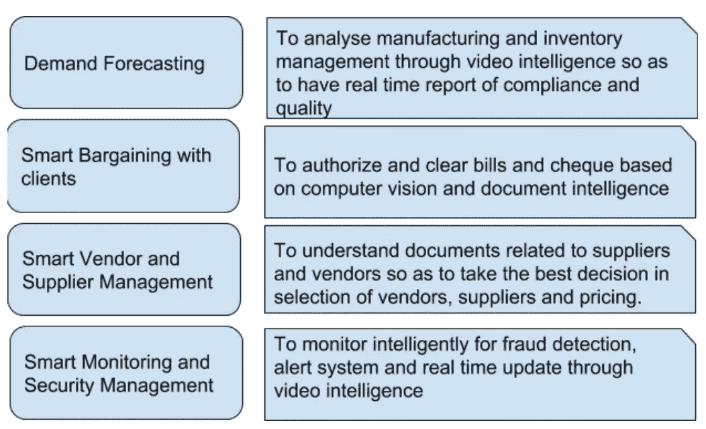

# 供应链:认知计算应用

> 原文：<https://medium.datadriveninvestor.com/supply-chain-cognitive-computing-applications-c2303b3895ca?source=collection_archive---------14----------------------->

供应链部门是最大的部门之一。它涉及多个系统，如库存系统、运输系统、供应商管理、制造系统和零售店。从制造到运输到库存再到零售店，效率都有很大的提升空间。尽管需求预测一直是供应链的中心问题，但在人工智能和认知计算应用方面，其他重要问题也有很大的相关性。智能采购、智能库存管理、智能订单管理和智能供应商管理已经讨论过，现在是大多数供应链公司的下一组目标。这里是一瞥。

我希望可口可乐、百事可乐、雀巢和 P&G 等 ope 公司将在供应链领域引领人工智能和认知服务。