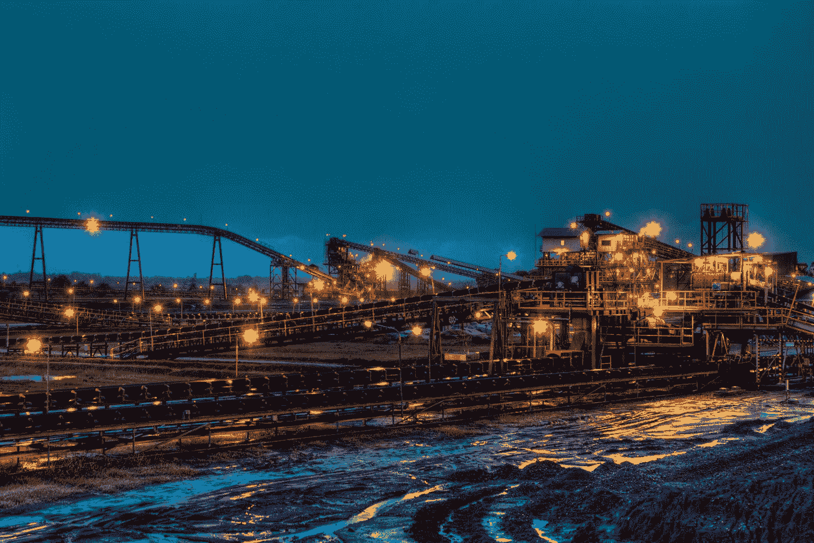

# 供应链来源

> 原文：<https://medium.datadriveninvestor.com/supply-chain-provenance-bc11a53bd2e2?source=collection_archive---------5----------------------->

“lighted brown concrete buildings near body of water at nighttime” by [Dominik Vanyi](https://unsplash.com/@dominik_photography?utm_source=medium&utm_medium=referral) on [Unsplash](https://unsplash.com?utm_source=medium&utm_medium=referral)

世界依赖于工业的生产能力，尽管它对地球的影响值得怀疑。生产过程需要各种各样的商品和材料作为原料，无论是从地里挖出的东西还是在地里生长的东西。

在全球经济中，原料的来源很少是透明的。因此，该行业通常依赖于从违反基本人权(如涉及奴役和童工)、造成持久环境破坏、剥削穷人和无权者并冒着供应质量差的风险的供应商那里获得原料。

这是不可持续的。

为了创造可持续的采购，我们需要透明、可追溯和防篡改的数据。只有供应链中的每一个环节都能够信任走在前面的人，并向后面的人交付可以信任的东西，整条供应链才能得到信任。这需要协调生产过程中所有阶段的数据:提取、加工、运输、储存、生产和消费。

分布式总账(区块链)是实现这些结果的完美工具。区块链技术是为了安全而设计的。它所承载的数据实际上是不可变的，但是可以被所有人访问。它能够创建一个完全可靠的出处链。

事实上，有许多基于区块链的项目正在进行中，以改善现有的来源过程。拥有经济利益和雄厚财力的利益相关者是第一批加入这股潮流的人:艺术品买家。艺术品的出处问题涉及数百万美元。证明莫奈画的一幅小铅笔画确实是莫奈画的，就能带来几美元和不错的退休福利！欺诈、伪造和腐败的动机显而易见。

因此，将整个起源过程转移到区块链，所有人都可以看到所有权谱系，从而消除了巨大的成本和风险。在这个过程中，它愉快地摧毁了各种各样的寄生行业，如欺诈和伪造。现有的出处流程可能涉及艺术史学家、科学家、技术人员、艺术专家和许多其他昂贵的专业人士。难怪艺术品所有者会投资区块链的出处解决方案。

一个更大的话题是将区块链解决方案应用于供应链管理中的来源问题。与艺术世界一样，它有望消除供应品质量、供应品可疑来源以及供应品掺假/替代等问题。

个别行业已经开始检查他们的供应链，以确保达到最低标准。“血腥”钻石率先将人权问题引入供应链。这个问题的解决很容易，因为所有的钻石都有独特的标识。区块链是该解决方案的首选总账。

其他矿业也纷纷效仿，尽管仍有重大问题有待解决。散装矿物很难追踪。诸如使用奴隶或童工等侵犯人权行为被消除的证据可能很难获得和核实。关于环境退化已经得到解决的评估受到许多意见和无休止的辩论的影响。

但钴行业最近的发展已经表明，这些问题是真实存在的，涉及大量资金。当大众汽车因供应链问题而未能与嘉能可(世界上最大的矿业公司)就钴(一种对电池至关重要的矿物)的新供应合同达成一致时，世界对此给予了关注。

与区块链的“智能合同”一样，我们可能需要可信的“神谕”来支持出处流程。我们可能需要“有能力的人”(有点像现在保证达到 JORC (2)或 ni 143–101(3)采矿标准的专家)的认证，以验证采购过程符合适当的标准。我们可能需要首先开发这些标准。在采矿业中，赤道原则(4)在这方面正使我们朝着正确的方向前进，尽管这些标准目前更多地涉及行业融资问题。

我们公司(Intraverse Technologies)已经开始探索构建基于出处理念的供应链所涉及的一些理论和技术问题。我们正在考虑如何为此使用区块链，如何使智能合同成为来源流程的基础，以及如何使用令牌经济原则来奖励做正确事情的参与者。现在还为时尚早，但我们的“Provenant Sourcing”项目正在加快步伐。

通过在供应链流程中增加来源，我们为矿业创造了一个可持续发展的未来。区块链使市场力量能够驱逐“最差的做法”，奖励“最佳的做法”。尽管实现这些可能性的全部好处需要付出巨大的努力，但改善人权、修复环境和保证制造商供应质量的综合因素，可能只是创造了一个令人信服的变革案例。

注意事项:

1.  参见[https://www . metal bulletin . com/Article/3526043/AMNESTY-REPORT-Volkswagen-responses-to-NGO-cobalt-claims . htm](https://www.metalbulletin.com/Article/3526043/AMNESTY-REPORT-Volkswagen-responds-to-NGO-cobalt-claims.htm)
2.  http://www.jorc.org/见
3.  参见 http://cim.org/standards/documents/block484_doc111.pdf 的
4.  参见[http://equator-principles.com](http://equator-principles.com/)