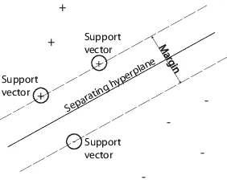

# 支持向量机:需要知道

> 原文：<https://medium.datadriveninvestor.com/support-vector-machine-71408703022e?source=collection_archive---------23----------------------->

> 支持向量机(SVM)是一种受监督的机器学习算法，可用于分类和回归目的。支持向量机更常用于分类问题，因此，这是我们在这篇文章中要关注的。
> 
> 它们可用于线性可分的数据集。

## 支持向量:

> 支持向量是最接近超平面的数据点，即数据集的点，如果移除这些点，将会改变划分超平面的位置。因此，它们可以被视为数据集的关键元素。

## 超平面:

> 对于分类问题，超平面是一条线，它线性地分隔和分类一组数据。
> 
> 直觉上，我们的数据点离超平面越远，我们就越有信心它们被正确分类。因此，我们希望我们的数据点尽可能远离超平面，同时仍然在超平面的正确一侧。
> 
> 因此，当添加新的测试数据时，它落在超平面的哪一侧将决定我们分配给它的类。

## 支持向量机的利弊

利弊:-

*   适用于较小的干净数据集。
*   它可以更有效，因为它使用了训练点的子集。

## 反对意见:-

*   不适合较大的数据集，因为支持向量机的训练时间可能很长。
*   对具有重叠类的噪声较大的数据集效果较差。

# SVM 的用途:

> SVM 用于文本分类任务，如类别分配、检测垃圾邮件和情感分析。它还通常用于图像识别挑战，在基于特征的识别和基于颜色的分类中表现特别好。SVM 还在许多手写数字识别领域发挥着重要作用，如邮政自动化服务。