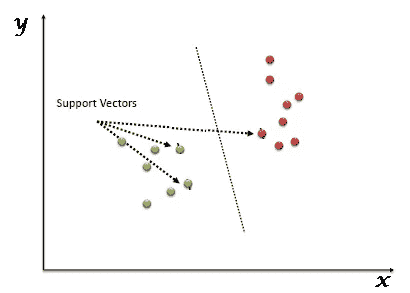
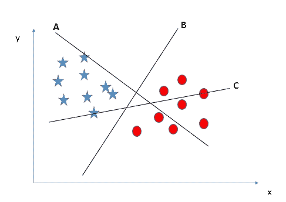
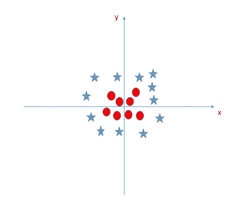
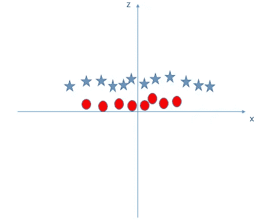

# 支持向量机

> 原文：<https://medium.datadriveninvestor.com/support-vector-machine-e151a9f7bbc4?source=collection_archive---------17----------------------->

[](http://www.track.datadriveninvestor.com/1B9E)

一种可用于分类和回归技术的监督 ML 算法。但是，它主要用于分类问题。每个数据项被绘制为 n 维空间中的一个点，其中特定的坐标代表每个特征。然后我们找到区分两个类别的超平面，然后应用分类。



Source : [Analytics Vidhya](http://www.analyticsvidhya.com)

SVM 的工作:

*   第一步是确定一个完美的超平面。应该是完美隔离两个阶层的那个。



例如，我们可以清楚地看到，平面 B 是可以完全隔离两个类的完美平面。

但是如果所有的飞机都完美地隔离了班级呢？在这种情况下，我们需要选择具有最高裕量的平面，这是因为鲁棒性。


在这里，我们可以看到平面 C 是最适合的，因为它的余量大于其他两个平面，这就是为什么我们会选择这一个。

现在有一些情况，我们不能完全分离两个类，所以它导致了离群值的产生。


所以像这样的情况，我们不能分开两个类，所以当我们在两个类之间形成一条直线时，红圈类中被遗漏的星称为离群点。

到目前为止，我们一直在考虑线性超平面，但是如果线性超平面不能帮助我们解决一些问题呢？



在这种情况下，SVM 引入了一个新的特征

```
Z = Y^2 + X^2
```

在绘制了 Z 轴和 X 轴上的点之后，图形看起来会像这样



Source: [Analytics Vidhya](http://www.analyticsvidhya.com)

*   这里 Z 的所有值都被认为是正的，因为它是两个值的平方和。
*   在原始图表中，红色圆圈靠近 X 轴和 Y 轴的原点，这就是为什么它的 Z 值很低，而恒星远离原点导致 Z 值很高。

在 SVM，两个类之间很容易有一个线性超平面。但是我们需要手动添加这个功能吗？嗯，答案是否定的，因为 SVM 使用的技巧叫做[***内核******诀窍*** 。它们将低维输入空间转换成高维输入空间。它将不可分离的类转换成可分离的类，根据我们定义的数据标签找到一种分离数据的方法。](https://en.wikipedia.org/wiki/Kernel_method)

Python 中的实现:

```
from sklearn.model_selection import train_test_split
from sklearn import svm
from sklearn.datasets import load_svmlight_file as load_svm
from sklearn import datasets
from sklearn.metrics import accuracy_scoredf = datasets.load_iris()
x=df.data
y=df.targetxtrain,xtest,ytrain,ytest=train_test_split(x,y,test_size=0.3,random_state=0)
clf_imp=svm.SVC(kernel='linear',C=1, degree=3, gamma='auto', coef0=0.0, shrinking=True, 
                probability=False,tol=0.001, 
                cache_size=200, class_weight=None, verbose=False, max_iter=-1)
clf_imp.fit(xtrain,ytrain)
y_pred = clf_imp.predict(xtest)
print(accuracy_score(ytest, y_pred))
```

它将产生大约 **0.97777** 的精度

现在我们可以用不同的方式调整不同的参数。

例如，一个内核可以被调整为***【RBF】***同样，它会产生不同的结果。类似地，也可以改变γ，c，degree 的值。在编写代码时，其他参数仅在一般情况下设置为默认值，因为它们没有多大用处。

所以继续练习，快乐编码！！！