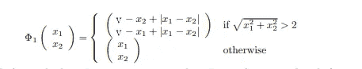
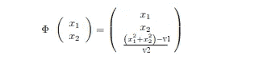
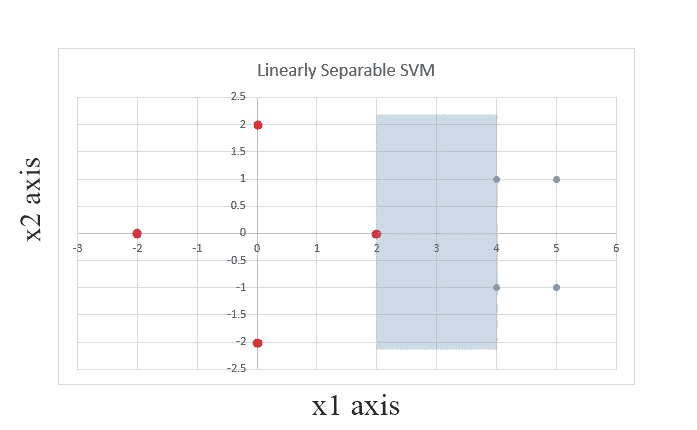
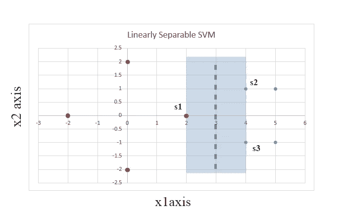
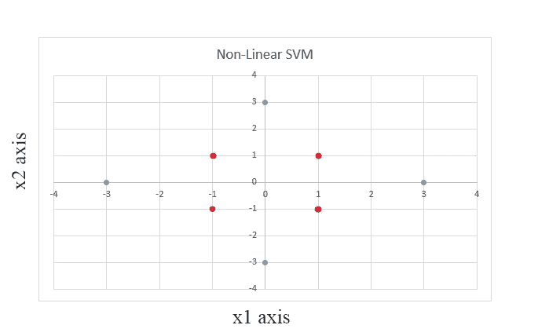

# 支持向量机(SVM)

> 原文：<https://medium.datadriveninvestor.com/support-vector-machine-svm-382b1f9b0aae?source=collection_archive---------4----------------------->

# **[1]简介和方法**

> SVM 代表支持向量机，它是一种用于线性和非线性数据分类的算法。使用称为“超平面”的平面来建立两个类别之间的分离。主要目的是获得数据点分类的最佳超平面。如果可以使用简单的线性超平面对数据点进行分类，这就是线性 SVM 的情况。然而，如果不能使用线性分类器将数据点分类成类，则首先将变换函数应用于数据集，以将一个类的数据点重定位到其他坐标或更高维度，然后在重定位过程之后，使用相同的旧线性分类器分离数据点。使用支持向量和边界的帮助来获得用于数据点分离的超平面。支持向量是位于任一类边缘的一些选定的数据点。通过这些支持向量，沿着支持向量建立边界。数据点之间的分隔空间称为“装订线空间”。

# **【2】要点:**

*   ***支持向量:*** 它是一个刚好接触页边空白边界的输入向量
*   ***边距:*** 借助支持向量创建的假想边界。
*   SVM 有两种距离:d+和 d-。d+在分离超平面的 R.H.S 上，d-在分离超平面的 L.H.S 上。
*   我们在 SVM 的主要目标是 ***“利润最大化”。***

# **[3]线性可分数据点的处理:**

*   A 类的数据点表示正类，B 类的数据点表示负类
*   数据点按照轴的坐标绘制在图上，比如 x1 和 x2
*   通过检查，我们计算出分离数据需要多少个支持向量
*   所有向量都以 1 的偏差增大。例如，S1(1 ^ 2)变成 S1(1 ^ 2 ^ 1)
*   我们需要找出每个向量的αi 值
*   在线性 SVM 的这种情况下，简单的映射函数φ()用于获得方程:

> **α1φ(S1)φ(S1)+α2φ(S2)φ(S1)+α3φ(S3)φ(S1)= v1**
> 
> **α1φ(S1)φ(S2)+α2φ(S2)φ(S2)+α3φ(S3)φ(S2)= v2**
> 
> **α1φ(S1)φ(S3)+α2φ(S2)φ(S3)+α3φ(S3)φ(S3)= v3**

这里，v1、v2 和 v3 的值是根据所选择的支持向量和余量获得的。在装订线空间中建立阈值，区域右侧的所有值和给定的+ve 值以及阈值左侧的所有值都给定了–ve 值。如果所获得的裕量是水平的，则遵循类似的概念，在这种情况下，高于阈值的所有值被认为是+ve，低于阈值的所有值被赋予-ve 值。

*   每个方程中的映射函数都被其对应的支持向量所代替

***α1s \\1 s \1+α2s \2 s \1+α3s \3 s \1 = v1***

***α1s \1 s \2+α2s \2+α3s \3 s \2 = v2***

***α1s \\1 s \3+α2s \2 s \3+α3s \3 = v3***

*   根据条件将扩充支持向量的值与 v1、v2 和 v3 的值一起放入这些方程中，然后求解这些方程以获得α1、α2 和α3 的值。
*   使用获得最终超平面的值坐标

***w \\=∑Iα是\\i***

最终获得的向量中的前两个值表示超平面 x1 和 x2 坐标，向量的第三个值是偏移。

分离超平面方程为:

***y = wx+b***

其中:w = (x1 x2)，b =失调

# **【4】非线性可分数据点的处理**

*   A 类的数据点表示正类，B 类的数据点表示负类
*   数据点按照轴的坐标绘制在图上，比如 x1 和 x2
*   通过观察，我们注意到这些数据不能用一条直线分开，因此需要对这个数据集应用一个变换映射函数，以便将一个调用的坐标转移到更高维度

**转换功能**



**其中:**

**x1** :第一轴坐标

**x2** :第二轴坐标

**v :** 从数据集检查中获得的一些值。例如，如果支持向量具有像 s1( 1，3)，s2(1，2)等的值。在这种情况下，v 的值可以设置为 v=6。

*   使用该变换函数获得新的修改的支持向量。现在，可以使用线性 SVM 分离这些变换后的数据点
*   所有转换的向量都以 1 的偏差增加。例如，s1 (1 2)变成

> **s 1(1 2 1)**

*   我们需要找出每个向量的αi 值
*   φ()用于获得方程:

> **α1φ(S1)φ(S1)+α2φ(S2)φ(S1)+α3φ(S3)φ(S1)= v1**
> 
> **α1φ(S1)φ(S2)+α2φ(S2)φ(S2)+α3φ(S3)φ(S2)= v2**
> 
> **α1φ(S1)φ(S3)+α2φ(S2)φ(S3)+α3φ(S3)φ(S3)= v3**

这里，v1、v2 和 v3 的值是根据所选择的支持向量和余量获得的。在装订线空间中建立阈值，区域右侧的所有值和给定的+ve 值以及阈值左侧的所有值都给定了–ve 值。如果所获得的裕量是水平的，则遵循类似的概念，在这种情况下，高于阈值的所有值被认为是+ve，低于阈值的所有值被赋予-ve 值。

*   每个方程中的映射函数都被其对应的支持向量所代替

> **α1s 1s 1+α2s 2s 1+α3s 1 = v1**
> 
> **α1s 1 S2+α2s 2+α3s 2 = v2**
> 
> **α1s 1 S3+α2s 3+α3s 3 = v3**

*   根据条件将扩充支持向量的值与 v1、v2 和 v3 的值一起放入这些方程中，然后求解这些方程以获得α1、α2 和α3 的值。
*   使用获得最终超平面的值坐标

> **w \\=∑Iα是\\i**

*   最终获得的向量中的前两个值表示超平面 x1 和 x2 坐标，向量的第三个值是偏移。

分离超平面方程为:

***y = wx+b***

其中: ***w = (x1 x2 )*** 和 ***b =偏移***

# **【5】内核绝招**

> 到目前为止，我们使用的数据点可以使用线性超平面分离，或者使用转换函数转换到高维度(在以前的情况下转换到更高的坐标)。然而，在各种情况下，这些方法不足以分离正负数据点，在这些情况下，我们需要使用变换函数，将数据点变换到比以前相对更高的维度。即完全到另一个平面。这个转换函数将我们的数据转换到三维特征空间。



Kernel Trick for SVM

其中 v1 和 v2 的值通过检查数据点的坐标来选择。v1 和 v2 的值应该与我们需要分离的坐标一致。

当我们在 SVM 中使用核技巧时，偏差为 1 的向量的增加不是必要的，然而如果我们希望，我们可以增加它，但是它只会增加要求解的方程的复杂性。

[](https://www.datadriveninvestor.com/2020/02/19/cognitive-computing-a-skill-set-widely-considered-to-be-the-most-vital-manifestation-of-artificial-intelligence/) [## 认知计算——一套被广泛认为是……

### 作为它的用户，我们已经习惯了科技。这些天几乎没有什么是司空见惯的…

www.datadriveninvestor.com](https://www.datadriveninvestor.com/2020/02/19/cognitive-computing-a-skill-set-widely-considered-to-be-the-most-vital-manifestation-of-artificial-intelligence/) 

# **【6】支持向量机上的数值:线性可分**

***正标分*** : (4 1)，(4 -1)，(5 1)，(5 -1)

***负标分*** : (2 0)，(0 2)，(0 -2)，(-2 0)

***以*** - > x1 和 x2 为轴绘制图形上的点



通过检查选择支持向量:

***S1 =(2 0)S2 =(4 1)S3 =(4-1)***

支持向量的扩充:

***S1 =(2 0 1)S2 =(4 1 1)S3 =(4-1 1)***

方程式的形成:

> **α1s 1s 1+α2s 2s 1+α3s 1 =-1**
> 
> **α1s 1 S2+α2s 2+α3s 2 = 1**
> 
> α1s \1 s \3+α2s \2 s \3+α3s \3 = 1

将上述等式中的 s~1、s~2 和 s~3 的值代入:

α1(2 0 1) (2 0 1) + α2(4 1 1) (2 0 1) + α3(4 -1 1)(2 0 1) = -1

α1(4+0+1) + α2(8+0+1) + α3(8–0+1)=-1

**5α1+ 9α2 + 9α3=-1**

α1(2 0 1)(4 1 1) + α2(4 1 1)(4 1 1) + α3(4 -1 1)(4 1 1) = 1

α1(8+0+1) + α2(16+1+1) + α3(16–1+1) = 1

**9α1 + 18α2 + 16α3 = 1**

α1(2 0 1)(4 -1 1) + α2(4 1 1)(4 -1 1) + α3(4 -1 1)(4 -1 1) = 1

α1(8+0+1)+ α2(16–1+1) + α3(16+1+1) = 1

**9α1 + 16α2 + 18α3= 1**

求解上述方程，我们得到数值:

**α1= -6.5 α2= 1.75 α3= 1.75**

> **使用—w \\=∑Iα是\\i**

= -6.5(2 0 1) + 1.75(4 1 1) + 1.75(4 -1 1)

= -13+7+7= 1

=0+1.75–1.75= 0

= -6.5+1.75+1.75= -3

我们得到(1 0 3)

> **比较:y = wx +b**

***我们有->w =(1 ^ 0):超平面***

***B= -3:偏置***

# **【7】支持向量机上的数值:非线性可分(需要变换函数)**

***正标分:*** (3 0)，(0 -3)，(-3 0)，(0 3)

***负标点:***(1 ^ 1)，(1 -1)，(-1 -1)，(-1 ^ 1)

***绘制图表上的点取轴- >*** x1 和 x2



通过检查选择支持向量:

***S1 =(1 ^ 1)S2 =(15 ^ 12)S3 =(12 ^ 15)***

支持向量的扩充:

***s ~ 1 =(1 1 1)s ~ 2 =(15 12 1)s ~ 3 =(12 15 1)***

方程式的形成:

> **α1s 1s 1+α2s 2s 1+α3s 1 =-1**
> 
> **α1s 1 S2+α2s 2+α3s 2 = 1**
> 
> **α1s \1 s \3+α2s \2 s \3+α3s \3 = 1**

将上述等式中的 s~1、s~2 和 s~3 的值代入:

α1(1 1 1) (1 1 1) + α2(15 12 1) (1 1 1) + α3(12 15 1)(1 1 1) = -1

α1(1+1+1) + α2(15+12+1) + α3(12+15+1)=-1

**3α1+ 28α2 + 28α3=-1**

α1(1 1 1)(15 12 1) + α2(15 12 1)(15 12 1) + α3(12 15 1)(15 12 1) = 1

α1(15+12+1) + α2(225+144+1) + α3(180+180+1) = 1

**28α1 + 370α2 + 361α3 = 1**

α1(1 1 1)(12 15 1) + α2(15 12 1)(12 15 1) + α3(12 15 1)(12 15 1) = 1

α1(12+15+1)+ α2(180+180+1) + α3(144+225+1) = 1

**28α1 + 361α2 + 371α3= 1**

求解上述方程，我们得到数值:

**α1 =-1.259α2 = 0.049α3 = 0.049**

> **使用—w \\=∑Iαis \\i**

= -1.259(1 1 1) + 0.049(15 12 1) + 0.049(12 15 1)

= -1.259+0.735+0.588= 0.064

=-1.259+0.588+0.735= 0.064

= -1.259+0.049+0.049= -1.161

我们得到(0.064 0.064 -1.161)

通过除以 0.064 来标准化上述向量

现在我们得到:(1 1 -18.140)

> **对比:y = wx +b**
> 
> **我们有->w =(1 ^ 1):超平面**
> 
> **B= -18.140:偏置**

```
Thank You !
My LinkedIn : [Visit Me on LinkedIn](https://www.linkedin.com/in/arneesh-aima-49b516116/)
```

**进入专家视图—** [**订阅 DDI 英特尔**](https://datadriveninvestor.com/ddi-intel)