# 支持向量机

> 原文：<https://medium.datadriveninvestor.com/support-vector-machines-ae0ff2375479?source=collection_archive---------2----------------------->

[](http://www.track.datadriveninvestor.com/DDIBeta11-21)

***在本文中我们将了解支持向量机(SVM)背后的直觉。SVM 超参数的相关性——裕度、伽玛、正则化和核。SVM 的利与弊，最后是 Python 中的一个例子。***


我们的目标是对数据集进行分类。为此，我们在 n 维空间中绘制数据集，以得出一条线性可分离的线。这条线有助于区分两类数据。

***听起来简单对吧？这是 SVM 的基础。***

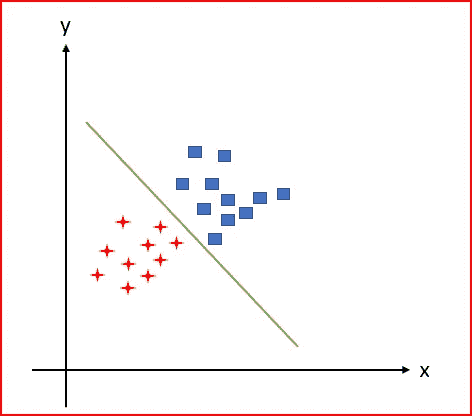

支持向量机有助于找到一个超平面(线)来线性地将数据点分成两类。

***但是我们可以有如下所示的多条线来分隔数据点。我们如何选择将数据集分成两个类的最佳直线？***

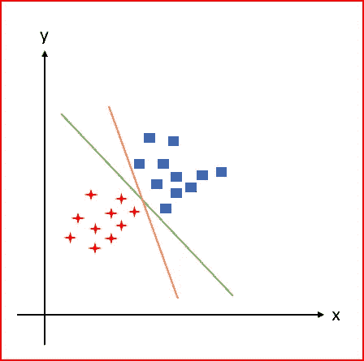

SVM 找到了超平面来最大化两类支持向量之间的间隔。超平面是分类数据集的决策边界，同时最大化边缘。

***什么是支持向量？***

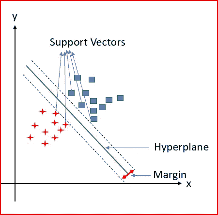

支持向量是数据集中最接近超平面的数据点。移除支持向量将改变分离两个类的超平面。支持向量是数据集的关键元素，因为 SVM 是基于它们构建的。

支持向量机有两个主要目标

*   找到一个超平面(线),将数据点线性分成两类
*   最大化两个类别的支持向量之间的间隔

***当两个类不是线性可分的时候，SVM 是怎么把它们分开的？***

以下数据不是线性可分的。我们不能用一条直线来区分这两个阶级。

为了解决这个问题，我们采用 n 维空间中的非线性可分数据。将其变换到更高维的空间，使其线性可分。

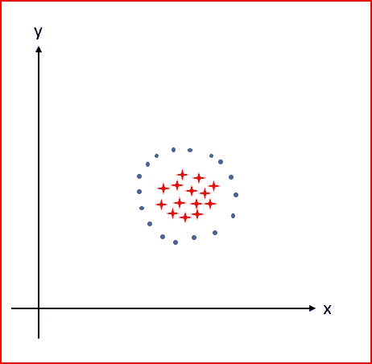

上述数据在二维空间中不是线性可分的。我们将数据转换到三维空间，并绘制一个超平面。超平面现在线性地分开两个类。这是**内核的绝招**。

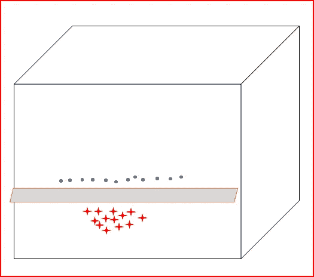

***逐步表演内核戏法***

假设我们在二维空间中有 5 个数据点，它们不能线性分离


Data is not linearly separable

我们将把数据转换到三维空间，看看数据是否是线性可分的。

我们用三个方程试试，x+ y，x*y，x + y。

x*y 的乘积为 0 或正数。因此，如果乘积为 0，那么我们可以将该点分类为 1 类。如果乘积是正数，那么我们可以将该点分类到第二类

我们将 x*y 作为 z 坐标，并在三维空间中绘制数据。我们现在看到线性可分的数据点。

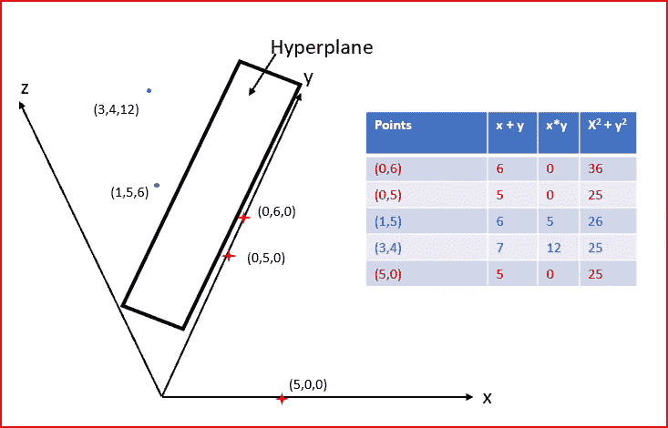

Data transformed to a higher dimension becomes linearly separable

***两个类的数据重叠怎么办？***

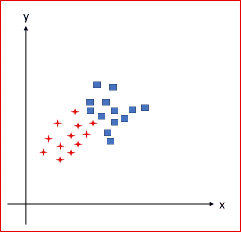

Overlapping data

我们在选择平滑的决策边界或正确分类训练点之间进行权衡

*   右侧绘图:正确分类所有训练点
*   左侧的图:错误分类了几个训练点

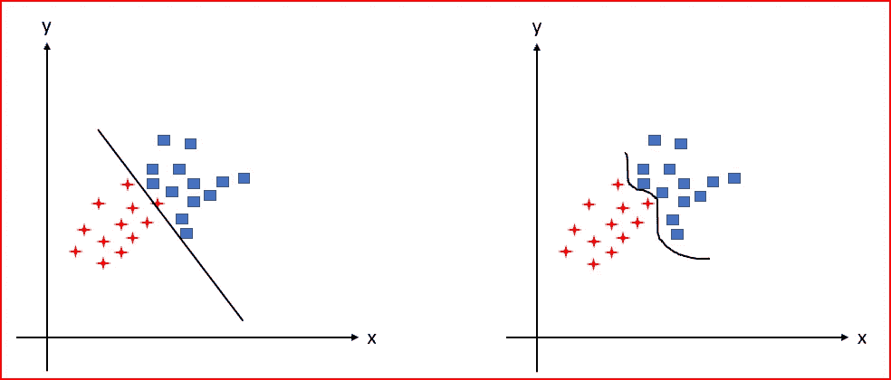

Left side plot where C is small and we have more misclassification. Right side plot where C is large and we have training data classified correctly

我们处理这个问题的一种方法是**正则化(C)。**

**正则化参数指定了允许的误分类程度**。正则化与边距成反比。

*   当正则化(C)参数趋于接近 0 时，则允许更多的误分类。较小的 C 值将迫使优化器为分隔两个类的超平面寻找较大的余量。
*   高正则化(C)参数将选择一个能够很好地正确分类所有数据点的超平面。C 的大值将迫使优化器为超平面选择较小的余量。这使得更多的训练数据点被正确分类。

处理重叠数据的另一种方法是指定一个名为 Gamma(γ)的超参数。

**Gamma(γ)定义了一个训练样本的影响力达到**的程度。

*   低 gamma 值告诉我们，在决定决策边界时，应该考虑远路点。这给出了两个类别之间的平滑线性分离
*   高 gamma 值告诉我们，在决定决策边界时，应该考虑近点。这在两个类之间给出了一个弯曲的分离，有时可能会过度拟合测试数据。

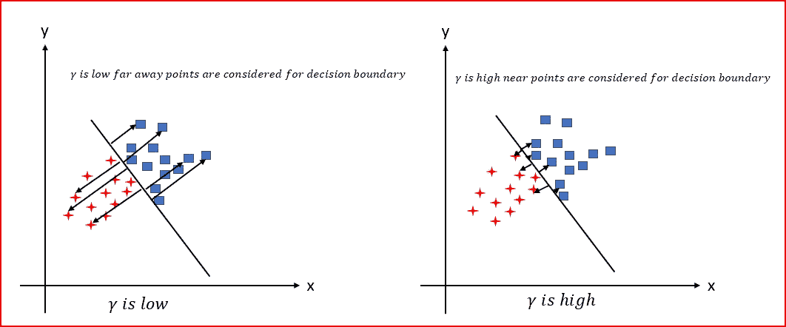

***总结 SVM***

**支持向量机是**

*   **确定性算法**:特定输入的输出是预先确定的。无论运行算法的次数是多少，输出都将保持不变。
*   **SVM 不是概率性的**
*   **SVM 二元线性分类算法** m
*   **SVM 用于回归和分类**

## SVM 的利与弊

**SVM 的优点**

*   在高维空间有效
*   由于 SVM 将训练点子集用于决策函数，因此内存效率高
*   在线性和非线性边界上都表现良好。对于非线性边界，我们需要选择正确的核
*   针对异常值的稳健性(使用 C 控制)

SVM 的缺点

*   大型数据集需要更多的处理时间
*   找到不同超参数的最佳值并不容易
*   为非线性边界选择正确的核可能是棘手的
*   多类分类不是直接可能的。

现在我们将使用 Python 实现支持向量机分类器

我使用过皮肤分割数据集。我提取了包含这两个类的数据子集

首先导入所需的库。我们将添加更多的库，因为我们建立 SVM 分类器

```
import numpy as np
import pandas as pd
import matplotlib.pyplot as plt
import seaborn as sns
from sklearn import preprocessing
```

我已经将数据保存在默认的 Jupyter 文件夹中，命名为 skin_1.csv。

将数据读入 dataset_1

```
dataset_1 = pd.read_csv(‘skin_1.csv’)
```

浏览数据集中的数据并描述所有输入变量

```
dataset_1.info()
```

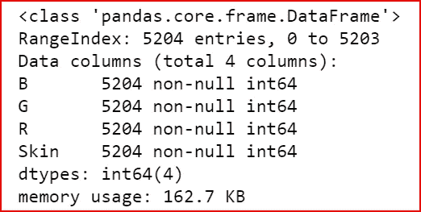

使用 seaborn 可视化数据

```
sns.pairplot(dataset_1, hue='Skin')
```

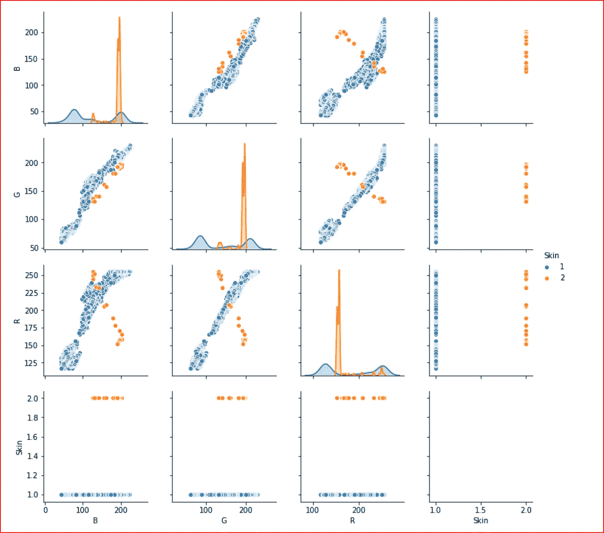

创建输入要素(X)和输出要素(Y)

```
X= dataset_1.iloc[:,0:3]
Y= dataset_1.iloc[:,-1]
```

将 dataset_1 拆分为训练集和测试集。测试集将占数据集 _1 的 40%，训练集将占数据集 _ 1 的 60%

```
from sklearn.model_selection import train_test_split
X_train, X_test,Y_train, Y_test = train_test_split(X, Y, test_size=0.4)
```

我们使用**标准缩放器**正态分布输入特征，包括训练和测试数据。这样，数据分布在 0 附近，标准差为 1。

```
from sklearn.preprocessing import StandardScaler
sc= StandardScaler()
X_train = sc.fit_transform(X_train)
X_test = sc.transform(X_test)
```

现在创建一个 svm 实例，然后应用分类器 SVC

```
from sklearn.svm import SVC
classifier=SVC(kernel ='linear', C=1, gamma=1)
classifier.fit(X_train, Y_train)
```

我们现在预测数据。

```
y_pred= classifier.predict(X_test)
```

计算精确度

```
from sklearn.metrics import accuracy_score
print(accuracy_score(Y_test, y_pred))
```

得到 0.997598463016330 的精确度。

我试图将直觉抛在 SVM 之后。希望我说得简单易懂

# 如果你喜欢这篇文章，请分享并鼓掌！