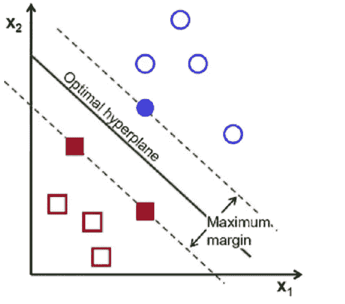

# 支持向量机重要问题

> 原文：<https://medium.datadriveninvestor.com/support-vector-machines-important-questions-a47224692495?source=collection_archive---------0----------------------->

1.  ***给出一些你会在随机森林机器学习算法上使用 SVM 的情况，反之亦然？***

Ans。性能取决于许多因素

*   训练实例的数量
*   数据的分布
*   线性与非线性问题
*   要素的输入比例
*   选择的超参数
*   你如何验证/评估你的模型

一般来说，训练一个性能良好的随机森林分类器更容易，因为你不必太担心超参数优化。由于自然随机森林，你不太可能过度捕捞。你只需在特征子空间上的训练集的 *n* bootstrap 样本上生长 *n* 树——使用多数投票，估计将非常稳健。

使用支持向量机，您有“更多的事情”要“担心”，例如选择合适的核(poly、RBF、linear …)、正则化惩罚、正则化强度、核参数(如 poly 度或 gamma)等等。

因此，总之，我们可以说，与支持向量机相比，随机森林更加自动化，因此“更容易”训练，但文献中有许多支持向量机优于随机森林的例子，反之亦然。因此，如果您想比较这两者，请确保对 SVM 运行足够大的网格搜索，并使用嵌套交叉验证来减少性能估计偏差。([https://www . quora . com/What-makes-Random-Forest-perform-the-support-vector-machine-SVM-欧几里德距离](https://www.quora.com/What-makes-Random-Forest-outperform-the-support-vector-machine-SVM-and-the-euclidean-distance))

2. ***为什么 SVM 是一个大幅度分类器的例子？***

*   SVM 是一种分类器，它对正面和负面的例子进行分类，这里是蓝色和红色数据点
*   如图所示，为了避免过度拟合 ie，..最佳超平面在离正例与反例的最大距离处(离边界线的距离相等)。
*   为了满足这一约束，也为了精确地分类数据点，边缘被最大化，这就是为什么这被称为大边缘分类器。

3.***C 在 SVM 的角色是什么？***

Ans。C 参数告诉 SVM 优化您希望在多大程度上避免对每个训练示例进行错误分类。对于较大的 C 值，如果超平面在正确分类所有训练点方面做得更好，则优化将选择较小边界的超平面。相反，非常小的 C 值将导致优化器寻找更大间隔的分离超平面，即使该超平面错误分类了更多的点。对于非常小的 C 值，即使您的训练数据是线性可分的，您也会得到错误分类的示例。

4. ***大幅度分类器的直觉是什么？***

Ans。假设您已经找到了一个超平面，它将训练集中的两个类完全分开。我们希望当新数据出现时(例如，您的测试集)，新数据看起来像您的训练数据。应归类为一个类或另一个类的点应位于相应类的训练数据中的点附近。现在，如果您的超平面的方向靠近训练集中的一些点，则新数据很可能位于超平面的错误一侧，即使新点靠近正确类的训练示例。

所以我们说，我们想找到具有最大边缘的超平面。也就是说，找到一个超平面，这个超平面适当地划分你的数据，但是也尽可能远离你的数据点。这样，当新数据进来时，即使它比训练点更接近错误的类，它仍然会位于超平面的右侧。

如果你的数据是可分的，那么有无限多的超平面将它分开。如上所述，SVM(和一些其他分类器)为具有最大余量的分类器进行优化。

5.***SVM 的内核是什么？为什么我们在 SVM 使用内核？***

Ans。SVM 算法使用一组被定义为内核的数学函数。内核的作用是把数据作为输入，转换成需要的形式。不同的 SVM 算法使用不同类型的核函数。这些函数可以是不同的类型。例如*线性、非线性、多项式、径向基函数(RBF)和 sigmoid。*介绍用于序列数据、图形、文本、图像以及向量的核函数。最常用的核函数是 RBF。因为它沿整个 x 轴具有局部和有限的响应。核函数返回合适的特征空间中两点之间的内积。因此通过定义相似性的概念，即使在非常高维的空间中也具有很少的计算成本。

6. ***我们能否将核技巧应用于逻辑回归？那为什么不在实践中使用呢？***

Ans。

1.  在这两种情况下，分类性能几乎相同。
2.  KLR(核逻辑回归)可以提供分类概率，而 SVM 是一个确定性的分类器。
3.  KLR 对多级分类有一个自然的扩展，而在 SVM，有多种方法将其扩展到多级分类(是否有一个版本比其他版本有更好的质量仍然是一个研究领域)。
4.  令人惊讶或不惊讶的是，KLR 也有支持向量机所享有的最优边际属性(至少在极限范围内)！

看着上面的内容，感觉你应该使用内核逻辑回归。然而，支持向量机也有一些优势

1.  KLR 在计算上比 SVM 更昂贵——O(N3)对 O(N2k ),其中 kk 是支持向量的数量。
2.  SVM 的分类器被设计成仅根据支持向量来定义，而在 KLR，分类器被定义在所有点上，而不仅仅是支持向量。这允许 SVM 享受一些自然的加速(就高效的代码编写而言)，这对于 KLR 来说是很难实现的。

7.***logistic 回归和无核 SVM 有什么区别？***

Ans。只有在实现中，一个是更有效的，并有良好的优化包

8. ***逻辑回归和 SVM*** 有什么区别

Ans。逻辑回归假设预测值不足以确定响应变量，但可以确定一个概率，该概率是预测值线性组合的逻辑函数。如果有很多噪音，逻辑回归(通常适合最大似然技术)是一个伟大的技术。

另一方面，存在这样的问题，你有成千上万的维度，预测者几乎肯定会决定反应，但以某种难以显式编程的方式。图像识别就是一个例子。如果你有一个 100 乘 100 像素的灰度图像，你已经有 10，000 个维度了。通过各种基本变换(内核技巧),您将能够获得数据的线性分隔符。

当存在分离超平面时，非正则化的逻辑回归技术不能很好地工作(事实上，拟合系数发散)，因为最大似然性是由任何分离平面实现的，并且不能保证您会得到最好的一个。你得到的是一个非常自信的模型，但预测能力很差。

支持向量机可以得到最佳的分离超平面，并且在高维空间中非常有效。在试图找到分隔数据的最小赋范向量方面，它们类似于正则化，但是有一个有利于选择*好的*超平面的边界条件。硬边界 SVM 会找到一个分离所有数据的超平面(如果存在的话)，如果没有，就会失败；当数据中有噪声时，软间隔支持向量机(通常首选)表现更好。

此外，支持向量机只考虑边缘附近的点(支持向量)。逻辑回归考虑数据集中的所有点。你更喜欢哪个取决于你的问题。

当预测因子不足以给出比反应概率估计更多的信息时，逻辑回归在低维度上非常有用。当维数较高时，支持向量机做得更好，尤其是在预测者肯定(或几乎肯定)决定响应的问题上。

9.**假设你在 SVM 用的是高 Gamma 值的 RBF 核。这意味着什么？**

Ans。SVM 调谐中的伽马参数表示靠近或远离超平面的点的影响。

对于低 gamma，模型将受到太多约束，并且包括训练数据集的所有点，而没有真正捕获形状。

对于较高的伽玛，模型将很好地捕捉数据集的形状。

10.**就 SVM 而言，什么是泛化错误？**

Ans。统计学中的泛化误差通常是样本外误差，它是对模型预测以前未见过的数据值的准确度的度量。

# **外部链接**

[https://www . quora . com/What-makes-Random-Forest-perform-the-support-vector-machine-SVM-欧几里德距离](https://www.quora.com/What-makes-Random-Forest-outperform-the-support-vector-machine-SVM-and-the-euclidean-distance)

[https://www . quora . com/Why-do-we-call-an-a-large-margin-classifier #](https://www.quora.com/Why-do-we-call-an-SVM-a-large-margin-classifier#)

[https://stats . stack exchange . com/questions/31066/what ' s-the-influence-of-c-in-linear-kernel-SVMs](https://stats.stackexchange.com/questions/31066/what-is-the-influence-of-c-in-svms-with-linear-kernel)

[https://www . quora . com/SVM 利润率背后的直觉是什么](https://www.quora.com/What-is-the-intuition-behind-margin-in-SVM)

[https://www . quora . com/What-is-difference-between-Linear-SVMs-and-Logistic-Regression](https://www.quora.com/What-is-the-difference-between-Linear-SVMs-and-Logistic-Regression)

[https://www.analyticsvidhya.com/blog/2017/10/svm-skilltest/](https://www.analyticsvidhya.com/blog/2017/10/svm-skilltest/)

[https://stats . stack exchange . com/questions/43996/kernel-logistic-regression-vs-SVM](https://stats.stackexchange.com/questions/43996/kernel-logistic-regression-vs-svm)

我会在未来添加更多……