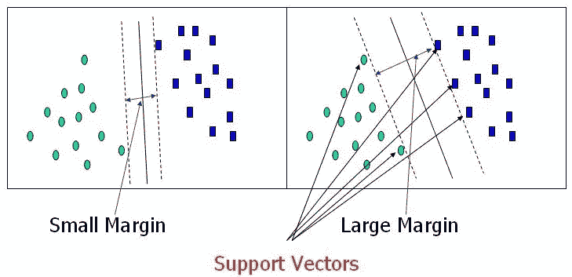
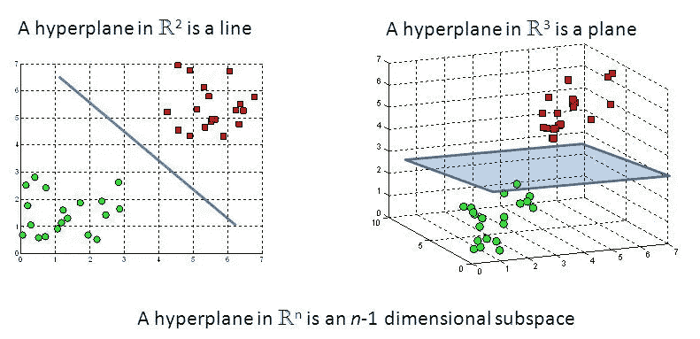
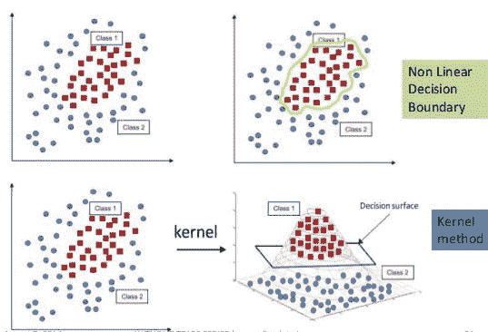
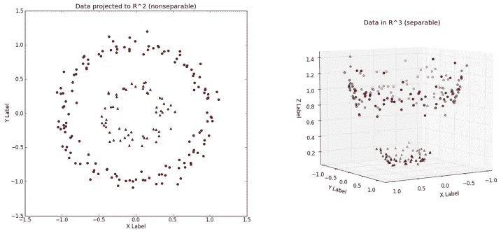
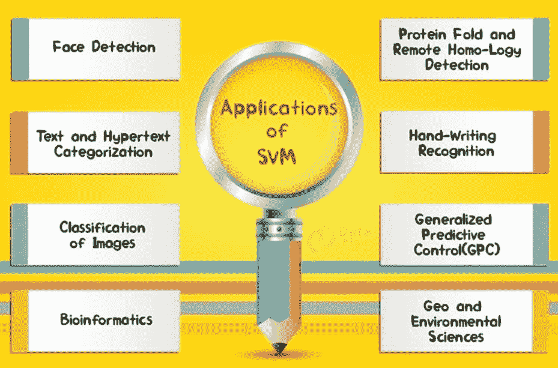

# 支持向量机

> 原文：<https://medium.datadriveninvestor.com/support-vector-machines-svms-4bcccbd78369?source=collection_archive---------2----------------------->

## 简要概述

# **简介**

支持向量机是一组从数据集学习的监督学习方法，可用于回归和分类。SVM 是一种**大间隔分类器:**它是一种基于向量空间的机器学习方法，目标是找到两个类之间的**决策边界**，该边界最大程度地远离训练数据中的任何点。

Source : Towards Data Science

# **支持向量:**

术语“支持向量”指的是个人观察的**坐标**。支持向量机是使用**超平面/线来最好地分离这两类的前沿。**

Source: bahrainpavilion2015.com

# **SVM 工作:**

SVM 模型是作为空间点的示例的**表示，被映射成各个类别的示例被尽可能宽的间隙**分开。然后，新的例子被映射到相同的空间，并根据它们落在差距的哪一边来预测属于哪个类别。

Identification of a perfect hyperplane. It should be the one that is perfectly segregating two classes.

除了执行线性分类，支持向量机还可以使用所谓的**内核技巧**有效地执行非线性分类，隐式地**将它们的输入映射到高维特征空间**。

Non-Linear Decision Boundary

# **内核方法:**

SVM 使用核方法来执行**非线性分类**。它们将低维输入空间转换成高维输入空间。它**将不可分离的类转换成可分离的类**，它根据我们定义的数据标签找到一种分离数据的方法。

Performing Non-Linear Classification using Kernel Method

# **支持向量机的特点和优势:**

1.  他们**使用找到最佳超平面的二次优化技术来最大化决策边界**的余量。
2.  它有能力**处理大的特征空间**。
3.  当我们对自己的数据一无所知时，SVM 是非常好的。
4.  适用于文本、图像和树等非结构化和半结构化数据。
5.  核心技巧是 SVM 的真正优势。有了合适的核函数，我们可以解决任何复杂的问题。
6.  它**相对较好地**扩展到高维数据。
7.  SVM 模型在实践中具有推广性，SVM 的**过拟合风险较小。**

# **SVM 的局限性:**

1.  它对噪音很敏感**。**
2.  将分类扩大到两类以上是有问题的。
3.  选择一个“好”的内核函数并不容易。
4.  **大数据集训练时间长**。
5.  难以理解和解释最终模型、可变权重和个人影响。
6.  由于最终模型不容易看到，**我们不能对模型做小的校准**，因此很难融入我们的业务逻辑。
7.  SVM 超参数是成本-C 和伽玛。微调这些超参数并不容易。很难想象它们的影响

# **SVM 的一些应用:**

Source : DataFlair

1.  文本(和超文本)分类。
2.  图像分类。
3.  生物信息学(蛋白质分类、癌症分类)。
4.  手写字符识别。
5.  垃圾邮件的判定。
6.  时间序列分析。
7.  异常检测。