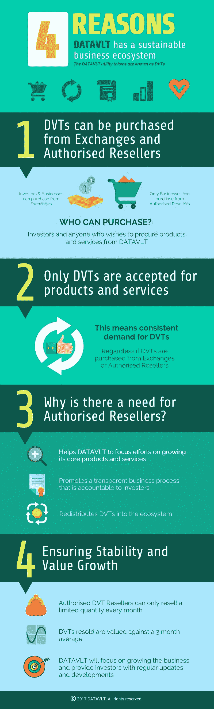

# 可持续的区块链业务:可能吗？

> 原文：<https://medium.datadriveninvestor.com/sustainable-blockchain-businesses-is-it-possible-d92ce5daedd7?source=collection_archive---------2----------------------->

“The Capital Markets”

自 19 世纪**以来，股票市场和一般资本市场经历了一个繁荣的时代和长期的熊市。企业倒闭，投资者和贷款者只能接受公司资产的清算价值，相当于原始投资的一半甚至更少。**

> 这些不寻常的经济周期极大地影响了消费者、供应商和其他商业伙伴。服务不可用；这些企业的材料供应商将不得不关门大吉，而建立起来的声誉和通向其他商家的桥梁也将被夷为平地。

“Shareholders”

商业创新者于是发展出了**最大化股东财富**的概念，以避免高管为自己的利益而工作，而是为利益相关者工作，等同于有价值的经济增长。

然而，人们发现，随着时间的推移，许多公司的利润下降或收入停滞不前。他们中的大多数人过于关注创新，却没有看到更广阔的前景。消费者呢？受他们操作影响的社区呢？

“Different Consumer Types”

> 然后成功三足鼎立的概念被发展出来，它陈述了企业成功的三个重要支柱，顺序如下；消费者、股东财富创造和企业社会责任。

将第一批消费者放在首位是因为他们是成功增长的关键决定因素。将消费者作为 feat 最重要支柱的公司之一是 **DATAVLT。**这是一个区块链驱动的平台，具有人工智能和机器学习功能，旨在帮助中小型企业利用其业务数据分析动态消费者偏好和需求。这将使公司能够创新其现有的产品，以保持其现有的消费者，并在不久的将来吸引更多的消费者。此外，使中小企业能够与其竞争对手竞争。

# 区块链的公司如何可持续发展？

DATAVLT 提供了四种可持续发展的方法，同样适用于其他行业。这四种方式可以分为两种，需要经销商和确保健康的价值增长。

**首先，授权经销商与交易所一起提供四个好处:确保可审计性、为以产品为中心的开发留出空间、提高透明度以及确保代币在网络中的健康分布。**

拥有基于区块链的分析平台允许企业防止系统中的欺诈，因为一旦执行不可逆交易，它是防篡改的，并且只能通过另一个公共交易来纠正。这个网络留下了审计线索，以便更好地问责。

对于网络的适当监控，人力也是一个问题，因此需要授权经销商授权他们监督商业生态系统内的活动。这为开发团队创新和升级他们的产品铺平了道路。

透明度对于在利益相关方(尤其是投资者和债权人)之间建立信任非常重要，在一定程度上确保了 DATAVLT 的未来扩展。

要实现的最大好处之一是代币的健康再分配，防止囤积和价格操纵。

**最后，是确保他们份额(硬币)的健康价值增长。**购买服务后，DATAVLT 将要求购买者使用他们的令牌来保证一致的需求。为了避免影响股价的市场倾销，DATAVLT 限制授权经销商每个季度出售有限数量的代币。这些将导致更好的企业估值。

