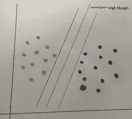
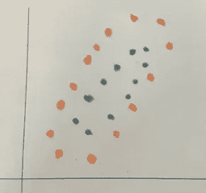

# 关于 SVM 的“需要知道”的细节

> 原文：<https://medium.datadriveninvestor.com/svm-helps-in-resolving-missing-cases-48c61c6e9715?source=collection_archive---------11----------------------->

***作者仅代表作者个人观点。这些绝不代表和/或反映他所关联的组织。***

**背景**

最近有消息称，可以通过装有摄像头的移动车辆跟踪公民违规行为。目标是捕捉大多数常见的违规行为，如扔垃圾、放水、在道路上丢弃建筑垃圾等。因此，下一个问题将是如何对所有这些细节进行分离和分类，以便采取可能的行动。我们可以通过多种方式对这些问题进行分类。

*   如果我们的目的是根据违规的类型进行分类，那么它可以帮助将违规分为垃圾、污水、碎片等。
*   如果我们的目的是根据地点或地址进行分类，那么我们可能需要更深入地了解 GPS 的详细信息，以划分成不同的区域(如北、东、西、南)，以便各个地区的政府机构能够采取适当的行动。

您认为我们将如何对上述用例中提到的图像进行分类？有多种方法，支持向量机(SVM)是其中一种，可以帮助分类这些图像。

正如我们现在所知道的，监督算法在解决回归和分类问题上都是有帮助的。SVM 就是这样一种算法，它可以很好地适用于分类问题。对于回归，该算法(也称为支持向量回归)的目的是将数据点限制在一组定义的边界内，以便可以防止远离模型方程(或线)的数据被包括在内。

因此，我们想到的下一个问题是，当我们有其他选择如逻辑回归来处理分类问题时，使用这种算法的好处。逻辑回归在处理简单的线性数据集时效果很好，但当我们开始处理更复杂的数据时可能就不太好了，这些数据在本质上不是那么线性的，这些数据集可能计算量很大，可能需要更多的时间来拟合模型。此外，线性回归可能会特别关注异常值，并且在此过程中可能会使模型变得复杂，但是，SVM 将有助于轻松隔离和分离出异常值，这里的重点是使其简单、容易地集中在相关的点上，而不是在异常值上浪费精力，这些异常值可能对选择的整体模型影响很小或没有影响。

**什么是支持向量机？**

支持向量机是一个概念，通过它给定的数据可以被分为两类或更多类。为了使我们的对话简单，让我们以两个类为例，尝试理解这种方法背后的过程。

线/超平面将用于根据数据点是二维的还是 n 维的将数据点分成 2 类。超平面通常比范围内的实际样本数据点小一维，对于三维空间，其超平面将变成二维**平面**，对于二维空间，其超平面将变成一维线。

因此，我们列表中的下一个问题是理解所提出的超平面如何对给定的数据点(也称为支持向量点)进行分类，为了获得正确的分类，需要考虑的场景很少。

*   最简单的情况是，你只有一个超平面来正确地分离你的数据，尽管可能有一些偏差的其他可能性，但选择一个具有完美分类的超平面并不费事。
*   在第二种情况下，我们将有不止一个可能的超平面干净地将数据分类。这里我们需要了解一个叫做“边缘”的概念，它只不过是单个数据点和超平面之间的距离。选择标准是选择具有最大裕度的超平面，这里的目的是保持它的宽度，以便在情况出现时容纳未来的数据点。
*   第三种情况可以是让更好的分类覆盖边界逻辑。这里，可以忽略具有良好裕度但不确保最大覆盖的超平面，以容纳具有更好分类的超平面。
*   最后一种情况是存在异常值，这使得无法对数据进行分类，我们在这里采用的方法是选择最可能忽略异常值的数据。

HyperPlane with high margin will be picked

**什么是核函数？**

好吧，那这里的挑战是什么？当数据真的不可分时，真正的问题就来了，我们需要的方法是在分类之前先转换它们。这里使用的技术叫做**内核**，它将给定的复杂粘合数据转换成可分离的数据。核采用低维输入空间，并将它们转换到更高维的空间，使得它们更适合分类。总体思想是借助于核函数，通过转化为线性模式来解决非线性复杂问题。这里有多种可能性，选择将基于手边的问题/用例。

Tough to classify here, and Kernel comes to the rescue

**编程逻辑**

编程部分很简单，因为 Python 的 scikit-learn 包提供了现成的函数，可以帮助获得所需的输出。像其他回归算法一样，SVM 可以很容易地导入和使用。

***从 sklearn 导入 svm***

***svmModel = svm。SVC(kernel='linear')***

***svmModel.fit(X，y) # X 为输入数组，y 为输出***

拟合模型后，我们可以使用预测函数来预测一组新输入值的值。

***svmmodel . predict(XNew)# XNew，用于预测的新数据数组***

核可以是“线性”、“rbf”、“多边形”等。一般来说，这两种类型都可以使用，但我们需要记住一些参数，如花费的时间，以及在这些项目上进行呼叫的准确性。按照“线性”、“多边形”和“rbf”的顺序，这些参数按升序排列，这意味着线性花费的时间更少，精度更低，而“rbf”花费的时间更多，但精度更高。

“线性”是最简单的开始，我们可以扩展到其他类型的基础上，我们是否相信装修。如果数据不适合线性模型，我们可以按顺序尝试“poly”并进一步尝试“rbf”模型。已经说过，直接从“rbf”开始可能会导致过度拟合，因此必须有意识地根据数据的性质、涉及的特征数量等来评估各种选项。以得出选择特定内核类型的逻辑结论。

**最终意见**

SVM 有多种使用案例，从图像分类、文本与超文本的分类开始，可以帮助达到面部识别的程度。现在，政府和相应的警察部门正在积极使用面部检测算法，通过将面部与在国家/地区的其他地方发现的面部进行匹配，将失踪的儿童/人员联系起来。

总的来说，SVM 在企业和政府部门有多种用途，这只是一个开始，我相信随着未来的发展，我们会有越来越多的使用案例利用 SVM 的功能。