# 斯瓦格+ Excel 工作表，一种验证 REST APIs 的极好方法

> 原文：<https://medium.datadriveninvestor.com/swagger-excel-sheets-a-wonderful-way-of-validating-rest-apis-48ad4af78661?source=collection_archive---------2----------------------->

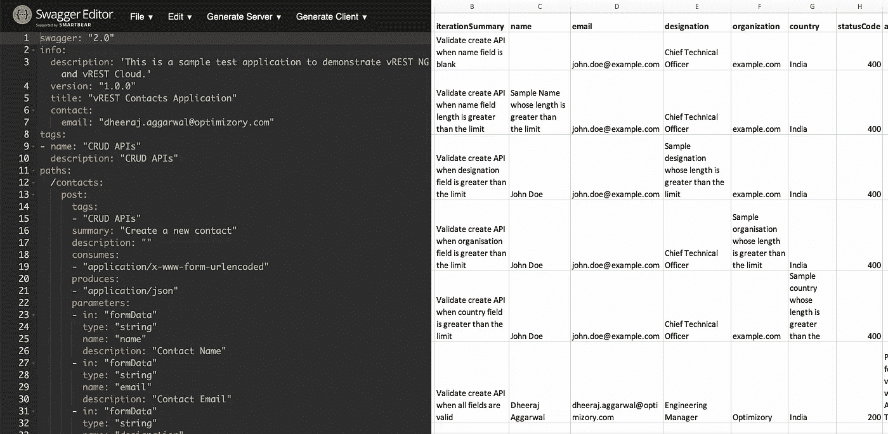

Swagger + Excel Sheets, A wonderful way of validating REST APIs

斯瓦格文件(也称 OpenAPI 规范)是记录 API 规范的最流行的方法，而 Excel 工作表提供了一种编写结构化数据的简单方法。任何人都可以在 excel 工作表中写入数据，无论其编程技能如何。引入 [vREST NG](https://ng.vrest.io) (自动化 API 测试的企业级应用程序)，它结合了两者的力量，使您的 API 测试体验更加无缝。这种方法也被称为数据驱动测试。

> *数据驱动测试是一种测试数据与测试逻辑或脚本分开编写的方法。*

因此，该过程是这样的:

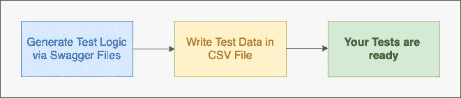

Swagger + Data Driven Testing Process

vREST NG 使用 swag 文件生成所有测试逻辑和样本测试数据 CSV 文件。vREST NG 从 CSV 文件中读取测试数据，并对 CSV 文件中的可用行进行迭代，然后逐个运行迭代。今天在这篇文章中，我们将详细了解以下内容:

1.  如何通过使用斯瓦格文件生成测试用例。
2.  如何通过 excel 表将测试数据馈送到那些生成的测试用例。

# 如何在 vREST NG 中执行数据驱动的 API 测试

为了详细说明这个过程，我将使用一个名为 contacts 应用程序的示例测试应用程序，它提供 CRUD APIs。我将指导您完成以下步骤:

1.  设置测试应用程序
2.  下载并安装 vREST NG 应用程序
3.  在 vREST NG 中执行数据驱动的 API 测试

# 1.设置测试应用程序:

如果您想按照您自己的测试应用程序的说明进行操作，您可以跳过这一步。

 [## 6 雅虎金融应用编程接口的替代方案|数据驱动型投资者

### 对于许多数据驱动型投资者来说，雅虎财务应用编程接口一直是一个可靠的工具。许多人依靠他们的…

www.datadriveninvestor.com](https://www.datadriveninvestor.com/2019/02/25/6-alternatives-to-the-yahoo-finance-api/) 

否则，只需从该[知识库链接](https://github.com/dheerajaggarwal/contacts-vrest-ng-ddt)下载测试应用程序示例。为了设置此示例测试应用程序，您还需要安装以下组件:

1.  NodeJS(使用 v10.16.2 进行测试)
2.  MongoDB(使用 v3.0.15 测试)

要设置该应用程序，只需遵循存储库的[自述文件](https://github.com/dheerajaggarwal/contacts-vrest-ng-ddt)中提到的说明。

# 2.下载并安装 vREST NG 应用程序

现在，只需通过 [vREST NG 网站](https://ng.vrest.io)下载并安装该应用程序。安装更简单，但是如果您需要操作系统特定的说明，那么您可以遵循这个[指南链接](https://ng.vrest.io/docs/app/installation.html)。

vREST NG - https://ng.vrest.io

安装后，启动 vREST NG 应用程序，并在出现提示时使用 **vREST NG Pro** 版本，以便进一步操作。

现在，首先通过在 vREST NG 工作区拖动文件系统中的任何空目录来设置一个项目。vREST NG 会把它当作一个项目，把所有的测试都存储在那个目录下。关于设置项目的更多信息，请阅读此 [**指南链接**](https://ng.vrest.io/docs/app/new-user.html) 。

快速开始，如果你不想遵循整个过程，只想看到最终结果。他们可以直接在 vREST NG 应用中下载并添加这个 [**项目目录**](https://github.com/dheerajaggarwal/contacts-vrest-ng-ddt/tree/master/test/contacts-api-tests) 。

# 3.在 vREST NG 中执行数据驱动的 API 测试

vREST NG 提供了一个快速的 3 步流程来执行数据驱动的 API 测试:

(a)导入 Swagger 文件

(b)将测试数据写入 CSV 文件

(c)[可选]设置环境

现在，我们将详细了解这些步骤:

# (a)导入 Swagger 文件

要导入 Swagger 文件，只需点击 vREST NG 应用程序左上角的**导入器**按钮。

vREST NG Importer Button

将会打开一个导入对话窗口。在此对话窗口中:

1.  选择“Swagger”作为导入源
2.  勾选选项“**生成数据驱动测试**”。如果选中此选项，vREST NG Importer 将为 swagger 文件中可用的每个 API 规范生成数据驱动的测试用例。
3.  提供 swagger 文件。对于这个演示，我们将使用测试应用程序存储库中的 swagger 文件。 [**下载招摇文件**](https://raw.githubusercontent.com/dheerajaggarwal/contacts-vrest-ng-ddt/master/swagger.yaml)

对话窗口看起来像这样。现在，点击**导入**按钮继续。

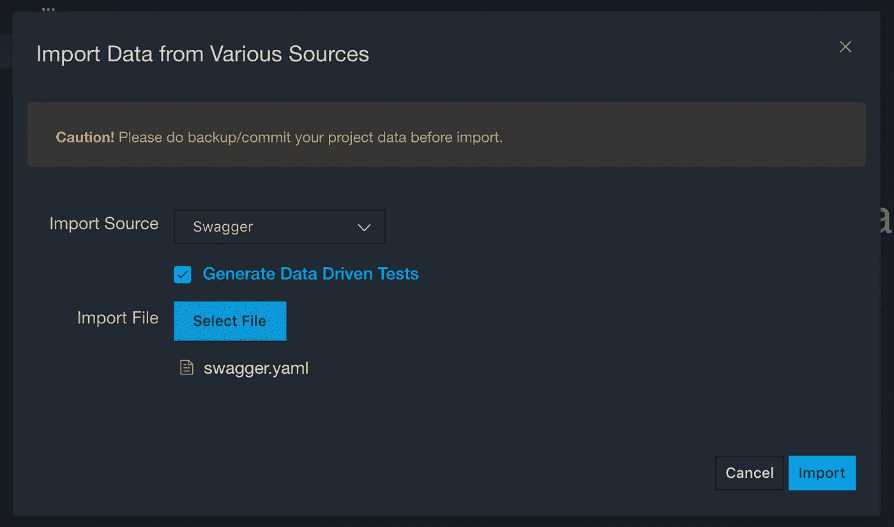

vREST NG Import Dialog

到目前为止，导入过程已经完成了以下工作:

1.  它已经为 swagger 文件中可用的每个 API 规范生成了一个测试用例。并且将根据 swagger 文件中可用的每个标签生成测试套件。

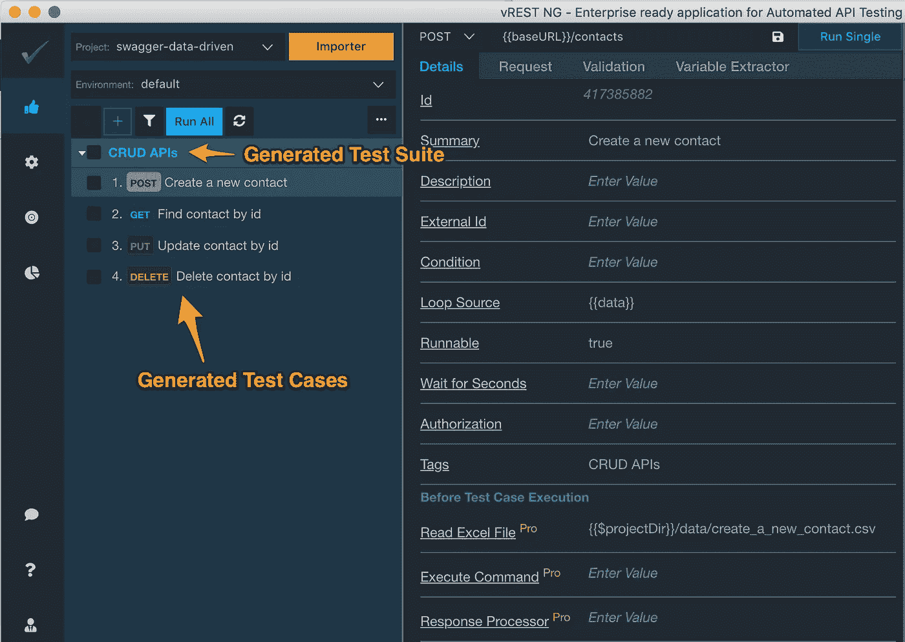

vREST NG — Generated Tests from Swagger Import

**2。**它已经根据您的 swagger 文件自动为每个测试用例创建了样本 CSV 文件，并包含了所需的列，如下图所示。

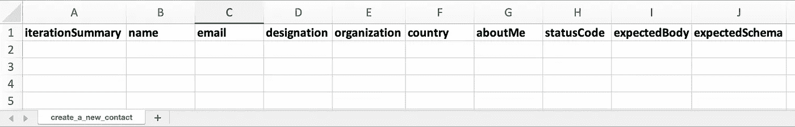

vREST NG — Generated CSV File from Swagger Import

我们将在这篇文章的后面详细讨论如何填写这个 excel 表格。

**3。**生成的 CSV 文件也会自动链接，如下图所示。

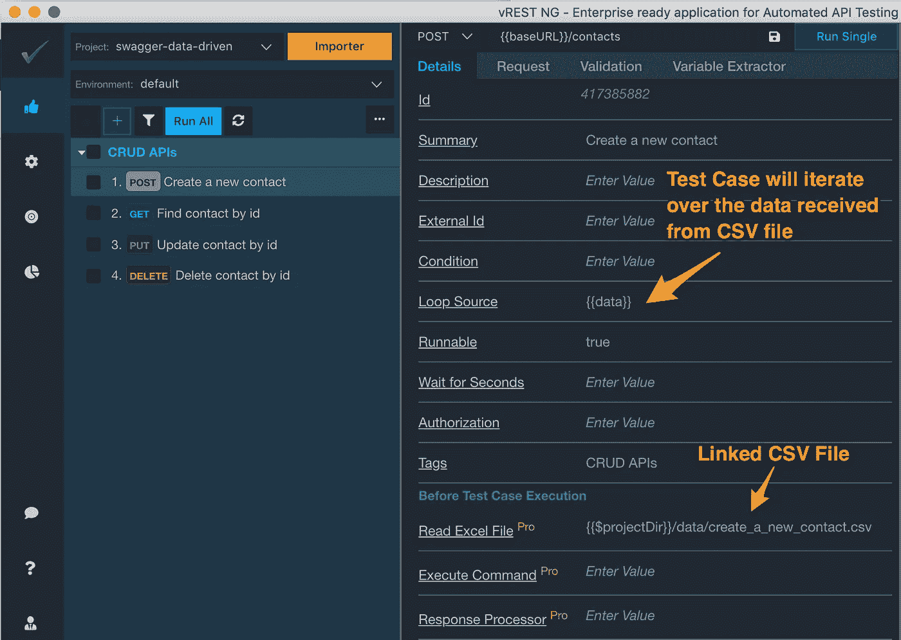

CSV File automatically linked via Swagger Import Process

因此，在每次测试执行之前，API 测试将从链接的 CSV 文件中读取数据，并将其转换为 JSON 格式，然后存储在一个名为 data 的变量中。现在，测试用例将迭代接收到的数据，并运行迭代。因此，如果您在 CSV 文件中做了更改，只需再次运行测试用例。测试用例将总是获得 CSV 文件的最新状态。**无需反复导入**。

**4。**根据 swagger 文件中可用的 API 定义，它已自动在 API 请求参数中插入一些变量。这些变量值将自动从链接的 CSV 文件中选取。

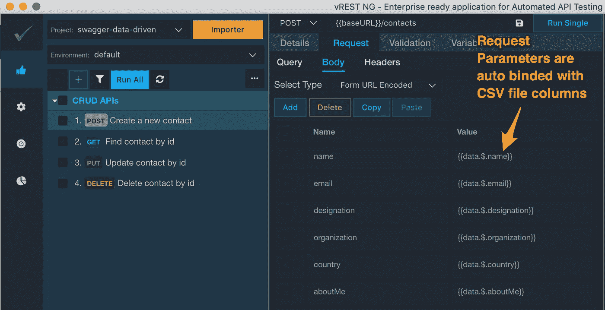

Request Parameters auto binded via swagger import process

**5。**它还自动添加了响应验证逻辑。状态代码断言用于验证 API 响应的状态代码。带有默认验证器断言的文本正文将预期的响应正文与实际的响应正文进行比较。带有默认模式验证器断言的文本体通过 JSON 模式验证 API 响应。

将从链接的 CSV 文件中提取预期的状态代码。

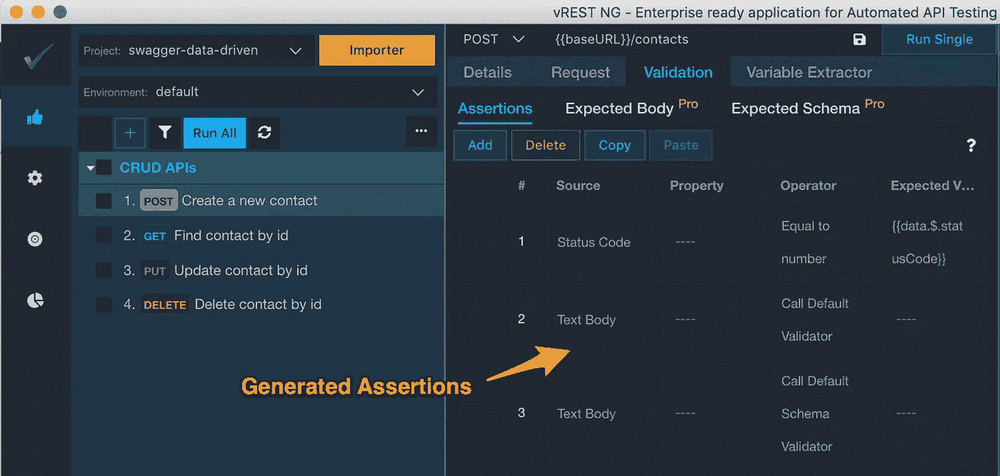

Assertions auto generated through Swagger Import process

预期的响应正文也将从链接的 CSV 文件中提取。

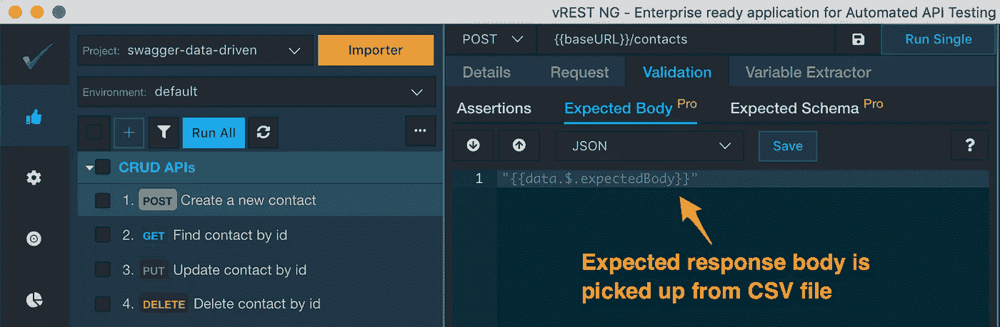

Expected body auto binded with CSV file column

预期的模式名称**也从链接的 CSV 文件中选取。**

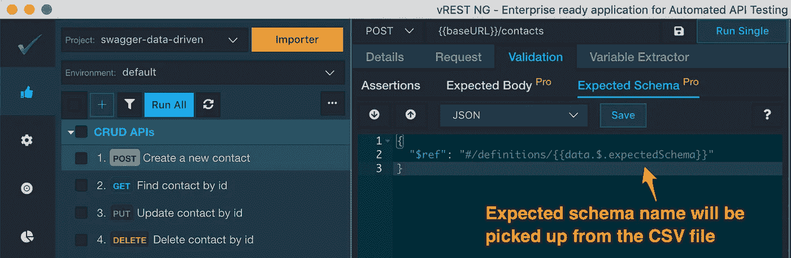

Expected Schema Name auto binded from CSV file column

**6。**它已经在 Configuration 选项卡的 Schemas 部分导入了所有的 swagger 模式定义。

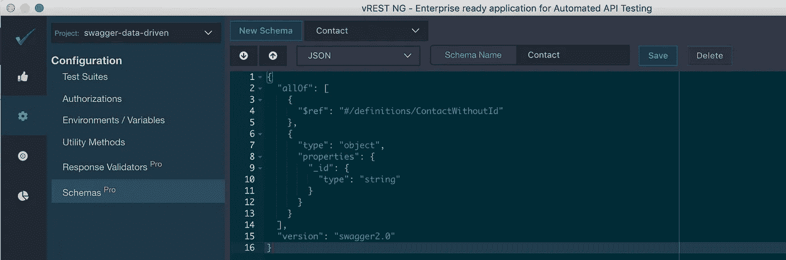

JSON Schemas auto generated through Swagger Import Process

如前所述，您可以在预期模式选项卡中引用这些模式定义。在 CSV 文件中，您只需要在 **expectedSchema** 列中为测试迭代指定各自的模式名称。

# (b)将测试数据写入 CSV 文件

因为我们已经看到了从导入过程中生成的数据文件。让我再次向您展示为创建联系人 API 生成的文件:

Sample CSV File auto generated via Swagger Import Process

在这个示例文件中，您可以为 Create Contact API 添加与各种迭代相关的测试数据。在 iterationSummary 列中，简单地为您的迭代提供有意义的摘要。这个迭代摘要将出现在 vREST NG 应用程序的 Results 选项卡中。你需要自己填写这些测试数据。您甚至可以通过任何外部脚本来生成这个测试数据。

现在，让我们在链接的 CSV 文件中添加一些测试迭代。

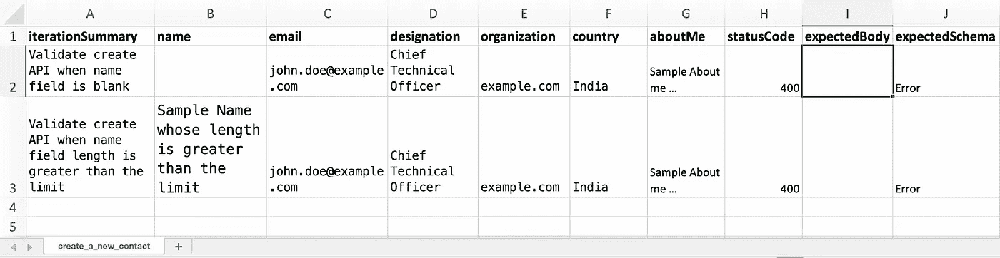

Write Test Data in Excel Sheet

使用上面的 CSV 文件，我们正在检查 Create Contact API 的两个测试条件:

1.  当名称字段为空时
2.  当名称字段长度超过 35 个字符的限制时。

在上面的 CSV 文件中，我们有意将 expectedBody 列留空。我们不需要填写这一栏。我们可以通过 vREST NG 应用程序本身来填充该列的值。

在执行测试用例之前，我们需要在 Configuration 选项卡中配置测试应用程序的 baseURL 变量，如下所示:

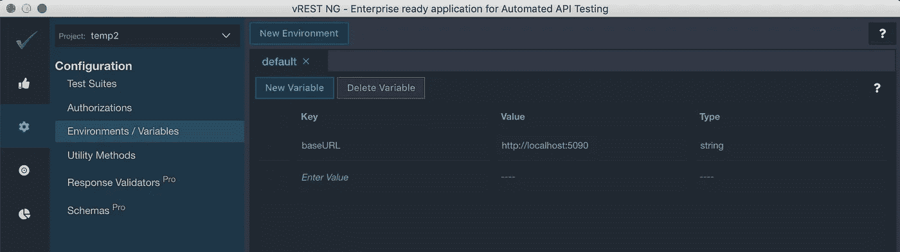

Configure the baseURL variable

现在，让我们在 vREST NG 应用程序中执行这个测试。两次迭代都失败了，因为预期的响应正文与实际的响应正文不匹配，如下图所示:

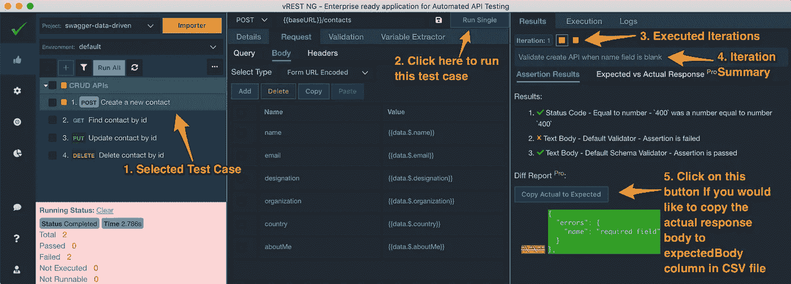

Single Test Execution in vREST NG

现在，为每个迭代点击“复制实际到预期”按钮。vREST NG 会直接将实际的响应正文复制到 CSV 文件中的 expectedBody 列，如下所示。

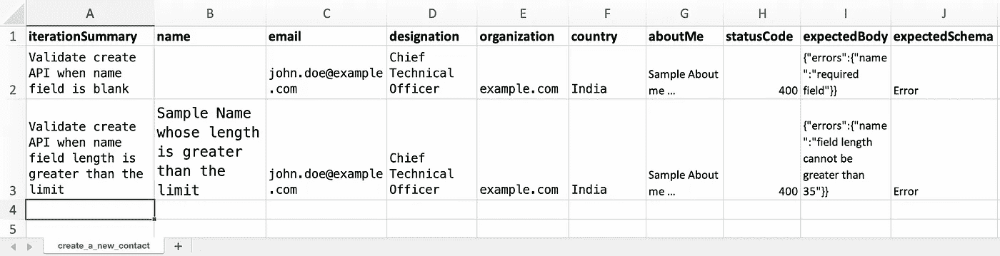

现在，在这个操作之后，如果您再次查看 CSV 文件。您可以看到 vREST NG 已经为您填充了 expectedBody 列，如下图所示。

**注意:**如果您已经在 Microsoft Excel 中打开了该 CSV 文件，那么您需要关闭该文件，然后再次打开它，以反映所做的更改。但是一些代码编辑器会自动检测文件系统上的变化，并实时反映出来。

现在，如果您再次执行测试，您可以看到测试现在通过了。

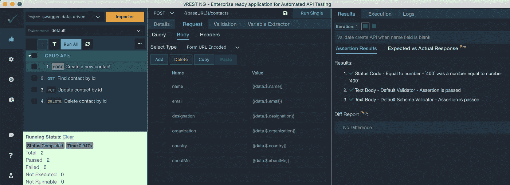

您还可以看到所选测试迭代的预期响应与实际响应的对比:

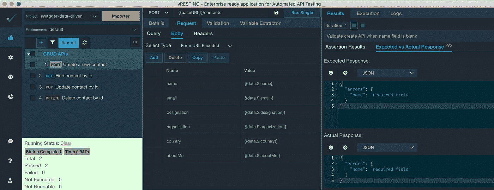

并且您可以通过转至 execution 选项卡来查看所选迭代的执行细节:

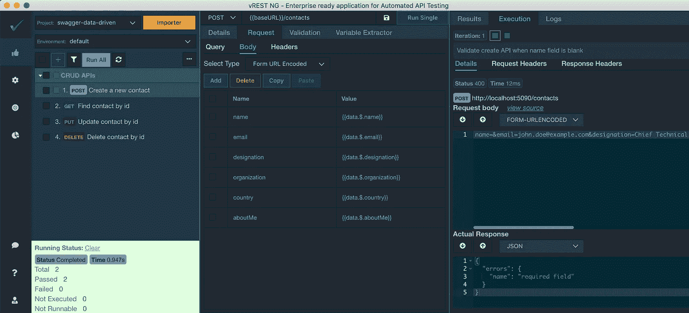

因此，通过这种方式，您可以在 CSV 文件中添加迭代。只需在您的 CSV 文件中添加迭代，并直接在 vREST NG 应用程序中运行它。不需要反复导入。这一切只是无缝工作。因此，它极大地提高了你的测试效率。

# (c)[可选]设置环境

对于生成的步骤，您可能还需要在执行测试之前设置初始的应用程序或数据库状态。以便您可以自动执行回归。设置初始状态的一些用例可以是:

1.  从备份中恢复数据库状态
2.  执行外部命令或脚本
3.  调用 REST API 来设置初始状态

现在让我们看看如何执行外部命令或从备份中恢复数据库状态。假设对于我们的示例测试应用程序，我们已经获得了一个数据库转储，我们希望在执行测试用例之前恢复这个转储。由于我们将 MongoDB 用于我们的示例测试应用程序，因此我们可以使用 **mongorestore** 命令来实现我们的目的。

您可以指定如下图所示的命令:

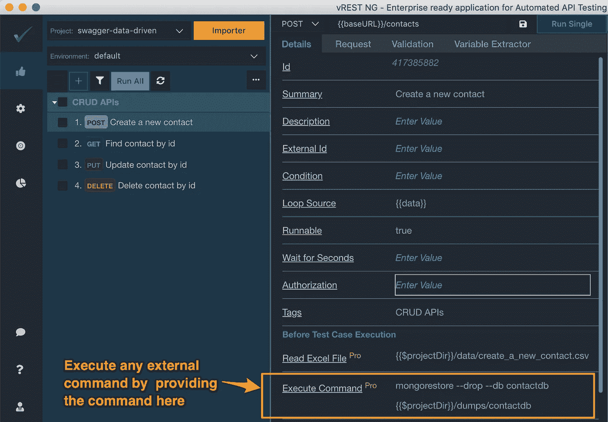

Command execution before test execution to setup initial state

上面的命令将从已经在 vREST NG 项目目录> >[转储文件夹](https://github.com/dheerajaggarwal/contacts-vrest-ng-ddt/tree/master/test/contacts-api-tests/dumps)中的备份中恢复数据库。

**注意:**确保 mongorestore 命令在您的路径中，否则您需要提供该命令的完整路径。

vREST NG : https://ng.vrest.io

所以，这是多么简单，你可以在 [vREST NG](https://ng.vrest.io) 中执行数据驱动测试。如果你觉得这篇文章有帮助，请通过评论告诉我，或者喜欢这篇文章，或者与你的朋友和同事分享这篇文章。如果您有任何疑问或需要任何帮助，您可以通过我的 [LinkedIn 个人资料](https://www.linkedin.com/in/aggarwaldheeraj/)联系我。

【https://www.linkedin.com】最初发表于**。**