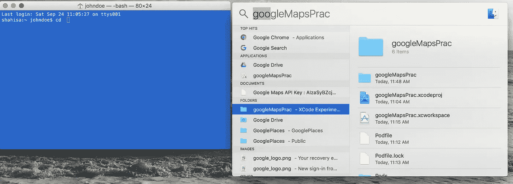
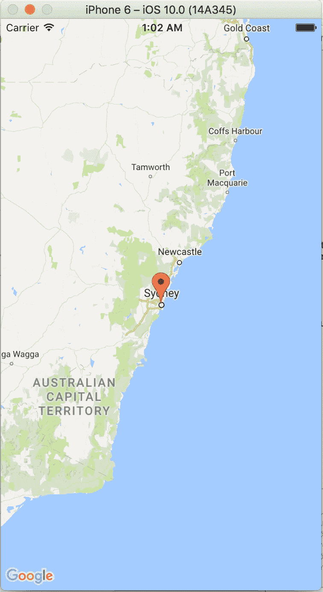

# Swift 3.0 谷歌地图 API

> 原文：<https://medium.datadriveninvestor.com/swift-3-0-google-maps-api-fb85bc30cbcb?source=collection_archive---------0----------------------->

[](http://www.track.datadriveninvestor.com/1B9E)

在成为一个更好的 iOS 开发者的过程中，毫无疑问，你将不得不使用 API 或应用程序接口。今天使用的是谷歌地图 API，它基本上允许开发者将谷歌地图服务整合到他们的应用程序中。它省去了开发全新地图系统的麻烦。这将是一个指导如何将谷歌地图添加到他们的 Swift 3 iOS 项目的指南。

## 步骤 1:安装谷歌地图软件开发工具包(SDK)

这一部分将使用 Swift 和 Objective-C 开源依赖管理器 CocoaPods 来完成。第一个人需要在 macOS 上安装 CocoaPods，如果它还没有安装的话。要检查 CocoaPods 是否安装在您的操作系统上，请在您的终端中运行以下命令。

```
pod --version
```

如果该命令返回“未找到”,则说明 CocoaPods 未安装在操作系统上，或者该命令将返回版本号。要安装 CocoaPods，请在终端中输入以下命令。

```
sudo gem install cocoapods
```

在此之后，将在操作系统上安装 CocoaPods。下一步是打开 XCode 并创建一个单视图应用程序。创建完成后，返回终端窗口，在项目中安装 pod 文件。必须将目录更改为正在处理的 XCode 项目。



Shortcut for Changing Directory

打开终端后键入:

```
cd "projectDirectoryName"
```

然后按回车。这可以通过同时按住 command 和 space 来调出 finder 来轻松实现。然后键入项目名称，并将项目文件夹拖到终端中，这样它会自动输入项目目录名称。之后，使用以下命令创建一个 pod 文件:

```
pod init
```

在 XCode 编辑器中打开 pod 文件，并添加以下代码行:

```
target 'YOUR_APPLICATION_TARGET_NAME_HERE' do
  pod 'GoogleMaps'
  pod 'GooglePlaces'
end
```

之后，保存 pod 文件并返回到终端，其中包含项目上的目录位置。然后运行命令:

```
pod install
```

当 pod 完成安装后，关闭 XCode 并使用恢复会话。xcworkspace 用于项目中的所有持续开发。

## 步骤 2:获取一个谷歌地图 API 密钥并添加到应用程序中

这是获取谷歌地图 API 密钥的链接:[https://developers.google.com/maps](https://developers.google.com/maps)

获得 API 密钥后，打开 XCode 应用程序并导航到 AppDelegate.swift add:

```
import GoogleMaps
```

将以下内容添加到应用程序(_:didFinishLaunchingWithOptions:)方法中:

```
GMSServices.provideAPIKey("**YOUR_API_KEY**")
```

对于位置 API:

```
GMSPlacesClient.provideAPIKey("**YOUR_API_KEY**")
```

在 ViewController 中添加以下内容:

```
import UIKitimport GoogleMapsclass ViewController: UIViewController {override func viewDidLoad() {super.viewDidLoad()// Create a GMSCameraPosition that tells the map to display the// coordinate -33.86,151.20 at zoom level 6.let camera = GMSCameraPosition.camera(withLatitude: -33.86, longitude: 151.20, zoom: 6.0)let mapView = GMSMapView.map(withFrame: CGRect.zero, camera: camera)mapView.isMyLocationEnabled = trueview = mapView// Creates a marker in the center of the map.let marker = GMSMarker()marker.position = CLLocationCoordinate2D(latitude: -33.86, longitude: 151.20)marker.title = "Sydney"marker.snippet = "Australia"marker.map = mapView}
```

## 步骤 3:声明 URL 方案和实现

通过在 Info.plist 文件中添加以下行来声明 Google Maps API 使用的 URL 方案:

```
<key>LSApplicationQueriesSchemes</key>
<array>
    <string>googlechromes</string>
    <string>comgooglemaps</string>
</array>
```

现在是展示和讲述的时候了。运行应用程序。



Yay! Google Maps API

如果本教程有帮助，请给予反馈。或者想了解更多就提问。