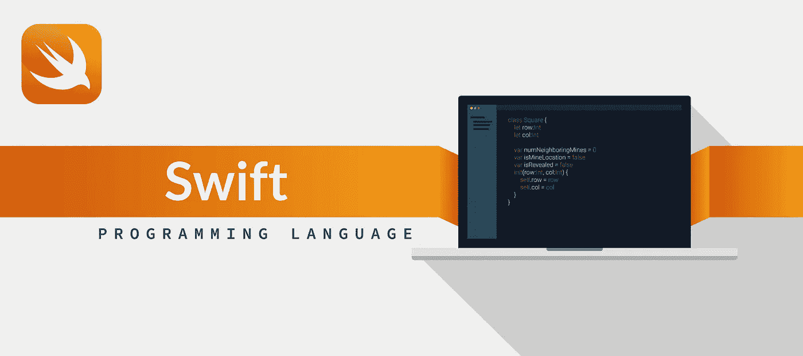

# Swift 编程语言:iOS 开发的利与弊

> 原文：<https://medium.datadriveninvestor.com/swift-programming-language-pros-and-cons-for-ios-development-2ad983312755?source=collection_archive---------11----------------------->

iOS 是世界上最受欢迎的两个开发平台之一，这就是为什么一些公司只为 iPhones 开发软件产品。当开发 iOS 时，有时很难选择必要的技术栈。您还需要决定是跨平台开发还是更简单的本地开发。语言方面，可以用比较老的 Objective-C，也可以用最近出现的 Swift。因为 Objective-C 已经存在了一段时间，所以在本文中，我们将关注 Swift 中的编程。

# 什么是 Swift 编程？

Swift 是大约五年前推出的，从那时起，它得到了这样一家大公司的支持，它正在成为 iOS 开发的主导技术。它是一个开源工具，有一个庞大的支持社区和各种各样的第三方工具。这一切都始于 2014 年，当时苹果公司的一名顶级工程师克里斯·拉特纳只是为了好玩而摆弄了一些东西。他在苹果公司的一些同事发现后，非常兴奋地想尝试一下。他最终在 2014 年全球开发者大会上介绍了这种新语言，这种语言开始流行起来。

 [## 2019 年最值得学习的编码语言——数据驱动的投资者

### 在我读大学的那几年，我跳过了很多次夜游去学习 Java，希望有一天它能帮助我在…

www.datadriveninvestor.com](https://www.datadriveninvestor.com/2019/02/21/best-coding-languages-to-learn-in-2019/) 

# Swift 是一门好语言吗

Swift 是一种非常好的语言，因为除了是一种流行的开源工具之外，它还非常安全，因为设计本身鼓励开发人员始终如一地编写干净可读的代码。也许它的主要优势是速度。事实上，当比较 Swift 和 Objective-C 时，可以确定 Swift 快 2.6 倍，在与 Python 的直接竞争中，Swift 快 8 倍。事实上，目前，我们正在见证一项巨大技术的崛起，它将主导软件开发。背后有苹果的支持确实给了 swift 很大的可信度，提升了它的知名度。

# Swift 编程的优点

除了使用 Swift 进行 [iOS 应用开发](https://skywell.software/mobile-app-development/)的明显优势之外，以下是一些额外优势:

*   更好的可扩展性——Swift 非常适合为您的产品增加功能，也非常适合为您的开发团队增加新成员。由于这种语言提倡简单性，如果需要的话，您可以向您的团队添加额外的开发人员，并让他们立即投入工作，因为它可读性很强。
*   互操作性——假设您有一个使用 Objective-C 构建的大型项目。您可以使用相同的代码库对应用程序进行所需的所有更新，因为我们已经知道 Swift 的可扩展性，如果您需要，您也可以添加一些功能。
*   全栈潜力——IBM 一直积极推动 Swift 在云中可用，这一决定显示出巨大的红利。服务器端 Swift 可以与任何技术集成。如果您同时使用 Swift 进行前端和后端开发，您将能够更好地共享您的代码，从而大大加快开发过程。

# 使用 Swift 的缺点

尽管迄今为止对 Swift 的所有评价都是正面的，但 Swift 编码仍面临一些挑战:

*   Swift 相对较新——自从 Swift 最近出现以来，肯定会有一些成长的烦恼。没有太多的工具或原生库，旧的工具或原生库不再与 Swift 新版本的发布相关。
*   几乎不支持早期的 iOS 版本——您只能在 iOS7 和更高版本的应用程序中使用 Swift。也就是说，Swift 不能用于在旧版操作系统上运行的遗留项目。然而，目前约有 5%的苹果设备运行的是 iOS6 或更早版本。
*   人才短缺——尽管 Swift 社区正在快速增长，但它仍然比其他开源语言小得多。事实上，根据 Stack Overflow 的调查，在接受调查的 78，000 名开发人员中，只有 8%的人表示他们使用 Swift。

我们希望这篇文章将有助于您在开发下一个应用程序时决定是否使用 Swift 编码语言。随着时间的推移，在苹果公司的支持下，Swift 肯定会变得更加受欢迎，道路上的所有打嗝和颠簸都将被消除。Swift 的创建正如其名称所暗示的那样:极其快速、高效和可扩展。

*最初发表于*[*sky well . software*](https://skywell.software/blog/swift-programming-language-pros-and-cons-for-ios-development/)*。*