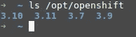
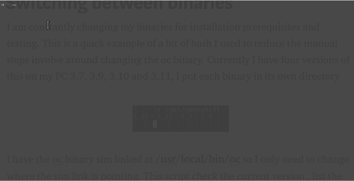

# 在二进制文件之间切换

> 原文：<https://medium.datadriveninvestor.com/switching-between-binaries-771e49a77043?source=collection_archive---------29----------------------->


我不断地为安装先决条件和测试更改我的二进制文件。我过去常常花一点时间改变路径或更新**。巴沙尔。**这是我用来减少改变 **oc** 二进制文件(Openshift 命令行二进制文件)的手工步骤的一个简单例子。目前，我的电脑上有四个版本的 **oc** 二进制文件，分别是 3.7、3.9、3.10 和 3.11，我将每个二进制文件放在各自的目录下，即 **/opt/openshift**



我在 **/usr/local/bin/oc** 中有 **oc** 二进制[符号链接](https://www.shellhacks.com/symlink-create-symbolic-link-linux/)，所以我只需要改变符号链接指向的位置。该脚本检查当前版本的符号链接，列出 PC 上的版本，询问您希望安装什么版本，删除现有的符号链接并添加一个新的。

一旦你写好了你的脚本，你可以通过改变 Linux 权限来使它可执行

```
chmod u+x change_oc.sh
```

然后可以运行它

```
./change_oc.sh
```

运行它看起来像这样



[我的博客](https://austincunningham.ddns.net/)