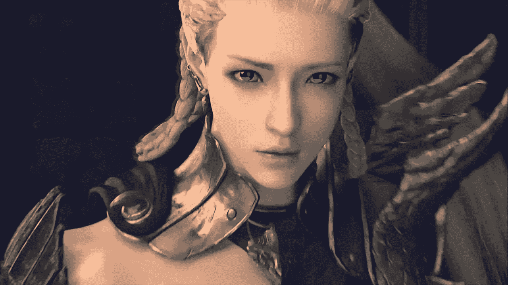
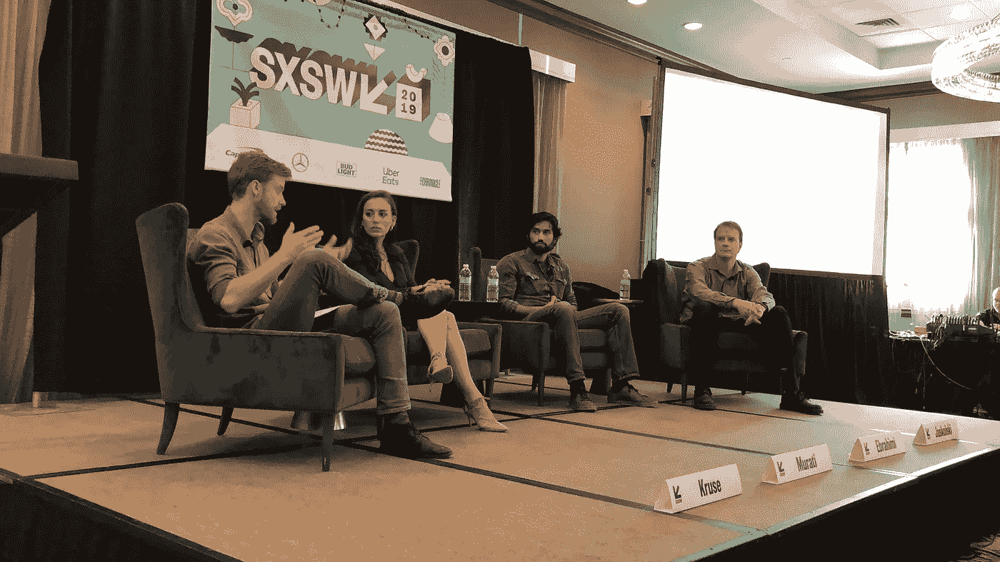
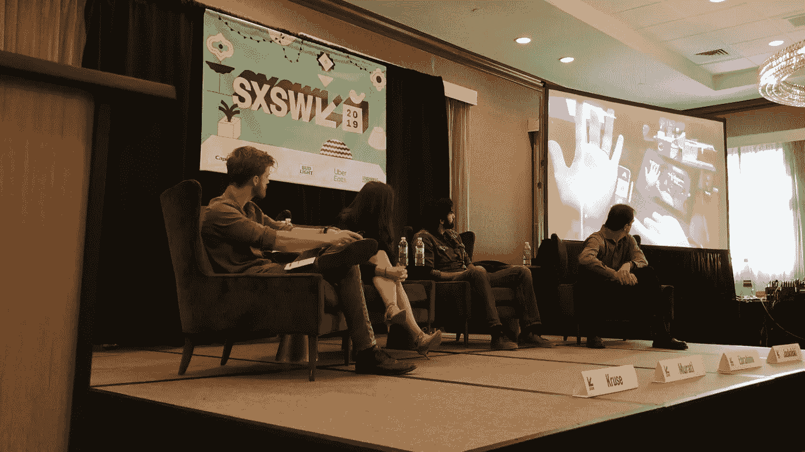
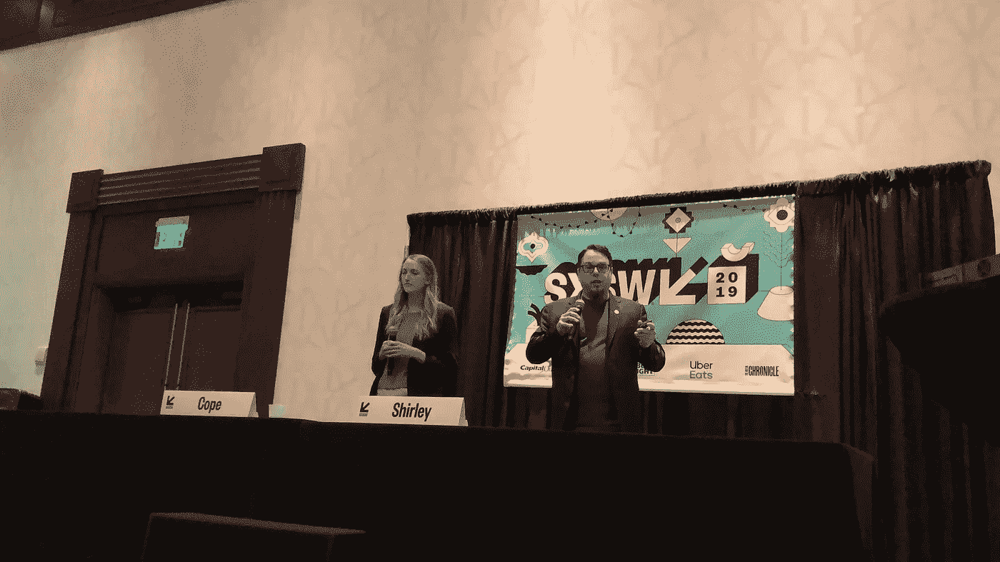
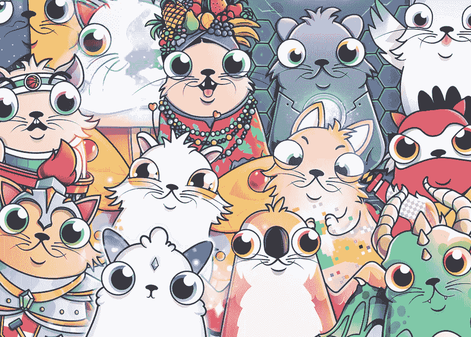

# SXSW:游戏玩家如何接管人工智能和区块链&改写未来

> 原文：<https://medium.datadriveninvestor.com/sxsw-how-gamers-are-taking-over-ai-and-blockchain-rewriting-the-future-31b13a1ecb27?source=collection_archive---------2----------------------->

## 谁说玩电子游戏不会让你在生活中有所成就？

> 李书行·塔克哈索米的手紧紧地抓着鼠标，他的眼睛充满了强烈的专注，从屏幕的左到右飞快地移动，检查着动作。

uroKy 去年的总收入为 4162204 美元。你开始想你应该成为一名交易者。但 KuroKy 并不在金融领域工作，在这个领域，高级交易员带着数百万美元回家曾经是一个标准问题。他是下一批白手起家的百万富翁中的一员。他是个游戏玩家。

KuroKy 是一名职业 Dota 2 玩家，顶级收入者一年的收入比我们大多数人一辈子的收入都多。这是电子竞技的世界，人们在现实生活的比赛中竞争，玩像 Dota 2，魔兽世界，星际争霸 2，英雄联盟，守望先锋和反恐精英这样的游戏。

 [## 人工智能预测能力的神话——数据驱动的投资者

### AI(人工智能)最有前途的优势之一似乎是它预测未来的能力…

www.datadriveninvestor.com](https://www.datadriveninvestor.com/2019/03/01/the-myth-of-ais-predictive-power/) 

有丰厚的奖金可赚，是游戏世界推动了人工智能和区块链的发展。

在 SXSW 上，来自 OpenAI、Unity 和 CryptoKitties 的代表在现场谈论他们在使用游戏推动人工智能和区块链的进步和采用方面的工作。

SXSW panel featuring OpenAI, Unity, National Geographic and Booz Allen Hamilton

## **OpenAI 利用 Dota 2 推进 AI 发展**

研究人员表示，当人工智能能够在复杂的策略游戏中击败人类玩家时，我们就真正走在了创造人工通用智能的道路上，即人工智能能够像人类一样思考和行为。

来自人工智能研究机构 OpenAI 的 Mira Murati 是该机构的战略负责人，她谈到了他们迄今为止最雄心勃勃的项目。OpenAI 创造了一个可以学习玩在线战斗竞技场多人游戏 Dota 2 的 AI 代理。据说这是一个复杂的游戏，玩家需要几年才能掌握。精通 Dota 2 需要挑选合适的英雄、物品和时间进行攻防。研究人员认为这是人工智能对抗人类的完美游戏。

人工智能代理本质上是一个使用算法进行学习的软件程序，它使用一种称为强化学习的机器学习技术自学游戏。强化学习是给一个人工智能代理一个目标，并让它自己的设备找出实现目标的最佳方式。当它朝着目标前进时，如果它在旅途中做出正确的举动，例如与对手战斗并杀死对手，它就会获得奖励。

Murati 解释说，人类需要几年时间才能学会玩 Dota 2。然后，玩家还需要很多年才能在游戏中击败英雄。研究人员加速了人工智能代理的学习，让代理每天都玩游戏，以获得每天 180 年的游戏经验。

在 OpenAI 办公室举行的锦标赛中，人工智能代理证明了它可以击败业余选手。这场胜利之后，OpenAI 决定在国际 2018 上挑战大联盟，这是世界上最赚钱的电子竞技比赛。不幸的是，OpenAI 的机器人不是职业选手的对手，职业选手三局两胜。

OpenAI 并不是唯一一个训练人工智能代理玩游戏的组织。2019 年初，DeepMind 训练 AI 在另一款复杂的在线多人游戏《星际争霸 2》中成功击败了人类玩家。此外，DeepMind 已经证明，它可以成功地教会人工智能击败围棋和象棋领域的顶级专业人士。

通过让人工智能代理与世界上最好的职业游戏玩家对抗，OpenAI 展示了游戏如何推进人工智能研究，以及人工智能可以自学如何在混乱的人类世界中导航。游戏规则千变万化的 Dota 2 同样乱七八糟。

SXSW panel featuring demo of OpenAI research

## Unity 开发定制的游戏和工具来训练人工智能

作为世界上最受欢迎的游戏开发平台之一，nity 一直处于利用游戏训练 AI 的最前沿。

Unity 有一个名为 Unity Labs 的部门，负责创造新的创新。Unity Labs 的阿米尔·易卜拉希米谈到了在人工智能中使用虚拟现实的意义，以及他在尖端项目上的工作，如允许人们在虚拟现实中建立虚拟现实，以及准确捕捉人类运动和皮肤纹理的技术。

易卜拉希米强调，在混合现实中，重要的是对空间、观察者的位置和房间里的东西进行三角测量，以创建我们周围的世界地图。地图不仅在混合现实中是必要的，它对人工智能系统理解世界也是有用的。

Unity 发布了一个机器学习代理工具包。目的是使机器学习研究人员能够在 Unity 平台内部的不同场景中训练他们的 AI 代理。在过去，人工智能的行为是硬编码的，但现在它越来越多地通过在虚拟现实等训练环境中的交互教给人工智能代理。

Unity 还发布了一款名为“障碍塔”的游戏，专为人工智能代理设计。事实上，如果你是人类，你不需要申请。这个游戏是用来训练和测试人工智能的，通过观察人工智能代理在游戏的 100 个关卡中的移动速度。AI 代理每次尝试时都会动态生成等级，这使得难度更大。凭借 10 万美元的奖金池，Unity 正在呼吁人工智能研究人员开始将这款游戏用作训练工具。

Unity 已经宣布自己处于机器学习和游戏的十字路口，在开发基于游戏和 VR 的人工智能工具以推动人工智能发展方面发挥了关键作用。

SXSW presentation featuring CryptoKitties

## **数码小猫一次接管区块链一只猫**

基于区块链的游戏 ryptoKitties 于 2017 年底推出，该游戏允许玩家繁殖数字猫，并随后出售、购买或交易这些值得收藏的卡通猫。这在当时是开创性的，是第一款基于区块链的游戏。

Dapper Labs 的产品负责人 Kim Cope 和 CTO Dieter Shirley 谈到了这款游戏的创作以及它对区块链的意义。Dapper Labs 是 CryptoKitties 的幕后公司。

区块链是一种分布式计算技术，其中选择成为网络一部分的所有各方都有相同信息的副本。CryptoKitties 是一个建立在以太坊区块链上的应用程序，被称为分散式应用程序(DApp)。

使用区块链，玩家可以准确、安全地追踪谁拥有哪只猫，以及它的交易价格。这个游戏的目的是创造人们真正拥有的资产，而不是由一个集中的组织拥有。

CryptoKitties 变得如此流行，以至于威胁到整个以太坊区块链。柯普和雪莉谈到区块链社区以前从未见过如此受欢迎的 DApp。当时，CryptoKitties 占了将近 25%的交易和以太坊网络一半的能量。这导致交易处理时间和成本(天然气价格)上升。有些人等了一个多星期才完成一笔交易，并支付了几乎两倍的价格。这引起了很多不满，并迫使以太坊开发者优先考虑提高以太坊的能力，以扩展和处理大量的流量。

CryptoKitties 不仅测试了以太坊的可扩展性，还激发了对区块链更广泛的了解。Dapper Labs 的首席执行官 Roham Gharegozlou 说，游戏是理解新技术的一种方式。

游戏改变了我们与区块链互动和使用的方式。CryptoKitties 以其可爱的吸引力和卡通插图吸引了更广泛的人群，而不是铁杆区块链爱好者。

CryptoKitties

## 游戏是未来吗？

利润丰厚的职业来来去去，比如从金融转向游戏。但似乎即使是像 KuroKy 这样最好的游戏玩家也可能有一天在自己的游戏中被 AI 打败。基于此，或许 AI 而非游戏玩家将统治世界，改写未来。

【我写的是艾与****。如果你也想了解一个受新兴技术影响的世界，请跟随我。****