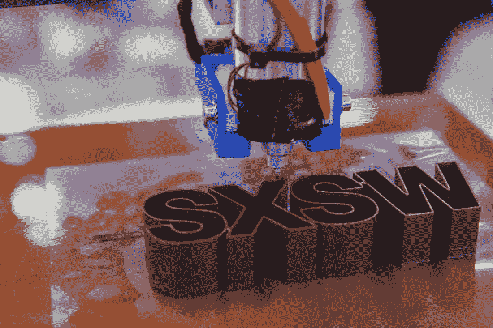

# SXSW |变革力量

> 原文：<https://medium.datadriveninvestor.com/sxsw-the-transformative-power-17d3f68b0c70?source=collection_archive---------15----------------------->

SXSW 会议和节日| Cal Holman 摄影

任何能持续 30 年以上，并且每年都在增长的东西，都必须在人们的灵魂中有很深的根基。一些批评家说这个节日已经失去了早年的草根精神。毫无疑问，当你有超过 70，000 名注册者时，这个组织，这个主题演讲，这个节目变得如此庞大，以至于描绘出大片主流制作的清晰迹象。事实并非如此。印度人、变形金刚、不墨守成规者和革命者与主流并肩战斗，并没有被主流所迷惑。这一事件成为一个统一愿景的平台，并启动一大批思想领袖采取一致行动——一种变革的力量。

围绕你所热衷的主题，与这么多志趣相投的灵魂和志趣相投的领导者的联系和接触是无价的。我们都愿意倾听，愿意分享，并且需要讨论和反馈想法。当我们离开的时候，我们有一个更新的概念库，相关的想法，和对实际趋势的清晰。这件事的一个方面特别吸引我。曲目、会议、展览和表演的数量如此之大，以至于没有人会带着相同的影响或感知离开音乐节。换句话说，一个人消费和消化思想的方式将与其他人不同，这使得《南靠》如此迷人。

我打算建立新的联系，并提议就工作的未来、社会公平和新技术的影响等主题进行更深入的对话。这些是我的书“(非)人类智能”的主题，与我现在正在写的这本书非常相关。我希望我已经遵循和吸收了比我身体可能的更多的东西，但是，我离开的时候仍然充满活力，被杰出的演讲者、公司和参与者公开和无私地分享他们的想法和愿景所启发。

这里有一些来自“南靠”的外卖，但受限于我自己的经验。​

1.**新职场**是真实的；它正在增长，需要大量新的解决方案和监管。

2.零工经济创造了机会，但还没有实现真正的社会公平。由于它的非正式性和大国权力的不对称，存在着弊端。
3。传统公司的传统组织正在被打破，并以新的方式重新组合，以测试新的模式。混合团队、D & I 方法、核心功能的外包、与创业公司和孵化器的新市场伙伴关系、不同层次的新人工智能模型。
4。50/50 运动只是一个开始。社会中的一切都在不断变化，这必须在工作场所和公司中迅速反映出来，以吸引和适应思想和感觉与以前不同的 Z 世代。我们需要超越和超越**创造平等**到一个更流动和更广阔的性别范围，到多个种族和起源教派，到一个需要更长时间保持生产力的老龄化人口。
5。**远程工作**在社会和生态上是正确的。我们需要接受并定义每个组织和每个团队成员的正确水平——年轻人才、职业母亲、家庭支持者、城市居民和其他有不同需求和愿望的人。
6。创业社区的数量和影响力都在增长。显然需要更多更好的投资来保持创新和就业增长。更多的资金是必不可少的，不仅仅是合作或指导。
7。 **CVC(企业风险投资)**是一个成长中的实体。对于这个细分市场，需要更多的理解和规范。这是垄断游戏的早期迹象吗？
8。**人工智能无处不在**以及人类对这一新现实的不适。人工智能信徒和人工智能实用主义者都同意未来的主要挑战——既然我们正处于大量就业岗位消失的风口浪尖，如何利用这些新技术创造社会公平。9。随着市场和组织结构的变化，所有的企业都在寻找**有利可图的创新。10。一切都在快速变化，需要我们深入审视我们的工作和社会伦理以及道德指南针。我们需要重新团结起来，并围绕人类的中心主题点燃新的社会契约，庆祝团结而不是分裂。当然，这一事件并不完美。一些商业开发，一些乏味的会议，一些复杂的导航。与整体影响相比，这些影响会逐渐消失。在电影、音乐、互动体验、公司和演讲者中，很明显，我们已经有一大批领导人在努力工作，让世界变得更好。**

一种真正的变革力量。

*最初发表于*[*【www.collectivebrains.org】*](https://www.collectivebrains.org/articles/sxsw-the-transformative-power)*。*