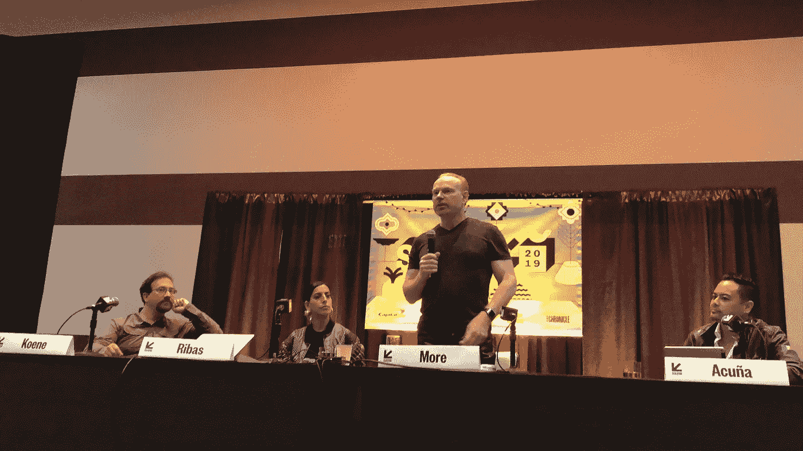
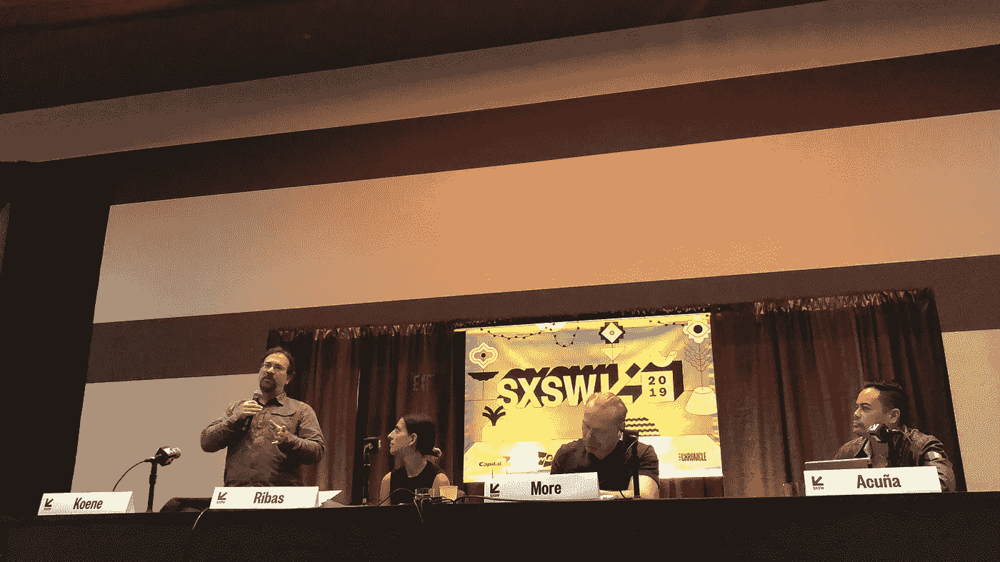
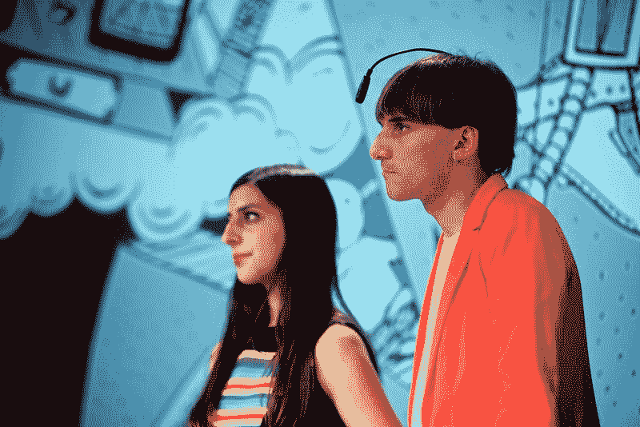

# SXSW:这两位未来学家想在你死后冷冻你的身体，替换你的大脑

> 原文：<https://medium.datadriveninvestor.com/sxsw-these-two-futurists-want-to-freeze-your-body-after-death-and-replace-your-brain-7557b005c257?source=collection_archive---------3----------------------->

## 见见马克斯·莫尔和兰德尔·科恩

Moon Ribas Cyborg Artist. Credits Michael Sharkey

> 主持 SXSW 跨人类主义专题小组的尼科斯·阿库纳说:“你可能会认为我们已经不在德克萨斯了，而是在网飞系列电影《黑镜》的某个奇怪情节中。”。

在事实上，如果你这样做了，你会被原谅，因为有一种说法是在被宣布死亡后冷冻保存身体，希望当科学安全地解冻你的身体并治愈你的疾病时，你可以复活。还有关于思想上传的讨论，以及用神经修复术代替我们大脑的一部分。这一切听起来像科幻小说，但这些天来，科幻小说的东西已经成为事实。

超人类技术是关于克服人类生物学的局限性，Max More 博士和 Randal Koene 博士处于这些技术的最前沿。

莫尔是阿尔科尔生命基金会的首席执行官，该基金会在亚利桑那州斯科茨代尔经营一家人体冷冻实验室。在过去的 7-8 年里，莫尔一直执掌着该组织。Alcor 是世界上现存的四个人体冷冻机构之一。

人体冷冻学是冷冻你的身体并保护你的细胞免受冷冻和解冻过程影响的科学。如果一个人已经注册了这项服务，当他们被宣布合法死亡时，他们的身体将被注入一种冷冻保护剂，这种保护剂对你的细胞来说基本上是医学级的防冻剂。接下来，他们的尸体被保存在华氏零下 320 度的环境中，在这个温度下可以保存几个世纪。

那些已经注册人体冷冻的人希望有一天当科学技术可以逆转衰老和导致他们死亡的疾病时，他们可以被解冻并复活。硅谷科技名人彼得·泰尔和雷·库兹韦尔被认为已经报名参加了这项手术。

然而，并不是所有延长生命和意识的方法都是生物性的。由科恩创造的全脑仿真是关于上传我们的大脑或意识，并创建我们大脑的数字版本。基恩是一名神经科学家，他的大部分工作都致力于这方面的研究。此外，科恩还是 Kernel 的首席科学家，该公司正在开发非侵入性大脑技术，以取代或增强大脑功能。

 [## 大笔资金和尖端技术:人工智能/人工智能投资将如何革新医疗保健…

### 在过去几年人工智能(AI)和机器学习(ML)的显著发展中…

www.datadriveninvestor.com](https://www.datadriveninvestor.com/2018/03/22/big-money-and-cutting-edge-technology-how-investment-in-ai-ml-will-revolutionize-the-healthcare-industry/) 

科恩谈到了他称为神经修复术的大脑植入物，这使得这个想法与我们目前通过起搏器、耳蜗植入物和肢体修复术来替代或增强功能的方式没有太大的不同。

通过植入替代大脑功能并不容易。科恩解释说，为了使神经修复成为现实，我们需要知道我们大脑中的神经元在做什么，以及大脑的不同部分如何相互交流。像神经递质或电脉冲这样的化学物质激发并产生电脉冲来改变神经元的某些东西，这是大脑不同部分进行交流的方式。

基恩说，我们有两种方式可以理解和复制我们的大脑。第一个是记录所有的神经元，制造假肢并用它们替换部分大脑。第二是保存大脑，切片后成像，并使用图像获取结构信息，以此建立模型。第二种选择可能不太理想，因为你已经死了。

神经修复术试图模仿大脑的相同结构和过程。如果我们可以对大脑的每个部分都这样做，基恩说，我们就可以再造一个人，并从本质上上传我们的思想和身体。

这是一种恐惧，即使你以数字大脑的形式被再造，那也不是真正的你。没有我们的肉体，我们就不是我们自己，甚至不是人类。

更多的人期望最终被上传，而不是继续保存他的生物身体。他关心的是生存而不是成为同一个人。那就是在一个新的平台上生存，绘制大脑的功能，并在新的平台上复制这些功能。身体可以被认为是我们目前生活的一个平台。莫尔说，无论我们如何强化我们的身体，比如在脊柱和头骨中使用金刚石纤维，一些东西不可避免地会杀死我们，比如飞行的小行星或飞驰的卡车。

基恩明白，人们担心在你的意识转移过程中会失去一些东西，或者如果变化发生得太快太剧烈，一个人可能不再觉得自己是人。因此，他主张将假体置换作为人们最舒适的途径。这是大脑一次替换一部分，而不是一次上传整个大脑。例如，替换不再拥有完整感官的中风患者的顶叶，或者替换记忆有困难的阿尔茨海默病患者的海马体。

虽然大脑植入物还没有出现，但人们已经使用其他类型的植入物好几年了，以增强他们的感官。

Moon Ribas 是一名电子人艺术家，她于 2013 年在自己的脚上植入了传感器，以实时检测地球的地震活动，无论是在日本、墨西哥还是新西兰。由于 Ribas 的额外传感器，她感觉更接近地球和动物，而不是其他人。尼尔·哈比森是一位半机械人艺术家，他是色盲，自 2004 年以来，他的头骨上安装了一根天线，可以将颜色转化为声音。

除了哈比森，里巴斯还植入了一颗牙齿，他们可以通过点击牙齿向对方发送振动来进行交流。额外的好处是他们都知道莫尔斯电码。它和蓝牙一起工作，所以他们称之为“蓝牙通信”。

keptics 说这是童话故事，然而通过我们每天携带的手机，扩展我们的大脑功能已经发生了。Acuna 声称，如果你已经将手机数据备份到云端，你就已经是一个超人类主义者了。

莫尔指出，在 20 世纪 60 年代，如果你突然晕倒在街上，你会被认为在法律上已经死亡。然而，在 2019 年，你被认为需要紧急医疗护理。在某些情况下，除颤器可以在你的心脏停止跳动后让你起死回生。

这给我们带来了一个问题，为什么我们要冷冻我们的身体和大脑，并上传我们的思想？

科恩说，这不是让个人活得更长，而是文明的进步。没有人愿意回到几百年前的平均寿命 35 岁。科恩指出，如果我们能够达到 150 或 250 岁的最大寿命，没有人会说这太长了。

了解我们的大脑是为了了解生命的蓝图，并使其适应挑战和社会的发展方向。没有搞清楚自己蓝图和适应新事物的文明一直在消亡。科恩表示，通过我们在神经科学领域的工作，很难想象我们不会上传我们的想法，并在某个时候创建一个数字大脑。

我们是那种探索星球的社会，还是仅仅在工业革命后的几百年里幸存下来的社会？

【我写的是艾与****。如果你也想了解一个受新兴技术影响的世界，请跟随我。****