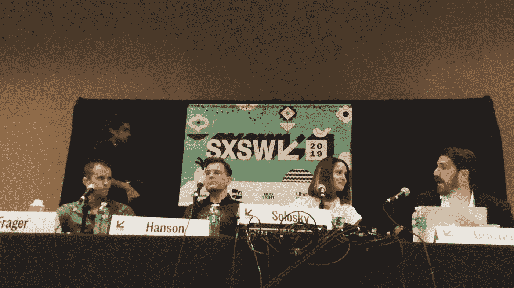
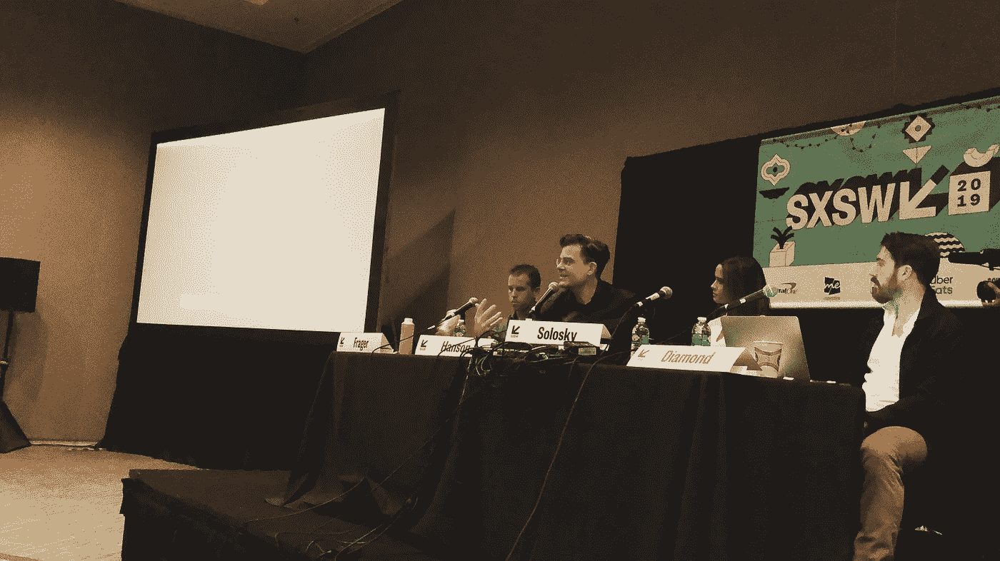

# SXSW:AI 最终会自我监督，确定自己的伦理吗？

> 原文：<https://medium.datadriveninvestor.com/sxsw-will-ai-eventually-self-supervise-and-determine-its-own-ethics-347a00198891?source=collection_archive---------7----------------------->

## 这是汉森机器人公司和其他人在 SXSW 上不得不说的话

不久前，沙特阿拉伯授予人形机器人索菲亚公民身份。这使得索菲亚成为世界上第一个成为一个国家公民的机器人，可能会给她平等的权利，在某些情况下甚至比人类更多的权利。SXSW 召集了一个专家小组，研究物理和数字空间中的人工智能生物，讨论虚拟人类时代的伦理问题。

 [## 人工智能预测能力的神话——数据驱动的投资者

### AI(人工智能)最有前途的优势之一似乎是它预测未来的能力…

www.datadriveninvestor.com](https://www.datadriveninvestor.com/2019/03/01/the-myth-of-ais-predictive-power/) 

Hanson Robotics 的创始人和 Sophia 的创造者 David Hanson 博士分享了他关于创造具有人类智能的有同情心的活机器的想法。Brian Frager，防碎电影公司的创意总监，谈到了创建虚拟角色和数字替身，以及这意味着什么，因为我们正在走向一个未来的就绪玩家。Amanda Solosky，竞争理论的联合创始人，基于真实的人创造互动的数字人类，分享了伦理在她的工作中的重要性。

> 人工智能应该有个性并模仿人类

H 安森希望机器能够达到人类水平的智能，达到普遍智能、有创造力、自主和自我决定的程度。虽然索菲亚还没有独立思考，但对汉森来说，她已经朝那个方向迈出了一步。

汉森认为，模拟整个人类，包括我们的思想和身体，是人工智能的未来。他指出，人类不仅仅是一个大脑——我们还有其他刺激，如激素、心率、进化冲动和心理学。然而，机器不一定要看起来像人类，它们可以呈现卡通般的外观。

汉森说，在人类中培养人工智能很重要，可以与机器建立积极的关系和相互理解。与机器共同进化，让机器生活在我们中间，将让我们实现人与机器的共生。

Solosky 根据真实和虚构的人物创建数字 AI 人物。当谈到塑造个性时，她的公司“竞争对手理论”收集了个人的 14 种不同属性，包括技能、思想、梦想、目的、信仰、面部特征、身体特征、声音、怪癖、动作和步态、所扮演的角色、知识、学习欲望以及个人希望为世界做出什么贡献。这些属性是不断发展的。

尽管对手理论试图在再现某人时达到一定程度的真实性，但它从来都不是一个人的精确副本，而是一个人的部分与数字版本相融合，该数字版本应该代表其模仿的个人的性格和个性。

Frager 之前曾与竞争对手 Theory 合作，创建照片般逼真的虚拟人物头像，这些头像可以进行风格化，这样你就可以选择 10%是自己，90%是工作。

当涉及到从人们那里收集数据时，无论是真实的还是其他的，当然会有伦理方面的影响，然而更大的问题是，如果这些人工智能变得有知觉，我们需要考虑什么样的伦理和权利适用于这些人造生物。

科幻小说迫使我们审视伦理难题，然而，像汉森、索罗斯基和弗拉格这样的领军人物可能会设定标准。

> 我们可以用三种可能的方式来构建像人类一样行为并尊重人类的道德人工智能

rager 提出了两种构建道德人工智能的场景。第一，从现实世界中的人类行为中收集尽可能多的数据，并从中得出关于伦理的结论，或者第二，创建一个有抱负的模型，输入到机器学习算法中，这些算法将确定人工智能的伦理、个性以及人工智能在特定场景下应该做什么。

然而，Frager 指出，在用于驱动算法的数据集中经常存在偏见，许多人本身并不道德，如果输出不符合我们对人类的要求，需要有一种方法让人类为输出提供输入。

汉森相信创造可以自我决定自己道德规范的人工智能，认为人工智能必须进化和自我监督。汉森指出，如果一个人工智能有一个真正好奇的头脑，他们可以欣赏世界，他们会重视人类的存在，生命和知识。如果我们开发出理解人类伦理和价值观的人工智能系统，汉森认为我们不会出错。如果人类教人工智能如何关心，就像教孩子如何去爱一样，那么人工智能可能会发展和利用它的优秀品质。

索洛斯基指出，自我决定的伦理只有在自由意志存在的情况下才有可能，并强调了一点，即人类需要像对待人类一样，教导、约束人工智能并向其展示后果。如果 AI 制定的目标是帮助、贡献、成长和联系，那么 AI 将希望成为他们最好的自己，并帮助人类成为他们最好的自己。然而，为了发展这一点，人工智能需要有能力控制自己。如果人类限制人工智能，它不会导致一个成功的模型。

人类正在辩论的伦理困境的模拟可以被建模，以允许人类和人工智能学习后果。这可以通过实时虚拟环境来实现。NVIDIA 是一家生产游戏行业广泛使用的显卡的公司，正在他们的下一代 GPU 上运行的游戏引擎中模拟机器人。弗拉格说，通过运行数百万个周期，机器人正在教会自己实现一个目标。

> 存在于数字或物理空间的人造生命，可能呈现不同的伦理结果。

rager 说他目睹了人们对 Sophia 的反应不同于对数字角色的反应，因为 Sophia 有一个物理形态，人们可以在现实世界中与之互动。索菲娅激发了人们的情感，让人们乐于展示更多的自我。人们也在教她不同的东西，因为她不断地从通过她的相机和传感器捕捉的感官数据中学习。另一方面，人们认为亚马逊 Alexa 不像人，不会与他们的语音助手进行有趣的对话。

索罗斯基认为，无论人工智能是数字的还是物理的，都有类似的伦理结果。关键的区别在于，数字化允许规模、大型和高效的系统在任何地方扩散。在这两种情况下，积极主动、有意识地设计系统来推动人类和人工智能合作等结果是值得的。

> 记录道德规范并分享这些道德框架非常重要。

S olosky 的竞争理论记录了对利益相关者的影响，包括人工智能与之互动的人类，人工智能所基于的个人，对人工智能拥有权利的组织，以及人工智能本身，如果它们有一天变得有知觉的话。当这种情况发生时，索罗斯基希望向它们展示我们对人类同样的关怀。

汉森说，在汉森机器人公司有很多关于伦理的文件(事实上，汉森的博士学位是关于这些机器的伦理和后果)。他们没有明确的答案，但有可行的模型。汉森说，很难做到面面俱到，所以他们在开发人工智能时着眼于伦理基础和基本问题。问题包括从人工智能系统是否增强了我们的知识，到我们如何创建智能系统来最大限度地提高人类生存、减轻痛苦和改善经济。

像 GDPR 这样的隐私和数据法是开始，但不是结束。汉森说:我们必须继续对话并向前推进，因为法律总是落后于我们可能做到的最好水平。

Frager 提到在人工智能社区中有创建开源标准的倡议，并帮助我们更好地理解机器学习模型。Sam Altman 支持的 OpenAI 背后有硅谷的支持。微软正在为人工智能系统创建一个开放平台。SingularityNET 是另一个用于伦理道德倡议的开源人工智能。

Hanson Robotics 的研究平台集成了智能视觉库、TensorFlow 和人工通用智能框架 OpenCog 等开源标准。OpenCog 是由汉森机器人公司的首席科学家本·戈泽尔设计的。事实上，他们 70%的工作是开源的。

> 人工智能的未来是生物学的

如果我们希望人工智能理解我们，汉森声称我们需要人工模拟和模仿整个人类。Hanson 认为 OpenAI 和 SingularityNET 还不够。我们需要大胆的大规模跨机构倡议，将神经科学、生物学和其他学科结合起来，创造出具有人类伦理和同情心并像我们一样思考的人工智能。否则，像 Sophia 这样的机器人，她目前是 SingularityNET 的营销吉祥物，可能会被判终身从事营销工作，正如本文中提到的。

【我写的是艾与****。如果你也想了解一个受新兴技术影响的世界，请跟随我。****

****本文原载于** [**数据驱动投资人**](https://www.datadriveninvestor.com/2019/03/19/sxsw-will-ai-eventually-self-supervise-and-determine-its-own-ethics/) **。****