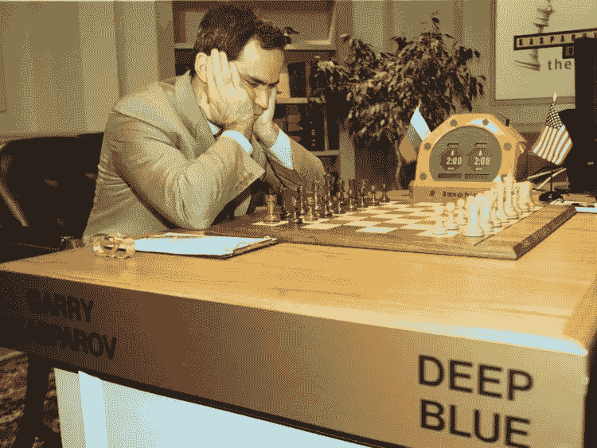

# 符号 AI v/s 非符号 AI，以及介于两者之间的一切？

> 原文：<https://medium.datadriveninvestor.com/symbolic-ai-v-s-non-symbolic-ai-and-everything-in-between-ffcc2b03bc2e?source=collection_archive---------1----------------------->

当试图开发智能系统时，我们面临着选择系统如何从它周围的世界获取信息、表示它并处理它的问题。符号人工智能，也被称为优秀的老式人工智能(GOFAI)，利用字符串来表示现实世界的实体或概念。然后，这些字符串被手动或递增地存储在知识库(任何适当的数据结构)中，并在被请求时可供接口的人/机器使用，以及用于基于由命题逻辑或一阶谓词演算技术放在一起的记忆事实和规则做出智能结论和决策。非符号人工智能包括向机器提供原始环境数据，并让它识别模式，并创建自己的复杂、高维的原始感官数据表示。

从定义上看，非符号人工智能似乎更具革命性、未来性，而且坦率地说，对开发者来说更容易。系统只是学习。它可以分辨猫和狗(CIFAR-10/CIFAR-100，带卷积神经网络)，阅读狄更斯的目录，然后生成自己的畅销小说(带 LSTMs 的文本生成)，并使用来自 LIGO([https://arxiv.org/abs/1711.03121](https://arxiv.org/abs/1711.03121))激光干涉仪的原始数据帮助处理和检测/分类引力波。

A Non-symbolic representation: Convolutional Neural Network. (Image from: [https://www.mdpi.com/1099-4300/19/6/242](https://www.mdpi.com/1099-4300/19/6/242))

另一方面，象征性的人工智能似乎更庞大，更难设置。它要求事实和规则被显式地翻译成字符串，然后提供给系统。模式不是自然推断或挑选出来的，而是必须明确地放在一起，并灌输给系统。此外，动态变化的事实和规则在符号人工智能系统中很难处理，学习过程是单调递增的，非符号人工智能系统可以快速纠正并轻松配置自己以处理新的冲突数据(凸优化技术)。

Intent Labs 的创始人安德鲁·布朗在 Quora 的一个回答中提到了符号和非符号人工智能之间的差异，这是我最喜欢的例子之一([https://www . Quora . com/What-is-the-difference-the-Symbolic-and-Non-Symbolic-approach-to-AI](https://www.quora.com/What-is-the-difference-between-the-symbolic-and-non-symbolic-approach-to-AI))；

假设你有一个人在一个房间里，他的工作是把你塞在门下的纸条从英语翻译成汉语。似乎是一个足够简单的工作流程。纸条，翻译，拿纸条。如果他是一个象征性的人工智能，他不懂普通话，但有一个巨大的英汉翻译库供他用来为你组装一个成品。他收到你的短信，然后开始艰难地浏览庞大的语料库并生成回复。如果他是一个非符号人工智能，他知道普通话。接收便笺，为您翻译，然后发送回来。

看起来似乎非符号人工智能是一个神奇的、无所不包的、神奇的解决方案，是全人类一直在等待的。然而，有一个问题。像很多事情一样，很复杂。

非符号人工智能(如深度学习算法)非常渴望数据。它们需要大量的数据才能有效地学习任何表示。他们还创造出数学上过于抽象或复杂的表现形式，难以观察和理解。
以普通话翻译为例，他会为你翻译，但他很难准确地解释他是如何做到这一点的。此外，成为英语到汉语翻译的专家也不是一件容易的事情。

另一方面，象征性的人工智能已经被提供了表征，因此可以在不必确切理解它们的意思的情况下吐出它的推论。这些表示也是用人类可以理解的语言编写的。
在普通话翻译员的示例中，他有一个解释英语到普通话翻译的图书库，翻译员可以带您完成他所遵循的过程，以获得最终翻译的字符串。他可能需要更长的时间来产生他的反应，以及引导你，但是他能做到。

Chess Master Garry Kasparov gets beaten by a Symbolic AI, and everyone knows how!

因此，当人类创建智能系统时，应用程序中包含可理解和可解释的块/过程是有意义的。因此，扔掉这些符号可能会使人工智能脱离人类的理解，在某一点之后，智能系统将做出决定，因为“它们在数学上可以”。此外，非符号人工智能系统通常依赖于正式定义的数学优化工具和概念。这涉及到根据优化问题对整个问题陈述进行建模。然而，许多现实世界的人工智能问题不能或者不应该按照优化问题来建模。
所以，很明显，这个领域仍然需要符号表示。然而，正如可以推断的那样，在什么地方和什么时候使用符号表示取决于问题。

例如，自然语言理解领域的克里斯·赖斯贝克(【https://www.cs.northwestern.edu/~riesbeck/index.html】)教授研究的直接内存访问解析([https://www . cs . northwestern . edu/academics/courses/325/readings/dmap . PHP](https://www.cs.northwestern.edu/academics/courses/325/readings/dmap.php))用于构建基本的情节记忆以理解自然语言，利用分层系统中存储的真实世界符号表示来表示上下文中每个对象之间的信息和语义连接。当自底向上解析的语句在知识库中查询特定的上下文/事实或规则时，会引用这种临时存储的信息。另一个例子是像国际象棋这样的游戏，它需要当前棋盘状态的语法表示，每个棋子是什么以及它能做什么，以便为后续的棋步做出适当的决定。

因此，当我们在一个专业化的高级技能智能系统的环境中有足够的关于玩家和行动者的信息时，理解利用符号表示比非符号表示变得更加重要。
然而，更令人兴奋的是象征性和非象征性表现的融合。他们可以互相帮助，以获得原始数据的总体表示，以及原始数据包含的抽象概念。例如，我们可以使用一个非符号 AI 系统(计算机视觉)，该系统使用一个棋子的图像来生成一个符号表示，告诉我们棋子是什么以及它在棋盘上的位置，或者用于了解棋盘状态的当前属性。然后，这些信息可以象征性地存储在知识库中，并用于为人工智能棋手做出决定，类似于 Deep Mind 的 alpha zero([https://arxiv.org/pdf/1712.01815.pdf](https://arxiv.org/pdf/1712.01815.pdf))(它使用子符号人工智能，但在大多数情况下，会生成非符号表示)。简而言之，与人类类似，基于非符号表征的系统可以充当眼睛(与视觉皮层一起)，而符号系统可以充当人脑的逻辑、解决问题的部分。

*瑞德·德索萨，研究生，西北大学人工智能科学硕士*