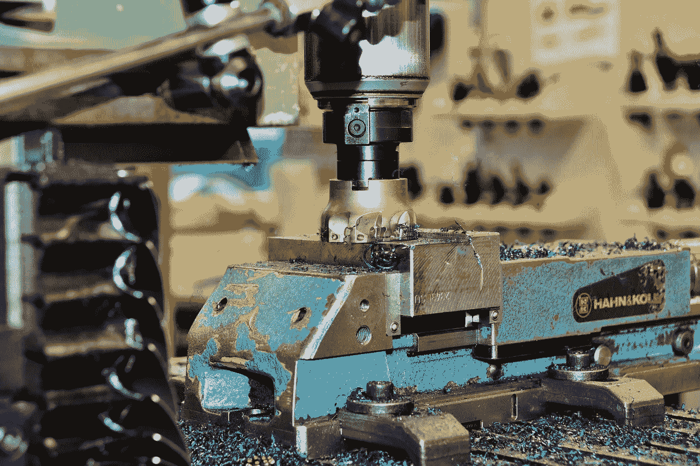
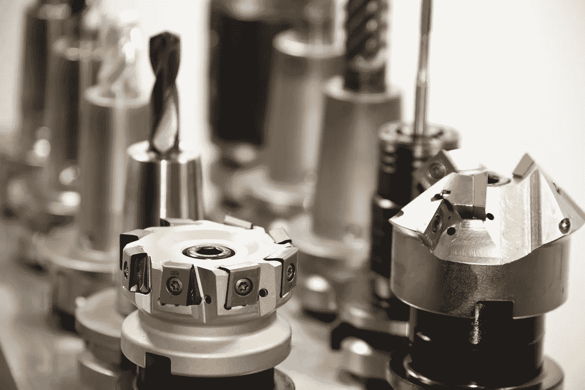
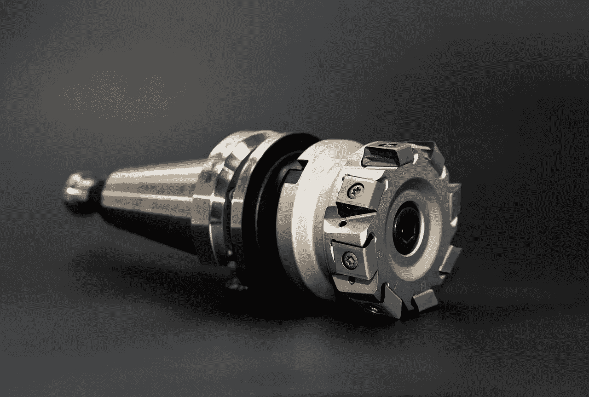

# SyncFab 计划在 2019 年初推出 MainNet

> 原文：<https://medium.datadriveninvestor.com/syncfab-plans-mainnet-for-early-2019-b1962e8d56c1?source=collection_archive---------19----------------------->

SyncFab 希望在今年年初推出其基于以太坊的平台，用于连接工业机器和客户。

值得注意的是，SyncFab [声称](https://medium.com/syncfabmfg/development-update-syncfab-manufacturing-blockchain-testnet-established-sneak-peek-of-3-0-18d901dc66b7)其 Mainnet 可能在 2019 年第一季度启动并运行。因此，SyncFab 可以很快通过其 **SyncFab (MFG)** ERC20(以太坊请求评论)令牌接受工业机器服务订单。

此外， [SyncFab](https://syncfab.com/) 可能很快会发布其以太坊分散应用(DApp)的 3.0 版本。具体来说，客户将使用 [SyncFab 的 DApp](https://marketmadhouse.com/blockchain-token-warren-buffett-might-like/) 来订购由计算机数控(CNC)机器和其他工业设备制造的零件和项目。

解释一下，SyncFab 的管理层认为它可以通过区块链传输给计算机控制的机床编程所需的数据。SyncFab 使用以太坊区块链，因为它提供了比传统互联网更高级别的安全性。

# **SyncFab 为制造商测试区块链市场**

事实上，SyncFab 的目标是为数控机床服务建立一个基于以太坊的市场。例如，汽车制造商可以使用 SyncFab 的平台订购发动机零件。最终，如果 SyncFab 的计划实现，公司将使用 MFG 令牌支付零件费用。

最新的计划是让公司通过 SyncFab DApp 发出报价请求。事实上，投标人将通过 DApp 发布采购订单和图纸。机械商店和制造商使用 DApp 竞标这项工作。

工作完成后，供应商将填写采购订单，制造商在 MFG 中付款。特别是，SyncFab 的首席执行官杰里米·古德温希望他的技术能让美国工业与中国竞争。

此外，SyncFab 还让被称为采购经理的人工监控人员负责其供应链。为了解释这一点，采购经理将监督采购过程，并确保他们完成每一份采购订单。

# **为什么投机者应该看 SyncFab**

加密货币投机者应该密切关注 SyncFab，因为它计划向真实世界中的真实客户销售真实产品。

重要的是，真正的产品是工业定制制造服务。此外，这类服务的市场已经非常庞大，利润丰厚。

事实上，第一研究公司[估计](http://www.firstresearch.com/Industry-Research/Machine-Shops.html)2018 年美国机械商店业务中有 2 万家公司，总收入为 360 亿美元。因此，SyncFab 解决方案的客户和市场已经存在。

然而，SyncFab 将面临一场艰苦的战斗，以使众所周知的保守的机械商店业主使用其解决方案。因此，SyncFab 的应用和平台可能需要数年才能赚钱。

另一方面，SyncFab 可以将区块链带入制造业。只有时间才能证明 [SyncFab](https://syncfab.com/) 能否将美国制造业带入 21 世纪。

这个故事也出现在 [*Geek Crunch 评论*](https://geekcrunch.reviews/) 和 *Tech Fury* 上。

## 来自 DDI 的相关故事:

 [## 为什么数据会改变投资管理

### 有人称之为“新石油”虽然它与黑金没有什么相似之处，但它的不断商品化…

medium.com](https://medium.com/datadriveninvestor/why-data-will-transform-investment-management-4a60966c1c81)  [## 投资算法快速指南

### 让我们想象一下 30 年前的股市…

medium.com](https://medium.com/datadriveninvestor/a-quick-guide-to-investment-algorithms-628450b9dc55)