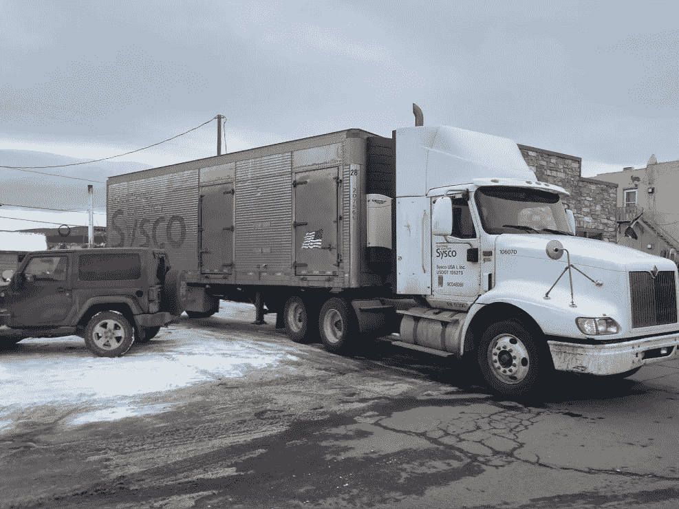
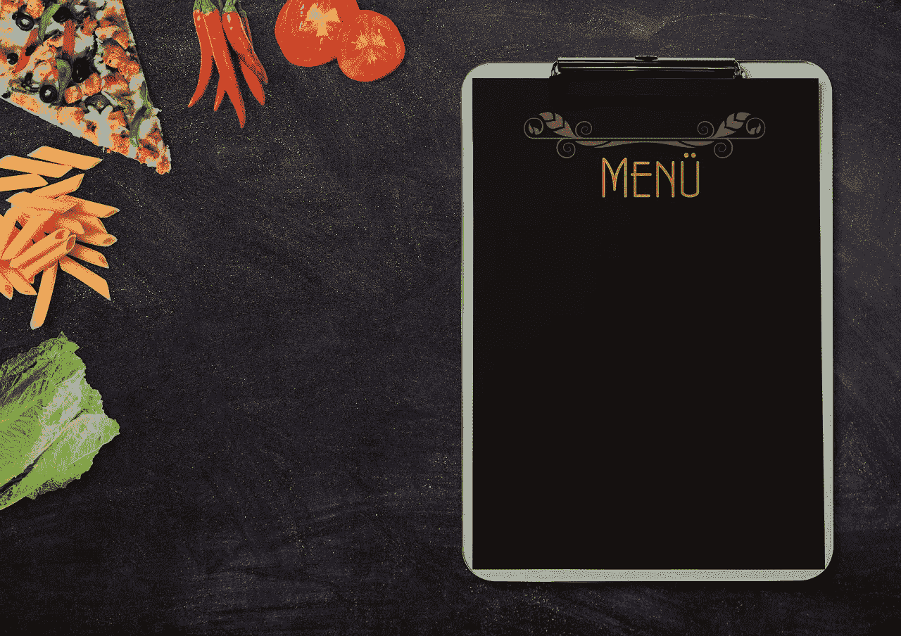
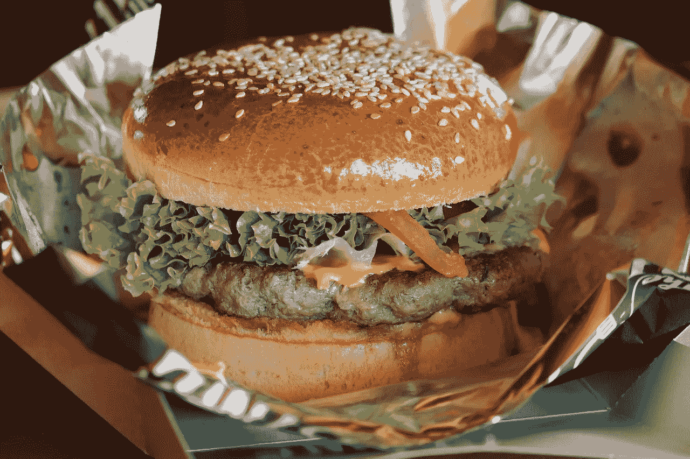
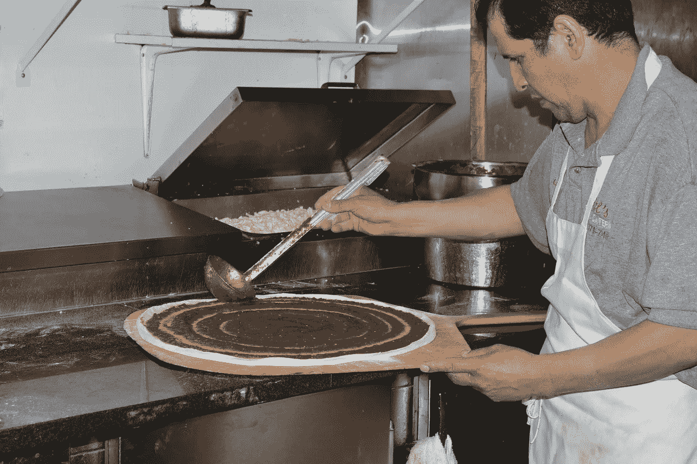

# Sysco (SYY)是价值投资吗？

> 原文：<https://medium.datadriveninvestor.com/sysco-syy-is-a-value-investment-5c04bb8e5c89?source=collection_archive---------14----------------------->

Sysco (SYY)是一种大多数人都没听说过的价值投资。然而奇怪的是，几乎每个美国人几乎每天都能看到 Sysco 的卡车。

解释一下， **Sysco(纽约证券交易所代码:SYY)** 似乎是一家为美国几乎每一家餐馆送餐的公司。事实上，Sysco [运营着](https://www.sysco.com/Contact/Contact/Our-Locations.html) 330 个配送设施，为 60 万家餐饮服务企业提供服务。

因此，Sysco 拥有美国最大的食品分销网络之一。相比之下，美国最大的独立超市**克罗格(纽约证券交易所代码:KR)** 经营着 37 家制造工厂，服务于 2782 家超市。

# SYSCO 运营着美国最大的食品分销网络之一

因此，Sysco 是一项价值投资，因为它运营着美国最大的食品分销网络之一。

由于美国不断变化的餐饮和购物习惯，这样一个网络的增长潜力是巨大的。特别是，像 GrubHub(纽约证券交易所代码:GRUB) 这样把餐馆的饭菜送到家里的公司正在像杂草一样生长。例如，GrubHub 在 2018 年第二季度的收入增长率为 51.62%。

重要的是，食品配送现在是一个价值 170 亿美元的行业，《纳什维尔田纳西人报》报道。送餐如此有利可图，**亚马逊(NASDAQ: AMZN)** 正进入亚马逊餐厅领域。

# Sysco 将从送餐服务中赚更多的钱

送餐服务增加了对餐馆用餐的需求，从而增加了餐馆订购的食物数量。因此 Sysco 赚了更多的钱，因为 Sysco 把食物送到餐馆。

Statista 计算，Sysco 在未来几年可能会赚更多的钱，因为送餐服务可能会从 2018 年的 170 亿美元增长到 2023 年的 240 亿美元。因此，Sysco 在未来几年可能会看到持续的收入增长。

从逻辑上讲，Sysco 的一个长期机会是省去中间人，直接向 Instacart、GrubHub、DoorDash、亚马逊和 UberEats 等送货服务公司出售餐食或餐包。因此，Sysco 可以取消中间商，从交货中赚钱。

# **Sysco(SYY)赚钱了吗？**

好吧，西斯科公司(纽约证券交易所代码:SYY) 的未来是光明的，但是它赚钱了吗？财务数据显示，Sysco 确实在赚钱。

例如，Sysco 在 2018 年第三季度的收入为 152.15 亿美元，毛利润为 29.04 亿美元。很明显，这些收入在第三季度以 3.86%的速度增长。

具体来说，Sysco 记录了 2018 年第三季度的营业收入 628.14 美元和净收入。此外，Sysco 第三季度产生了 2.7115 亿美元的运营现金流、6839 万美元的融资现金流和 1.7066 亿美元的自由现金流。

因此，Sysco 赚了钱，但很难保住现金。很明显，Sysco 在 2018 年 9 月 29 日只有 7.903 亿美元的现金和等价物。

在这种情况下，直接销售给食品配送服务或进入餐包业务可能是明智之举。特别是，Sysco 需要开发新的现金流。

# Sysco (SYY)是好的分红股票吗？

Sysco (SYY)是一项价值投资，因为市场先生在 2019 年 1 月 23 日将其定价为 62.89 美元。但是 Sysco 是好的分红股票吗？

目前，答案是肯定的，因为 Sysco 将于 2019 年 1 月 25 日支付 39 英镑的股息。此外，该股息比 2019 年 10 月 26 日支付的股息多 3。

令人印象深刻的是，Sysco 的股息在过去三年中增长了 8。解释一下，Sysco 在 2016 年支付了 31 英镑的股息，2017 年增长到 33 英镑，2018 年增长到 36 英镑，2019 年增长到 39 英镑。

dividends 声称，事实上，Sysco 的股息在过去 48 年里一直在增长。此外，Sysco 在 2019 年 1 月 23 日向投资者提供的股息收益率为 2.48%，年化股息为 1.56 美元，股息支付率为 44.7%。

因此，Sysco 是一个价值投资，因为它的价格低，股息高。更重要的是，Sysco 是一个价值投资，是一个很好的股息股，有很大的增长空间。

# **不断变化的行为使 Sysco 成为成长股**

Sysco 是一项价值投资，因美国人行为的改变而蓄势待发。

特别是，许多美国人太懒，或者太忙而没有时间做饭。然而，他们仍然想要一顿不是来自微波炉的热饭。幸运的是 Sysco、GrubHub、UberEats、DoorDash、亚马逊餐厅等。正等着在每部智能手机上提供这顿饭。

因此，现在叫外卖比以往任何时候都更容易、更便宜。此外，如今外卖的种类多得令人难以置信。例如，一次送餐服务；据田纳西人报道，亚马逊餐厅在 T4 纳什维尔的一个城市提供 100 家餐馆的食物。

然而，这些食物中 80%到 90%的成分可能来自 Sysco。除了配料，Sysco 很有可能提供外卖盒。

# Sysco 是一项价值投资，因为它将赢得外卖大战

除了配料，Sysco 几乎出售所有餐馆使用的东西，包括清洁用品、炊具和餐巾。因此，每一次外卖和快递业务的扩张，Sysco 都会赚更多的钱。

而且 Sysco 比 GrubHub 便宜；该公司 2018 年 1 月 12 日的交易价格为每股 74.46 美元。有吸引力的是，Sysco 支付股息，而 GrubHub 不提供股息。因此，GrubHub 是一个潜在的价值投资，而 Sysco 现在是一个价值投资。

因此，如果你正在寻找一个价值投资，以兑现在送餐爆炸，Sysco 是它。Sysco 是送餐价值投资，因为它为餐饮业提供原材料。

最重要的是，无论谁在外卖应用大战中获胜，Sysco 的投资者都可以赚钱。Sysco 会赢，因为不管谁送饭，它都会提供原料和供应品。

价值和股息投资者可以通过 Sysco 从外卖应用的爆炸中获利。长期被忽视和低估的 Sysco (NYSE: SYY) 是送餐爆炸的最佳价值投资。

这个故事最初发表在 [*市场疯人院*](https://marketmadhouse.com/) 。