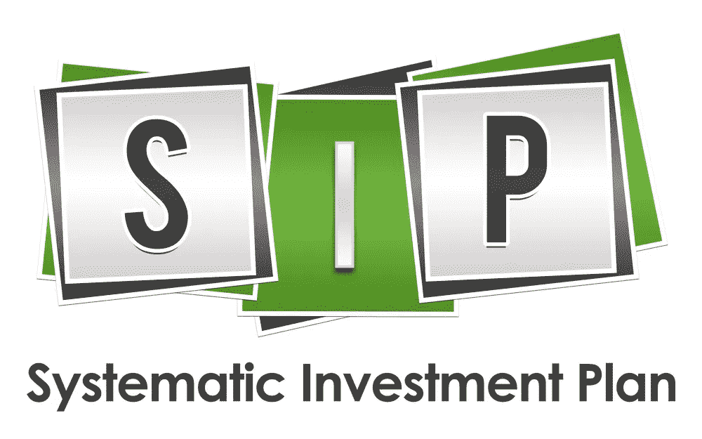

# 系统投资计划——创造长期财富的最佳工具

> 原文：<https://medium.datadriveninvestor.com/systematic-investment-plan-sip-the-best-vehicle-of-long-term-wealth-creation-2960a7820273?source=collection_archive---------8----------------------->

Your friend in Wealth Creation

共同基金现在为大多数投资者所熟悉。感谢社交媒体、电视、报纸和杂志广告。商业频道的金融知识项目也在教育投资者共同基金的好处。人们有兴趣详细了解这个概念。他们现在渴望**做出明智的财务决策**来增加他们的财富。

共同基金是适合所有类型的投资者有超短期，短期和长期的视野。投资者可以通过两种方式投资共同基金。第一种是**一次性付款**，另一种是通过 **SIP** 。系统投资计划是以交错方式投资的一个很好的工具，允许投资者定期**进行小额投资**，即每周、每月或每季度。投资者可以通过 SIP 以最低卢比开始投资共同基金。只有 500。一些计划还规定每月最低消费 100 卢比。

SIP 提供了**卢比平均成本**的好处。卢比成本平均法是一种定期投资固定金额的方法。这反过来又保证了你在价格低的时候买更多的特定共同基金，在价格高的时候买更少的。因此，从长远来看，股市的牛市和熊市都会让你受益。

SIP 让你不用担心市场的时机。没有人能把握市场时机，这几乎是不可能的。因此，坐拥现金，等待合适的投资时机，只会浪费你的时间。SIP 帮助投资者在投资中**遵守纪律**不管市场情绪如何。有了这些好处，SIP 现在是投资者的最爱。

股票共同基金的回报与市场挂钩。这有风险，但从长远来看，通过 SIP 投资模式，这种风险变得可以计算，几乎可以管理(T21)。优质的小型企业投资项目**大型、多股基金和较小比例的中小盘基金**可以产生 12%至 16%的年回报率。但是考虑到股票市场的起伏，现实和合理总是谨慎的。**如果投资是通过 SIP 进行的，SIP 投资的回报率应被认为是 11%(总体投资组合回报率)。**

***点记:***

*   首先确定你的**目标**，并确定他们的**时间范围。**
*   将他们分成**短期**和**长期**目标。
*   仅当目标**的时间跨度为 7 年或以上时，才选择**债务**短期**共同基金和**股权**共同基金。****
*   然后**将共同基金中的每个 SIP** 与特定目标对应起来。
*   启动 SIP 永远没有一个好时机。**不要试图把握市场时机**坐拥**现金**寻找合适的机会。
*   给每个选择的小口适当的时间来见证股票市场的牛市和熊市。
*   不要急于下结论，每隔 3/6 个月就改变共同基金的选择。
*   除了关注**产生高回报的能力**之外，还要关注管理**下行风险**所选 SIP 的管理。
*   始终选择基于**核心和附属方法**的共同基金 SIP，尤其是股票共同基金。
*   非常重要的是，千万不要因为股票市场的短期波动而停止你的投资。牛市**和熊市**对于小企业投资项目产生长期良好回报都很重要。****
*   **耐心**和**纪律**在继续投资于园区对于**从园区投资中获取巨大利益**非常重要。
*   股票共同基金 SIP 只在**长期**有回报。

SIP 是创造长期财富的最佳工具。

所以，今天就开始喝吧。