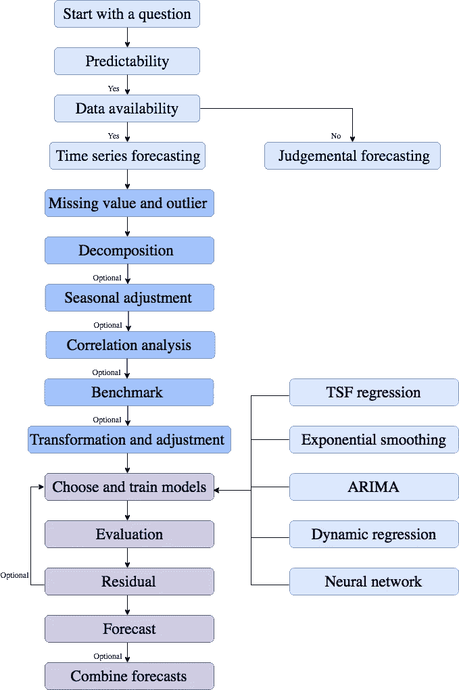
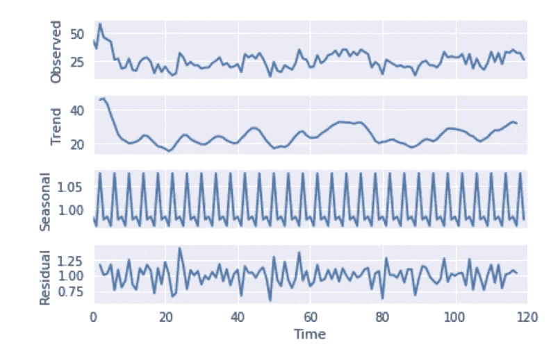
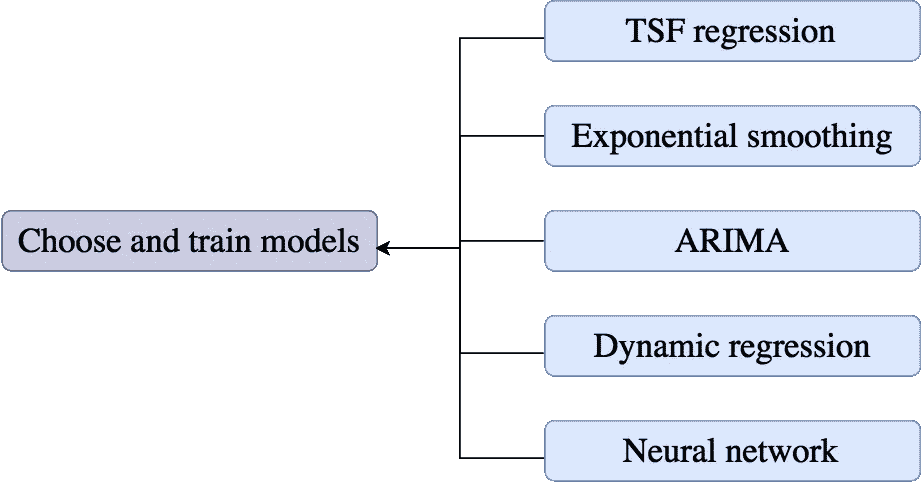

# 现实商业问题中时间序列预测的系统解决方案

> 原文：<https://medium.datadriveninvestor.com/systematic-solution-for-time-series-forecasting-in-real-business-problems-2816747799d6?source=collection_archive---------1----------------------->

时间序列预测的在线资源和教程主要分为两类:特定预测模型的代码演示，以及数学公式背后的理论的学术风格解释。这两种方法都有助于学习。然而，为了解决行业中的实际业务问题，有一个系统的、结构良好的解决方案是必不可少的，数据科学家可以将其作为指南并应用于实际用例中。

本文旨在通过展示以下内容，从实用的角度为时间序列预测提供一个端到端的系统解决方案:

*   预测中完整过程的总体视图
*   如何按照下面的方法流程图一步一步地直接应用解决方案来解决您的业务问题

A systematic solution for Time Series Forecasting in Real Business Problems

**从一个问题开始**

我们想用数据回答的问题是什么？举个例子，

*   食品杂货店数百家食品集团下一季度的预期销量是多少？
*   车辆出租 3 年后的转售价值是多少？
*   每条主要国际航线和每种级别(经济舱、商务舱和头等舱)的乘客数量是多少？
*   食品和饮料行业未来 3 个月的预期客户需求时间？

从头脑风暴开始，思考你感兴趣的问题，并期望通过你的数据集得到答案。

**预见性**

确定问题的可预测性很重要，因为不是所有的预测都比抛硬币好。事件或价值的可预测性取决于几个因素。你可以参考我之前的文章《[建立预测模型前你应该知道的预测基础](https://towardsdatascience.com/forecasting-fundamentals-you-should-know-before-building-predictive-models-299a18c2093b)》了解更多细节。

**数据可用性**

当完全缺乏历史数据(即新产品、新政策、新竞争对手)，或数据不完整，或数据仅在延迟一段时间后才可用时，**判断性预测**是这些情况下的唯一选择。

当数据集具有关于过去的数字信息，并且假设过去模式的某些方面将持续到未来也是合理的，我们可以构建**时间序列预测**模型来进行预测。

**缺失值和异常值**

处理缺失值的一种常见方法是使用插值法用估计值替换它们。比如说**熊猫。DataFrame.interpolate** 方法就是为此而设计的。

*   对于非季节性数据，可以用简单的线性插值来填补缺失部分，即`interpolate(method=’linear’)`
*   对于季节性数据，建议使用多项式或样条等更复杂的插值方法来连接这些值，即`interpolate(method=’spline’, order=2)`

处理异常值的最简单方法是用变量的中值填充它们。例如，如果变量“年龄”的值大于 80，我们将其替换为中位数，`df["Age"] = np.where(df["Age"] >80, median,df["Age"]).`

显然，只有当我们假设缺失值和异常值确实是错误时，才应该使用这些插值方法。简单地替换它们而不考虑它们为什么会发生是危险的，因为它们可能会提供我们需要考虑的有用信息。

**分解**

分解主要用于研究时间序列数据，方法是将时间序列分成三个部分，每个部分代表一个基本的模式类别。

*   趋势周期成分
*   季节性成分
*   剩余部分(包含时间序列中的任何其他内容)

Time series decomposition

底部面板中显示的剩余部分(residual)是从时间序列数据中减去季节和趋势周期部分后剩下的部分。

**季节性调整(可选)**

经济序列通常是季节性调整的。季节调整意味着从观测值中去除季节成分。

例如，[平民失业率数据](https://fred.stlouisfed.org/series/UNRATE)通常经过季节性调整，以突出由于**潜在经济状态**而非季节性变化引起的变化。

*   对于加法分解，通过从观测值中减去季节性成分来计算季节性调整数据`observation-seasonal component`
*   对于乘法分解，季节调整值是通过将观测值除以季节分量得到的，`observation/seasonal component`

**相关性分析(可选)**

相关性并不意味着因果关系。[预防冲突的金拱门理论](https://mediawiki.middlebury.edu/wiki/IPE/Golden_Arches_Theory_of_Conflict_Prevention)是基于被误解的相关性的理论的一个例子。理解和确定因果机制对于建立良好的预测模型至关重要。在实践中，散点图可以很容易地用来确定变量之间的相关性。

**基准测试(可选)**

有一些预测基准可以与我们开发的任何方法进行比较，以确保新方法优于这些简单的替代方法。如果新方法的性能比基准测试差，就不值得考虑。四种常见的基准预测方法是

*   **平均法**:将所有预测设置为历史数据的平均值。例如，将 11 月的销售额设置为等于 1 月至 10 月销售额的平均值。
*   **朴素方法**:设定所有未来值的预测值等于最后一次观察值。例如，设置 11 月的销售额等于 10 月的销售额。
*   **季节性朴素方法**:将每次预测设置为等于一年中同一季节的最后一次观测值。例如，设置今年 11 月的销售额等于去年 11 月的销售额。
*   **漂移法**:增加或减少一段时间内的平均变化量(称为漂移)。例如，如果从 1 月到 10 月的月销售额增长率为 10k(漂移)，则设置 11 月的销售额等于 10 月的销售额加上 10k。

**转换和调整(可选)**

通常，历史数据中的模式越简单，对未来值的预测就越准确。源数据的转换和调整可以排除一些已知的变化，并使数据集中的隐藏模式随着时间的推移更加一致。有 4 种常见的调整:

*   **日历调整**:核算每个月不同的天数
*   **人口调整**:去除人口变动的影响
*   **通货膨胀调整**:消除通货膨胀的影响
*   **数学变换**:随时间序列水平增减的季节性变化

**选择和训练模型**

Forecasting models that widely used in the industry

时间序列预测研究已经存在了将近一个世纪。你可以想象在这个特定的领域，有多少算法被开发和优化。预测方法的选择取决于可用的数据、模型的预测精度以及预测模型的使用方式。目前，行业中最好和最广泛使用的预测模型是时间序列预测回归、指数平滑、ARIMA、动态回归，以及包括神经网络在内的几种先进方法。

**评价**

为了选择最佳模型，有必要对预测精度进行度量和评估。实践中通常使用以下评估方法:

*   平均绝对误差:MAE
*   **均方根误差:RMSE**
*   平均绝对百分比误差:MAPE
*   平均绝对标度误差:MASE
*   贝叶斯-施瓦兹准则:BIC
*   阿凯克标准:AIC
*   **修正了赤池的信息标准:AICc**
*   汉南-奎因标准:HQC

有时，不同的评价方法可以选择不同的预测模型。推荐的方法是找到使用时间序列交叉验证计算的具有最小 **RMSE** 的模型，或者具有最小 **AICc** 值的模型。

**剩余(可选)**

残差可用于检查预测方法是否使用了所有可用信息。一个好的预测模型的残差应该满足以下条件:

*   残差的平均值等于 0；如果不是，预测是有偏差的
*   残差是不相关的；如果没有，在计算预测时应该使用的数据中还有其他信息
*   残差具有恒定方差(可选)
*   残差呈正态分布(可选)

任何不满足前两个条件的预测方法都是可以改进的。强烈建议将残差可视化:

*   时间图:显示方差是否可以被视为常数
*   直方图:正态分布与否
*   ACF(自相关):序列值之间的相关性；如果残差看起来像白噪声，则表明预测方法是好的

**预测**

应用我们选择的模型来计算预测。

**合并预测(可选)**

拉普拉斯说:“把这两种方法的结果结合起来，可以得到一个结果，它的误差概率定律将更迅速地减小。”

罗伯特·克莱门特写道:“结果几乎是一致的:综合多种预测可以提高预测的准确性。在许多情况下，只需对预测进行平均，就可以显著提高性能。”

我建议使用上一步**中建议的几种不同方法，选择和训练同一时间序列的模型**，并对结果预测进行平均。在大多数情况下，通过使用简单的平均值来组合预测是难以超越的。

我写这篇文章的目的是描述一个端到端的系统解决方案，数据科学家可以在日常工作中直接应用它来解决实际的业务问题。知识和技能的学习和应用有不同的深度，从学术水平到工业实践中发现的水平。本文主要研究时间序列预测在工业中的实际应用。将来，我会发表一些关于预测算法的文章，包括数学理论的解释和 Python 代码示例。

"对未来的预知使得操纵敌人和支持者成为可能. "——雷蒙·阿隆。预测是你可以通过应用科学获得的超能力。不需要被放射性蜘蛛咬。