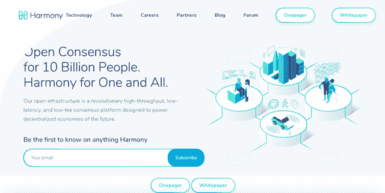

# 以和谐应对规模

> 原文：<https://medium.datadriveninvestor.com/tackling-scale-harmoniously-with-harmony-14938451756d?source=collection_archive---------16----------------------->

加密货币和区块链技术一直被视为将带来技术进步新时代的基础技术，并以有前途的新想法和功能支撑 web 3.0，迄今为止，这些想法和功能一直暗示着我们或在这一点上似乎不切实际。

区块链的一个更明显的用途是不可变的数据库管理，它可以用来破坏一大批牢牢控制着价值数十亿美元的基础设施行业的公司。

 [## 2019 年成为主流的 7 大区块链挑战及更多...数据驱动的投资者

### 教训是永远不要停止学习和成长。关于技术、金融、工作场所、生产力和…

www.datadriveninvestor.com](https://www.datadriveninvestor.com/2019/03/25/top-7-blockchain-challenges-to-go-mainstream-in-2019-more/) 

区块链只是一个概念，解释如何使用它是重要的一部分，项目的结构、编码和实施方式以适应不同的用例才是真正重要的。

今天有许多区块链可供使用，有些是专用的，有些是通用的。

Harmony Hompage

# 攀登区块链

权力下放为我们提供了许多令人钦佩的品质，但此时此刻，在当前的技术限制下，区块链的可扩展性已成为阻碍整个行业发展的真正问题。

能够在分布式网络上每秒完成数千个事务，同时每天添加新用户并保持低成本，同时仍然保持分散化和安全性，这是一个值得注意的平衡行为。

我们看到了可扩展性的限制，Cryptokitties 使区块链联邦理工学院嘎然而止，当 BTC 达到 20k 以上时，3 小时的交易处理时间和 5-8 美元的交易费用。这是不可持续的，扩展解决方案成为区块链下一阶段发展的焦点。

# 和谐的目标是如何扩展其链条

分片一直是解决可扩展性困境的建议方案之一，Etheruem 正在探索自己的概念版本，试图提高链的性能，但对于如何进行分片有许多解释。

Harmony 是一个新的连锁店，它看起来非常注重分享，并创建了自己的版本来衡量区块链。

分片将数据分割成更容易管理的更小的部分，使得总的计算负担更小。这意味着它们不是处理大型计算任务，而是被分解成更容易处理的小块。

Harmony 从 Zilliqa 网络获得灵感，在工业和学术发展的基础上建立了自己的系统，以创建一个新的链，该链具有一些漂亮的基于分片的功能。例如切分标记、信标链、重切分和纪元的证明。

# 和谐的用例

像 Harmony 这样的高性能区块链有利于高频小额支付等有趣的用例。

# 物有所值

比方说，用户想购买在线课程，但只为他使用的内容付费，他们可以这样做，并根据使用课程的时间量或使用课程时消耗的内容/页面/视频量收费。

现在，用户可以只为他们真正觉得有价值的内容付费，而不是购买整个课程，因为有些内容对他们不适用。

# 高速网络

在线游戏节奏很快，几秒钟就能决定胜负。假设你在玩在线游戏，你需要额外的生命值或护甲，你可以买一些，然后马上送到你的库存里使用，确保你的对手不会打败你。交易完成后，在市场上销售产品的玩家或开发者会立即收到费用。

# 更多关于和谐

如果你觉得这篇关于 Harmony 的评论很有趣，并且想了解更多关于这个项目或者他们当前的发展，我推荐你查看下面的资源。

*   [网站](https://harmony.one/)
*   [一个传呼机](https://harmony.one/images/onepager.jpeg)
*   [白皮书](https://harmony.one/pdf/whitepaper.pdf)
*   [中等](https://medium.com/harmony-one)
*   [电报](https://t.me/harmony_one)

免责声明——这是我提交给 [@originalworks](https://steemit.com/@originalworks) 写作比赛的作品，在这里找到

文章最初发布在 [steemit](https://steemit.com/cryptocurrency/@chekohler/tackling-scale-harmoniously-with-harmony) 上