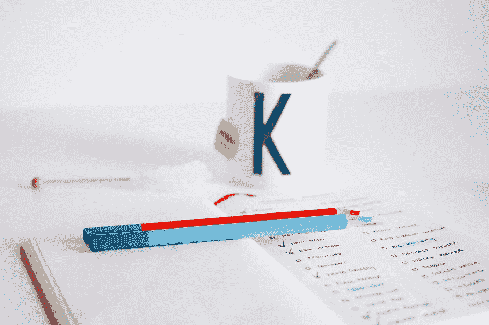

# 迈出一小步:提高你的信用评分

> 原文：<https://medium.datadriveninvestor.com/take-a-baby-step-improve-your-credit-score-f1457b10b249?source=collection_archive---------0----------------------->

## 新的一年是重新理财的一个好理由，但不是唯一的理由

一年中的任何时候都是让你的信用步入健康轨道的好时机。[益百利](http://www.experian.com/blogs/news/)公共教育总监罗德·格里芬谈到了各种各样的话题，都是为了帮助人们从债务中反弹，巩固收益，并为今年和每年做好准备。

从根本上说，信用健康对改善你的整体财务状况至关重要。格里芬认为，衡量信用健康的最佳方式是从你的信用报告开始。每 12 个月在[annualcreditreport.com](https://t.co/ufYEB5LrT4)获得一份免费报告。还可以从 Experian 获得一份[免费报告](https://www.experian.com/consumer-products/free-credit-report.html)。

“用你的报告获得信用评分，”格里芬说。"分数会告诉你你在风险方面的地位:你的基本信用健康."

 [## 如何保护你的信用评分获得丰厚回报

### 给你的生活画上圆满的句号

medium.com](https://medium.com/financial-strategy/top-off-your-life-thanks-to-the-gift-of-great-credit-f4167a75cedd) 

当被问及什么是一个好的信用评分范围时，格里芬回答说，“与大多数信用报告问题一样，答案是‘视情况而定’。”得分范围各不相同，但一般都在 700 分以上。当你得到一个信用分数时，你应该得到一个解释，说明这个分数意味着什么，以及影响它的因素。"

那些想要改善信用的人应该将他们的信用报告与他们收到的因素进行比较。

“解决这些因素，提高你的分数，”格里芬说。“大多数人需要做一两件事:减少信用卡余额，补上逾期付款。逾期付款和使用率占信用评分的 60%或以上。”

保持低余额也会提高信用。询问是最不重要的因素。不过，格里芬说，过于频繁地申请新贷款并不是一个好主意。时间也是一个关键因素。分数反映了一段时间内的行为，而不仅仅是当前发生的事情。

格里芬认为，在试图恢复信用时，耐心和一致性是最好的做法。设定可实现的目标，当你达到目标时奖励自己。

# **还没结束**

尽管在经济上和情感上都很艰难，格里芬说如果你有应收账款，这并不是世界末日。

“不要害怕与催收机构合作，”他说。“它不会重置报告时钟。如果可以的话全额还债。新的 FICO 和 [VantageScore](https://twitter.com/VantageScore) 系统不包括付费收藏。”

[FICO score](https://www.credit.com/credit-scores/what-does-fico-stand-for-and-what-is-a-fico-credit-score/) 是由 [FICO](https://twitter.com/FICO) 开发的信用评分，该公司专门从事所谓的“预测分析”，这意味着他们获取信息并进行分析，以预测可能会发生什么。

 [## 当你掌握你的信用时，节省数千美元

### 你的信用评分提高可能只是一个公共事业法案了

medium.com](https://medium.com/financial-strategy/save-thousands-of-dollars-when-you-get-a-grip-on-your-credit-6ea09bcd1a89) 

如果你想提高自己的信用，但又难以维持生计，格里芬敦促要谨慎。

“不要付钱给那些说如果你付钱，他们可以修复你的信用的人，”他说。“傻瓜和他的钱很快分开。找一个好的非营利信贷顾问。国家信用咨询基金会是一个很好的起点。

虽然你可以提高你的信用评分，但这不是一个一朝一夕的过程。

格里芬说:“或长或短，这取决于你的特殊情况和你的信用问题。”“如果你只是错过了一次付款，可能只是一个月。破产可能需要几年时间。但永远不会永远。”

包括 Ask Experian [博客网站](https://www.experian.com/blogs/ask-experian/)在内的一些资源可供那些想学习如何更好地管理信贷的人使用。

“从事信用报告系统，”格里芬说。“拿到你的报告，知道里面有什么。拥有它。不要让它控制你。”

**关于作者**

吉姆·卡扎曼是拉戈金融服务公司的经理，曾在空军和联邦政府的公共事务部门工作。你可以在[推特](https://twitter.com/JKatzaman)、[脸书](https://www.facebook.com/jim.katzaman)和 [LinkedIn](https://www.linkedin.com/in/jim-katzaman-33641b21/) 上和他联系。