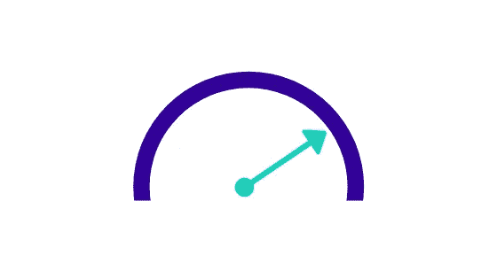
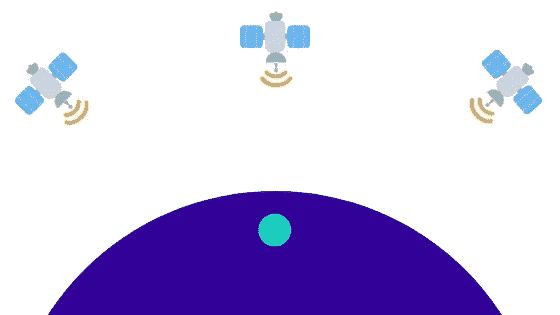
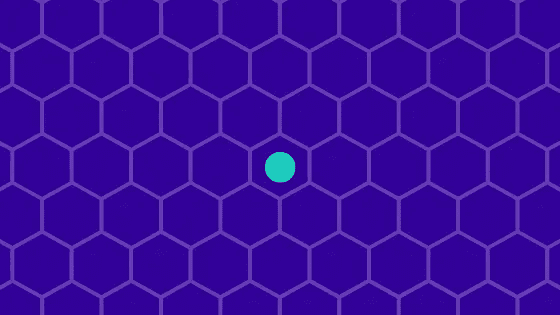

# 让 AR 云更上一层楼

> 原文：<https://medium.datadriveninvestor.com/take-ar-cloud-to-the-next-level-964f3c60445a?source=collection_archive---------8----------------------->

网上有许多资源在推测许多技术，AR 也不应该例外。这篇文章主要是关于增强现实的潜力，特别是增强现实云，而不是它的用例。我将简要介绍截至 2019 年 7 月的 AR 现状，然后转到 AR 云原则，接着是一些可以将我们带到空间计算下一个级别的关键点。它是为初学者、爱好者和所有对 AR 感兴趣的人设计的。

# 我们目前如何使用 AR？

目前手机上的增强现实实现主要由 ARKit(最新版本 3)和 ARCore(最新版本 1.10)以及许多其他的[框架](https://thinkmobiles.com/blog/best-ar-sdk-review/)代表。这些给数百万现有用户带来了 AR，这是一个很大的优势。

 [## 人工智能和虚拟现实的融合-你能期待什么|数据驱动的投资者

### 在技术领域，融合是合乎逻辑的一步。就在几十年前，你可能需要一个专门的…

www.datadriveninvestor.com](https://www.datadriveninvestor.com/2018/08/30/the-convergence-of-ai-rv-what-you-can-expect/) 

另一方面，耳机有自己的操作系统，专门为新的 AR 用例设计(Hololens 2，Magic Leap，NReal 等)。
这些工具大多有一个共同的锚的概念。AR 内容是相对于这些主播来放置的。
虽然不太为人所知，但增强现实标记语言(ARML)于 2012 年创建(基本上由 Wikitude 创建)，作为所有“增强现实浏览器”的标准。它是这样定义锚的:⚓ =现实世界中物理对象的位置。

ARCore 1.2 在 2018 年 5 月 8 日推出了一项名为云锚的功能。
它使开发人员能够在 iOS 和 Android 上建立共享的 AR 体验，允许在一个设备上创建的锚点转换为云锚点，并与其他设备上的用户共享。但是我们还没有接近真正的 AR 云。

# AR 云

许多人将 AR 云定义为“世界的软拷贝”、“行星规模的 3D 模型”或“单一最大最重要的基础设施”。如果让我选择 AR 云的前 3 项要求，我会说:

*   用户可以在地球上的任何位置访问*全球点云*(锚点)/内容云(我们的虚拟信息，例如 3d 模型)。它是持久的和共享的(至少是点云部分)。
*   用户使用设备上的算法，利用给定的相机流、设备的传感器和点云片段，实时求解虚拟相机。
*   用户不断更新和改进点云以保持其相关性。

第三方开发者可以在现有的 AR 云之上构建自己的应用(就像我们在 HTTP 协议之上创建自己的 web 应用一样)。
当然，在我们创建 AR 云之前，有许多技术和逻辑问题:

*   访问 AR 云的默认设备有哪些？(眼镜？)
*   最常见的内容格式是什么？(“经历”？)
*   谁将治理/管理这一切？(有人会吗？)
*   这个网络的总体架构是什么？(集中式、分散式、混合式？)

如果你感兴趣的话——已经有一个名为[https://openarcloud.org](https://openarcloud.org/)的社区投入资源来解决这些问题。我个人觉得读起来很有意思。

# 将 AR 带到下一个水平的技术

# 5G

更有可能的是，你将获得每秒 100 兆的日常速度，而 4G 目前在日常速度下只能提供每秒 10 兆。简单的数学计算:拥有 10 倍的网络速度，我们可以加载 10 倍多的数据，而对 UX 产生同样的影响。这非常有帮助，因为我们将在 AR (3d 内容)中大量使用重物。在美国，5G 已经特别普及，正如 LifeWire.com 所说，“到 2020 年，大多数国家都将接入 5G 网络”。

# GPS III

新一代更精确的卫星。
“该系列的第一颗卫星预计于 2014 年发射，但重大延迟将发射推迟到 2018 年 12 月。第十次也是最后一次 GPS 块 IIIA 发射预计于 2023 年在 Q2 进行。”—维基百科
对最终用户意味着什么？

我们将获得 1 到 3 米的精度，而目前，在良好的条件下，我们有 3 到 10 米的精度。独立于 GPS3，还有一种称为双频 GNSS 的方法，通过使用来自多个来源的数据来提高精度。已经在小米 Mi 8 —探索者版实现了。
独立于上述一切，谷歌正在建立所谓的 *VPS* (视觉定位系统)，它将通过混合 GPS 数据和街景来用于事件更好的导航。

# DAPPS

OpenArCloud.org·佩奇说:“我们倾向于以尽可能分散的方式组织它”。不仅仅是因为它是炒作，而且因为它的集中化带来了许多安全和政治问题。目前，当谈到 Dapps 时，我们有 Etherium 作为单一的首选解决方案，但到了我们有 GPS3 (2023)的时候，DAPPS 肯定会发展。

# 结论

如果你有兴趣在下面留下评论或者你可以访问这个链接[https://www.openarcloud.org/workinggroups/overview](https://www.openarcloud.org/workinggroups/overview)

免责声明:这只是我的想法，在我们生活的快速变化的世界中，任何事情都可能发生，所以也许很快我们就会以完全不同的方式使用 AR 云。