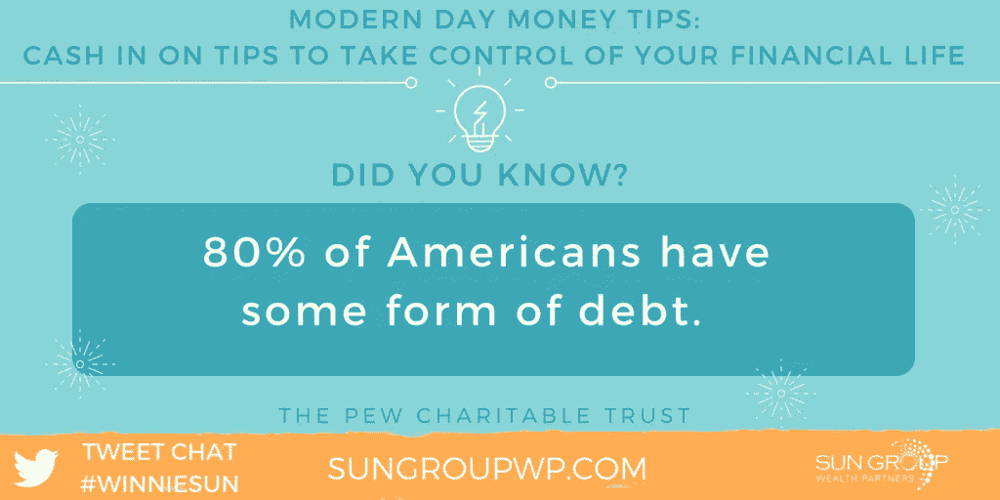
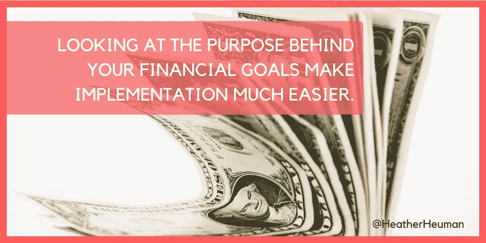
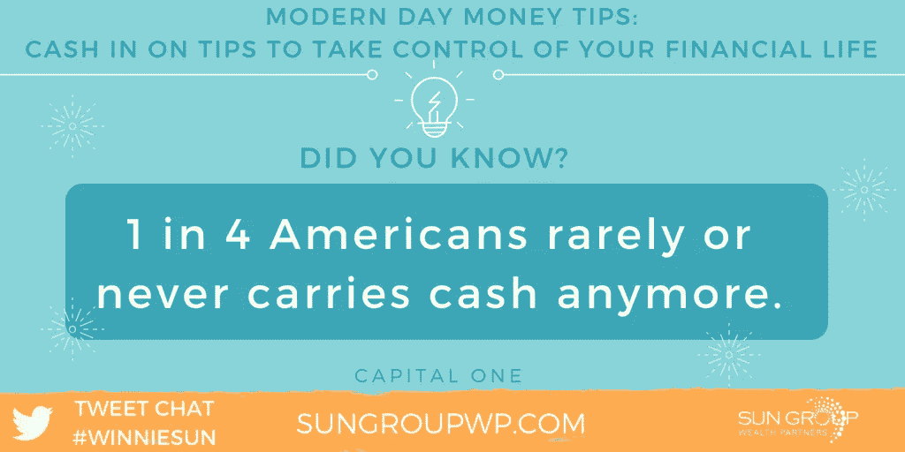

# 掌控你的财务生活

> 原文：<https://medium.datadriveninvestor.com/take-control-of-your-financial-life-f858fa54f500?source=collection_archive---------7----------------------->

## 金钱不能定义你，但你需要它来储蓄和投资

在一个金融大起大落、各种建议相互矛盾的世界里，普通人不知道该走哪条路并不奇怪。

[温妮·孙](http://winniesun.com/about/)将[希瑟·霍曼](https://twitter.com/heatherheuman)和[益百利](https://twitter.com/Experian)的专家聚集在一起，帮助那些展望未来的人从改变生活的建议中获利。

孙是金融行业最受欢迎的专业人士之一。休曼宣称自己是一名“数字传教士”。她是社交媒体发言人、战略家和“[商业、耶稣和甜茶](https://www.sweetteasocialmarketing.com/podcast/)”的播客主持人 Experian 是“领先的全球信息服务公司，提供数据和分析工具。”

 [## 预算友好的方式保持活跃，保护你的理智和财务健康

### 专家建议在预算内保持活跃和健康

medium.com](https://medium.com/financial-strategy/win-the-race-to-the-top-for-health-and-wealth-7ca8eb651514) 

钱不是万能的，但却是安心的首付。家庭争吵主要集中在钱的问题上。

“钱是一种工具，可以把你从 A 点带到 B 点，”孙说。“它不会定义你，但它是你需要存起来并投资的东西，为你和你家人的未来做准备。”

Experian 专家强调了解各种细节。

“金钱是一种金融工具，应该明智地管理，以获得最佳成功，”他们说。“这包括清楚地了解你的收入、支出、储蓄目标等等。你努力工作赚钱。让它为你工作。”

对赫曼来说，金钱使她完整。

“这是一个机会的来源，让我过上更充实的生活，并对我周围的人和世界上的人产生重大影响，”她说。

那些在过去 10 年里关注并遭受痛苦的人知道，尽早存钱是一种不可浪费的特权。未来几年的金融安全不是必然的，也不是自动驾驶的。

“我非常相信储蓄自动化，”孙说。“你应该通过像 bill pay 这样的系统自动支付你的费用和信用卡账单。

她说:“使用像你的 401k 账户来自动化退休储蓄，529 大学储蓄计划等等。”

# 努力工作的好处

霍曼负责。

“我告诉我的钱去哪里，我怎么花，而不是相反，”她说。“前几代人认为，钱来自‘努力工作’——被‘大人物’长期雇佣，而不是企业家或企业主等各种选择。”

Experian 专家给出了以下建议:

*   永远不要花费超过你的收入。这会让你远离债务。
*   积极对待你的财务，从长远考虑，让你的钱发挥作用。
*   确保你建立了你的应急基金，投资了你的退休金，制定了现实的财务目标和行动计划来帮助你实现这些目标。

 [## “我希望我存的少一点”……从来没有人这么说过

### 规划和储蓄将为你今天和退休做好准备

medium.datadriveninvestor.com](/i-wish-i-saved-less-said-no-one-ever-668cf1c8cb96) 

有一个问题是，紧缩预算好还是多赚钱好。

“如果你能做到这两点，那就太好了，”孙说。“我喜欢强调赚更多的钱。

“当你赚更多的钱时，这可以给你的预算多一点喘息的空间，”她说。“整个‘你只能活一次’的概念需要稳定、持续的收入来源。”

不仅仅是赚钱，而是要做好。

“明智地赚更多的钱是我的座右铭，”休曼说。“然后，我们可以保持精力‘紧张’或集中，完成更多的工作，从而赚更多的钱。”

预算是 Experian 的关键。

专家说:“[制定并维持预算](https://www.experian.com/blogs/ask-experian/how-to-make-a-budget/)在管理你的财务时至关重要。”。“你的预算是你的财务路线图。如果你专注于赚更多的钱而没有制定预算，你很可能仍然会陷入超支的陷阱。

“也就是说，如果你有精力，兼职或多份工作并没有什么不对，”他们说。记住，你可能不得不把一部分钱存起来交税。你仍然想为额外收入做预算。"

# 节省和减少债务

有各种各样方法来偿还债务，而不是把你自己挖回一个洞。

“赚更多的钱，”孙说。“这听起来当然比实际容易，但这是事实。

“如果你赚更多的钱，不把它花在你不需要的东西和事件上，你将能够偿还债务，继续远离债务，”她说。

 [## 当你的存款不足时，你会去哪里？

### 美国人在短期和长期需求上都非常贫穷

medium.com](https://medium.com/financial-strategy/where-will-you-turn-when-your-savings-fall-short-16fb451323ea) 

以下是 Experian 的建议:

*   清楚地了解你的债务。[你的信用报告](https://medium.com/@JKatzaman/know-the-score-be-a-credit-to-yourself-143fd1b30025)可以帮上忙。
*   创建一个行动计划。从高利息债务或最低余额债务开始。这实际上是找到一种让你保持动力的方法。
*   尽量不要使用你正在偿还的信用卡。
*   把自己从可能诱惑你花钱的电子邮件或邮件列表中删除。
*   专注于建立你的储蓄和实现其他对你有益的财务目标。

霍伊曼主张创建零平衡预算。在零平衡或[零基预算](https://en.wikipedia.org/wiki/Zero-based_budgeting#Creator_and_Definition)中，每个新期间的所有费用都必须合理。

自动化让你养成储蓄的习惯。然而，如果市场跳水，“存了就忘”会让你坠入悬崖。一定要咨询专家。

孙说:“财务自动化的好处是，你每个月都在积极地偿还你所欠的任何钱。”“你在存钱、投资，每时每刻都在为自己做计划。

“问题是，这不是一个“设置好就忘了”的公式，”她说。“定期检查自己的财务状况很重要。如果你刚刚开始，我建议每个季度一次或更多。”

霍伊曼还权衡了自动化的两个方面。

“这避免了我们忙碌时可能发生的延误，”她说。“另一方面，这消除了我们给别人辛苦挣来的钱时的那种‘刺痛’。我们会变得麻木不仁。”

# 灵活自动化

Experian 看到了财务自动化的其他利弊:

*   优点:你可以不假思索地支付账单，增加储蓄。自动化您的账单将帮助您避免滞纳金，并有可能提高您的信用。
*   缺点:账单会波动。如果你没有做好准备，这可能会导致财务压力。你必须确保你的财务信息总是更新的，这样付款就不会有问题。

 [## 恢复您的信用从一小步一小步开始

### 获得高分不会一蹴而就

medium.com](https://medium.com/financial-strategy/restoring-your-credit-starts-with-baby-steps-251ec10bbb43) 

“自动化有很多方面，”专家说。“如果你把支票上的钱自动存入退休账户或储蓄账户，这就是自动化。如果你的账单是自动转账，那是另一种形式。有很多很好的方法可以让你的财务自动化。”

也有不同的方法来明智地存钱、花钱和安排钱的优先次序，以创造更多的现金流。

“我总是量入为出，这样当我需要做出更大的财务决定时，我的预算就有了一些喘息的空间，”孙说。“我认为大多数人将受益于统一的比例。

“例如，承诺只花你月收入的三分之一，并尝试每月减少，”她说。“然后，优先考虑挣钱。尽量每个月多赚一点。管理你的钱时，小步骤很重要。”

[目标也能创造奇迹](https://medium.com/@JKatzaman/goal-setting-as-simple-as-it-sounds-d6d7ac7e4911)。

“目标激励着我，”霍伊曼说。“对于任何有家庭的人来说，他们非常有帮助，使之成为一种‘团队’努力。我们将去迪斯尼度假，并支付现金。谁有动力一周不去福乐鸡快餐店吃五次饭？”

# 你真的知道吗？

储蓄和支出不应该是随意的。

Experian 专家说:“要分清主次，就要清楚地了解你目前是如何花钱的。”“回去回顾两到三个月的支出，了解你的现金流。

他们说:“当你花时间检查你的消费模式时，你可以确定哪些项目值得优先考虑，哪些项目可以从你的支出中剔除，以帮助你节省。”

省钱的神话可以粉碎最好的计划。

“最具破坏性的神话是你只能活一次，所以你应该挥霍，”孙说。“虽然这种情况偶尔会发生，但模式是随着时间的推移而形成的。为了你的钱包着想，在你的支出和账单支付上保持一致比不规律的预算要好。”

 [## 通过几个简单的步骤来管理你的钱

### 最难的部分是进入正确的心态

medium.com](https://medium.com/financial-strategy/take-charge-of-your-money-through-a-few-easy-steps-2ab642841684) 

神话导致其他借口。

霍伊曼说:“有一种误解认为，如果你的收入是固定的，或者比你希望的要少，那么存钱是不可能的。”。“这给了人们一个‘退出’的机会，而实际情况是，这可能需要更多一点的纪律。”

益百利有两大神话:

*   "为了省钱，你必须淘汰所有的信用卡，坚持使用现金."虽然这种方法*可以*帮你省钱，但你还是想展示一些信用活动来建立你的分数和历史。只需收取少量费用，每月付清即可。
*   “你不能同时存钱和还债。”你可以也应该努力做到这两点。即使你只是在优先偿还债务的同时存了一小笔钱，那也比什么都没有强。

“我最喜欢的财务技巧是自动化你所有的账单支付和自动化你的储蓄，”孙说。“生活已经够忙了。你不需要另一个可以通过电子系统完成的任务。你是可能让你陷入财务困境的变量。

“此外，还要记录商务和个人物品的支出，”她说。“如果你能每月 100%付清账单，最好用你的信用卡做记录。”

# 走移动路线

霍伊曼更喜欢将部分收入直接存入银行，并通过手机进行在线存款。

“这立刻让我觉得我们在财务自由的目标上取得了进展，”她说。

 [## 达到 700 分或更高，为你的人生赢得高分

### 你的信用评分越高，你找到的机会就越多

medium.com](https://medium.com/financial-strategy/reach-700-or-higher-and-score-big-for-your-life-45a70829fcc3) 

益百利提出了一些财务技巧:

*   定期检查你的信用报告。每隔 12 个月，你可以在[年度信用 Report.com](https://www.annualcreditreport.com/index.action)从三大信用局中的每一个获得一份免费的信用报告。
*   如果你不自动转账，就在手机上设置提醒，确保你不会错过任何一笔付款。你的支付历史是影响你信用评分的最大因素之一。

孙推荐了财经博客、播客或来自 FinCon(T3)社区团体的内容，推荐了商业博客、推荐了福布斯、和资产电视(T6)推荐了精彩内容。

Experian 创建了一个金融专家的 Twitter 列表。

清晰、可持续的财务目标需要计划和纪律来维持。

“当我与我们的客户一起工作时，我让他们量化他们的财务目标，”孙说。“这可以写在一张简单的纸上，也可以写在他们手机上的笔记应用程序上。这应该是他们可以访问并被提醒的东西。

“我也喜欢给客户贴上这些目标的标签，”她说。"那么这些账户就有了明确的目的来解释人们为什么要储蓄."

# 抓住早期的胜利

霍伊曼说，储户应该关注当前的收入，然后是增长的机会和目标。

“先看看容易摘到的水果，”她说。“生活中的许多事情都需要时间和努力:财务、婚姻等等。关键是要永远记住目标背后的目的。”

财务目标的类型也很重要。

Experian 的专家说:“最好是既制定短期目标，也制定长期目标。”。“短期目标会帮助你保持专注。同样，把你的目标放在身边。如果你想放弃，视觉效果会成为你的动力。”

 [## 收入流始于滴滴

### 兼职和自由职业可以减轻你的经济负担

medium.datadriveninvestor.com](/income-streams-start-from-drips-7ec21e042a59) 

收入来源多样化也能增加现金流。

“要有创意，但要实用，”孙说。“你有什么技能和能力来创造更多的收入？你如何利用你的时间，让你的努力工作可以继续吸引收入？如果你能回答这些问题，你就能[创造其他收入来源](https://medium.com/@JKatzaman/startcustoing-business-online-not-for-faint-of-heart-6367e4e6bc4d)。

“我的朋友玛莎·科利尔通过易贝带来了可观的收入，”她说。“总有办法的。”

霍伊曼建议寻找用更少的时间获得更大成果的机会。

在现金与信用卡的辩论中，使用现金提醒你，你不是在无底洞里取钱。它强调你不能花费超过你所拥有的。

“我 99%的消费都是通过信用卡完成的，”孙说。“我喜欢使用信用卡，因为我每个月都会还清欠款。信用卡让我记录了我在个人和商业需求上花了多少钱，并帮助我了解我是否在预算之内。

“此外，这让纳税时间变得稍微容易了一点，”她说。"我获得的积分可以转化为旅行费用."

# 纪律需要努力

霍伊曼也有类似的偏好。

她说:“信用卡的好处是，对于商务旅行来说，它让我在纳税方面更容易。”“我月底把卡还清了。另外，美国航空公司的里程数非常惊人。

霍曼说:“不利的一面是，有些人没有纪律来保持卡*付清*。

 [## 管理良好的信用卡可能是好东西

### 考虑现金和信用卡的利弊

medium.datadriveninvestor.com](/credit-cards-managed-well-can-be-good-things-654506b8daeb) 

Experian 专家提供了解决方案。

“现金可以帮助你保持预算，但它可能会被放错地方，”他们说。“当你只使用现金时，跟踪你的支出并不容易。信用卡——如果使用得当——可以帮助你建立信用。在网上购物时，它们有更多的保护。

他们说:“如果你担心信用卡利率或支出超过你的偿还能力，只需用你的信用卡支付一张账单或汽油费，然后马上还清。”

了解你的信用评分可以改善你的整体财务健康。

“我们经常忽视信用评分的重要性，直到我们打算做出一个重大的财务决定，”孙说。“然而，重要的是要始终有一个想法，如果你的信用评分是健康的。然后，您可以快速更改或修复报告中的错误。

“此外，当你打算购买或租赁更大的东西时，拥有良好的信用评分通常可以转化为省钱，”她说。

Experian 专家指出，信用评分反映了金融历史。

他们说:“你需要定期检查你的信用报告，以了解影响你分数的积极或消极行为[。](https://www.experian.com/blogs/ask-experian/how-is-your-credit-score-determined/)

“知识就是力量，”他们补充道。“当你表现出对你的信用评分有积极影响的行为时——按时支付账单，减少你的总体债务——你就为自己的财务成功做好了准备。”

# 查看应用程序

一些应用程序和网站可以帮助人们制定并坚持他们的理财计划。

“我用我所有的信用卡应用程序作为现金管理工具，”孙说。“例如，美国运通和大通有很好的平台。我把我的银行和其他金融机构连接到一个应用程序，比如 Intuit 的 T2 QuickBooks，来定期记录我个人和公司的现金流。

“你需要知道自己的财务状况，以便为自己做出明智的财务决策，”她说。

 [## 财务成功:有这方面的应用

### 拥有更便捷的网上银行，有身份保护

medium.datadriveninvestor.com](/financial-success-there-are-apps-for-that-17addbd69a7c) 

[Experian 网站](http://www.experian.com/)也有丰富的信贷和个人理财知识。

“我希望在年轻的时候就学会投资、分红和复利的力量，”孙说。“我也希望我知道如何更有效地使用我的信用卡来保存记录，并为我的企业赢得积分。

“我现在仍然很感激知道这些，”她说。"在孩子很小的时候，我们就可以教给他们很多关于金钱的知识."

正如 Experian 专家总结的那样，“信贷是一种应该明智使用的工具，因为你的信用记录会影响你财务生活的许多方面。”

**关于作者**

吉姆·卡扎曼是拉戈金融服务公司的经理，曾在空军和联邦政府的公共事务部门工作。你可以在[推特](https://twitter.com/JKatzaman)、[脸书](https://www.facebook.com/jim.katzaman)和 [LinkedIn](https://www.linkedin.com/in/jim-katzaman-33641b21/) 上和他联系。