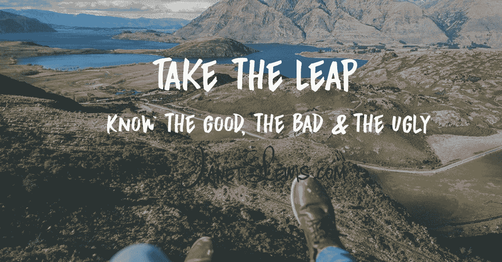

# 迈出这一步，知道好的、坏的和丑陋的

> 原文：<https://medium.datadriveninvestor.com/take-the-leap-know-the-good-the-bad-the-ugly-c2a4fda36a2?source=collection_archive---------14----------------------->

如今，似乎每个人都想成为企业家，这原本是用来形容那些扰乱社会的创造性创新者。现在，它被用来描述每个人，从多层次营销公司的“销售代表”到社交媒体上的“影响者”，再到发明解决需求的新方案的人。

成为一名企业家已经变得很“性感”，听起来比市场助理、行政协调员甚至销售副总裁要好得多。随着社交媒体越来越受欢迎，它也创造了这种“跟上琼斯”的心态，并创造了一系列“看着我，我很成功，将成为下一个马克·扎克伯格”。

出于某种原因，现在人们比以往任何时候都希望别人羡慕他们的生活。他们希望对自己的身份和工作感觉良好，即使这是他们编造的。他们想在网上给朋友、家人甚至陌生人留下深刻印象。他们希望人们相信他们过着舒适的生活，他们的生活是完美的。不管你如何定义企业家，都有很多人相信这就是生活，这是赚钱和解决问题的捷径。

我可以告诉你，成为一名企业家不是一蹴而就的，它伴随着许多起起落落。不要让自己被那些社交媒体的帖子误导。企业家的生活不是和你所有的伙伴在游艇上喝香槟，也不是要有一个很好的工作生活平衡，甚至不是你想什么时候休假就什么时候休假。

请继续关注，我将分享作为一名企业家的好、坏和丑。

下次见。

*最初发表于*[*【janetlewis.com】*](https://janetlewis.com/taketheleap/)*。*