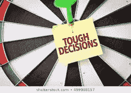

# 做出影响一生的艰难决定

> 原文：<https://medium.datadriveninvestor.com/taking-life-impacting-tough-decisions-d608dfa4bf22?source=collection_archive---------15----------------------->

我们做出的以及强加给我们的所有决定都会产生长期后果。

**决策不仅仅是选择一个选项——而且还要付诸行动。**

**如果我们只是决定而不采取任何行动**——决策是不完整的。

**尽管不确定、不确定和处于未知的情况下**仍能做出艰难的决定和行动的人——**是那些更成功、更快乐、更满足、更少后悔等的人。**

 [## 决策的移情设计方法如何工作——数据驱动的投资者

### 移情设计是一种产品设计方法，首先由多萝西·伦纳德和杰弗里·雷波特在哈佛大学提出

www.datadriveninvestor.com](https://www.datadriveninvestor.com/2018/07/18/how-the-empathic-design-method-of-decision-making-works/) 

**做出艰难的决定构成了冒险，所有的风险都有回报、机会*以及痛苦**——有些决定有不可逆转的结果。

**这个决定可能和**“我们要不要卖掉雅虎”[我指的是第一次有人出价很高，但他们没有卖掉，因为预期以后会有意外之财——后来他们不得不在几年后以低得多的价格卖掉]或者我应该选择哪个职业/职业/课程，或者是否继续这段关系。

或者这个决定可以小到我应该穿什么去参加聚会或者我们应该吃什么晚餐等等。

**所做的决定和采取的行动的大小决定了我们生活的影响和轨迹。**

我们的人性也让我们在小决定中充满疑虑——当我们需要做出重大决定时，我们会感到焦虑、不安全，有时甚至痛苦。

有些人可以代表他人(比如为他们的组织)做出重大决定——然而他们在个人生活中却无法做出决定。

然后，有时[在这种情况下]最好的决定会带来不好的结果，而在其他情况下，一个看似不好的决定会带来好的结果。

这是因为我们无法看到所有相关的变量——更不用说预测它们将如何共同决定未来的事件

当我们做决定的时候，我们仅仅是在决定把我们的精力、资源、注意力和努力投向哪条道路和方向。

没有人在 100%的时间里做出完美的决定——我们和错误的人约会，我们在糟糕的工作/难相处的老板/有毒的关系中呆的时间比我们应该呆的时间长，以至于我们点了错误的食物。

我们必须明白，每当我们处于第 22 条军规的情况下，行动总是会有更好的结果[不管我们的尝试是成功还是失败]，而不行动总是隐藏着危险、损失和后果，这些会在我们以后的生活中显现出来。

**当我们推迟做出决定并付诸行动**——因为我们害怕搞砸/失败/犯错误= > **你的情况不会有任何变化**【除了那些奇迹般失败的情况】。

我们永远不能指望奇迹，但是当我们积极主动时，我们就选择了前进，这是你能做出的最好的决定之一。

为什么大多数人讨厌做决定——这是因为几乎所有人都把我们的处境和环境过于复杂化了。

**我们在决策过程中的大部分情绪紧张实际上是我们自己内心对改变的抵制，因为我们不喜欢失去控制的感觉。**

**可惜，未来不在你的掌控之中。当你接受这个事实的时候，你的抵抗消失了，你的情绪紧张也随之消失了。**

但是我们害怕做出错误的选择，这导致了一段时间的无所事事，问题很可能会变得更大、更具破坏性。

决策的艺术也是解决问题的艺术。

**所有标有*的人都有独立的 DIY 博客，在《成功无限咒》的 Subhashis 之心中——除了这篇文章，请阅读另一篇关于如何做决定的文章。**

57 种轻松做出艰难决定并付诸行动的方法

1.接受这样的事实:你无法预见未来，因此无法做出完美的决定

2.接受你的决定可能出错的事实

3.找出情况变得更糟的所有不同方式——然后积极主动地做好准备，提前知道如果情况变糟，该如何缓解

4.要明白你无法感知——更不用说控制——所有将决定未来事情如何发展的变量。

5.关注那些对你和你的控制和影响范围内最重要的变量*

6.完全掌控决策——不要等待他人的批准+不要等待一致意见——因为，在复杂的决策中，一致意见可能永远不会出现

7.记住，我们只能控制自己的决策过程，而不能控制结果——接受并意识到这一点可以减轻很多压力，并让你的创造性直觉为你服务

8.确定你知道什么和你不知道什么

9.确定你拥有什么信息和你需要什么信息——不要因为信息过载而瘫痪

10.确定你能接受的最低结果是什么——弄清楚你真正想要的是什么

11.确定什么是可以商量的[意味着你可以放弃],什么是绝对最不需要的

12.确定你有什么资源

13.确定你需要什么资源

14.确定你需要改变自己的哪些方面——你的信仰、你的怪癖、你的假设、你的看法= >从不同的角度看问题

15.设定你做最后决定的日期和时间，并坚持下去——当你提前决定最后决定的期限时，你的大脑会自动做出反应，逐渐关闭永无止境的新事物流。

16.你需要设定一个截止日期也是为了防止自己错过重要信息——你不想在考虑所有重要变量之前就冲动地做出一个草率的决定。

17.如果你没有其他合理的期望去发现——强迫自己现在做一个决定，然后睡上 24 小时——如果 24 小时后这个决定仍然是正确的，那么让它成为你的最终决定

18.如果你需要和一些人交谈或者问一些问题，制定一个有时间限制的计划来完成这些事情

19.心理学研究发现，在我们的大脑有时间无意识地筛选新数据或新经历后，我们的直觉会指导我们做出更好的决定。

20.有时候你对摆在你面前的任何选择都不满意，因为它们不适合你。即使有两个选择看起来很有意义(比如选择参加暑期课程或者毕业后马上去背包旅行)

21.探索所有可用的选项、替代方案、可能性和选择——考虑长远——全文阅读《成功无限咒语》中的“做出重大决策”—[https://success unlimited-mantra . com/index . PHP/blog/Making-Big-Decisions](https://successunlimited-mantra.com/index.php/blog/making-big-decisions)