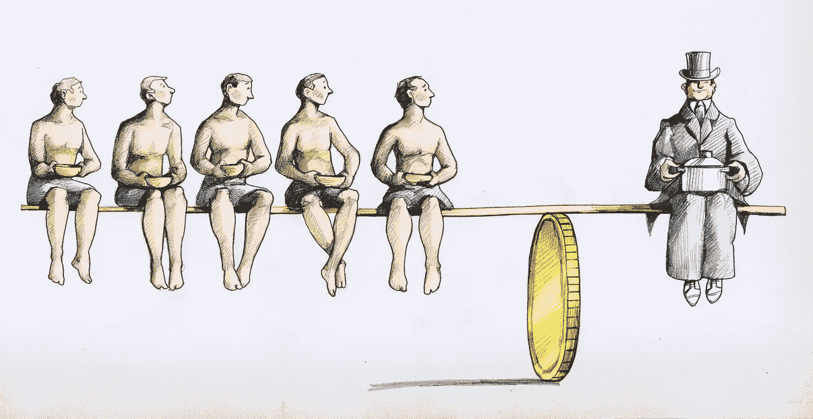

# 如何挑战企业，并取得胜利。

> 原文：<https://medium.datadriveninvestor.com/taking-on-the-corporations-and-winning-4ddb576aff50?source=collection_archive---------2----------------------->

© [nuvolanevicata](https://stock.adobe.com/uk/contributor/202434054/nuvolanevicata?load_type=author&prev_url=detail) / Adobe Stock

# 对比特币的大规模投资并没有改变世界，但它显示了千禧一代通过技术团结起来时的分散力量。

密码狂热可能在圣诞节前后达到顶峰，市值达到 7500 亿美元，但仍有数量惊人的资金滞留在这一实验性资产类别中。虽然更多的传统运营商现在已经开始采用加密技术，但很大一部分资金来自年轻、精通技术的个人:T2 千禧一代。尽管你喜欢加密货币，但它们至少在一个方面取得了巨大成功:它们能够吸引金融市场通常不存在的参与者的投资。

有一种加密技术的投资超过了其他任何技术，那就是加密世界的老爷爷:比特币。由于围绕 2017 年疯狂价格增长的狂热 [FOMO](https://www.urbandictionary.com/define.php?term=fomo) ，许多人进入了比特币。我就是这些人中的一员，我赚了点小钱(不在[蓝宝的地盘](https://www.cnbc.com/2018/02/07/bitcoin-millionaires-are-buying-lamborghinis-with-cryptocurrency.html)，唉)。

然而，比特币投资者中存在一个中坚力量，通常被称为[霍德勒](https://en.wikipedia.org/wiki/Hodl)，他们的目标是保持投资，无论价格波动如何剧烈。许多霍德勒夫妇的动机不仅仅是单纯的经济利益。他们说“比特币将改变世界”，但这种想法从何而来？

社交媒体、开源和点对点技术的出现强烈地塑造了数字技术的创造者和使用者的思维。作为最大的用户，千禧一代受到的影响尤其大。这一代人不太相信传统政治是解决他们问题的手段。事实上，他们中的许多人认为他们改变世界的唯一方式就是彻底颠覆传统体制。他们将利用技术来创造他们自己的平行的、分散的权力形式。

比特币感觉像是“占领华尔街”运动虚构出来的。尽管比特币出现的时间略早于占领运动，但它们都是对 2008 年金融危机的反应，都与千禧年看待世界的方式完美契合。“占领”抗议活动的决策是由直接民主制做出的，这是一种没有等级制度的分散式投票制度。类似地，加密货币背后的分布式分类账消除了中央机构仲裁网络成员之间交易的需要。

分布式控制的思想根深蒂固；它甚至影响了千禧一代消费真理的方式。在社交媒体上，所有的观点都是有效的和有价值的(无论是积极的还是消极的)。真理没有单一的来源。由网络的用户来决定哪些新闻是假新闻。

每一代人都有抗议运动。通常，抗议运动动员起来改变政治制度。但许多千禧一代觉得传统的政治渠道不再有效，他们无论怎么喊都不会有人听。他们感觉到了这一点，但并没有被吓住，因为他们拥有前几代人只能梦想的武器:通过社交媒体远程和几乎即时地组织大量人员的能力。

对这一代人来说，比特币的崛起提供了一个独特的机会。比特币将把社会带入一个新时代，而央行没有权力通过印钱来膨胀他们辛苦赚来的现金的价值。它可以让你在任何时候，以一种完全不受限制的方式，和你想交往的人交往。比特币的用户将会控制它的命运。至少这是我的想法。

实际发生的情况是，数百万人购买了只能以非常有限的方式消费的数字代币(大多数情况下根本不能用于其他密码)。不仅如此，矿商和早期采用者等有影响力的各方几乎已经变得像法定货币的央行，这就是他们勾结时的力量。他们有能力(至少尝试)通过所谓的“[叉](https://en.wikipedia.org/wiki/Fork_(blockchain))”来迫使货币发生变化。有时这些叉子是“硬”的，有时是“软”的，尽管软叉子听起来毫无用处，但在密码世界里，它们通常比更硬的叉子更受青睐。

How would you like your fork — hard or soft?

现在，作为 cryptos 基础的被称为“区块链”的技术可能会成为一项重要的技术。但没有理由认为它的主要用途将是承保一种无政府的数字货币。事实上，密码狂热者喜欢憎恨的寡头政治——想想[大石油](https://uk.reuters.com/article/us-energy-blockchain/bp-shell-lead-plan-for-blockchain-based-energy-trading-platform-idUKKBN1D612I)和[大银行](https://www.barclayscorporate.com/insight-and-research/technology-and-digital-innovation/what-does-blockchain-do.html)——已经开始部署它了。许多其他大公司也在这么做。甚至政府也开始参与进来。

比特币只是一种货币(或一种商品——取决于你问的是谁)，而且已经有很多好的货币了。很难想象仅凭一种货币就能摧毁旧的权力等级制度，为数字乌托邦铺平道路。

与比特币不同，许多其他加密货币确实有一个[基础商业模式](https://www.investopedia.com/tech/most-successful-icos-all-time/)。其中一些可能最终会导致成功的公司，但它们不太可能在五年甚至十年后成为世界上最强大的公司。互联网泡沫已过去近 20 年，即便是亚马逊(Amazon)等 2000 年至 2001 年崩盘中最成功的幸存者，也不是全能的——他们销售的产品仍依赖于石油、矿业、农业和金融领域的传统企业。

我们的经济是由多种力量推动的，而不仅仅是科技公司。在公共证券交易所上市的大型传统企业对全球经济有着强大的影响力。通过他们的行动，他们决定了我们消费的产品来自哪里，由什么制成，如何生产。

例如，他们决定是继续挖掘脏煤还是投资清洁技术。他们决定是从砍伐殆尽的雨林还是从可持续发展的种植园购买木制品。他们决定是根据不稳定的合同向员工支付最低工资，还是通过培训计划和利润分享对员工进行投资。如果千禧一代真的想改变世界，他们必须从企业开始。

近年来，低成本指数基金和交易所交易基金(ETF)已经成功地将一个全新的私人投资者阶层带入市场，其中包括许多千禧一代。理论上，拥有股票会让你对公司的运营产生影响。但是，尽管这些私人投资者分享了他们所拥有的公司的利润，他们目前却被剥夺了对公司事务的投票权。之所以会出现这种情况，是因为指数基金和 ETF 提供商对客户持有的股票拥有代理投票权。

指数基金和交易所交易基金的成功将股票投票权大量集中在参与者手中，如管理着 [5.1 万亿资产的【AUM】](https://about.vanguard.com/who-we-are/fast-facts/)和管理着[6.28 万亿美元资产的【AUM】贝莱德](https://www.blackrock.com/au/individual/about-blackrock)。这些组织关起门来决定如何利用客户的代理投票来影响他们所投资的公司(通常，他们的投票记录可以在他们的网站上找到，例如 [Vanguard here](https://about.vanguard.com/investment-stewardship/how-our-funds-voted/) )。

贝莱德和他的朋友们在上面这样的广告上花了很多钱，让你认为他们是混乱世界中的稳定力量。不管他们的意图是什么，这些资产管理公司的行为就像一党制国家，中央权力机构发号施令，但不对民众负责。

我之前曾呼吁建立一个[投资合作社](https://medium.com/@DavidWatsonBlog/cooperative-investing-trade-unions-for-the-neoliberal-era-1aed46679c1)与低成本指数基金和交易所交易基金在价格上竞争，但以民主方式运作，以应对社会和环境问题。或者，由区块链和智能合约支持的技术能提供解决方案吗？

不难想象，在这样一个世界里，股票通过分布式分类账进行交易，私人投资者可能会主动选择将代理投票权授予谁，从而创建一个与政府平行的政治体系，在这个体系中，秘密政客会争取你的选票。

当然，一个人拥有的股份数量将决定其影响力的大小。然而，与目前只有最有经验(也是最富有)的投资者才能参与的制度相比，分布式股票投票权将让更多的投资者发挥影响力。

有一点是肯定的:如果有人要给全球企业带来民主，那将是精通技术的千禧一代。这群理想主义投资者已经向比特币和其他加密货币投入了数十亿美元。如果动员起来对抗这些公司，它们的影响将是深远的。

占领运动和阿拉伯之春等分散抗议运动的失败提供了重要的教训。使用技术来组织只能是第一步；重要的是你接下来要做什么。有意创造独立于当前权力等级的运动甚至货币可能会弄巧成拙。为了实现真正的改变，新的想法和技术必须与现有的东西相结合。要实现真正的改变，所有成功的社会运动最终都必须成为政治运动。

如果你想控制局面，你必须掌握权力。如果你愿意的话，加密货币已经创造了它们自己的非常有趣的一套缰绳。但是，这些缰绳并没有真正依附于任何东西，与此同时，我们经济的动物，全球资本主义的动物，正在奔向夕阳。

2018 大卫·沃森版权所有