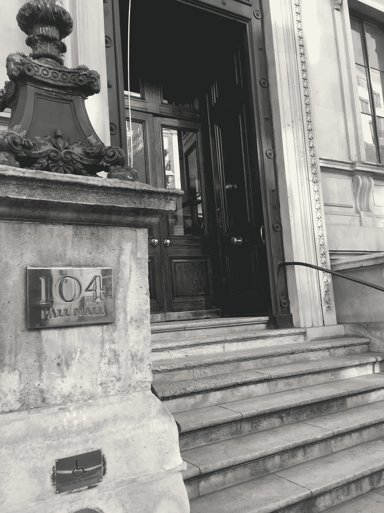
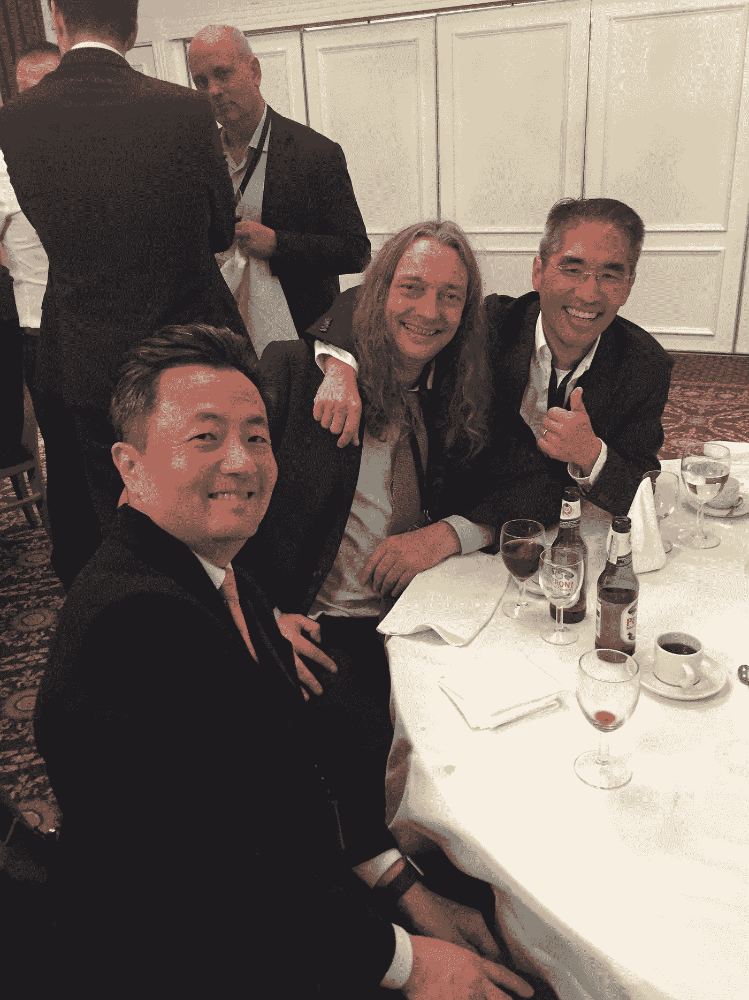

# 来自世界首届 Stablecoin 会议和贸易展的故事

> 原文：<https://medium.datadriveninvestor.com/tales-from-the-worlds-first-stablecoin-conference-tradeshow-fe4d81b7fb96?source=collection_archive---------26----------------------->

我仍然对这场稳定的旋风感到有些疲惫。这场旋风叫做:合作实现大规模采用。对于 Xank 团队来说，这是一个相当忙碌的日程，但我们很高兴参加有史以来第一次 stablecoins 会议。什么时候你可以说你参加了一个主题的第一次会议？这是我从这次活动中总结出的 5 个要点。

1.  监管已经开始实施。我们是主动还是被动？人们普遍认为应该成立一个自律组织(SRO ),为稳定的硬币使用者提供更多的保护。有价值的风险披露可以是现有监管机构发布的标准化招股说明书。这可以在不同的管辖区之间产生一致性，并降低合规成本和最终用户的易用性。
2.  泰瑟真的不想露面。考虑到 Tether 正在迅速失去市场份额，而且 T2 在维持其联系汇率方面存在问题，你可能会认为他们会欢迎任何机会来讲述他们的故事。他们拒绝参加会议，也没有出席两次预定的采访。
3.  做市商和交易所比我想象的更有趣。这对我来说是一个惊喜。我可以从交易者、稳定的硬币发行者、风险投资者等角度解读。但我很少从交易所和做市商那里读到任何个人的东西。听到他们的故事帮助我理解了他们对加密生态系统的重要性。顺便提一下，Mitchell Dong 的观察是，Tether 的交易价格低至 1 美元兑 0.88 美元。
4.  密码 4 年相当于其他行业 40 年。我见到了比约恩·艾尔索斯，他是[比特贝](https://bitbay.market)的运营经理，并与他共进晚餐。BitBay 成立于 2014 年，是现存最古老的 stablecoins 之一。我喜欢比特贝的理想主义和社区组织。尽管就市值而言，他们只是一个小稳定股，但他们为我们其他人铺平了道路，值得大声疾呼。
5.  用例，用例，用例。这是我不断从投资者小组听到的信息。这对我帮助很大。像许多其他创始人一样，我会立即谈论我们的产品，而不是它解决了什么问题。因为 Xank 拥有其他 stablecoins 没有的用例，所以我们需要将营销重点放在这一领域。

发生了更多的事情，但是睡了两个小时(我还在倒时差)，我们现在就离开这个话题。请欣赏下面的图片！

Entrance to our beautiful venue, The Reform Club in London

Dinner and drinks with Ryan Kim (Xank), Bjorn Alsos (BitBay) and author Sung Kim