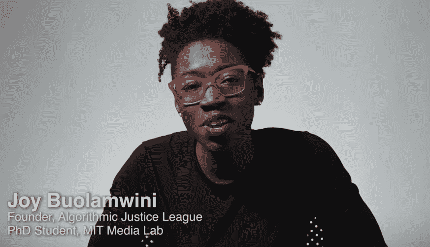
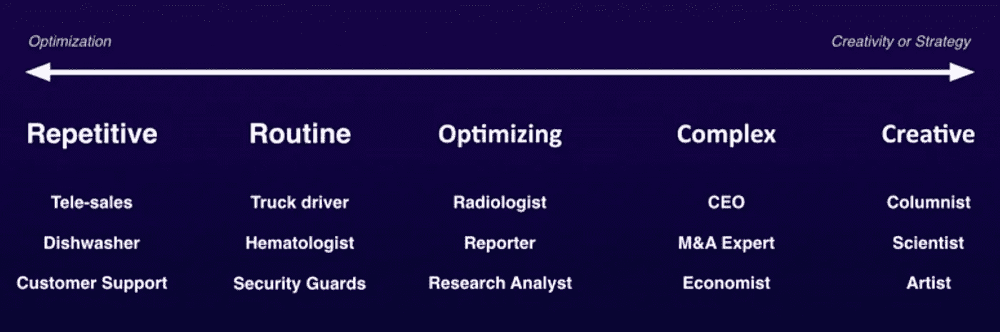
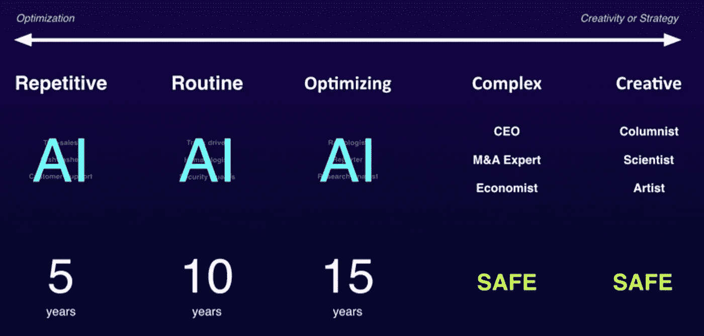

# 驯服 AI:我们每个人都应该思考的一件事

> 原文：<https://medium.datadriveninvestor.com/taming-ai-exercising-judgement-on-when-to-automate-vs-augment-60f70b7a2ff9?source=collection_archive---------13----------------------->

Photo Credit: Comfreak

承认吧…你曾经疑惑过。

还能比这更糟吗？

你输入了你的 16 位账号，自动系统第二次告诉你有一个错误。

然后它强迫你听，因为它重复所有的数字，并提示你重新输入一遍。

你不禁会想…

有人认为这是一个自动化的好主意。太好了！但是，为什么体验感觉不完整？

你在想…

人工智能应该会让我的生活更轻松。然而，有时感觉我是那个竭尽全力让它运转的人？

自动化有时会带来令人沮丧的影响。尤其是当人工智能和机器学习被注入到我们生活的更多领域时。这包括令人沮丧的与自动电话系统的交互。

但事实是实际上有更好的方法。而且，首先要弄清楚如何以及在哪里将自动化与人性化结合起来——增强。这就是你驯服 AI 的方法。

 [## 挑战你对人工智能和社会的看法的 4 本书——数据驱动的投资者

### 深度学习、像人类一样思考的机器人、人工智能、神经网络——这些技术引发了…

www.datadriveninvestor.com](https://www.datadriveninvestor.com/2019/02/28/4-books-on-ai/) 

# 当人工智能被释放

那天是 3 月 3 日，汤米正准备接受判决。他的罪行？持有毒品并有暴力拒捕的前科。

风险评估预测算法给他打了 10 分。这个分数反映了汤米未来犯罪的可能性。

在 1 -10 的范围内，这意味着几乎可以肯定他会。因此，他不会轻易逃脱。释放他的条件也不会手软。

该算法会建议在标准刑期上增加 3 个月监禁。

毕竟，这符合社会的最大利益。控制那些最有可能犯罪的人。但是，结果如何呢？

另一方面，肖恩被标记为 3 级风险，因此更容易逃脱。这也是一起有盗窃前科的藏毒案。

由于风险评分较低，该算法建议社区服务工作遵循标准句子。算法再次挽救了局面。

这似乎都很好，除了。

两年后，被认为风险较小的肖恩继续犯罪。从那以后又来了三次。而风险得分较高的汤米却没有。

肯定有什么不对劲。

# 现状核实

这种对个人犯罪的负面偏见的想法可能感觉很熟悉。这是因为这是 2002 年电影《T2》中的情节。

在这部电影中，个人被指控犯有他们没有犯下的罪行，仅仅是因为犯下这种罪行的可能性。但是，这不会发生在现实生活中，对不对？

之前汤米和肖恩的故事只是部分虚构。

量刑建议并不真实，但它们感觉像 ProPublica 在 2016 年 5 月报道的一些现实生活经历中合乎逻辑的下一步。

这篇文章报道了[在刑事判决中用于风险评估的软件中的机器偏差](https://www.propublica.org/article/machine-bias-risk-assessments-in-criminal-sentencing)。

> 全国各地都有预测未来罪犯的软件——ProPublica

不管是好是坏，这只是人工智能和机器学习如何被用来推动决策的一个例子。

拥有一种算法有着巨大的价值，它可以将历史和实时数据点考虑在内，同时考虑到大脑或眼睛不明显的细微信号。

然而，**我们如何在人工智能增强决策制定和自动化此类决策之间划清界限，这是一个深刻的问题**(特别是在预测分析的情况下)。

在未来的某个领域，人们会因为某种算法认为他们没有犯下的罪行而被追究责任吗？

ProPublica 的文章证明，如果这种情况继续下去，我们可能会走向那里。

# 权衡，价格——代价是什么？

> 预测分析将对谁被雇佣、谁被批准贷款或谁看到广告产生影响

点击一个广告所涉及的风险远低于服更长的刑期，所以也许这就是我们的底线。

**如果犯错的后果很严重，我们会选择用人工智能来增强我们的决策。否则，我们将自动执行此类决策。**

在统计学中，我们使用一种叫做 [F1-score](https://en.wikipedia.org/wiki/F1_score) 的东西来管理这一点。

F1-score 为您提供了一种方法，不仅可以测量算法正确猜测结果的次数，还可以测量正面结果被错误分类为负面结果的次数。

根据您的使用情况，后一种情况真的很重要。将重要的电子邮件误归类为垃圾邮件是不好的，但当这种情况发生时，没有人会受到伤害。

而不是把一个无辜的人误认为有罪。犯错是一件大事。代价是高昂的，所以也许这可以作为护栏。

然而，由于人类对算法能力的过度自信，存在着线路移动超出预期的风险。

# 谜题的关键部分

Photo Credit: [PIRO4D](https://pixabay.com/users/PIRO4D-2707530/)

使人工智能在许多情况下有效的正是它的局限性。它天生缺乏同理心，这使得它缺乏一些有用的偏见。

我所说的有用的偏见指的是，由于人工智能中不存在的同理心，人类可以运用的判断力。

想想杂货店的自动结账(自助结账)。当你没有足够快地将杂货装袋时，它会发出哔哔声。没有同理心。

这可以说是一个 UX 问题。非常正确。因此，也许人工智能需要的 UX 层需要为人类接触腾出空间。

然而，成本节约和效率是这些自动化决策的关键驱动因素。代价是什么？

大多数情况下，自动化人工智能都缺少这种人情味。而且，它可能会在真正重要的时候丢失。

在神经网络的[反向传播](https://en.wikipedia.org/wiki/Backpropagation)中涉及的那些冷计算是为了优化给定的用例，而没有考虑更大的人类经验。

我们必须记住，一个算法的结果将建立在现有数据的基础上，除非我们能够将整个人类经验整理成文，否则差距将会存在。

一些独特的东西使我们成为人类，这不能简单地印入算法中。即使它很接近，我们也面临着一个问题— **对于这种情况，我们应该使用算法来自动化人工任务还是通过与 AI** 配对来增强人工任务？

# 拿块尿布，拿瓶啤酒

人工智能算法，例如那些与机器学习和深度学习一起使用的算法，真的很擅长显示多个事物之间的相互关系。这个术语叫做*相关性*。

然而，你知道一句老生常谈的话——“相关性并不意味着因果关系”。

而且，你可能听说过一个现在很有名的故事，一个分析顾问为中西部的零售商做一些研究，目的是发现通常一起购买的物品。

这是基于一种假设，即如果你把这些东西放在一起，你就能提高销量。

他们发现购买啤酒与购买尿布有关联。

有趣的见解。谁能想到呢？

自动搜索算法可以很容易地将这些项目放在一起。但是，这有意义吗？

新生儿的父母在凌晨 2 点去商店补充尿布可能只是需要啤酒。但是，你不能假设买啤酒的人也在找尿布。

就零售商而言，这些信息有助于加强决策。这不是冷冰冰的数学，人情味很重要。

# 划定屈服控制的界限

李开复在他关于人工智能如何拯救人类的 Ted 演讲中，预测了在不久的将来人工智能可能会带来革命性的变化。

Kai-Fu Lee — [How AI Can Save Humanity](https://www.ted.com/talks/kai_fu_lee_how_ai_can_save_our_humanity#t-843054) (TedTalk)

根据他的说法，**任务重复、例行或需要优化的领域将被自动化**。

然而，他谨慎地指出，复杂性和创造性至关重要的领域将是安全的。有些人可能会有不同的看法。

Kai-Fu Lee — [How AI Can Save Humanity](https://www.ted.com/talks/kai_fu_lee_how_ai_can_save_our_humanity#t-843054) (TedTalk)

没有人确切知道这些领域中的一些多久会自动化，自动化程度会有多高。

然而，作为实践者或影响者，这个问题又出现了。

人工智能应该完全自动完成这项任务，还是仅仅用来增强人类对这项任务的参与？

我们如何应对这种情况会带来真正的后果。只要回想一下前面描述的刑事量刑故事。

# 前方的道路

Photo Credits: [Yuting Gao](https://www.pexels.com/@leofallflat)

> 数据和收集数据的人有着相同的议程——**克莱顿·M·克里斯坦森**

人工智能依靠它可以获得的数据生存。那是它的燃料，是它的命脉。

有意或无意地，偏见存在于收集的数据和分析数据的方式中。当我们利用人工智能的好处时，我们需要认识到这一点。

在人工智能驱动的未来，谁拥有最多的数据，谁就拥有垄断和控制权。赢家通吃。那又怎样？

你可以是旁观者，也可以是参与者。

这里提出的思想进入了人工智能伦理学的领域。

如今，围绕这一点的大多数对话都集中在人工智能的影响上，因为它涉及到对工人进行再培训的需求、减少工作时间或收入再分配的可能性。

所有这一切的基础是，我们应该向人工智能让步多少、在哪里让步以及让步什么。

作为一名人工智能从业者，我喜欢它给生活带来的便利和好处。我热衷于将人们、社区、他们所有的数据和设备连接起来。

然而，对于如何以及在哪里应用人工智能，我越来越有责任感。

有些任务的最佳途径是完全自动化。在其他情况下，正确的途径是为领域专家提供长期的直觉和移情工具，以帮助探索边缘。

你不应该满足于坐在场边，简单地让 AI 发生在你身上。

训练你的思维去挑战自动化的人工智能体验。提问— **人工智能增强在这种情况下会更合适吗？它实际上会是什么样子？**

这种自动化的体验可以通过人性化的方式更上一层楼吗？

可能性是无限的。

而且，你现在有了一个思维框架来帮助你更好地驯服 AI。