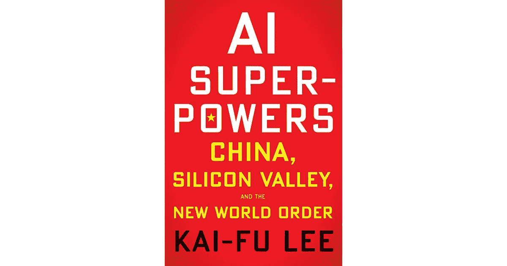

# Taps 笔记:人工智能超能力

> 原文：<https://medium.datadriveninvestor.com/taps-notes-ai-superpowers-962e667ce9f3?source=collection_archive---------8----------------------->

我读了李开复的《人工智能的超能力:中国、硅谷和新的世界秩序》，并作为我正在进行的《T2》系列评论的一部分进行了评论。

**快速回顾:**李开复博士的这本书[触及了我一段时间以来一直在阅读的许多主题:人工智能、中国经济和技术的崛起以及美国和中国创业环境的异同。考虑到他的背景，李博士当然精通这些主题，他在卡内基梅隆大学的博士论文中开发了世界上第一个与说话人无关的连续语音识别系统，然后在那里他成为了苹果、SGI、微软的高管，然后领导了谷歌在中国的工作。除了其他事情，他现在还经营着一家投资于美国和中国市场的风险投资公司 Sinovation Ventures。总的来说，我认为这本书是一本信息量很大的读物(尽管他对中国市场的赞美有时有点自私和过分热情)。在讨论中国市场时，李博士热情洋溢地描述了中国创业公司现在的时机，有大量的机会，勤奋的创始人和无与伦比的人才库可供利用。他出色地阐释了硅谷(广泛用于描述美国科技场景)和中国科技场景之间的一些关键差异。他进一步提出了一个合理的令人信服的论点，即在人工智能时代，由于他们的技术场景在过去 20 年中的发展方式，中国有着巨大的优势。最后，他对人工智能的未来及其对社会的影响，特别是对劳动力市场的影响——人类在护理和“同情”驱动的领域中扮演更多角色——的看法与其他人相似，并产生了共鸣。总的来说，这本书是任何关注地缘政治和技术的交集以及对其潜在影响的人的好读物。](https://en.wikipedia.org/wiki/Kai-Fu_Lee)

# ***本书亮点:***

我的风险投资基金总部位于北京的中关村(读作“jong-gwan-soon”)社区，这个地区通常被称为“中国的硅谷”今天，中关村是中国人工智能运动的心脏。对这里的人来说，AlphaGo 的胜利既是挑战也是激励。它们变成了中国人工智能的“人造卫星时刻”。

在 20 世纪 50 年代和 60 年代，早期版本的人工神经网络产生了有希望的结果和大量的宣传。但在 1969 年，来自基于规则的阵营的研究人员进行了反击，说服了该领域的许多人，神经网络是不可靠的，其用途有限。神经网络方法很快就过时了，人工智能在 20 世纪 70 年代陷入了第一个“冬天”。

*神经网络需要大量的两样东西:计算能力和数据。数据通过给程序许多例子来“训练”程序识别模式，计算能力让程序高速解析这些例子。*

*但多年来对神经网络方法根深蒂固的偏见导致许多人工智能研究人员忽视了这个声称取得杰出成果的“边缘”群体。转折点出现在 2012 年，当时 Hinton 团队构建的一个神经网络在一次国际计算机视觉大赛中击败了对手。*

有时候你只需要证明这一点就能让所有人闭嘴。

*从根本上说，这些算法使用来自特定领域的大量数据来做出决策，从而优化预期结果。它通过训练自己来识别将许多数据点与预期结果联系起来的深层模式和相关性。当数据被标上期望的结果——“有猫”对“没有猫”时，这种发现模式的过程就更容易了；“点击了”对“没点击”；"赢了的游戏"对"输了的游戏"*

*做这件事需要海量的相关数据，强大的算法，狭窄的领域，具体的目标。如果你缺少其中任何一个，事情就会变得一团糟。数据太少？该算法没有足够的例子来揭示有意义的相关性。目标太宽泛？该算法缺乏明确的优化基准。深度学习就是所谓的“狭义人工智能”——从一个特定领域获取数据，并将其应用于优化一个特定结果的智能。虽然令人印象深刻，但它与“通用人工智能”仍有很大差距，“通用人工智能”是一种通用技术，可以做人类能做的一切。*

*西方可能已经点燃了深度学习之火，但中国将是人工智能之火产生的热度的最大受益者。这一全球性转变是两个转变的产物:从发现时代到实施时代，以及从专业知识时代到数据时代。*

*这些新的里程碑中有许多仅仅是过去十年突破的应用——主要是深度学习，但也有强化学习和转移学习等补充技术——来解决新问题。这些研究人员正在做的事情需要高超的技能和深厚的知识:调整复杂数学算法的能力，处理大量数据的能力，使神经网络适应不同问题的能力。*

今天，成功的人工智能算法需要三样东西:大数据、计算能力和强大(但不一定是精英)的人工智能算法工程师的工作。

*…一旦计算能力和工程天赋达到一定的阈值，数据的数量就成为决定算法整体能力和准确性的决定性因素。*

*今天利用人工智能的力量——二十一世纪的“电力”——需要四个类似的投入:丰富的数据、饥渴的企业家、人工智能科学家和人工智能友好的政策环境。*

*…中国最大的弱点之一(研究问题的创新方法)*

中国成功的互联网企业家是通过征服这个星球上最残酷的竞争环境而获得成功的。他们生活在一个速度至关重要的世界，复制是一种公认的做法，竞争对手会不择手段赢得新的市场。在中国创业现场度过的每一天都是火的考验，就像在竞技场里当角斗士度过的一天。战斗是生死攸关的，你的对手毫无顾忌。

*这个无与伦比的真实世界数据宝库将在开发人工智能驱动的服务方面为中国公司提供重要支持。*

最近这些强有力的发展自然使力量的天平向中国倾斜。但除了这种自然的再平衡，中国政府也在竭尽全力扭转局面。中国政府成为人工智能超级大国的全面计划承诺为人工智能研究提供广泛的支持和资金，但最重要的是，它成为全国各地地方政府效仿的灯塔。

*普华永道估计，到 2030 年，人工智能的部署将为全球 GDP 增加 15.7 万亿美元。预计中国将获得其中的 7 万亿美元，几乎是北美 3.7 万亿美元收益的两倍。随着经济实力的平衡向有利于中国的方向倾斜，政治影响力和“软实力”，即该国在全球的文化和意识形态足迹也将向有利于中国的方向倾斜。*

人工智能世界秩序将把赢家通吃的经济学与中国和美国少数公司手中前所未有的财富集中结合起来。我认为，这是人工智能带来的真正潜在威胁:大范围失业和不平等性加剧导致的巨大社会混乱和政治崩溃。

几个世纪以来，人类通过工作来充实他们的日子:用他们的时间和汗水来换取住所和食物。我们已经围绕这种交流建立了根深蒂固的文化价值观，我们中的许多人已经习惯于从日常工作中获得自我价值感。人工智能的崛起将挑战这些价值观，并有可能在极短的时间内削弱这种生活目的感。

但正是第二个阶段——中国初创公司从美国商业模式中获得灵感，然后激烈竞争，专门针对中国用户调整和优化这种模式——让王兴成为了世界级的企业家。

*中国团购市场的皇家之战是中国互联网生态系统变成的一个缩影:一个竞技场，数百名模仿者在那里拼死搏斗。在混乱和流血事件中，外国先行者往往被证明是无关紧要的。是国内的争斗者相互推动，让对方变得更快、更灵活、更精干、更吝啬。他们积极抄袭对方的产品创新，将价格降到最低，发起诽谤运动，强行卸载竞争软件，甚至向警方举报竞争对手的首席执行官。对于这些角斗士来说，没有肮脏的把戏或卑鄙的手段是不被允许的。他们部署的策略会让优步创始人特拉维斯·卡兰尼克脸红。他们还展示了一种狂热的 24 小时工作伦理，这种伦理会让谷歌员工跑到他们的小睡舱。*

*这是一个丰富的环境，有助于崇高的思考，有助于设想抽象问题的优雅的技术解决方案。*

与之形成鲜明对比的是，中国的创业文化是硅谷的阴和阳:中国公司首先是市场驱动的，而不是使命驱动的。他们的最终目标是赚钱，他们愿意创造任何产品，采用任何模式，或者进入任何能够实现这一目标的行业。

苏格拉底鼓励他的学生通过质疑一切来寻求真理，而中国古代哲学家则建议人们遵循古代圣贤的礼仪。对完美的严格复制被视为达到真正精通的途径。

将这三种趋势结合起来——对复制的文化接受、稀缺心态以及投身于任何有前途的新行业的意愿——你就拥有了中国互联网生态系统的心理学基础。

*美国公司对待中国就像对待任何其他市场一样，来核对他们的全球清单。他们没有投入资源，没有耐心，或者给他们的中国团队与中国世界级企业家竞争所需的灵活性。他们认为在中国的主要工作是向中国用户推销他们现有的产品。实际上，他们需要投入实际工作，为中国用户量身定制产品，或者从头开始开发新产品，以满足市场需求。对本地化的抵制减缓了产品迭代，并使本地团队感觉像笨重机器中的齿轮。*

王兴身上体现的征服哲学可以追溯到 14 世纪的明太祖朱元璋。朱元璋是起义军的领袖，他打败了几十个军阀，建立了明朝:“筑高墙，积粮食，韬光养晦。”对王兴来说，风险投资是他的粮食，优质产品是他的墙壁，十亿美元的市场将是他的宝座。

*在这一转变的背后，有几个关键的基石:移动优先的互联网用户，微信作为国家超级应用的角色，以及将每部智能手机转变为数字钱包的移动支付。*

*中国公司没有这种奢侈。在准备对其数字产品进行逆向工程的竞争对手的包围下，他们必须利用其规模、支出和繁重工作的效率作为差异化因素。他们疯狂烧钱，并依赖大批低薪送货工人来实现他们的商业模式。这是中国另类互联网世界的一个典型特征，让固守硅谷正统观念的美国分析人士摸不着头脑。*

这款应用可以让你在发送信息的同时发送照片和简短的录音。考虑到当时在手机上输入汉字是多么麻烦，后者是一个很大的好处。

*短语——“大众创业、大众创新”——*

大量的流动劳工愿意为他们提供上门服务，只需支付很少的费用。是为 O2O 搭建的环境。

虽然 Airbnb 在很大程度上仍然是一个为你的房屋上市的轻量级平台，但该公司的中国竞争对手途家本身管理着大量的租赁物业。对于中国的主人，途家主动提出承担大部分繁重的工作:每次拜访后打扫房间，给房间储备物品，安装智能锁。

*这种加大投入的意愿——花钱、管理劳动力、跑腿和建立规模经济——已经重塑了数字经济和现实经济之间的关系。中国的互联网正在更深入地渗透到普通人的经济生活中，并影响着消费趋势和劳动力市场。*

现任者的实力可以部分解释这种巨大的差距。美国人已经从信用卡和借记卡的便利中受益(并为此付费)——这是 20 世纪 60 年代的尖端金融技术。移动支付是对银行卡的一种改进，但不如直接从现金转移支付的改进显著。随着中国向移动互联网的快速转型，该国在现有技术(台式电脑、固定电话和信用卡)方面的弱点变成了让其跃进新范式的优势。

在中国打车应用的早期，乘客可以通过应用程序预订，但通常是用现金支付。中国主要平台上的很大一部分汽车是由老年人驾驶的传统出租车——这些人不急于放弃旧的现金。因此，如果骑手和司机使用微信钱包支付，腾讯会向他们提供补贴。骑手付的少，司机收的多，腾讯给双方补差价。由于合法乘车和旨在榨取补贴的欺诈性乘车，促销成本极高，但腾讯坚持了下来。这个决定得到了回报。这种推广建立了用户习惯，并吸引了出租车司机，他们是城市消费经济的关键节点。相比之下，Apple Pay 和谷歌钱包在这一领域表现平平。从理论上讲，它们为用户提供了更大的便利，但它们并不愿意贿赂用户自己去发现这种方法。美国科技巨头的不情愿是可以理解的:补贴侵蚀了季度收入，而硅谷的创新纯粹主义者通常不赞成“购买用户”的尝试。但美国人不愿意变重，这减缓了移动支付的采用，并将在数据驱动的人工智能世界中对这些公司造成更大伤害。

*就像成为化石燃料推动工业革命的长期埋藏的有机物一样，中国替代互联网宇宙中丰富的现实世界互动正在创造海量数据，这些数据将推动其人工智能革命。*

*正如我前面所说，为二十一世纪创造一个人工智能超级大国需要四个主要组成部分:丰富的数据、顽强的企业家、训练有素的人工智能科学家和支持性的政策环境。*

在政府支持的关键领域，中国的技术功利主义政治文化将为更快部署改变游戏规则的技术铺平道路。

*研究人员基于这些记录竞争——而不是基于新产品或收入数字——当一个人创造了新的记录时，他或她希望自己的成就得到认可和认可。但是鉴于进步的速度很快，许多研究人员担心，如果他们等待在杂志上发表，他们的记录已经黯然失色，他们在前沿的时刻将被记录在案。因此，他们没有坐以待毙，而是选择在 www.arxiv.org 这样的网站上即时发表，这是一个在线科学论文库。*

完整的人工智能革命需要一点时间，最终将在一系列四波浪潮中席卷我们:互联网人工智能、商业人工智能、感知人工智能和自主人工智能。

互联网人工智能在很大程度上是使用人工智能算法作为推荐引擎:这些系统学习我们的个人偏好，然后为我们提供精心挑选的内容。

请记住，仅中国的互联网用户就超过了美国和整个欧洲的总和，这些用户可以向内容创作者、O2O 平台和其他用户进行无摩擦的移动支付。这种结合正在产生创造性的互联网人工智能应用和货币化机会，这在世界上任何其他地方都是无与伦比的。再加上中国坚韧不拔、资金雄厚的企业家，中国相对于硅谷有着强大的优势，但还不是决定性的。

*像这样的优化在拥有大量有意义业务成果的结构化数据的行业中效果很好。在这种情况下，“结构化”指的是已经分类、标记并可搜索的数据。结构良好的企业数据集的主要例子包括历史股票价格、信用卡使用和抵押贷款违约。*

*我把这些新的混合环境称为 OMO:在线-合并-离线。OMO 是已经将我们从纯粹的电子商务交付带到 O2O(线上到线下)服务的进化的下一步。这些步骤中的每一步都在网络世界和现实世界之间搭建了新的桥梁，但 OMO 是两者的完全整合。它把线上世界的便捷带到了线下，又把线下世界丰富的感官现实带到了线上。未来几年，感知人工智能将把购物中心、杂货店、城市街道和我们的家变成 OMO 环境。*

那种类型的数据收集可能会让许多美国人反感。他们不想让老大哥或美国公司知道太多他们在做什么。但是中国人更容易接受他们的面孔、声音和购物选择被捕捉和数字化。这是中国人愿意用一定程度的隐私换取便利的又一个例子。

中国人的心态是不能让完美成为优秀的敌人。

*越来越多的数据产生的正反馈循环意味着人工智能驱动的行业自然倾向于垄断，同时压低价格，消除公司之间的竞争。*

汉斯·莫拉维克是我在卡耐基梅隆大学的一名教授，他在人工智能和机器人方面的工作让他认识到了将两者结合起来的一个基本事实:与流行的假设相反，人工智能模仿成年人的高级智力或计算能力相对容易，但赋予机器人幼儿的感知和感觉运动技能要困难得多。在根据数据进行预测时，算法可以让人类大吃一惊，但机器人仍然无法履行酒店服务员的清洁职责。本质上，AI 很擅长思考，但机器人不擅长动手指。

生产率和工资的“大脱钩”已经在 1%和 99%之间造成了裂痕。我担心，如果任其自生自灭，人工智能将会撕开这道口子。

*最难自动化的工作——那些位于“安全区”右上角的工作——包括收入范围的两端:首席执行官和医疗助理、风险资本家和按摩师。*

*在社交场合，当被要求介绍自己或他人时，我们通常会首先提到工作。它填满了我们的生活，提供了一种常规感和人际关系的来源。一份固定的薪水不仅是奖励劳动的一种方式，也是向人们表明一个人是社会中有价值的一员，是一个共同项目的贡献者。*

迄今为止，中国的科技精英很少谈到人工智能对就业可能产生的负面影响。就我个人而言，我不认为这种沉默是因为任何对大众隐瞒黑暗真相的愿望——我认为他们真的认为人工智能进步对就业的影响没有什么可害怕的。从这个意义上说，中国的科技精英与技术乐观主义的美国经济学家是一致的，后者认为从长远来看，技术总能为所有人带来更多的就业和更大的繁荣。

硅谷提出的许多人工智能导致的失业的技术解决方案分为三类:重新培训工人，减少工作时间，或重新分配收入。

*新职业，我称之为“富有同情心的看护者”这些医疗专业人员将护士、医疗技术人员、社会工作者甚至心理学家的技能结合在一起。*

使我们成为人类的东西将是最难替代的。

*注重与客户多沟通，让他们感受到关怀。*

作为一名风险投资者，我认为一种新的影响力投资有着特别重要的作用。我预见到一个风险生态系统的出现，它认为创造人性化的服务行业的就业机会本身就是一件好事。它将引导资金进入以人为本的服务项目，这些项目可以扩大规模并雇佣大量人员:产后护理的哺乳顾问、训练有素的青年体育教练、家庭口述历史的收集者、国家公园的自然向导或老年人的交谈伙伴。像这样的工作在社会和个人层面上都很有意义，其中许多都有潜力产生真正的收入——只是没有投资独角兽技术创业公司带来的 10，000%的回报。启动这个生态系统需要参与其中的风投们转变心态。风险投资的理念是建立在高风险和指数回报的基础上的。当一个投资者投资 10 家创业公司时，他们很清楚其中 9 家很可能会失败。但是，如果一个成功的故事变成了一个十亿美元的公司，那项投资的指数回报会使基金获得巨大成功。推动这些指数回报的是互联网独特的经济学。数字产品可以以接近零的边际成本无限扩大规模，这意味着最成功的公司可以获得天文数字的利润。然而，以服务为重点的影响力投资需要有所不同。它需要接受线性回报，同时创造有意义的就业机会。这是因为人力驱动的服务工作根本无法实现这些指数级的投资回报。当有人围绕人类护理工作建立了一家伟大的公司时，他们无法数字化复制这些服务并将其推向全球。相反，企业必须一点一点、一个工人一个工人地建立起来。事实是，传统风投不会理会这种线性公司，但这些公司将成为建立人工智能经济的关键支柱，创造新的就业机会，促进人类联系。

*在这个时代，智能机器已经取代我们，成为我们经济引擎中的齿轮，我希望我们将珍惜所有这些追求——护理、服务和个人修养——作为我们建设一个更人性化社会的集体社会项目的一部分。*

*然而，我使用这个短语，是为了具体反映人工智能能力的技术平衡，而不是暗示军事霸权的全面斗争。但是这些区别很容易被那些对政治姿态比对人类繁荣更感兴趣的人所模糊。*

在人工智能的故事中，我们不是被动的观众——我们是故事的作者。