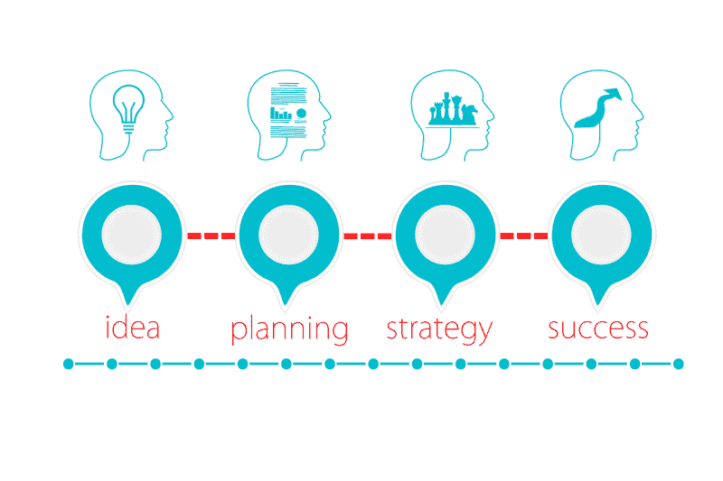

# 目标与零售生存艺术——市场疯人院

> 原文：<https://medium.datadriveninvestor.com/target-and-the-art-of-retail-survival-market-mad-house-6dd1c727126a?source=collection_archive---------8----------------------->

传统观点认为**塔吉特(纽约证券交易所:TGT)** 是一只濒临灭绝的折价恐龙。

令人惊讶的是，塔吉特百货在零售业的末日中赚钱并不断增长。然而，尽管塔吉特的收入在增长，但它赚的钱却在减少。

例如，Target 的季度收入从 2019 年 8 月 3 日的 184.22 亿美元增长到 2019 年 11 月 2 日的 186.65 亿美元。目标的季度毛利；然而，从 2019 年 8 月 3 日的 57.97 亿美元下降到 2019 年 11 月 2 日的 57.3 亿美元。

# 目标是赚钱少

与此同时，Target 同期的季度净收入从 9.38 亿美元降至 7.14 亿美元。此外，Target 的季度营业收入从 2019 年 8 月 3 日的 13.24 亿美元降至 2019 年 11 月 2 日的 10.02 亿美元。

相比之下，Stockrow 估计，截至 2019 年 11 月 2 日的季度，Target 的收入增长率为 4.74%。这一增长率高于上一季度的 3.63%。

 [## 算法交易的机器学习|数据驱动的投资者

### 当你的一个朋友在脸书上传你的新海滩照，平台建议给你的脸加上标签，这是…

www.datadriveninvestor.com](https://www.datadriveninvestor.com/2019/01/30/machine-learning-for-stock-market-investing/) 

所以，我觉得塔吉特是在搬商品但是赚钱少。因此，我不得不怀疑，多渠道商家[报告的](https://multichannelmerchant.com/operations/target-reports-34-growth-ecommerce-blows-projections/)塔吉特 2019 年第二季度的电商增长率 34%是否有助于该公司。我怀疑塔吉特公司可能因为销售额增加而亏损。

# 目标是产生更少的现金

值得注意的是，塔吉特产生的现金越来越少。特别是，Target 的自由现金流从 2019 年 8 月 3 日的 17.55 亿美元降至 2019 年 11 月 2 日的 3.57 亿美元。然而，Target 的自由现金流在 2019 年 5 月 4 日从-3.27 亿美元上升。

相比之下，Target 的运营现金流从 2019 年 8 月 3 日的 24.89 亿美元降至 2019 年 11 月 2 日的 13.47 亿美元。因此，Target 产生了大量现金，但其现金流却在萎缩。

值得注意的是，Target 的负投资现金流从 2019 年 8 月 3 日的-7.35 亿美元增长到 2019 年 11 月 2 日的-9.76 亿美元。此外，在同一时期，Target 的融资“现金流”从-12.71 亿美元降至-10.58 亿美元。

最后，Target 的现金和等价物从 8 月份的 16.56 亿美元降至 11 月份的 9.69 亿美元。因此，当其最大的竞争对手拥有大量现金时，塔吉特的现金却少得多。

# Target 能和亚马逊竞争吗？

与此同时，**亚马逊(纳斯达克代码:AMZN)** 在 2019 年 9 月 30 日报告了 434.01 亿美元的现金和短期投资。因此，亚马逊的现金是塔吉特的 43 倍。

我认为亚马逊 Target 是最大的竞争对手，因为 Target 的城市中产阶级客户是最有可能的亚马逊购物者。例如，我认为普通的目标顾客是中产阶级的足球妈妈。这部分人群是亚马逊的目标市场。

Macarta [声称](https://www.macarta.com/amazon-the-drop-fashion-line/)相应地，亚马逊正在以他们称之为 Drop 的有限私有品牌扩展其时尚业务。Drop 是一系列针对年轻女性购物者的“影响者设计”服装系列。

# 空投如何威胁目标

例如， [The Drop](https://www.amazon.com/thedrop?tag=googhydr-20&hvadid=350642877520&hvpos=1t1&hvexid=&hvnetw=g&hvrand=10751266948488776487&hvpone=&hvptwo=&hvqmt=b&hvdev=c&hvdvcmdl=&hvlocint=&hvlocphy=9028842&hvtargid=kwd-748264962709&ref=pd_sl_4raid9ktmu_b) 于 2019 年 9 月 5 日与“Instagram 影响者”米莲娜·卡尔推出了一个系列。杰夫·贝索斯希望看到卡尔在 Instragram 上推销的服装的顾客会通过亚马逊购买。

我认为滴滴是企图抢夺目标客户。特别是，贝佐斯试图让未来的足球妈妈们；当他们的购物习惯还在形成的时候。贝佐斯的计划是创造一代只在亚马逊上购物的女性。很明显，关于亚马逊最好的书是布拉德·斯通写的 [*百货店:杰夫·贝索斯和亚马逊时代*](https://www.amazon.com/Everything-Store-Jeff-Bezos-Amazon-ebook/dp/B00BWQW73E) 。

亚马逊可以推出 Drop 这样的项目，因为它有大量现金。另一方面，塔吉特可能不得不借钱来开展自己的业务。此外，亚马逊有能力向米莲娜·卡尔等 Instagram 影响者支付巨额费用；或者佣金，来加入这笔交易。

# 亚马逊如何利用 Instagram 摧毁目标

所以，亚马逊可以利用社交媒体；包括**脸书(NASDAQ: FB)** 旗下的 Instagram，来摧毁 Target。Statista [估计](https://www.statista.com/statistics/398166/us-instagram-user-age-distribution/)2018 年美国有 1.05 亿活跃 Instagram 用户。

因此，亚马逊可以通过 Instagram 接触到 1.05 亿观众。此外，亚马逊可以为工具、玩具和电子产品等产品创建投递点。在男人谈论“酷的新工具”或电子产品时，这种营销策略的使用对男人来说是一种下降。

在这种环境下，我不得不怀疑像 Target 这样的实体店是如何生存的。亚马逊可以利用媒体目标和免费送货上门的方式接触顾客。

# 目标股票定价过高吗？

我认为市场先生在 2019 年 12 月 4 日将**目标(纽约证券交易所:TGT)** 定价过高，为 124.75 美元。

我认为 Target 定价过高，因为其收入和现金流正在缩水。此外，我不认为塔吉特百货拥有与亚马逊竞争的资源。

因此，我认为 Target 可能不得不削减业务，减少足迹才能生存。这样一来，我相信塔吉特的股价会崩盘。

# Target 是好的分红股吗？

尽管“市场先生”对其定价过高，但**塔吉特(纽约证券交易所代码:TGT)** 是一只不错的分红股票。事实上，Target 在 2019 年 11 月 19 日支付了 66₵股息。因此，股东可以从目标公司赚钱。

Dividend.com 报告称，重要的是，塔吉特百货的股息已经增长了 51 年。具体而言，Target shares 在 2019 年 12 月 4 日提供的股息率为 2.13%，年化派息为 2.64 美元，派息率为 41.25%。

归根结底，塔吉特是一家没有掌握零售生存艺术的好公司。目标股东可以在短期内赚钱，但我预测这家零售商可能会在不久的将来萎缩和崩溃。

*原载于 2019 年 12 月 4 日*[*https://marketmadhouse.com*](https://marketmadhouse.com/target-and-the-art-of-retail-survival/)*。*