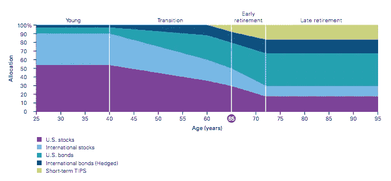
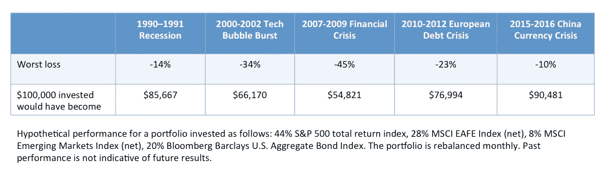
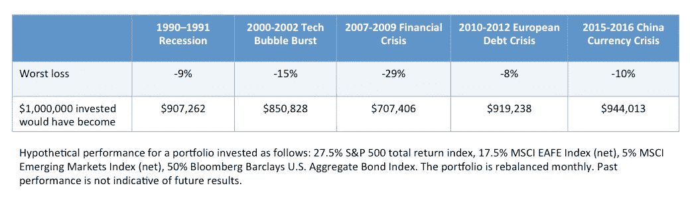

# 目标日期基金的风险可能比你想象的要高

> 原文：<https://medium.datadriveninvestor.com/target-date-funds-may-be-more-risky-than-you-think-a90f5db44d01?source=collection_archive---------5----------------------->

Photo by [Annie Spratt](https://unsplash.com/photos/3qbBwA8QCEY?utm_source=unsplash&utm_medium=referral&utm_content=creditCopyText) on [Unsplash](https://unsplash.com/search/photos/target?utm_source=unsplash&utm_medium=referral&utm_content=creditCopyText)

当你接近退休的时候，尤其如此。但即使你离退休还有几十年，这些基金承担的风险也可能超出你的承受能力。

对于目标日期基金有很多误解。在证券交易委员会的调查中，大约 40%的受访者认为这些基金是退休后的安全投资。更令人担忧的是，调查中 52%的目标日期基金投资者认为目标日期基金保证退休收入。

 [## 数据驱动投资的兴起——数据驱动投资者

### 当 JCPenney 报告其 2015 年 2Q 的财务结果时，市场感到非常震惊。美国零售巨头…

www.datadriveninvestor.com](https://www.datadriveninvestor.com/2019/02/28/the-rise-of-data-driven-investing/) 

他们不做那种事。现实情况是，它们只是提供了一种投资股票和债券多样化组合的便捷方式。这些投资可以上升也可以下降，就像股票和/或债券的其他投资一样。

**什么是目标日期基金？**

首先快速回顾一下。目标日期基金基本上是个人可以投资的一站式基金，在 401(k)s 等雇主退休计划中最常见。

关键变量是你的年龄，或者更确切地说，是你想退休的年份——这是你的目标日期。假设你现在 40 岁，预计 25 年后退休，也就是 2045 年。你为你的计划选择的目标日期基金应该是名字中带有 2045 的那个。或者，如果你没有做出选择，你的雇主可能会默认你进入“适当的”目标日期基金。

这差不多就是你在这些事情上要做的工作。

然后，该基金遵循所谓的“下滑路径”，每年改变股票和债券的组合，直到达到退休目标年。这个想法是，债券的风险低于股票，所以越接近退休，债券的配置就越大。

例如，以下是 Vanguard 的目标日期下滑路径:

Source: [Vanguard](https://www.vanguard.com/pdf/s167.pdf)

它表明，直到 40 岁，你的投资组合将有 90%的股票(国内+国际)和 10%的债券。然后下滑，到了 65 岁退休年龄，投资组合大概是 52%股票，48%债券。

该图还显示，即使在退休后，配置组合仍在继续下滑，而许多人认为这种情况不会改变。在 72 岁时(“延迟退休”的开始)，Vanguard 目标日期投资组合包括 30%的股票和 70%的债券。

使用目标日期基金的好处是，你不必担心你的股票债券配置，也不必担心每年重新平衡到一个新的组合。基金经理会为你做所有的工作。

难怪目标日期基金越来越受欢迎。2018 年是第一年[超过一半的 401(k)参与者将其所有资产投入单一目标日期基金](https://www.marketwatch.com/story/should-you-have-your-entire-401k-in-a-target-date-fund-2018-11-05)。

请注意，这并不意味着所有这些人没有多样化的投资组合，仅仅因为他们的资产 100%都在一只基金中。相反，正如我们上面看到的，每个目标日期基金在国内/国际股票和债券上相当分散。

那么问题出在哪里？

**费用问题**

首先是费用。

如果你足够幸运，你的雇主提供的退休计划提供 Vanguard target date 基金，每年仅花费约 0.12%，即每投资 10，000 美元每年花费 12 美元。

第二大提供商是 Fidelity 和 T. Rowe Price，他们收取的费用是 Vanguard 的四倍多。富达和 T. Rowe Prices 的目标日期基金的[平均费用率分别为 0.61%和 0.72%](http://www.interest.com/401k/news/5-things-you-should-know-about-target-date-funds/) 。这些都非常接近行业平均水平。

正如我在[之前的一篇文章](https://medium.com/datadriveninvestor/fees-matter-a9b19811055b)中所写的，费用会对你最终的积蓄产生很大的影响。

然而，目标日期基金的更大问题是风险。

**目标日期基金实际承担多大风险？**

我不会向你展示常用的风险统计数据(比如波动性)，而是用不同的方式。

我将举例说明衰退和危机对类似于目标日期基金的投资组合的影响。这样，你就能了解这些基金在过去遇到麻烦时的表现。

*显而易见，过去的表现并不代表未来的结果。*

让我们先来看看退休前的情况:一个激进的配置，80%的股票/20%的债券，模仿一个人退休后 15 年或更长时间的目标日期配置组合。

下表显示了过去 30 年中发生的经济衰退和危机中最严重的损失百分比和美元值(对于 10 万美元的投资组合*)。

如你所见，80-20 的股票-债券投资组合在过去三十年的几个时期里经历了巨大的损失。在 2007—2009 年的金融危机中，该投资组合的价值几乎损失了一半。最近在欧洲债务危机期间——对美国投资者来说似乎很遥远——投资组合已经损失了超过 20%的价值。

即使你离退休还有几十年，你也必须问问自己，面对这种损失，你是否感到舒服。

在上述每个案例中，市场都出现了反弹，但这是事后诸葛亮。问题是，在危机期间，你是否能坚持投资。在那个时候认输，转投更保守的投资组合并不理想。

最终，最好的投资组合是你能坚持的，而不是数学上最优的。

**临近退休或退休时，分配组合可能至关重要**

我在本文开头引用的调查是在 2008 年金融危机后委托进行的。这是为了应对在此期间接近目标年份的几只目标日期基金的价值大幅下跌。

事情是这样的:在那次调查中，大多数 target date 基金的所有者认为，退休时投资于股票的基金不到 40%。许多投资者认为，目标日期基金在退休时 100%投资于现金。

这是有道理的。投资者有正确的直觉，他们的投资组合在退休时应该包含最小的风险，从而在他们需要钱的时候避免巨大损失的可能性。

但这远非事实。

正如我们从 Vanguard 下滑路径中看到的，退休时的配置更接近 50%的股票/50%的债券。富达和 T Rowe Price 提供的目标日期基金实际上对目标年份股票的配置略高(约 55%)。

下表显示了一个假设的 50%股票、50%债券的投资组合在各种危机中的过往表现。因为我们现在考虑退休目标年，所以我使用 100 万美元的投资组合，而不是 10 万美元的投资损失。

百分比损失明显低于我们之前看到的更激进的投资组合。然而，一个庞大的退休投资组合的美元损失是巨大而痛苦的。

就在你准备退休的时候，你可能不希望看到自己 100 万美元的储蓄跌到 91.9 万美元(欧洲债务危机)。更不用说在 2007—2009 年金融危机期间下跌了近 30 万美元。

这可以很容易地转化为多工作几年来弥补损失。这是许多即将退休的人在过去十年里做过的事情。

总而言之:

目标日期基金是投资多样化投资组合的一种非常方便的方式，而且不需要做太多的工作。

然而，重要的是要了解这些基金实际上是如何运作的，尤其是其中存在的风险。

***脚注***

**危机时期*

*1990-1991 年经济衰退:1990 年 1 月至 1991 年 3 月*

*2000-2002 年科技泡沫破裂:2000 年 4 月至 2003 年 3 月*

*2007 年至 2009 年金融危机:2007 年 11 月至 2009 年 2 月*

*2010 年至 2012 年欧洲债务危机:2010 年 5 月至 2012 年 5 月*

*2015–2016 中国货币危机:2015 年 8 月至 2016 年 2 月*