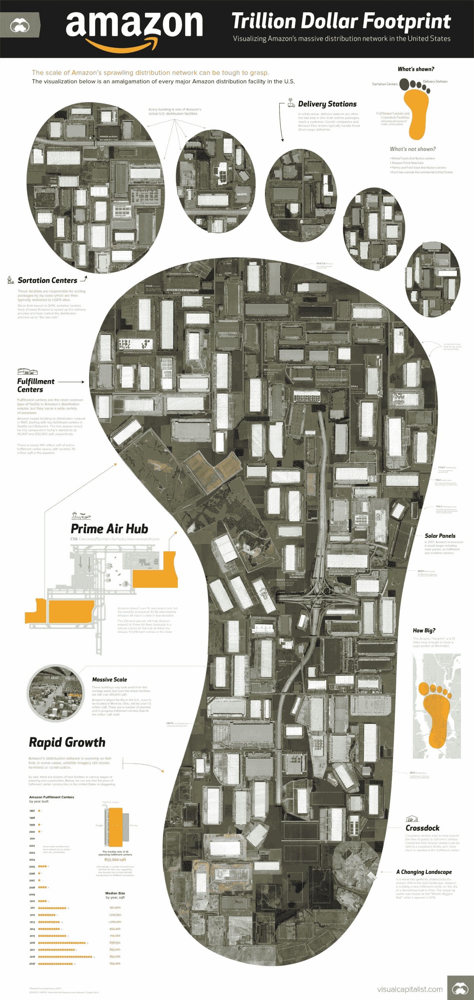
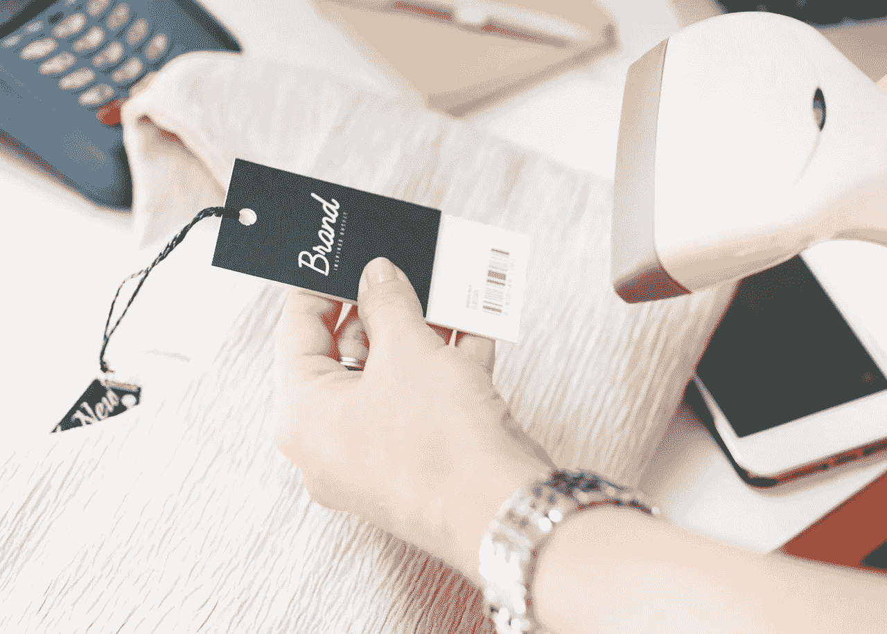

# 塔吉特百货在零售业末日中赚钱

> 原文：<https://medium.datadriveninvestor.com/target-makes-money-amidst-the-retail-apocalypse-ac12c60489ca?source=collection_archive---------3----------------------->

塔吉特百货在零售业的末日中赚了钱，但是它面临着生存的挣扎。值得注意的是， **Target(纽约证券交易所:TGT)**2018 年第四季度的收入为 229.77 亿美元，毛利为 60.78 亿美元。

同时，塔吉特百货的三个直接竞争对手； **Bed Bath & Beyond(纳斯达克股票代码:BBY)** ， **Pier 1 Imports(纽约证券交易所代码:PIR)** ，资不抵债的西尔斯正在关店。具体来说，1 号码头可能会关闭 145 家商店和床浴&超过计划关闭的 40 家，*今日美国* [报道](https://www.usatoday.com/story/money/2019/04/18/pier-1-imports-store-closings-retailer-close-up-145-locations/3507053002/)。此外，破产的[西尔斯](https://www.cnn.com/2019/02/05/business/sears-store-closings-ahead/index.html)计划在 2019 年关闭其 200 家凯马特门店中的 36 家，以及多达 74 家[西尔斯](https://finance.yahoo.com/news/sears-starting-2019-closing-80-152324120.html)门店。

 [## 股票市场投资的机器学习——数据驱动的投资者

### 当你的一个朋友在脸书上传你的新海滩照，平台建议给你的脸加上标签，这是…

www.datadriveninvestor.com](https://www.datadriveninvestor.com/2019/01/30/machine-learning-for-stock-market-investing/) 

西尔斯；贝德柏士比昂公司凯马特(Kmart)和 Pier 1 的所有者是迎合中产阶级顾客的折扣店。因此，这三家零售商与塔吉特直接竞争。然而，在这三家公司挣扎求生的时候，塔吉特却在赚钱。

# **塔吉特赚了钱，但它只是在苟延残喘**

Target 在 2018 年第四季度的运营收入为 10.14 亿美元，净收入为 7.98 亿美元。此外，Target 报告 2018 年第四季度自由现金流为 17.52 亿美元，运营现金流为 23.49 亿美元。

然而，这些数字接近 2018 年的数字。例如，Target 2018 年第一季度的营业收入为 11.29 亿美元，净收入为 10.87 亿美元。此外，2017 年第四季度，Target 的运营现金流为 24.4 亿美元，自由现金流为 19.6 亿美元。

因此，看起来塔吉特只是在漂浮。对此的解释是，Target 赚的钱只够维持运营，但几乎没有剩余现金。

事实上，Target 在 2019 年 2 月 2 日只有 15.56 亿美元的现金和等价物。此外，Target 的现金在 2018 年下降了 10.87 亿美元。Target 在 2018 年 2 月 3 日拥有 26.43 亿美元现金。

# **Target 是否在烧钱为运营融资？**

因此，塔吉特公司似乎在用现金为经营和扩张融资。如果塔吉特的收入没有显著增长，这可能是致命的。

不幸的是，塔吉特的收入正在缩水。为了证明这一点，Target 在 2017 年第三季度和 2018 年第三季度的收入分别为 229.83 亿美元和 229.77 亿美元。缩水很轻微，但是很明显。

此外，Stockrow 给予 Target 2018 年第四季度-0.83%的负收入增长率。这一点意义重大，因为它表明塔吉特的收入增长在至关重要的 2018 年假日季出现下滑。

相反，Target 报告称，2018 年假期的收入增长令人印象深刻，达到 51.56 亿美元。具体来说，Target 在 2018 年第四季度的收入为 178.21 亿美元，在 2018 年第四季度增长到 229.77 亿美元。

# Target 不受亚马逊的影响吗？

因此，Target 能够大幅提高收入，但可能无法帮助折扣店生存下来。

目标处于危险之中，因为它是最危险的直接竞争对手；**亚马逊(NADAQ: AMZN)** 赚的钱要多得多。例如，亚马逊 2018 年第三季度的收入为 723.83 亿美元。

相比之下，Target 报告 2018 年全年收入为 753.56 亿美元。因此，亚马逊一个季度的收入几乎相当于塔吉特百货的年收入。

毫不奇怪，亚马逊赚的钱比塔吉特多得多。事实上，亚马逊 2018 年第四季度的毛利为 275.97 亿美元，大于 Target 2019 年第一季度的营收 229.77 亿美元。

# **亚马逊可能会花掉 Target 的生意**

独特的是，亚马逊在 2018 年新年前夕拥有 317.5 亿美元的现金和等价物，以及 95 亿美元的短期投资。因此，截至 2018 年底，亚马逊的银行存款为 412.5 亿美元。

因此，亚马逊有现金通过无情的支出将塔吉特百货挤出市场。有趣的是，新闻报道表明这正是杰夫·贝索斯正在做的事情。

例如，亚马逊计划建立一个 15 亿美元的 Prime Air 枢纽和 50 个 Prime Now 枢纽；小型区域履行中心，*视觉资本家* [报告](https://www.visualcapitalist.com/footprint-all-amazons-warehouses/)。这样做的目的是为了加快亚马逊的送货服务。此外，亚马逊正在向其现有的 1 亿平方英尺的履行中心增加 3500 万平方英尺的履行中心。

此外，据商业内幕 [报道](https://www.businessinsider.com/amazon-buys-mercedes-benz-vans-for-delivery-program-2018-9)，亚马逊正在为其新的送货车队购买 2 万辆奔驰 Sprinter 面包车。此外，Everything Store 将资助愿意成为亚马逊送货承包商的企业家。

# **亚马逊是前所未有的大目标**

所有这些都威胁到了 Target，因为它让亚马逊变得更加方便易用。因此，没有人需要在 Target 购物，因为亚马逊可以通过 Prime Now 在两小时内将他们需要的一切送到他们的家门口。

事实上，亚马逊 Prime 甚至会在一些市场为你储备冰箱。为了解释，亚马逊钥匙服务让快递员打开你的前门，把东西放在你的家里， *The Verge* [报道](https://www.theverge.com/2017/10/25/16538834/amazon-key-in-home-delivery-unlock-door-prime-cloud-cam-smart-lock)。

因此，忙碌的足球妈妈不再需要在下班回家的路上停下来购物。此外，如果亚马逊来到他们的家中，在食品柜中储存物品，许多人可以完全摆脱购买实体商品的习惯。

从长远来看，塔吉特可以与 **Dollar General(纽约证券交易所代码:DG)** 和 **Dollar Tree(纳斯达克代码:DLTR)** 竞争最贫穷和教育程度最低的客户。显然，争夺穷人的粮票不是一个非常有利可图的商业模式。

# **克罗格、Instacart 和 Ocado 对目标的威胁**

Target 要担心的不仅仅是亚马逊。例如，美国最大的超市运营商**克罗格(纽约证券交易所代码:KR)** 通过 Instacart 将其送货足迹增加了一倍，达到 1600 家商店，*杂货潜水* [估计](https://www.grocerydive.com/news/kroger-grows-delivery-footprint-by-50-with-instacart/533715/)。

此外，克罗格和**奥卡多集团有限公司(伦敦证券交易所:OCDO)** 正在[规划](https://marketmadhouse.com/kroger-kr-and-ocado-plan-robotic-warehouse-in-ohio/)全美 20 个机器人操作的履行中心。Ocado 是一家英国公司，在英国经营大型机器人履行中心和杂货配送服务。

克罗格和奥卡多将在佛罗里达州奥兰多附近的格罗夫兰和俄亥俄州代顿附近的巴特勒县建立履行中心。值得注意的是，Kroger 在俄亥俄州门罗附近购买了 68 英亩的土地，作为第一个机器人客户服务中心。

在这种情况下，目标客户很快就会有两种快捷方便的当天送达服务可供选择。而且，臭名昭著的深度折扣店；亚马逊和克罗格运营这些服务。加入沃尔玛(纽约证券交易所:WMT) 的组合，目标可能无法生存。

塔吉特百货将不得不大幅提升其配送策略，才能在零售环境中生存下来。因此，Target 将需要花费大量资金来保持竞争力。

# **塔吉特是价值投资吗？**

然而，尽管零售环境不断变化，你仍可以为**塔吉特百货(纽约证券交易所代码:TGT)** 创造强大的价值。情况是，塔吉特公司的股票现在赚钱了，如果塔吉特公司亏损，你可以很容易地抛售。

值得注意的是，Target 现在很便宜；相比亚马逊和**好市多批发(纳斯达克代码:COST)。**具体来说，Target 在 2019 年 4 月 23 日的交易价格为每股 82.03 美元。与此同时，亚马逊的交易价格为每股 1，920.92 美元，好市多的交易价格为每股 245.48 美元。

此外，Target 将于 2019 年 6 月 10 日支付 64₵的股息，而亚马逊不支付股息。另一方面，好市多于 2019 年 2 月 22 日支付 57₵股息。

最后，Target 的股息在过去 51 年里一直在增长，因此是安全的。2019 年 4 月 23 日，目标投资者的股息收益率为 3.12%，年化股息为 2.56 美元，股息支付率为 47.6%。

# **Target 是一只好股票，但要准备好快速抛售**

我的结论是，Target 是一只根基不稳的好股票。Target 正在赚钱，但它面临着巨大的、创新的、资金雄厚的、危险的竞争对手，这些竞争对手正在戏剧性地改变游戏规则。

所以，Target 是一只现在买入并持有的股票，是一家未来不确定的公司。我认为投资者应该准备好快速抛售 Target，但你现在可以从中赚钱。

这个故事最初出现在[*市场疯人院*](https://marketmadhouse.com/) 。