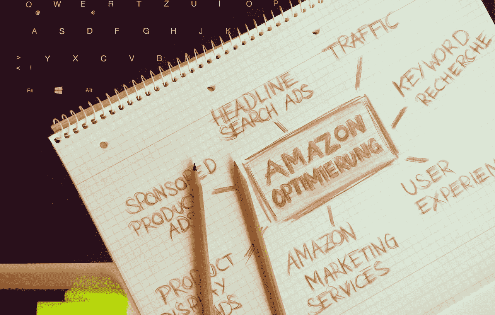

# 价值目标(TGT)为生存而战

> 原文：<https://medium.datadriveninvestor.com/target-tgt-battles-for-survival-f1385b966b21?source=collection_archive---------9----------------------->

目标(TGT)面临着一场殊死的生存之战。奇怪的是，这家时尚零售商发现，对今天的消费者来说，它的折扣不够便宜。

据此， **Target(纽约证券交易所股票代码:TGT)** 创立了一个名为 Smartly 的自有平价品牌。石英[报道](https://qz.com/1416163/target-bets-private-label-brands-will-help-it-survive-amazon/)解释说，每件智能产品将卖 2 美元或更少。

具体来说，Smartly 产品将比 Target 现有品牌 Up & Up 便宜 50%。作家艾莉森·格里斯沃尔德认为 Smarty 旨在对抗像 Brandless 这样的网上折扣店。例如，据报道，Brandless 以 3 美元的统一价格出售所有商品。

**潇洒会帮助 Target (TGT)战美元树还是亚马逊？**

然而，我认为明智地反击小盒子折扣店，如**美元树(纳斯达克:DLTR)****美元通用(纽约证券交易所:DG)** 和 Aldi。例如，美元树以 1 美元出售所有商品。[阿尔迪](https://www.produceretailer.com/article/news-article/learn-lesson-or-two-aldi)，；另一方面，沃尔玛出售廉价的高质量自有品牌食品。

有趣的是，塔吉特(TGT)可能希望大多数顾客不要购买时髦的产品。要论证，潇洒是亏损领导；一种被认为能吸引顾客进入商店的产品。

显而易见的希望是，顾客会进来买得漂亮，但购买的是更贵的品牌。所以，潇洒的心理是，**麦当劳(NYSE: MCD)** 美元菜单的背后。

麦当劳贴出一美元菜单，希望饥饿的顾客会看一看，然后买一个巨无霸。塔吉特希望顾客能精明地购买，但却买了汰渍。

**塔吉特(TGT)需要更多现金来对抗亚马逊**

潇洒地目标；不过，也是为了反击**亚马逊**。塔吉特百货的管理层希望通过提供比亚马逊能提供的价格更低的价格来吸引顾客。

很少有零售商比塔吉特百货更受亚马逊的威胁。亚马逊争夺 Target 的核心客户群；尤其是城市和郊区的中产阶级。

例如，Target 的目标客户是一位 35 岁的郊区足球妈妈。不幸的是，足球妈妈是最有可能属于亚马逊总理的人。

Smartly 的一个明显用途是让 30 岁以下的人(千禧一代)习惯在塔吉特购物。塔吉特希望在这些千禧一代有了孩子之后，把他们变成忠实的顾客。

塔吉特(TGT)能和亚马逊竞争吗？

吸引这样的购物者是一项艰巨的任务，因为亚马逊比塔吉特(TGT)要方便得多。值得注意的是，亚马逊允许顾客在沙发上完成所有的“购物”。

对于亚马逊来说，没有汽车，没有去大盒子商店的旅行是必要的。相反，你需要做的只是拿起你的手机。

Target 面临的挑战比你想象的要大，因为顾客对亚马逊和实体店有所区分。例如，当想到电子商务时，许多人首先会想到亚马逊。

这使得像塔吉特或沃尔玛这样的公司很难吸引顾客到他们的网站。例如，顾客会先去亚马逊，然后再去拜访他们。如果亚马逊的价格低，它就能在没有广告或营销的情况下获得销售。

为了在网上生存，塔吉特百货首先需要让顾客访问 Target.com。我看不出如何聪明地实现这一目标。

**塔吉特(TGT)加入到这场争夺底部的竞赛中**

Smartly 更有可能的用途是吸引在一元店或 Aldi 购物的低端顾客。那些收入不平等的受害者只凭价格购物。

因此，零售商们都在竞相杀价以吸引他们的生意。竞相杀价包括提供尽可能低的价格。其他都不重要，不是风格，不是质量，也不是效用。

我不得不怀疑，这样的客户除了产生额外的现金流，还会为塔吉特做些什么。塔吉特(TGT)是如此渴望现金，以至于想要穷人的福利支票和食品券吗？

**塔吉特(TGT)赚钱了吗？**

财务数据显示，塔吉特不需要极度贫困者的钱。

例如，塔吉特(TGT)录得 55.37 亿美元的毛利；以及 2018 年 8 月 4 日 11.33 亿美元的营业收入。相反，Target 在同一天的收入为 171.75 亿美元，净收入为 7.99 亿美元。

很能说明问题的是，Target 当天录得 22.1 亿美元的运营现金流和 11.92 亿美元的自由现金流。因此，塔吉特百货不会从极度贫困的人那里拿钱。

塔吉特百货(TGT)将需要更多的现金来与亚马逊竞争

然而，如果塔吉特(TGT)想要与亚马逊正面竞争，它将需要更多的现金。

特别是，亚马逊在 2018 年 6 月 30 日拥有 270.5 亿美元的现金和短期投资。这些现金使亚马逊能够花费数十亿美元在美国城市开设无收银员便利店。

相比之下，Target 在 2018 年 8 月 4 日报告了 11.8 亿美元的现金和等价物。因此，塔吉特的现金是亚马逊的 27 分之一。

Amazon Go 对塔吉特百货是一个直接威胁，因为它在城市社区运营，迎合同样的基本客户群；中产阶级专业人士。由于劳动力成本较低，Target 可能很难与 Go 竞争。

对 Target 来说，更大的威胁是亚马逊 Prime，它将商品直接送到消费者手中。特别是，亚马逊的 Prime Now 超快 2 小时送货服务可能会摧毁目标。

Prime Now 是一个主要威胁，因为它解除了消费者去商店思考的需要。例如，忙碌或懒惰的人会用 Amazon Prime Now 作为不去购物的借口。

**联手能拯救像塔吉特(TGT)这样的零售商吗**

Target 最大的问题是缺乏现金与亚马逊直接竞争。塔吉特(TGT)并不孤单，一些更大的零售商包括**沃尔玛(纽约证券交易所代码:WMT)** 、**克罗格(纽约证券交易所代码:KR)** 和**沃尔玛(纳斯达克代码:WBA)** 也有类似的问题。

面对亚马逊，零售商的一个显而易见的解决方案是合作。例如，塔吉特已经将其药房业务移交给了 CVS Health(纽约证券交易所代码:CVS) 。此外；克罗格和沃尔格林正在肯塔基州的沃尔格林药店试验克罗格杂货店销售。

此外，Kroger 与 Instacart 有着密切的工作关系。为了解释这一点，Kroger 提供食品杂货，Instacart 提供送货服务。此外，克罗格购买了英国杂货技术公司**Ocado Group PLC(LON:OCDO)**6%的股份。克罗格购买了 Ocado 的股份，因为它需要该公司在机器人履行方面的专业知识。

**收购会帮助 Target 对抗亚马逊吗？**

这种合作的缺点是零售商最终会与合作伙伴分享利润。因此，更明智的解决方案是收购。例如，塔吉特百货收购了快递服务公司 Shipt，沃尔玛也在疯狂收购。

收购是一个有限的解决方案，因为它需要钱。目标公司必须筹集现金或借款来为收购融资。在最糟糕的情况下，一家公司不得不出售资产来为收购融资。例如，Kroger 不得不出售其便利店来筹集资金投资 Ocado。

塔吉特(TGT)可能会通过收购来对抗亚马逊。例如，通过收购拥有 Family Dollar 的小盒子零售商 **Dollar Tree(纳斯达克股票代码:DLTR)** 。另一个选择是与西夫韦这样的杂货商或 7-Eleven 这样的连锁便利店合并。

这种合并的好处是让塔吉特百货拥有数百个小店面来对抗亚马逊。小箱子位置的最佳用途是在线订单的取货和退货位置。

**塔吉特(TGT)是一只高股息股票吗？**

尽管面临亚马逊的威胁，塔吉特百货(纽约证券交易所:TGT) 仍然是一只高股息的股票。

例如，Dividend.com 报告称，Target 在 2018 年 10 月 8 日实现了 50 年的股息增长。因此，自 1968 年以来，塔吉特百货的股息每年都在增长。

更重要的是，目标投资者于 2018 年 10 月 8 日获得 3.03%的股息率和 2.56 美元的派息率。除此之外，派息率为 47.6%。

在这种情况下，下一个目标股息为 64 英镑，支付日期为 2018 年 12 月 10 日。target 2018 年分红增加 2，从 2018 年 5 月 15 日的 62，上升到 2017 年的 60。

塔吉特(TGT)将在亚马逊时代茁壮成长

我认为市场先生在 2018 年 10 月 11 日低估了 84.69 美元的目标，因为股息和收入。2017 年，Target 的年收入为 718.79 亿美元，增长率为 3.43%。今后几年，Target 将保持增长并提供丰厚的股息。

相反，来自亚马逊的威胁是长期的。我相信 Amazon Go 在 2023 年或 2024 年之前无法与 Target (TGT)直接竞争。此外，我认为 Prime Now 在几年内不会在全国范围内推出。

因此，塔吉特有足够的时间为亚马逊的威胁做准备。我预测塔吉特会反击亚马逊，保持自己的价值。塔吉特可以在亚马逊时代茁壮成长，因为它是一家拥有强大品牌和一些优秀技术的好公司。

如果你想要一家股息丰厚、品牌强大的零售商，那么塔吉特(TGT)应该在你的投资组合中。

这个故事首先在 [*市场疯人院*](https://marketmadhouse.com/) 你的杂货店战争的前排座位实现。