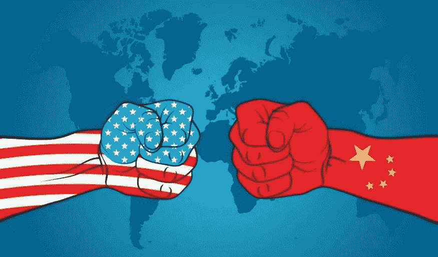
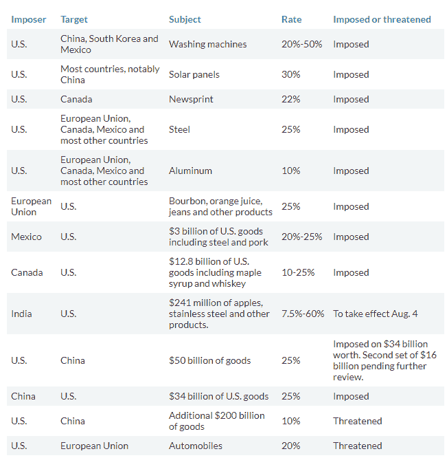

# 关税战&自由贸易的动态变化

> 原文：<https://medium.datadriveninvestor.com/tariff-war-changing-dynamics-of-free-trade-f98c6ab1c183?source=collection_archive---------7----------------------->

随着最近关于关税、贸易协定和汇率操纵的头条新闻变得越来越少和重复，它们仍然引起不确定性&不必要的市场反应——从长远来看，这对市场和任何经济的总体健康都没有好处。对于像我这样的技术交易者来说，这变得极具挑战性，因为市场开始像钟摆一样摆动。总之，这里不是谈论贸易，而是最近随着美国对其他一些贸易伙伴征收关税而升级的总体贸易紧张局势。

像世界贸易组织这样的贸易组织的作用已经变得越来越困难，因为争吵的双方正在就违反行为相互提出索赔——最近美国总统威胁要退出世贸组织，然后再做出其他决定——现在。然而，在中国、欧盟、加拿大、墨西哥和土耳其对特朗普政府的钢铁和铝关税提出投诉后，美国已向世界贸易组织分别提起诉讼。你看这是怎么回事。让我们看看贸易战是如何展开美国关税的

**礼遇:市场观察**

从图表中可以明显看出，大多数国家没有被美国的强制贸易政策吓倒，而是立即对美国商品征收关税进行报复。如果目前的关税制度不是临时性的，两国之间的双边协议可能会成为全球贸易向前发展的关键。这并不是说没有人在努力拯救自由贸易体制。

日本和欧盟宣称自己是自由贸易的旗手，签署了世界上最大的双边贸易协定，覆盖了全球 GDP 的三分之一。该协议涉及双方的重大让步，最终将降低日本对欧洲葡萄酒、奶酪和其他食品的高额关税，并提高欧盟对日本汽车和汽车零部件的关税。一个类似的贸易协议也在等待加拿大和欧盟，CETA 的批准。这只是让我想知道为什么他们不能与美国谈判类似的协议——这毕竟可能是一件好事。“你帮我忙，我也会帮你忙”这句话在这里难道不成立吗——毕竟这是生意。

贸易战似乎没有发生，而是采取了另一种动态，中国最初表示不会在世界上两个最大经济体之间的持续贸易摩擦中使用人民币作为工具，导致人民币汇率降至 2015 年以来的最低水平(并不是说人民币已经不受政府控制)。猜猜今天早些时候美国总统出来批评此举，并对美国利率发表评论，无意中导致美元兑主要货币的 10 个月高点下跌，顺便说一句，这不是一件坏事，因为美元走软对美国出口有利。

我不知道这将在哪里停止，但在某一点上，每个人都会意识到，这种贸易战的贩卖，手臂扭曲和货币操纵不会帮助任何人。市场继续遭受最讨厌的不确定性。这场混乱的最大输家是全球经济！

相关文章: [**交易心理&经验教训**](http://www.datadriveninvestor.com/2018/07/12/trading-psychology-lessons-learnt/) ， [**百事通……一个高手！**](http://www.datadriveninvestor.com/2018/07/03/jack-of-all-trades-master-of-one/) 、 [**一刀切的交易策略？**](http://www.datadriveninvestor.com/2018/06/20/one-size-fits-all-trading-strategy/)

保持联系:[Twitter](https://twitter.com/fklivestolearn)|[StockTwits](https://stocktwits.com/trade_nut)|[LinkedIn](https://www.linkedin.com/in/faisal-khan-2a3009b/)|[Telegram](https://t.me/joinchat/IWzyHBGWCFwPQTe8Tm5H_Q)|[trade alike](http://www.tradealike.com/)

*原载于 2018 年 7 月 19 日*[*www.datadriveninvestor.com*](http://www.datadriveninvestor.com/2018/07/19/tariff-war-changing-dynamics-of-free-trade/)*。*