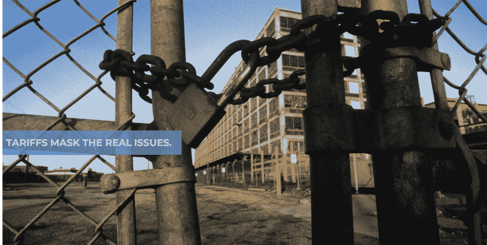

# 关税掩盖了真正的问题。

> 原文：<https://medium.datadriveninvestor.com/tariffs-mask-the-real-issues-7eb1496b22a4?source=collection_archive---------17----------------------->

我开始这篇思考文章的那天，道琼斯指数下跌 767.27 点，收于 25717.74 点(-2.90%)，纳斯达克指数下跌 278.03 点，收于 7726.04 点(-3.47%)，S&P 指数下跌 87.31 点，收于 2844.74 点(2.98%)。世界 500 大富豪的损失总计 1170 亿美元；然而，他们仍然控制着近 5.4 万亿美元，自 19 年 1 月 1 日以来增长了 11%。为什么从这些数字开始？对于为退休投资的普通美国人来说，今天大多数人都亏了钱，除非你非常关注空头头寸。这些损失是中国中央政府决定允许人民币贬值到临界水平以下的结果。那么，这有什么关系呢？让我们来看看事实。

*   以购买力平价衡量，中国现在是世界上最大的经济体。2018 年，中国经济生产了 25.3 万亿美元。欧盟以 22 万亿美元排名第二，美国以 20.5 万亿美元排名第三。在 1979 年开始的经济和结构改革的推动下，中国经济在过去的 30 年里取得了惊人的增长。如果你想了解更多，下面的文章提供了很好的见解。[https://www.everycrsreport.com/reports/RL33534.html](https://www.everycrsreport.com/reports/RL33534.html)和[https://fas.org/sgp/crs/row/RL33534.pdf](https://fas.org/sgp/crs/row/RL33534.pdf)
*   2016 年，中国制造业相当于其 GDP 的 28.7%，而美国为 11.6%。
*   中国是世界上最大的出口国。2017 年，中国出口了 2.2 万亿美元的产品。欧盟出口 1.9 万亿美元，美国出口 1.6 万亿美元。
*   2018 年，中国低成本工厂制造了全球所有产品的 17.6%。随着美国政府征收关税，美国公司在 Q1、Q2 和第三季度初增加了在中国的制造和相关采购，以增加库存，增加中国在全球产品制造中的份额。与此同时，中国对美国制造的产品征收关税。
*   2018 年，中国向美国出口了 18%的产品。这导致了美中[4190 亿美元的贸易逆差。](https://www.thebalance.com/u-s-china-trade-deficit-causes-effects-and-solutions-3306277)
*   中国是美国最大的商品贸易伙伴、美国第三大出口市场和最大进口来源。
*   中国是美国国债的最大外国持有者。这些证券在一定程度上为美国联邦债务提供资金。截至 2019 年 4 月，中国大规模购买美国国债的总额为 1.1 万亿美元。

1980 年，中国经济改革开始一年后，美中贸易总额为 50 亿美元。2018 年，这一数字已膨胀至 6600 亿美元。通过“剥离”这个人物，细节成为故事。洞察力与 1 一致。)我们如何为美国公司融资；2.)我们如何管理企业；第三。)令人上瘾的“最低成本”模式以及工资停滞、失业和就业不足的直接影响；

**我们如何为美国公司融资:**美国公司的融资方式对我们的经济文化有着重大影响。在建立和领导公司超过 20 年后，这种趋势和影响只会加速。从金融角度来看，服务业和制造业都面临着挑战。有趣的是，它并不适用于政府，因为政府的运作超出了经济标准的范围。当我们从股权和债务的角度来看融资时，标准是相似的。我们在风险因素上有分歧。现实是一目了然的。为了符合债务融资的资格，商业模式、产品或服务、历史财务表现等。所有这些都在比率、标准等更大、更详细的范围内发挥作用。

金融机构一致的愿望是降低或消除成本、增加利润和降低风险，以换取获得营运资本。关注季度回报，无论是作为上市公司还是私营公司，衡量指标包括资本回报率、每股收益等。推动特定的短期行为。这反过来推动了文化。我接触的大多数客户不再是真正的“制造商”这些总部位于美国的大型全球性公司将绝大部分(如果不是全部的话)制造业务外包给全球供应链中成本最低的生产商。对许多人来说，R&D 和产品设计的功能也被外包出去了。不幸的是，在许多情况下，为了达到获得营运资本所必需的财务基准，公司不得不改变业务模式，以适应外部融资的必要性。这种情况适用于债务和股权融资——尽管股权市场实际上更具挑战性，因为基于风险因素，资本回报率的预期更高。在公共股票市场，基于“分析师”观点的季度业绩和季度环比 EPS 要求的短期压力推动着实际的商业决策。这并不是说优化业务运营不是一个伟大的目标。相反，这是一个挑战，因为在许多情况下，获得融资是基于商业模式的改变，而这种改变并不符合员工或企业的最佳利益。例如，一家金融机构对营运资金额度的要求可能需要更改，包括降低成本、调整员工人数等。，而另一家金融机构可能需要一套完全不同的影响业务运营的标准。标准转变和获得短期和长期资金的需求的交汇推动了美国制造业和美国服务业许多方面的外包(如软件工程、托管服务、客户支持、研究——麦肯锡等)。)

1.  **我们如何管理企业:**我们如何为企业融资的影响是影响我们如何管理/运营企业的潜在机制。无论你是否同意季度或半年度报告，今天一致的是公司如何运营——无论是作为公共实体还是私人实体，如果公司利用外部资金来源(债务或股权)。现实很简单。我们以 1.5 个月为周期管理业务。在每个 1.5 个月的期末，必须做出决策，以实现关键指标，包括流动性、效率、盈利能力、杠杆、增长和估值。如果任何指标趋势低于预测/分析师预期，则必须实施缓解策略。话虽如此，6 周的操作时间使得短期决策势在必行。

退一步说，与企业融资相关的决策的含义以及所选金融合作伙伴和渠道的目标对于短期和长期规划都至关重要。当你审视中国经济这个混合了威权、共产主义和资本主义的结构时，一个关键因素是对融资和回报率的“长远眼光”。虽然美国和中国经济中的融资情景并不普遍是短期对长期的，但联邦政策的整体观点是并列的。政策分歧的一个极好例子是中国的“一带一路”倡议。正是这种短期观点创造了近 40 年的经济学转变，导致了美国经济的现状。这是与经济相关的联邦政策层面。认识到这样一个事实，即在全球经济向发展中国家倾斜的情况下，与财务相关的活动和结果推动了企业文化的发展，这些因素包括:a .获得低成本劳动力，b .不太严格的环境和安全要求，c .获得较低的原材料成本，d .庞大的劳动力资源，等等。近 40 年来对美国、中国和其他发展中国家如越南、印度等的影响。实际上是预先决定的。

2.**“最低成本”的上瘾模型以及工资停滞、失业和就业不足的直接影响**

如果我们看看 2000—2016 年的统计数据，美国失去了 500 万个制造业岗位。在 2000—2014 年的类似时期，中国经济新增了 5168 万个制造业岗位。降低成本和提高供应链效率的压力与结果直接相关。自 1978 年以来，美国平均工资增长率一直保持在 2-3%之间。考虑到这一点，2009—2014 年中国工资增长了 11.4%。在通货膨胀调整的基础上，今天的平均时薪基本上相当于 1978 年的购买力。考虑到自动化，Wolfgang Lehmacher 的 Forbe 的文章不要责怪中国从 2016 年 11 月开始抢走美国的工作，【https://fortune.com/2016/11/08/china-automation-jobs/】T2 没有抓住经济演变的关键点。以沃尔玛为例，2016 年美国制造商联盟的估计包括:

*   中国供应商代表沃尔玛 70-80%的商品，剩下 20-30%给包括美国在内的所有其他全球来源
*   据《商业杂志》报道，沃尔玛是美国最大的消费品进口商。2015 年，沃尔玛交付了 795，900 个集装箱(标准箱)，排名第一。
*   在沃尔玛投资美国就业计划下，沃尔玛在美国每创造一个就业岗位，就有超过 100 个岗位被取代——资料来源:*经济政策研究所*
*   2013 年，沃尔玛承诺到 2023 年购买 2500 亿美元的美国制造产品，占其过去十年净销售额的 6%。按照这个速度，到 2023 年，沃尔玛将只会从美国制造商那里购买 3.2%的商品(美国制造)。

作为 80 年代末沃尔玛兼职教授教授的本科课程的受益者，我可以证明这样一个事实，即沃尔玛的影响并不是萨姆·沃尔顿创建该公司时的意图。在此基础上，已经为通过沃尔玛销售消费品的大型制造商建立了生产线审查，除了对进货费、回扣等的需求之外，压低价格、减少制造商利润以及在许多情况下降低配料/原材料质量的压力是压倒性的。这些需求促使制造商转向海外制造。这种制造大部分是通过第三方进行的，不再是“拥有的”资本，有效地将制造商转变为具有大量白领一般和行政(G&A)职能的营销组织。曾经是纺织品制造商、管理织机等的公司。不再雇用产品制造角色，因为他们外包生产。一件安德玛的衬衫不是安德玛制造的，一双耐克鞋也不是耐克制造的。安德玛利用第三方在孟加拉国，中国，越南和洪都拉斯，以及其他国家。

对中产阶级来说，提高效率的压力是美国经济的恶性循环。随着中产阶级中的个人可以获得的制造业工作的消失，它们被服务经济中的低收入，在许多情况下，兼职的角色所取代。今天，沃尔玛雇佣了大约..150 万美国工人，其中近 50%是兼职，这意味着他们没有资格享受福利。此外，去年沃尔玛报告了他们的食品券赎回数字，18%的美国食品券在他们的商店被赎回——来源: *AlixPartners* 。

**要点:**虽然细节很复杂，而且我们在全球经济中运营，但如果我们要维持生活水平，并为今世后代提供宝贵的就业机会，我们在美国管理企业的方式需要改变。“当前”的场景很有挑战性，但现在是时候后退一步，看看我们是如何经营企业的。举个例子，对于中国的制造业，我们放弃/牺牲了什么？

*   知识产权得不到尊重；然而，美国公司愿意创造竞争对手，如海信等。随着公司作为直接制造商进入美国市场。18 年前，中国加入了世贸组织，然而，作为一个国家，他们并没有达到该机构制定的标准。来源:[*https://www . Cato . org/blog/how-world-trade-organization-can-curb-China-intellectual-property-offices*](https://www.cato.org/blog/how-world-trade-organization-can-curb-chinas-intellectual-property-transgressions)
*   环境影响——这是政治圈里一个有趣且激烈争论的话题。我们通过 EPA 等机构实施政策来限制排放，减少产品中特定材料的使用等。其他国家，如中国，也在炫耀同样的规定。商业中的现实很简单。如果你可以在其他地方生产产品，对环境的影响视而不见，同时降低成本，增加股东和投资者的利润，那你为什么还要在美国生产呢？
*   社会影响——全球外包消除的职业角色越多，我们就越依赖较小的税基来抵消维持最低生活质量标准所必需的权益。这是一个恶性循环，迫使美国进一步降低商品和服务的成本。最终，这会影响美国人、中国人、越南人等。随着公司继续在全球寻找下一个“最便宜”的劳动力来源。如果我们回顾历史，这充其量是“掠夺性的”,不幸的是，只有极小比例的个人受益，他们实际上是这些公司中做出这些决策的领导层。

作为退伍军人的儿子和女婿，其中一人获得了双紫心勋章，通过外包给我们与之战斗的共产主义国家来消除美国的职业角色，几代美国公民为我们流血牺牲，成为这些决定超越单一主题背后的更大范围的理论基础中的另一个问题。随着关税和未来关税威胁的持续，中国供应商流失的最大受益者是越南供应商；然而，我们和那些在越南为民主而战的人隔了两代。要问的问题是，企业领导人在寻求实现财务目标的方法时，是否会考虑这些因素。退一步讲，这与“民族主义”无关，而是关于对短期财务表现的需求对社会的影响，而不是对个人愿望的长期影响。

*   财务影响——当您评估专门针对成本模式的决策的财务影响时，中期和长期影响是显著的。为了实现分析师的每股收益目标，可供领导层使用的机制变得极其有限。随着中产阶级因传统职业职能的外包而受到进一步“挤压”，以及其他问题，社会成本因需要解决不断增长的福利计划而增加。

**摘要:**征收关税在一定程度上是我们自己造成的。苹果不生产它的产品。看看富士康。随着美国制造业专注于外包，我们只剩下监管金融、品牌开发、市场营销、销售等的 G & A 角色。我们已经把在美国经营业务的 KPI 变成了“我们脖子上的包袱”结果，政治家们导致了关税，因为简而言之，作为商业领袖，我们选择了关注利润而不是人。

那么，我们如何解决我们制造的问题呢？让我知道你的想法，观点和评论。请随意与我——鲍勃·莫里斯、visionary_one@comcast.net 或在 https://twitter.com/digitalquotient[上分享它们。](https://twitter.com/digitalquotient?source=post_page---------------------------)

*1*[*https://SET . ODI . org/WP-content/uploads/2017/08/SET-China _ Shift-of-Manufacturing-Employment-1 . pdf*](https://set.odi.org/wp-content/uploads/2017/08/SET-China_Shift-of-Manufacturing-Employment-1.pdf)