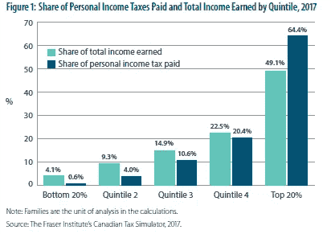

# 对富人增税不会解决任何问题

> 原文：<https://medium.datadriveninvestor.com/taxing-the-rich-more-will-not-solve-anything-fa508f64f4a0?source=collection_archive---------14----------------------->

对富人过度征税是毁掉整个经济和社会的最快方式。

在当今的媒体中，有一种对超级富豪的诽谤。很多抱怨。当我提到富人时，我指的是占 1%左右的上层阶级。

虽然我怀疑愤怒是由普通的嫉妒和羡慕引起的，而不是某个人直接对你做了什么。因为一个混蛋毁了你一天中的一分钟就给一群人定型是不公平的。

无论是在加拿大还是在美国，都有人在讨论如何向富人多征税。

 [## 更好地制定预算，打造更大的数据驱动型投资者

### 即使是专家也承认它们并不完美。从 1 到 10 的范围内，安东尼·科普曼和德尔…

www.datadriveninvestor.com](https://www.datadriveninvestor.com/2018/11/08/budget-better-to-build-bigger/) 

我们都会被征税。有些比其他人多。我觉得这就像在脸上打了一拳。很疼。如果我有选择的话，我不想让它发生在我身上。每个人的脸上都会挨一拳，你打的越多，拳头就越大。许多人现在要求富人加大打击力度。迟早，他们不会再想被揍了。任何一个谨慎的人都会去一个不会给他们太多打击的地方。

富人为我们使用的东西买单。

我想过挣 90 万美元薪水的想法。你在多伦多要付大约 45 万美元的税。我相信大多数超级富豪不会把他们的财富浪费在拿薪水上，而是用其他方式获得收入，但让我们假设有些人不会，是吗？即使支付了 90 万美元的全额合格股息(即来自公共股票的股息)，他们仍将支付 30 万美元以上的税款。所有的钱都归政府所有。

富人交的税最多。我交的税微不足道，绝对不够支付一名教师的工资。他们薪酬过低的不幸现实是一个单独的问题，我不会在这里深究。从本质上讲，富人是政府最大的收入来源，而不是大多数中下阶层。我们不是政府的摇钱树。一个年薪 90 万美元的人要缴纳的税款相当于 45 个年收入 5 万美元的人。仅供参考，2015 年，前 1%的人占加拿大所得税的 22%，前 5%的人占所得税的 42%。

我们在世界上创造经济价值，政府收取我们创造的部分价值。政府所做的就是用这些现金做出支出决定。一个好的政府会做出好的支出决策来支持国家，这样我们才能共同创造更大的经济价值。

因此，如果政府开始针对超级富豪(他们最有价值的顾客)征收更多的税，他们会非常不高兴。他们会想离开。愤怒的穷人可能想要这个，也许这就是策略。尽管这是一个目光短浅且相当愚蠢的想法。

如果富人是主要的收入来源，这意味着我们的许多公共社会项目，如学校、医疗保健(对加拿大读者来说)、社区中心和公共交通都是由他们资助的。有趣的是，富人可能不会使用这些程序。他们可能会把孩子送到私立学校，在国外接受医疗保健，在那里你不必为急诊等上 2-5 个小时或为核磁共振成像等上 6 个月，而且很少乘坐公共交通工具。他们绝对不需要穷人利用的福利或任何社会收入项目。

我并不是说，我们都应该感谢富人缴纳了税款。他们只是像所有人一样遵守法律。但是，如果我们因为他们自己的收入水平而诋毁他们，这只会给国家带来负面的经济前景。

我们不要忘记，许多初创公司和企业要么直接由富人资助，要么由政府投资基金资助，这些基金仍然依靠从富人那里征收的税款运行。他们在从国外的其他富有朋友那里吸引资金方面也发挥着重要作用。我认为这比让国家负债累累要好。

他们可以离开。

超级富豪是因为他们不受束缚。大多数中下阶层的人都被工作束缚住了。超级富豪从资产中赚钱。比如依靠投资组合生活，从他们的企业股权中获得丰厚的股息(或类似的东西)。不管怎样，这可能是他们致富的第一步。因此，与大多数人不同，贡献最大的客户拥有最多的选择。如果他们的资产是纯粹的投资组合，他们可以离开，然后扑通一声落在任何地方。巴黎的超级富豪一波一波都走了，就是这样。

因此，丑化和针对他们只能导致国家经济未来的长期衰退。心胸狭窄和嫉妒的人假想的“胜利”对国家和被嫉妒吞噬的个人都没有好处。

拥有更多的富人对国家更有利。至少，这使它在世界上具有经济意义。没人关心 500 万低收入人群。但是 500 个富人可以移动针头。他们是能够提升整个社会现状的人。

**这是一个复杂的问题，无法用简单的答案来解决。**

我不是说贫富差距越来越大是好事。它不是。平均数必须提高到一个更高的水平。恐怕这篇文章不是一篇解答文章。这是一个相当复杂的问题，不应该试图用向富人增税这样简单的答案来回答。充其量，这是绝望的政客利用低收入人群的愤怒而使用的营销伎俩。很贱很侮辱人。

在这样一个你不知道正确答案是什么的难题的情况下，我想到了查理·芒格会说的话:

> *“倒置。总是倒置。许多棘手的问题最好在逆向解决时解决。”—查理·芒格*

所以，我们可以问自己:“如果我们不想长期解决这个问题，我们应该做什么？从长远来看，什么是毁掉国家经济的好方法？”一个解决办法是向富人征税。这将使我们在未来几十年里失望。这不会伤害一个政治家执政 4 年的遗产，但会伤害我们和我们未来几十年的孩子。

**在这个问题上，我们需要合作。**

我认为一个潜在的解决方案是改变视角。

> *“你不必像失去时那样把钱赚回来。”—沃伦·巴菲特*

这是一句投资名言，但也是一个可以应用于当前情况的教训。仅仅因为我们的嘴被打了一拳，并不意味着我们应该更用力地打富人。在其他地方寻找解决方案。

一个潜在的领域是心态和教育。富人教他们的孩子如何保持他们的财富并积累财富。让复利的力量发挥作用。穷人可能不会。这会导致愤怒，但愤怒只会给世界带来悲剧。嫉妒和羡慕是对任何人都没有好处的琐碎无用的感情。

这是教下一代生存技能。政府正着手将个人理财教育尽早引入年轻学生，这是正确的举措。我认为这比历史或艺术课更重要。如果 13 岁时读到全球经济中的金融崩溃让你意识到你应该尽快还清信用卡债务，而不是认为学生贷款是免费的，那么你和学习历史的所有权力，但我怀疑这将是大多数人的情况。

我的朋友告诉我，像 Jay Z 这样的著名说唱歌手也在为贫困青年教授个人理财方面发挥着积极作用。老实说，富人用他们自己的直接项目回馈社会会比政府更快。这就是我们如何与富人合作，共同改善现状。

只是一个旁观者的想法。看到羡慕、嫉妒和缺乏远见毁了这一切，我很难过。

*原载于*[*www.oldmandan.com*](https://www.oldmandan.com/essays/richtax)*。*