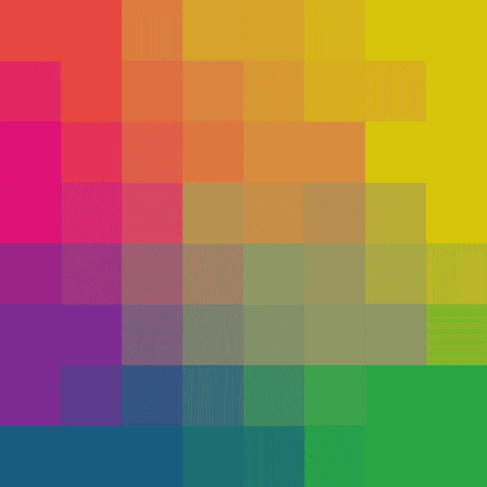
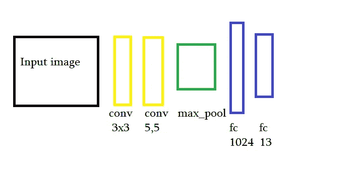

# 使用 Tensorflow 向人工智能教授颜色

> 原文：<https://medium.datadriveninvestor.com/teach-colors-to-artificial-intelligence-using-tensorflow-e7db912407b5?source=collection_archive---------3----------------------->

[](http://www.track.datadriveninvestor.com/1B9E)

几个月前，我观察到我的一个亲戚在教他的女儿颜色。他给他看不同颜色的纸，婴儿必须把它们区分开来。对人类来说，如果没有任何残疾，很容易看到颜色之间的明显区别。但是有了这么大的进步，对机器来说应该也很容易，对吗？

正如我们所知，计算机的图像只是一些数字的组合，分成 3 个通道，红绿蓝(在大多数情况下)。我不会在这里开始解释，如果你不知道计算机是如何看待数字图像的。

尽管计算机将图像视为原始数字，但它们应该很容易识别颜色，对吗？例如，我们知道当红色通道的值在 200–230、绿色 0–30、蓝色 170–200 之间变化时，我们得到紫色。当 R:0–30，G:230–255，B:0–30 时，我们得到浅绿色等等。所以电脑识别每种颜色应该也很容易。因为它只需找到一条线，将像素编号分成几组。

* *注:这些色边都是我设置的。(这是我感知颜色的方式)。

甚至只需编写代码计算每个通道的平均值，然后在字典或列表中找到相应的颜色名称就可以了。但我更感兴趣的是，简单的神经网络是否能够学习到能够让它以 100%的准确度区分颜色的模式。那么，我们开始吧。

你可以在这里看到所有的代码。

我已经创建了 64x64 图像类型的图片，看起来像这样。


Purple Image from dataset

数据集中有 13 种不同颜色的图像，这是我很快想到的。每堂课 10 张图片。所以总共有 130 张图片。

第一步是始终进行数据预处理，但在我的情况下，没有我应该考虑的变化，因为我对神经网络是否能够理解我拥有的这种模式感兴趣。

但是我仍然必须考虑到我所有的标签都是单词，我需要将它们转换成对我的神经网络有用的样式。为此，我使用一个热编码器。如果你不知道一个热编码器做什么，读读[这个](https://hackernoon.com/what-is-one-hot-encoding-why-and-when-do-you-have-to-use-it-e3c6186d008f)。

我有 13 个标签。因此，例如“红色”将是这样的向量:[0，0，0，0，0，0，1，0，0，0，0，0，0，0，0，0]。

```
from sklearn.preprocessing import LabelEncoder, OneHotEncoder
import os 
import pickledef create_one_hot_encoder(y, 
                           enc1_file = 'label_encoder.pkl',
                           enc2_file = 'hot_encoder.pkl'):

    if os.path.exists(enc1_file) and os.path.exists(enc2_file):
        print("The pickle files already exists")
        return False

    label_encoder = LabelEncoder()
    encoded = label_encoder.fit_transform(y)
    encoded = encoded.reshape(len(encoded), 1)

    enc = OneHotEncoder(sparse=False)
    enc.fit(encoded)

    with open(enc1_file, 'wb') as write:
        pickle.dump(label_encoder, write)

    with open(enc2_file, 'wb') as write:
        pickle.dump(enc, write)

    print("Model Saved Sucessfully")
    return True
```

我创建 pickle 文件，允许我使用这种编码，它是从训练数据中生成的，用于在我训练模型之后测试它。

现在，我将快速浏览一下我开发的代码。首先，我们需要为我们的图像创建输入和输出。因为这是一个非常简单的任务，所以我使用占位符来定义我的输入输出。

```
X = tf.placeholder(tf.float32, shape = [None, 64, 64, 3])
y = tf.placeholder(tf.float32, shape = [None, 13])
hold_prob = tf.placeholder(tf.float32)
```

这里 x 代表我们将输入的图像。如你所见，它有形状(无，64，64，3)。在这种情况下，None 表示批量大小。我拥有的图像数量非常少，所以在这种情况下我采用完整的批次，并将批次大小设置为数据集中的图像数量(在我的情况下为 117)。但是如果你愿意，你可以改变这个参数。“hold_prob”定义了使用 dropout 时保持层存活的概率。

接下来，我定义了所有必要的步骤。作为损失函数，我使用交叉熵的 Adamoptimizer。

```
cnn = CNN(batch_size= 117, learning_rate=0.001, shape = [64,64,3],
          num_classes=13)cnn.neural_net(X, hold_prob)cross_entropy = tf.reduce_mean(tf.nn.softmax_cross_entropy_with_logits(labels=y,
                                                                           logits=cnn.y_prob))
    optimizer = tf.train.AdamOptimizer(learning_rate = cnn.learning_rate)
    loss = optimizer.minimize(cross_entropy)
```

这里 CNN 是我创建的类，在“model.py”文件中，你可以在 GitHub 上查看。接下来，我调用函数 neural_net 来构建我将在下面介绍的神经网络，并将最终输出保存到我们在交叉熵损失中使用的 cnn.y_prob。

为了训练我的数据集，我开发了自己的简单神经网络，它有两个卷积、一个池化和两个完全连接的层。我用 relu 作为我的激活函数。



very short and funny description of the model that I used.

我使用脱落层，以避免过度拟合。这是代码

```
def neural_net(self, X, hold_prob = 0.5):

        with tf.variable_scope('convolution') as scope:

            conv1 = self.conv_layer(X, [3, 3, 3,  32])
            conv2 = self.conv_layer(conv1, [5,5, 32, 64])            

        with tf.variable_scope('pooling') as scope:

            pool1 = tf.nn.max_pool(conv2, 
                                   ksize = [1, self.kernel_size ,    self.kernel_size ,1], 
                                   strides=[1, self.strides_size, self.strides_size , 1],
                                   padding = 'VALID')

        with tf.variable_scope('fc_layer') as scope:

            flat = tf.reshape(pool1, [-1 , 8 * 8 * 64])
            dropout_flat = tf.nn.dropout(flat, keep_prob=hold_prob) 

            fc1 = self.fc_layer(dropout_flat, 1024)
            fc1 = tf.nn.relu(fc1)
            dropout_fc1 = tf.nn.dropout(fc1, keep_prob=hold_prob)

            fc2 = self.fc_layer(dropout_fc1, self.num_classes)
            #fc2 = tf.nn.relu(fc2)

        self.y_prob = fc2
```

这是我决定使用的一个非常简单的模型。我在 GTX-1060 上训练了 1000 个时期的 117 幅图像，耗时长达 4 分钟。我一开始以为它肯定能给我 100%的准确率。但我错了。训练准确率为 94%。此外，我尝试在测试集中的 13 张图像上测试它，它识别出了 12 张正确的图像。也有 92%的准确率。错误在于，我看到的“深绿色”图像被识别为“深蓝色”。找到允许识别 13 种颜色的加法和乘法的集合似乎很容易，但事实证明在训练过程中我们无法做到这一点。这背后可能有几个原因。

1.  训练时间短
2.  有几张图片
3.  对于整个图像，每个通道包含相同的值(对于每个图像，我们有相同的像素值)。像在紫色图像中一样，红色、绿色或蓝色通道中的每个像素值在整个图像中是相等的。更具体地说，紫色图像有 10 个图像。对于第一个，所有像素值是(200，0，170)，对于第二个紫色图像是(203，3，173)等等。

# 结论

总之，我想在一个非常简单的任务上测试简单的 CNN，学习识别图像中的颜色模式。原来这只是另一个分类问题，需要更多的训练和良好的数据结构，因为我无法达到 100%的准确率，即使是在这个简单的问题上，训练集和时间都很少。也许我可以提出更好的神经网络模型，甚至不使用卷积或池，但我从这个项目中获得的所有乐趣是测试这种类型的神经网络如何解决这个问题。

正如我在介绍中所说的，我的灵感来自于一个正在学习如何识别颜色的小孩。但她一开始也很难识别它，犯了很多错误。她花了 4 分多钟才学会颜色图案。在那之后，我们怎么能责怪 AI 没有学会这个简单的结构呢？也许是时候开始考虑改善我们大脑中自己的神经网络了:)。

## 参考

[[1]https://medium.com/r/?URL = https % 3A % 2F % 2f hackernoon . com % 2f hot-encoding-what-one-hot-why-and-why-do-you-use-it-e3c 6186d 008 f](https://hackernoon.com/what-is-one-hot-encoding-why-and-when-do-you-have-to-use-it-e3c6186d008f)

【https://medium.com/r/?】[2]T2URL = https % 3A % 2F % 2fwww . common lounge . com % 2f 讨论% 2f 244616 b 76d 3d 40 f 88 e8e 8 f 12103 a 22743d

感谢大家阅读这篇文章。这是我的第一篇文章，所以我想发表一些非常容易阅读和理解的东西。接下来，当我有时间的时候，我计划发表我已经解决的更复杂的问题。当它发生的时候希望再次看见你。

# DDI 特色数据科学课程:

*   [**用于数据科学的 Python**](http://go.datadriveninvestor.com/intro-python/mb)
*   [**深度学习**](http://go.datadriveninvestor.com/deeplearningpython/mb)
*   [**数据可视化**](http://go.datadriveninvestor.com/datavisualization/mb)

**DDI 可能会从这些链接中收取会员佣金。我们感谢你一直以来的支持。*