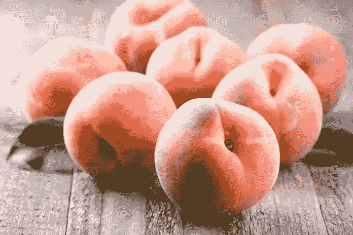

# 教师有到期日

> 原文：<https://medium.datadriveninvestor.com/teachers-have-an-expiration-date-57e533ace7d?source=collection_archive---------12----------------------->

面包、鲜桃、意大利面、金枪鱼罐头……超市里的所有东西都有保质期。虽然每个独特的项目的日期是不同的，但每个人都知道在某个时候，任何给定的项目都会过期，变质，变得陈旧，腐烂。

在学习政策研究所最近的一份报告中，每年大约有 8%的教师离职。美国教师的流失率几乎是加拿大、芬兰和新加坡等国教师的两倍。[http://www.qz.com，](http://www.qz.com,)“美国很难保住教师的工作”)。原谅我的引用，要求 MLA 格式化已经有几年了:)。不过这并不奇怪。多年来，不仅在美国，而且在世界各地，教育工作者的流失率都是大新闻。作为一名在成功工作了 14 年后最近离开这一职业的教育工作者，我一直在深入挖掘教师离开的原因。我们都听说过最流行的理由:工资低、压力大、缺乏行政支持、评估太多、缺乏尊重等等。这个清单实际上可以一直列下去，而且几乎总是根据每个教育者的不同而有所区别。不幸的是，这些都是工作带来的环境因素。

 [## 教科书行业如何最终被颠覆，并将继续改变-数据驱动…

### 就此而言，教科书产业在美国乃至全世界都有着悠久的历史。事实上，他们已经…

www.datadriveninvestor.com](https://www.datadriveninvestor.com/2018/09/25/how-the-textbook-industry-has-finally-been-disrupted-and-will-continue-to-change/) 

那么，我们来说说桃子吧。我喜欢桃子。*新鲜*，乔治亚的桃子最好吃。桃子是挑剔和微妙的。桃子枯萎、变质或腐烂的原因有很多。桃小食心虫在桃子上出没。在生长季节的每一天，这种真菌都在争夺毁掉桃子的机会。桃子完全依赖于农民使用适当的杀虫剂来保护它，即使如此，无论农民提供多少支持，有时也是不够的。不是所有的桃子都能上市。有些会在树上腐烂，有些会在地上枯萎，有些会在市场上腐烂。任何挂在树上的腐烂的水果都会成为次年的病源，继续这种桃杀真菌的效果。然而，当桃子上市时，对它的威胁还没有结束。桃子必须应对生产部门内的温度波动，来自全国各地的水果中的其他潜在真菌，以及寻找完美桃子的购物者不断处理的压力。这个清单也是无穷无尽的。桃子和其他农产品的损耗率令人震惊。在做了一点研究后，2012 年估计有多达 30%的作物没有收获，多达 30%的收获产品在包装过程中因“无法销售”而被移走。事实是，我们对完美产品的挑剔偏好是造成这种浪费的主要原因。因此，农民种植和收获农产品只是为了将其中的大部分浪费掉，或者返回到土壤中用于下一茬作物，因为我们作为消费者不喜欢农产品的外观，尽管它完全可以食用。

当我继续在教育领域寻找可行的解决方案时，我总是回到一个轻率的想法:改变从我们每个人开始。作为一个职业，我们不断地推动和要求改革，从更高的工资、更少的评估、更多的行政和地区支持以及更多的家长责任开始。我们要求改变，要求别人做跑腿的工作，好像我们是完美的，有权享受这些细节。以更高的工资为例。你基本上有两个选择:教育私有化或提高税收。当然，有许多选项可供讨论，但是我们将使用这两个大的选项作为例子。这两种选择都需要其他人的跑腿工作，这又一次把你的薪水命运交到了其他人的手中。事实一再证明，大多数美国人都想把更多的钱留在口袋里，而不是给你加薪。你会说“对大企业多征税”！然后他们离开或者找到漏洞，就像他们一直在做的那样。“堵住漏洞，”你说！你是在要求那些口袋里塞满了公司钱的政客们堵住这些漏洞吗？现在，如果我们将教育私有化，你就指望“企业主”和你一起将利润进行再投资。私有化意味着像企业一样经营，意味着更多的利润作为最终目标。再说一次，你指望别人给你更高的薪水。

然而，这并不是因为更高的工资或任何其他教师离开教室的具体原因。这是关于在你死之前充分利用你的时间。没错。我认为教育工作者不应该渴望从教育中退休，而是应该现实地对待他们的到期日，并为此做好计划。我是一个打算从教育界退休的人。让我们继续承认房间里的大象。学历舒服。一旦你签了那份合同，就会有一种安全感，只要你在最初几年没有搞砸，你就有了一份稳定的工作和不错的福利。我知道。感觉很好。这并不是我们大多数人在最初几年接受教育时的确切思维过程，但我们对这些想法并不陌生。我们很高兴将我们的整个职业生涯奉献给改变。直到我们不再兴奋。那么我们就很痛苦，原因有很多。我知道。我在那里，我经常收到你们很多人的来信。

就像桃子一样，我们都有自己的保质期。一些桃子进入了市场，出现在我们的盘子里。有些人永远无法从树上下来。我们中的一些教育工作者坚持到退休，而我们中的一些人仅仅工作了五年就离开了。我的到期日似乎是 2018 年 6 月。我不知道要进去。我想应该是 2005 年 1 月+工作年限+年龄= 85 岁(这就是退休数学)。我猜你也不知道你的有效期。我敢肯定，有很多个学生时代，你以为自己会退休，也有很多年，你希望自己的截止日期是前一年。

第二学期正如火如荼地进行，这意味着你有几个月的时间(根据你的合同，可能会有几天)来决定你是否在 8 月份回去。当你考虑明年八月的时候，我想给你留下一些思考来计算你的截止日期。我从个人经历中吸取经验，因为这些成为我决定放弃教育的重要因素。

家庭——对我们许多人来说，在职业生涯的早期回家与家人团聚令人耳目一新。然而，确实有一段时间，回家似乎是对现实的逃避，或者是比在教室里呆一整天还要多的工作。我们要么完全投入，要么完全脱离。所以知道自己现在在哪里很重要。如果你全力以赴，没有被你的家庭所拖累，继续向前冲。然而，如果你完全*空闲*，这是一个反思的绝佳机会。你的工作生活如何影响你的家庭生活？你的孩子/配偶不应该因为你不开心而痛苦。对于那些正在参与和充电的人来说，不要认为反思是理所当然的。经常反思，对自己和家人诚实。反思可能是避免脱离的关键。

**财务健康**——很容易陷入“我们工资不够”的争论中。现实是，我们经常得到市场将承受的报酬。基于预算限制，学区只能发放这么多现金。他们不是从彩虹尽头的无底金罐中捞钱，而是尽他们所能支付给你(这不是关于行政人员和教师工资的争论)。大学一毕业，你就很高兴能有一份稳定的薪水。不用再为了付房租而去收银台工作，去酒吧当服务生，去上私人课。你开始收到有福利的薪水，并且很高兴能对一个孩子的生活产生影响。唯一改变的是你。虽然这些年来你的工资增长很少(顺便谢谢你)，但总的来说，还没有达到全国要求的水平。同样，反思是关键。你量入为出吗？你的消费习惯失控了吗？你正在购买不是必需品的东西吗？你考虑过利用业余时间赚点外快吗？想过在放学后指导一项运动或赞助一项活动吗？也许你的孩子去你的学校。也许他们可以在你指导的运动或活动中。你的意思是你可以和你自己的孩子以及他们的朋友出去玩并得到报酬？对我来说听起来很甜蜜！如果你不想赞助或辅导，你有没有想过为准备 ACT 或 SAT 的学生提供辅导？这里面有很多钱。你在朋友的孩子毕业时给他们做剪贴簿？这里面也有钱。你明白我的意思了吗？

**身体健康**——这可能是知道你的保质期临近的最大指标。和我们很多人一样，当有压力时，你会吃东西。通常这也不是最健康的食物选择。你尽可能地抓住最快、最便宜、最令人满意的东西。苏打水，糖果(当然是很多很多的巧克力)，薯片，午餐吃快餐，回家路上吃快餐，因为你今天没有吃午餐，晚餐吃快餐，因为你没有精力做饭，等等。它。补充道。向上。不久之后，重量也增加了。你的体重开始影响你的自尊，你担心学生的想法，你的同事，你的配偶，你自己的孩子；你快淹死了。忘了健身吧。你已经筋疲力尽了，而且坦白地说，白天你摄入体内的那些东西让你感觉不好。不，做出健康的选择并不容易，但当你病态肥胖，然后不得不找另一份坦率地说你不适合管理的工作时，放弃教育也不容易。这可能看起来很黑暗，但在课间值班或体育课上从壁橱里取出篮球时死于心脏病也是如此。你真的想这样结束吗？

情绪健康——除了你自己，没有人应该受到责备。尽管我们想要更多的钱、更多的支持、更多的尊重等等。如果我们不喜欢自己，这些都不会有任何影响。我不在乎从第一年到第 48 年你改变了多少生命，如果你没有照顾好你的情绪健康，你所影响的所有生命都是徒劳的。在过去的几年里，我明白了我越自私，我就越无私。你看，就像你一样，我从早上 7 点到下午 4 点倾尽所有。不过，下午 4 点以后，我没什么可给的了。我筋疲力尽。我开始不断地思考老板对我是多么不公平。我开始责怪他的一切:工资，缺乏尊重，事实上我在做他的工作和我的工作。我不知道开关是什么时候打开的，但确实如此。我受够了，于是寻求一些建议。它阻碍了个人发展。"学会自私，这样你才能给予更多."刚开始，没什么意义。你的意思是，我需要投入更多的工作以便从我的一天中得到更多？我已经在这里拼命了。但是成功了。我每天读一点书。我学到了更多关于领导力，自我关怀，以及其他我不太了解的话题，比如钱。我学会了如何不舒服，而且这对你有好处。十多年来我一直过得很舒服。我不知道不舒服怎么办。你也不知道。你每天都在同一时间起床，往同一个杯子里倒咖啡，把同一堆文件从厨房的柜台上搬回你的包里，放进你的车里。你去同一家麦当劳吃早餐，走同一条路线，停在同一个地方，进同一扇门，在去你的教室的路上经过同一个教室，把你的东西放在同一个地方，走到同一个走廊，听同样的人讲同样的故事，在同样的钟声响起时问候同样的学生。舒服。你为什么不能走不同的路线去上班？你为什么不能从另一扇门进去？你为什么不能停在远一点的地方？为什么不能？舒服。直到它不是。然后就是彻头彻尾的气人。这时你就知道，你的有效期可能快到了。

**你的同事**——有两种类型的同事会决定你上学的日子和年份。那些和他们在一起很有趣并且真心喜欢他们的工作的人，以及那些已经过期、发霉、变得不新鲜的人。问题就变成了，你的同事是如何给你分类的？你知道你期待和谁一起吃午饭，你希望谁请一天病假。你知道你想和谁一起去实地考察，你想和谁呆在一起，帮你保守秘密。你的同事日复一日地和你在一起。这需要自我意识和自我检查。你如何影响你同事的日常业务？四处打听。你会找到一个对你诚实的人。当你这样做的时候，坚持他们。诚实是一种福气。

你的学生们。最重要的利益相关者。因为没有他们，你就没有工作。让我们假设你是桃子，他们是购物者。他们会在农产品部挑选你吗？你是否丰满而结实，闻起来成熟，没有瘀伤和真菌？或者你太黏糊糊，有点皱，坦白说，不适合做馅饼？你的学生每天像看桃子一样看着你。他们消耗你。你的截止日期对你的学生来说是非常清楚的*。问问他们。他们会告诉你，他们认为你还剩下多少年，或者你是否应该在第一学期结束后离开。说真的，诚实是一种福气。*

每个人的有效期都不一样，原因也不一样。没有泄露秘密的迹象。只有事物和直觉的结合。但我相信每个人都有一个。我们还缺少的一件事是对那些确实到期的人的支持。退休人员很容易庆祝。他们把整个职业生涯都奉献给了一种职业，影响了无数的学生和家庭。到期员工选择在退休前离职。这并不会因为他们没能坚持到退休而降低他们的教育水平，但这确实充分说明了他们的自我意识。在越线之前离开是一种艺术，应该庆祝。