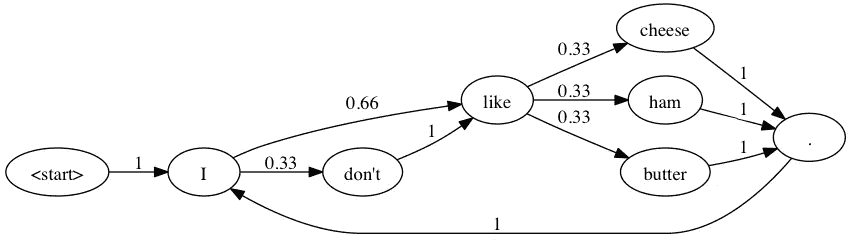

# 教计算机如何用马尔可夫链写在线约会简介

> 原文：<https://medium.datadriveninvestor.com/teaching-a-computer-how-to-write-dating-profiles-with-markov-chains-7628a6fc760c?source=collection_archive---------14----------------------->

[](http://www.track.datadriveninvestor.com/1B9E)

计算机如何生成听起来不像塑料或人工的高质量文本？完成这项任务有不同的方法。第一步是创建一个大而高质量的数据集合，也许是诗歌，并用这个集合训练一个递归神经网络，使用 PyTorch 或你选择的框架一个字母一个字母地生成单词。第二个选择可以是实现一个简单的马尔可夫链模型，并训练它挑选单词集合来创建随机的句子。

# 什么是马尔可夫链？

> *在概率论及相关领域，一个马尔可夫过程，以俄罗斯数学家* ***安德烈·马尔可夫*** *命名，是一个满足马尔可夫性质的随机过程(有时表征为* ***【无记忆】*** *)。粗略地说，如果一个过程可以仅仅基于它的当前状态来预测它的未来，就像一个人可以知道该过程的全部历史一样，因此独立于这样的历史；即取决于系统的当前状态，其未来和过去的状态是独立的(维基百科)。*

马尔可夫链是一个事件序列，其中每个后续事件在概率上依赖于当前事件。它本质上由一组满足马尔可夫性质的概率分布决定的转移组成。



Markov model diagram

当有大量输入数据要处理时，马尔可夫模型非常有用，类似于反馈神经网络模型，但肯定的是，在最后一个模型中，您将需要更多的数据。模型收到的数据越多，机器调整所有状态转换的概率就越多。

但是马尔可夫模型最感兴趣的是预测序列中接下来会发生什么，而不是创建一个新的文本块。它们缺乏产生依赖于上下文的内容的能力，因为它们不能考虑先前状态的完整链。

在我看来，它无法与递归神经网络在新文本生成任务方面的能力相提并论。

# 马尔可夫链在起作用！

我们如何使用马尔可夫模型的一些例子:

*   文本生成
*   金融建模
*   自动创建内容

如果你去谷歌学者，你可以找到相当有趣的项目使用马尔可夫模型:如预测降雨发生，网络攻击检测，互联网流量共享的审查，定期行人运动的预测方法和蛋白质结构预测！

使用马尔可夫模型还有其他很好的例子，一个很好的例子是通过查看一个人的位置历史来预测他/她从某个地方可能会去哪里。谷歌的页面排名使用的就是这种模式。您还可以实现垃圾邮件过滤、密码恢复和机器翻译。

如果你想开始学习概率建模，这个模型是一个**必须**。

# Markovify:一个简单的、可扩展的马尔可夫链生成器

如果你想接触马尔可夫链，你可以安装**马尔可夫链。** Markovify 是一个简单的，可扩展的马尔可夫链生成器。目前，它的主要用途是建立大型文本语料库的马尔可夫模型，并从中生成随机句子。但是，理论上，它可以用于其他应用。

这个库是用 Python 3 编写的，并且是开源的。您可以在 GitHub 上找到资源和文档:

[](https://github.com/jsvine/markovify) [## jsvine/markovify

### 一个简单的，可扩展的马尔可夫链生成器。通过在…上创建帐户，为 jsvine/markovify 开发做出贡献

github.com](https://github.com/jsvine/markovify) 

**安装**

```
pip install markovify
```

**实现马尔可夫链模型的基本步骤**

```
import markovify

**# Get raw text as string.**
with open("/path/to/my/corpus.txt") as f:
    text = f.read()

**# Build the model.**
text_model = markovify.Text(text)

**# Print five randomly-generated sentences**
for i in range(5):
    print(text_model.make_sentence())

**# Print three randomly-generated sentences of no more than** 300 characters
for i in range(3):
    print(text_model.make_short_sentence(300))
```

我建议你创建一个大的数据集和标点正确的文本，并使用`.`来分隔句子。如果你应用这些技巧，马克维菲效果最好。

# 用 Markovify 生成新的约会网站简介

# 关于数据集:

该数据集包括来自 2 个不同的约会应用网站的 300 个资料，我计划增加(给我一些时间，一切都在控制之中！)

我试图通过向递归神经网络模型提供相同的数据来完成这项任务，但由于收集的数据量很小，该模型没有产生良好的结果，这导致我使用马尔可夫链。这些数据可以生成有趣的个人资料。正如你在下面看到的，为了让它更有趣，我决定使用 **Pixton** ，一个漫画创作工具来创作出令人敬畏的漫画！查看结果:


# 灵感

浏览互联网，发现一些项目也应用了马尔可夫链模型，因此您可以从中获得灵感并创建自己的模型:

# 加尔科夫:生成新的加菲尔德线

 [## 加尔科夫-加菲尔德+马尔可夫链-乔希·米勒德

### Garkov 是 Markov 模型在旧的 Garfield strips 的抄本上的一个应用，加上一些额外的代码使它全部…

joshmillard.com](http://joshmillard.com/garkov/) 

# 灵感机器人:产生无限的灵感名言

[](https://inspirobot.me/) [## InspiroBot

### 我是一个人工智能，致力于产生无限量的独特的鼓舞人心的报价，永无止境…

inspirobot.me](https://inspirobot.me/) 

# 随机配方生成器

 [## 随机配方生成器

### 编辑描述

www.cutsquash.com](http://www.cutsquash.com/processing/recipe_generator/recipeGeneratorv3.html) 

创建您自己的模型，并让我知道结果！

# 参考

为了创建这个项目，我从这篇文章中获得了灵感:

[](https://www.getcenturylink.com/blog/bot-read-tinder-bios-came-up-with-own/) [## 我们有一个机器人读取了 500 个 Tinder 的 Bios，它想出了自己的 GetCenturyLink

### 这些天，有一个适合每个人的约会应用程序。从马术爱好者到培根爱好者，再到无麸浪漫主义者。但是没有…

www.getcenturylink.com](https://www.getcenturylink.com/blog/bot-read-tinder-bios-came-up-with-own/) [](https://github.com/viritaromero) [## viritaromero -概述

### 软件工程师，对数据科学和机器学习充满热情。-维里塔罗梅罗

github.com](https://github.com/viritaromero)