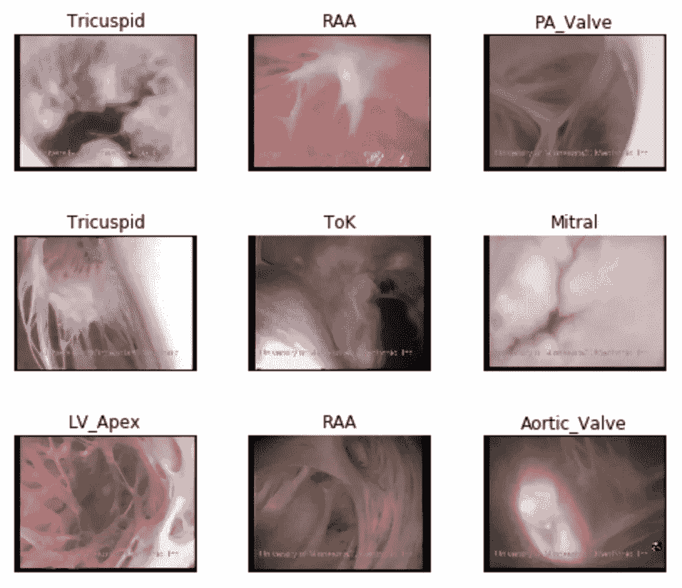
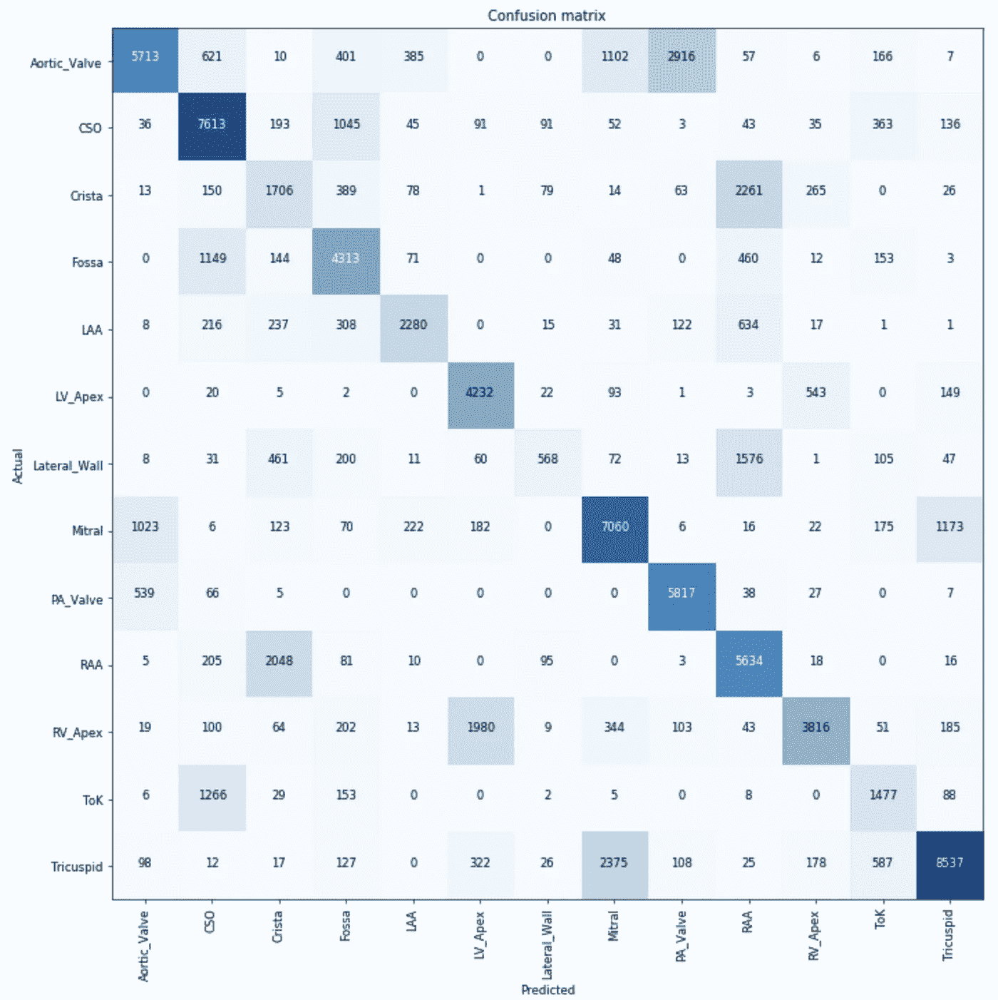
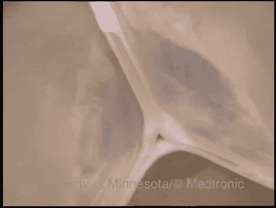
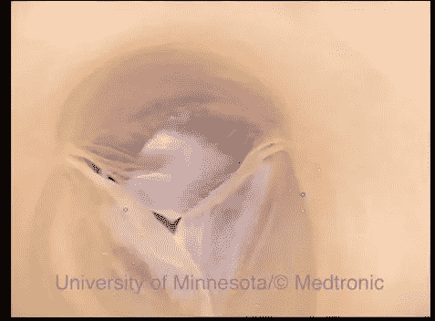
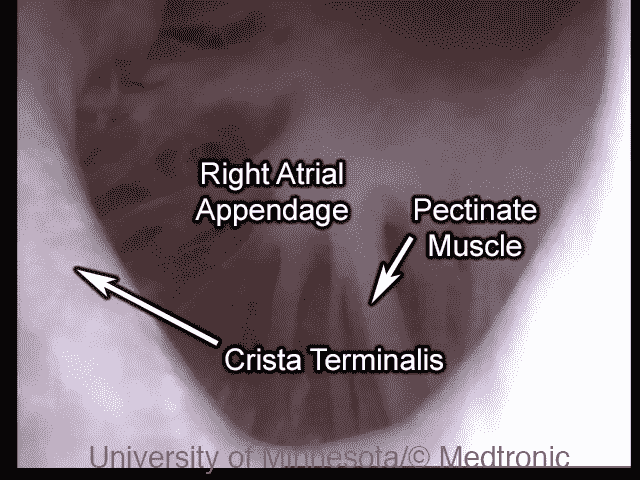
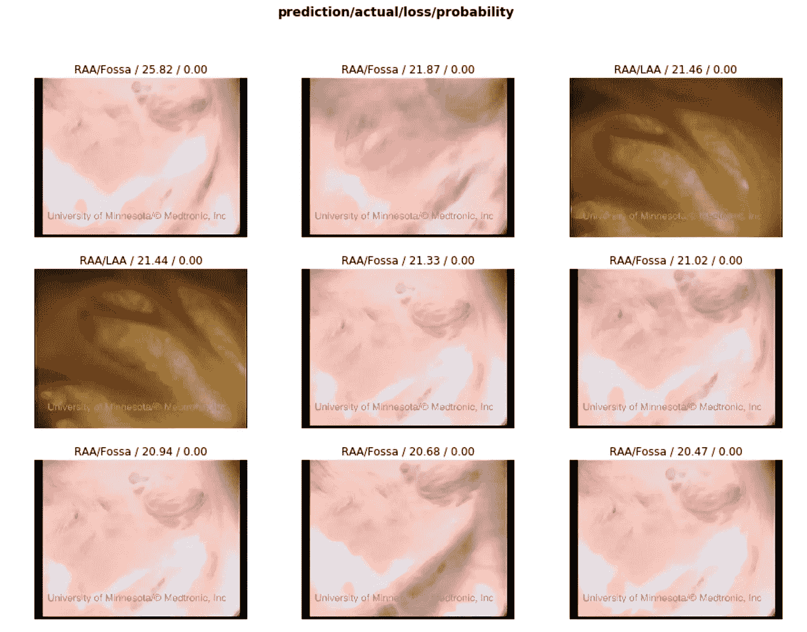

# 讲授神经网络心脏解剖

> 原文：<https://medium.datadriveninvestor.com/teaching-a-neural-network-cardiac-anatomy-f14f91a4c4bf?source=collection_archive---------13----------------------->

学习心脏解剖很难。电脑能做吗？

Images of cardiac anatomy within a human heart.

上面的图像是在真实的、功能正常的人类心脏内部拍摄的。尽管病得太重而不能移植，他们仍然可以插管、灌注和复苏。让我们能够看到心脏解剖的功能。所有这些图像、视频以及更多内容都可以在[可视心脏实验室](http://www.vhlab.umn.edu/)的[人类心脏解剖图谱](http://www.vhlab.umn.edu/atlas/)中找到。

 [## DDI 编辑推荐:5 本机器学习书籍，让你从新手变成数据驱动专家…

### 机器学习行业的蓬勃发展重新引起了人们对人工智能的兴趣

go.datadriveninvestor.com](http://go.datadriveninvestor.com/5ML1) 

在一个熟练的博士生能够区分这些不同的地区之前，需要许多个月甚至几年的训练。但是神经网络需要多长时间才能搞清楚这一点？

事实证明这非常简单。视频被分成大约 65 个训练心脏和 15 个验证心脏。帧被提取出来，通过使用神奇的新 [FastAI 库](https://github.com/fastai/fastai)，一个经过训练的 resnet34 在仅仅十分钟的训练后就迅速找到了模式。

这个数据集的一个重要特征是，它是由嘈杂的摄像机角度组成的。通常，相机镜头会随着每次心跳而移动，导致模糊或过饱和的画面。一些错误是噪声中固有的，其中帧只是不提供信息。

这个网络的另一个更重要的特点是，它对学生来说很有教育意义，揭示了难以区分或者难以区分的领域。

例如，肺动脉(肺动脉瓣)经常被误标为主动脉瓣。这是因为它们在形状和功能上非常相似。两者都大致呈圆形，由三个小叶组成:

Aortic Valve

Pulmonic Valve

但是一些解剖学分类与其他分类相冲突。界嵴是分隔右心房附件和右心房其余部分的脊。界嵴的连续镜头通常包括右心房附件。有时他们会使用相同的镜头。

One image can show many anatomies.

最酷的是我们模型的错误是我们的学习能力！看一看混淆矩阵，看看你是否能发现经常共享同一个镜头的解剖结构。事实上，窝的照片经常包含冠状窦口的照片。两个心室的顶点经常看起来相似。在一些照片中，三尖瓣看起来有点像二尖瓣。

使用 fastai，我们可以更进一步，查看对我们的模型来说最混乱的镜头。一段视频中模糊、高度饱和的镜头似乎占据了主导地位。另外两个图像显示了左心耳的照片，在我看来，它确实非常像右心耳。

Images the model was most confused with.

如果你的背景不是医学领域，希望这篇文章能让你对解决心脏问题的领域有所了解。如果你对心脏科学感兴趣，请随意访问我们的网站，或者查看我写的关于心脏医疗设备的非常[简短的概述](https://medium.com/@erikgaas/you-should-make-a-medical-device-c315c4f6520a)，并将它们与心脏生理学联系起来。