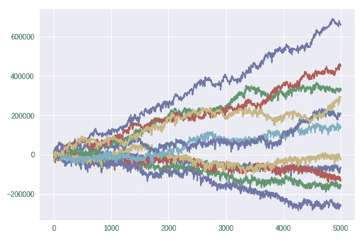

# 教机器人“低买高卖”

> 原文：<https://medium.datadriveninvestor.com/teaching-a-robot-to-buy-low-sell-high-c8d4f061b93d?source=collection_archive---------0----------------------->

在《人工智能》中，我们看到了一种 [Argumentum ad lunam](https://rationalwiki.org/wiki/Argumentum_ad_lunam) 的变体:

> *“如果我们能把人送上月球，我们就一定能 X”。(非正式的谬误或错误的类比)*

但现在它使用 Alpha Go 或 Watson 示例:

> 如果“AlphaGo Zero: Google DeepMind 超级计算机[可以]在 40 天内学习 3000 年的人类知识”[链接](https://www.telegraph.co.uk/science/2017/10/18/alphago-zero-google-deepmind-supercomputer-learns-3000-years/)
> 
> 然后“人工智能交易系统将震撼华尔街”[链接](http://www.itprotoday.com/machine-learning/how-ai-trading-systems-will-shake-wall-street)

在[金融中的人工智能:穿透炒作](https://medium.com/@gjlr2000/ai-in-finance-cutting-through-the-hype-with-case-studies-f361518b00d4)中，我解释了人工智能在金融中应用的几个例子，但我忽略了“圣杯”:开发一个找到盈利策略的人工系统。请注意，这不同于*预测*资产价格；我们真正想要的是交易者根据信息采取行动，实现财富最大化。

幸运的是，来自 NYU 的 Gordon Ritter 建立了这样一个系统(正如《新闻周刊》在[中发表的，机器学习可以应用于交易吗？他在学术论文中对此做了很好的解释:](http://www.newsweek.com/business-technology-trading-684303)

> [***机器学习进行交易***](https://papers.ssrn.com/sol3/papers.cfm?abstract_id=3015609)

根据我在人工智能案例研究中使用可复制研究的实践，我在这个笔记本中复制了 Ritter 的论文。像以前一样，我会尽量减少行话(“Q-learning”“MDP”？)并努力突出背后的直觉。

**剧透**:是**不是**现实生活中的交易。是的，系统可以*从零开始学习*一个盈利策略*如果*你有几百万个例子*和*当前价格只取决于以前的价格。*但是*有办法(在研究阶段)改进它。

**注**:这种 python 代码是作为一种教学工具开发的，对于商业应用程序来说会非常慢——Ritter 用 Java 写的，它“在几秒钟内完成一百万次迭代”。我的目标是在一个文件中使用 Google Colaboratory，以确保结果可以被任何人复制。

PnL during training — going from negative to positive

以下部分设置了 Ritter 定义的参数: