# 教人工智能寻找转录因子结合位点

> 原文：<https://medium.datadriveninvestor.com/teaching-ai-to-find-transcription-factor-binding-sites-ab37690e2675?source=collection_archive---------2----------------------->

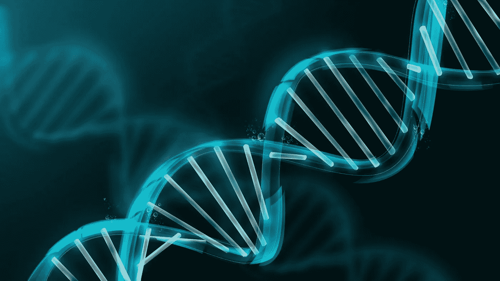

## 卷积神经网络+未来。烹饪

人类已经统治了世界。

我们从生活在字面上的污垢到建立像互联网一样的东西，创造了数百个国家和文明，甚至发现了如何利用自然事物如电力来为我们的设备提供动力！

(另外，我听说在[知识社会](https://theksociety.com/)有一些孩子在研究一些非常酷的东西，看看他们吧！)

我们喜欢认为自己是超级聪明、无所不能的生物，但是仍然有一些事情我们还没有真正能够解决。

*喜欢，其实认识我们自己。*

 [## DDI 编辑推荐:5 本机器学习书籍，让你从新手变成数据驱动专家…

### 机器学习行业的蓬勃发展重新引起了人们对人工智能的兴趣

www.datadriveninvestor.com](https://www.datadriveninvestor.com/2019/03/03/editors-pick-5-machine-learning-books/) 

关于人体，我们还有很多不了解的地方。比如为什么癌症、糖尿病和神经疾病不会消失。

但是，如果我们知道这一点，我们可以有更多的权力。我们可以̶c̶u̶r̶e̶预防疾病，找到从生物学角度提升我们自己并作为一个物种进步的方法。**我们可能会成为超人**🚀**。**

你想想，人类不过是一群群细胞，按照一定的方式排列在一起，共同工作。**所以了解我们的细胞=了解我们自己。这是第一步。**

这就是为什么我一直在研究我们的细胞如何工作，以及我们如何使用机器学习和人工智能来增强我们对细胞的了解。**我复制了一个可以发现转录因子结合位点的卷积神经网络模型😎**

哇，真是一堆大词。为了理解它们的含义，我将放大我们细胞中非常重要的一部分，我们的 DNA。

# 如果你的细胞是一块披萨，DNA 就是食谱🍕

你的 DNA 含有由分子 A、T、C 或 g 组成的核苷酸。DNA 呈双螺旋形状，这意味着 A 与对面的 T 结合，C 与 g 结合。

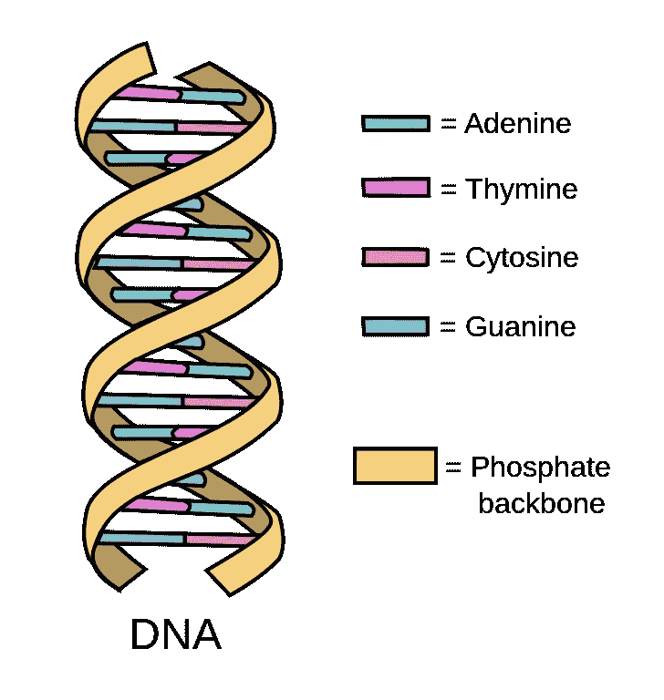

这些 A、T、C 和 G 核苷酸的顺序为你的细胞拼出了*配方*。就像披萨食谱一样。**某些基因，或者核苷酸序列，可以决定你细胞的特性。**

DNA 的指令本身并不能做很多事情，但它们最终被用来编码蛋白质。那些*实际上*组成了细胞的部件和功能。

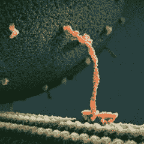

cool animation of a protein

仔细想想，蛋白质真的很疯狂。它们是微小的分子，但由于有数万亿个，它们几乎无所不能。从抑制肿瘤到修复 DNA，应有尽有。

> 理解蛋白质是如何制造的=理解细胞=理解人类=超能力

# 如果基因被表达，那么蛋白质就能被制造出来

基因表达与哪些分子与基因相互作用有关。如果基因被表达或“开启”，它可以编码一种蛋白质。

这就像如果你的食谱有 100 种食谱，你不会一次把它们都做好。特定的食谱在特定的时间使用，特定的基因在特定的时间表达。

转录因子是一种调节基因表达的分子。

## 转录因子有助于转录，谁会想到呢？

转录是发生在 DNA 和蛋白质阶段之间的一件有趣的事情。

让我们回到高中生物课，我保证会更有趣。

**DNA 序列被一种 RNA 分子复制，这种 RNA 分子“读取配方”,因此信息可以被传递。**这样，正确的氨基酸就可以组合在一起形成蛋白质。

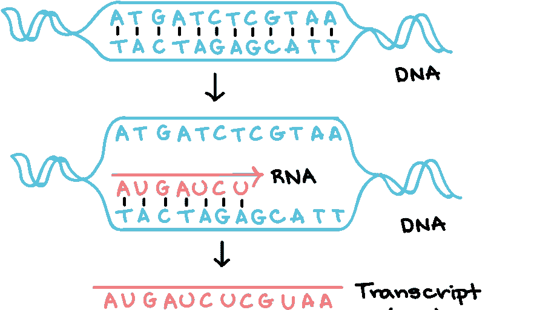

From [Khan Academy](https://www.khanacademy.org/science/biology/gene-expression-central-dogma/transcription-of-dna-into-rna/a/overview-of-transcription)

一种叫做 RNA 聚合酶的蛋白质实际上制造了 RNA 分子。它与一个叫做**启动子**的序列结合，因此它可以复制这个序列。

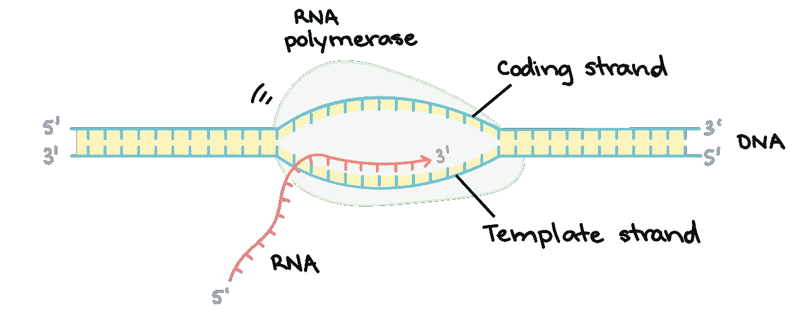

The RNA polymerase copies one side of the DNA, the template strand

**转录因子与 DNA 启动子区域的不同位点结合。所以当 RNA 聚合酶通过时，它知道是否要与之结合。就像你在食谱上突出说明一样。**

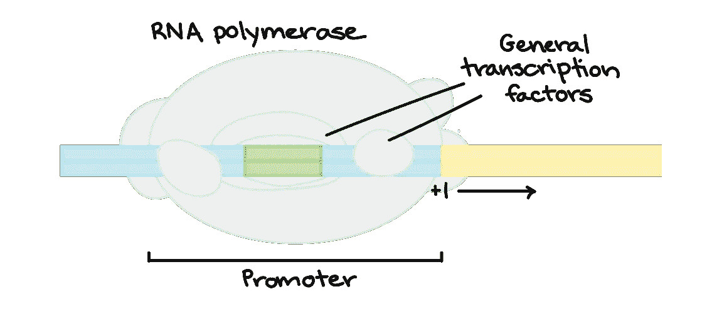

包括癌症和糖尿病在内的许多不同疾病都涉及某些基因在不应该被关闭或打开的时候被关闭或打开。理解转录因子和它们结合的位点就是如此🔑为了理解细胞如何工作和解决这些问题。

> 理解转录因子=理解蛋白质是如何制造的=理解细胞=理解人类=超能力

# 关于转录因子，我们还有很多不知道的

一个细胞中有 20-25，000 个蛋白质编码基因(加上更多我们尚未发现的基因)，每个基因都与转录因子相互作用。

那是很多因素和基因。我们怎么知道某个序列成为转录因子结合位点的可能性有多大？有这么多数据，很难说。

嗯，至少也许人类可以告诉……计算机可以帮助我们。

# 卷积神经网络可以识别结合位点！

“when a computer knows more about you than you do”

CNN 是一种神经网络，是人工智能的一个子集。他们非常擅长**在数据** *、*中寻找模式，并利用这些模式对新数据进行预测。

这和用电脑对狗和猫的图像进行分类是一回事。但它不是图像数据，而是对基因组数据进行分类。以及某个序列是否是结合位点。

CNN 就像我们的厨师👨‍🍳，利用食谱来预测未来的烹饪风格。

又名**预测转录因子将在哪里结合**，我们的蛋白质是如何制造的，我们的细胞如何工作，以及人类如何工作😎

我用 Tensorflow 在 Python 上复制了一个 CNN 模型，作者是来自《自然遗传学》的 James Zou、Mikael Huss、Abubakar Abid、Pejman Mohammadi、Ali Torkamani 和 Amalio Telentil。在这里仔细阅读论文[。](https://www.nature.com/articles/s41588-018-0295-5)

很恶心，对吧？我也这么认为。让我们看看它是如何工作的。

# 策展:我们的数据有点老套…

所以让我们来解决它😉

**这个模型应该在训练阶段分析一系列较短的 DNA 序列**的数据集，当它学习如何读取数据并选择它是否是一个结合位点。在测试阶段，**将会看到一个更长的序列，这是它从未见过的，并做同样的事情。**

这意味着我们的输入数据是一堆 A，T，C 和 G。

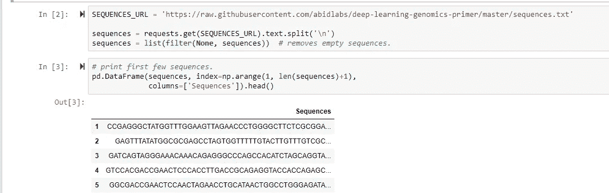

I imported the DNA data and printed it

计算机用数字语言阅读。所以我们要把我们的 ATCG 改成 0123(我这么做是因为它押韵，但是我们实际上只是把它们改成 0 和 1😀).

它将成为一个独热编码的数组。这意味着我们有 4 列，每一列代表 A、T、C 或 g。如果核苷酸 A 出现，则该列中会有 1，其他地方会有 0。

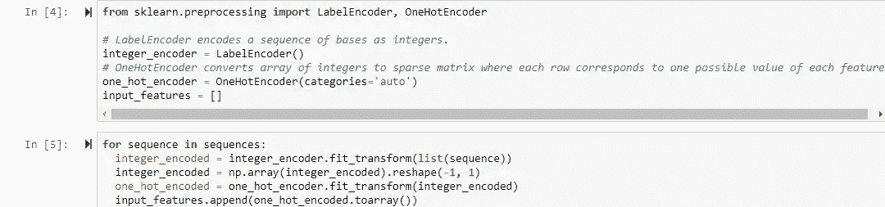

The code for turning the data into a 1 hot encoded array

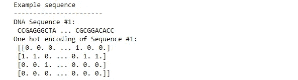

我们的标签也是一次性编码的。所以如果一个序列是一个结合位点，它的标签就是 1。如果不是，就是 0。

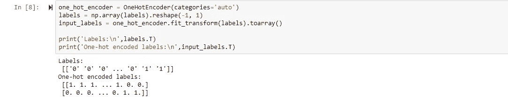

现在，我们可以将数据分成几组:

*   **50%训练**(其中网络反复分析数据进行学习)
*   **25%验证**(练习查看新数据)
*   **25%测试**(最终评估准确度)设置！

# 模型架构:是时候训练模型了！

CNN 使用不同的层来学习数据中的不同模式，因此它可以使用这些模式来进行预测。让我们来看看 Fab 四…

## 卷积层:

这使得计算机可以详细分析数据(或阅读食谱的每个单词)，并**了解特征。**

这个 CNN 有一个卷积层，有 32 个不同排列的 0 和 1 的滤波器，每个滤波器的大小为 12 个碱基。

*   过滤器是一个正方形，它扫描数组并寻找特征。
*   如果过滤器正在查看数组的某个部分，而 1 与 1 对齐，那么这意味着它将是 1。如果和 0 一致，那就是 0。
*   现在，已被“识别”的特征将显示为 1。
*   过滤器覆盖的所有数字的总和将被添加到卷积特征中

## 最大池层:

在这里，我们**将我们的过滤器压缩成更小的方块**，这样计算机更容易处理，只保留最重要的特征。#简单

*   我们的游泳池大小是 4，所以我们将查看 4 个基地的每个部分。
*   每 4 个方块中的最高值将被添加到池层
*   这些汇集层位于每个卷积层之后

## 展平层:

在所有的卷积层和池层完成它们的工作后，这一层将它们进一步压缩成一个 **1D 阵列。**#更简单

## “密集”层:

到目前为止，CNN 一直在“提取”DNA 数据的特征并浓缩它们，或者说只有*看到了*这本食谱。**现在是时候*考虑一下*了。**

*   第一层 dense_1 **将数组压缩成 16 个张量，**或 16 个数据“容器”,这些容器也可以应用函数(如 ReLU)来修改数组并创建输出
*   第二层 dense_2 从 dense_1 获取数据，并将其转换为 **2 个张量:1 表示“是，这是一个结合位点”，0 表示“否”。**
*   softmax 函数给出这是否是结合位点的输出，但将其转换成**概率**(例如，0.7 表示是(1)，0.3 表示否(0))

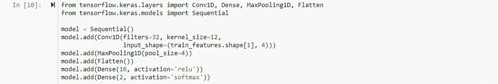

Here’s what the CNN code looks like all together

我对模型进行了 50 个时期的训练，当我这样做的时候，我可以看到损失在下降。这意味着**随着时间的推移，模型预测和实际发生之间的差异会减小**(这总是一个好现象)。

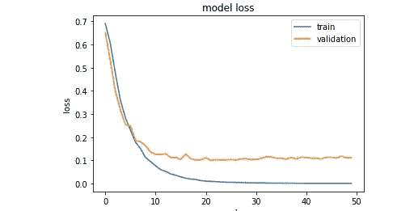

我还画出了精确度是如何提高的:

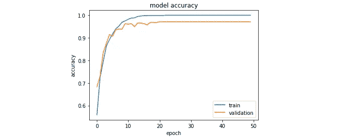

# 评价:它到底有多准确？

在训练这个 CNN 来预测某些序列是否是转录因子结合位点之后，我在一个**混淆矩阵中绘制了最终的准确率。**

它显示了

*   真阳性(计算机说是，实际上是)
*   误报(计算机说是，实际上不是)
*   真正的否定(电脑说没有，实际上没有)
*   假阴性(电脑说不是，实际上是)

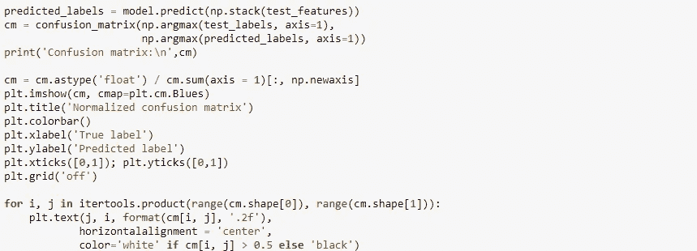

Code for the labels and colors of the confusion matrix

请敲鼓。

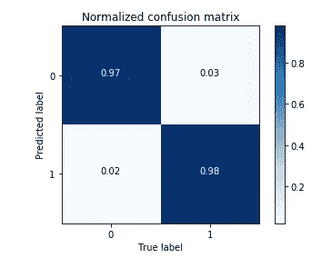

97%，太变态了🤯

# 这对人类(和计算机)意味着什么

我们可以把一堆 DNA 序列输入电脑，让它判断其中是否有一个是转录因子结合位点。准确率高达 97%！！它展示了 CNN 可以为我们打开多少可能性，比如:

*   发现治疗癌症和糖尿病等疾病的结合位点
*   更多地了解我们的细胞如何工作，以及我们的 DNA 在制造蛋白质时如何与转录因子相互作用
*   弄清楚人类是如何在细胞水平上工作的，并带来可能赋予我们超人能力的知识！

相当棒！！

## 概括一下:

*   理解细胞如何工作=理解人类=以多种方式帮助人类
*   你的 DNA 就像你的食谱，里面有你细胞的指令，如果某些基因被表达，它就被用来编码蛋白质
*   转录因子在选择哪些基因通过结合启动子 DNA 来表达方面起着巨大的作用，但很难区分一个看不见的序列是否是结合位点
*   卷积神经网络可以使用多层通过识别模式来预测结合位点，准确率高达 97%！！

生物 x 机器学习的未来*疯狂*。人类统治了世界，但是一旦我们学会了了解自己，未来将会变得美好🤩

***感谢阅读！如果你看了这篇文章觉得有趣/有一些问题，请随时给这几个人鼓掌，在*** [***Linkedin、***](https://www.linkedin.com/in/anupra-chandran-800b9814b/) ***上联系我，关注我的*** [***中***](https://medium.com/@anupra.chandran_2789/what-i-learned-from-being-different-61d660f5b1db?postPublishedType=repub) ***，敬请关注！！见丫:)***