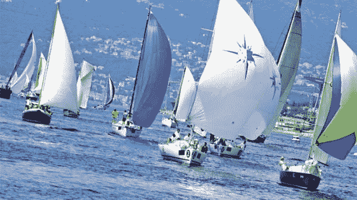
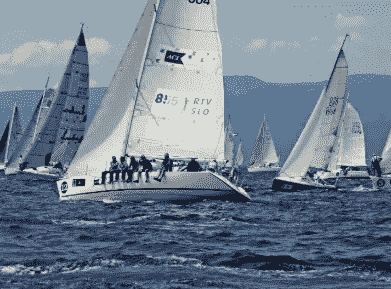

# 帆船团队教练——一次变革的经历

> 原文：<https://medium.datadriveninvestor.com/team-coaching-on-sailing-yachts-a-transformative-experience-9c3dba26a871?source=collection_archive---------19----------------------->

Gerard O'Donovan 经营的教练博客，我们的目标是不断为那些寻求改善生活的人带来价值。因此，我们有一个政策，出版我们重视和欣赏的客座作者的文章和材料。今天的特邀作者是马里奥·冈萨雷斯·福雷拉德(德国)。

让客户团队驾驶游艇是团队教练最有力的工具之一。它可以与传统的团队辅导过程有力地结合，作为一个户外研讨会，旨在加速团队在凝聚力、一致性和绩效方面的发展。

一群杰出的个人在团队环境中的表现往往不尽如人意:他们每个人都可能是顶尖的执行者，但在一个团队中，这个团队并不是一个高绩效的团队。首先要考虑的是组成团队的个人是否真的是一个团队，或者说是一个团体。

 [## 想知道领导是谁？请他决定。-数据驱动型投资者

### 一个有效的领导者能为组织提供的最有价值的东西之一是决策能力…

www.datadriveninvestor.com](https://www.datadriveninvestor.com/2019/01/25/want-to-know-who-the-leader-is-ask-him-to-decide/) 

一个团队可能缺少一个明确的共同目标和一套一致的操作规则。此外，Lencioni 的团队模式可能存在五种功能障碍:缺乏信任、害怕冲突、缺乏承诺、逃避责任和不重视结果。

在传统的团队辅导过程中，干预包括对团队的初步评估，然后教练在一段时间内陪同团队参加一些定期会议。教练从外部观察团队，可以看到团队内部无法察觉的事情，并反映出他所看到的。团队教练关注团队成员之间的互动，而不是成员本身:团队本身就是一个实体，是互动而不是个人塑造了团队。这种经典的团队教练方法本身就已经非常强大了。帆船上的额外课程极大地加速和放大了团队教练的所有有益效果，因为在管理帆船时，团队必须作为一个功能团队运作，否则，船就不能正常航行，并为团队提供即时反馈。

在户外活动中，团队负责帆船，面对一系列要解决的航行情况，教练帮助分析和比较团队在职业生涯中面临的情况。

理想情况下，船上课程可以包含在团队辅导过程的中间，因此在一些初始团队辅导课程之后，船上课程开始，然后，辅导过程继续进行常规团队辅导课程。

有两种方法接近团队，机械方法(经典方法)，假设成员塑造团队；系统方法(现代方法)，认为交互(而不是成员)塑造了团队。团队教练的系统方法基于两个原则:团队是一组在意见不一致时就如何达成一致达成一致的人(因此，有既定的决策规则)；系统的结构是其对话的网络(因此，如上所述，是交互而不是成员塑造了团队)。

再者，团队有两大支柱:团队的目标和团队的规则。团队的目标是绩效指标；团队的绩效将根据这些目标来衡量(例如，年度销售预算)。团队的规则是承诺指标；团队尊重它的规则(例如，“我们让自己可预测”)，他们致力于目标的实现。

此外，一个正常运作的团队将通过以下方式克服上述五种 Lencioni 功能障碍:建立信任、控制冲突、实现承诺、承担责任和注重结果。

当团队负责游艇时，团队的所有这些方面(目标设定、团队规则、团队成员之间的互动以及团队的功能障碍)都可以以非常放大的方式观察到。团队之间的互动，对于正确操纵帆船至关重要，变得非常明显:船的性能反映了团队的性能。

在驾驶帆船的场景中，团队动力被极大地放大了。未知和苛刻的环境就像一个放大镜，团队的互动变得非常明显。这允许团队非常清楚团队是如何工作的，并在团队需要的方面当场工作。

沟通的紧迫性，以及要设定和协调的即时行动，例如，为了使船转向(改变航向)，以及船本身提供的即时反馈(船“需要”一个有效的团队以正确航行)，极大地放大了团队的工作模式:船上的事情与办公室的一样，但更紧急、更快，并且完全不言自明。

这种放大对于教练和团队来说都是一个很好的工具:团队立即意识到需要在互动的哪些方面进行工作，新达成一致的工作模式可以在下一次操作中直接进行测试和调整。教练可以和团队一起分析刚刚经历的情况及其在公司环境中的相似性。一切都变得即时、持续和快速:对团队挑战的认识，克服挑战的规则定义，以及对新定义的工作模式的实验。

这种团队会议的效果是如此强大，因为这是一种令人惊叹的体验，它真的让团队走出了舒适区，在这种要求很高的情况下，团队中真正最好的人被召集起来，没有地方拖延，也没有地方躲藏。在这个充满挑战的环境中，是团队未开发的潜力得以充分发挥的地方。

会议的效果是立竿见影的；由于团队从第一秒开始就以有效的方式一起工作是至关重要的，这要求团队合作的最佳表现，并且可以直接带入办公室，因为在船上和陆地上需要的团队技能完全相同。

船上团队会议的另一个非常重要的方面是效果的持久性。共同的成就感在团队成员之间建立了非常牢固的纽带；它很容易成为一生的纽带。在这次会议后，一个典型的评论是:“在过去的 4 个小时里，我对我的同事们的了解超过了过去 15 年和他们在一起的时间”。事实上，这是一个完整的团队辅导过程的一部分，有助于使效果和学习持久。

一个例子说明了这些方面的影响放大，加速变化和持久性的改善:一段组织的喷气发动机制造商。有两个部门愿意改善他们的合作，愿意作为一个团队来运作。

两个部门的团队成员已经接受了培训，在培训过程中，还包括了船上的户外活动。

辅导过程团队的目标是优化各部门之间的合作，改善他们之间的沟通和协同作用，并制定一个共同的项目计划。

根据团队成员的说法，教练过程的转折点实际上是船上的教练会议。在那次会议中，团队面临的挑战得到了明确的确定，新的团队规则得到了定义并在现场进行了测试。客户团队报告了在信息流、自我意识、团队凝聚力和实现公司目标方面的显著改善。

除了来自客户的直接反馈之外，还通过在过程的开始和结束时用一组测试评估团队，并比较结果来测量进度。有伦乔尼(团队的五种功能障碍)、麦克莱兰(激励需求)、贝尔宾(团队的角色)和托马斯-基尔曼(冲突模式)的测试。比较辅导过程开始和结束时的测试结果，在团队功能、行动导向、归属感和冲突解决方面有显著的改善。

考虑到上述所有因素，我们可以得出结论，将帆船上的户外课程纳入教练过程可以加速、加强和巩固团队教练干预的有效性。

**关于** [**马里奥·冈萨雷斯·福雷拉德**](http://www.gonzalezforrellad.com/)

他出生于巴塞罗那，目前居住在德国。他能流利地说五种语言。他拥有机械工程硕士学位、工商管理硕士学位(MBA)和高管培训硕士学位。此外，他还是一名游艇水手。

在他的国际职业生涯中，他为欧洲、北美、南美、中东、东南亚和远东 20 个不同国家的工业公司管理咨询项目。融合了他的航海、教练和管理咨询背景，他在帆船上整合了高管教练课程，在凝聚客户团队方面取得了优异的成绩。

在这里阅读更多内容，不要忘了订阅我的教练博客网站获得免费教练报告:[https://www . coaching-blog . com/team-coaching-on-sailing-yachts-a-transformative-experience/](https://www.coaching-blog.com/team-coaching-on-sailing-yachts-a-transformative-experience/)

*查看我们这里提供的课程:*[*https://www . noble-Manhattan . com/training-courses/coaching-courses/*](https://www.noble-manhattan.com/training-courses/coaching-courses/)

*并获得我们的免费报道:*[*https://www.coaching-reports.com/*](https://www.coaching-reports.com/)